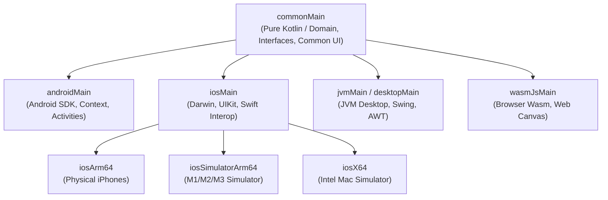

# 🏛️ Kotlin Multiplatform Architecture Foundation & Clean Modular DDD

This skill establishes the production-grade architectural standards for building maintainable, scalable, and warning-free **Kotlin Multiplatform (KMP)** and **Compose Multiplatform (CMP)** applications. It enforces **Clean Architecture** blended with **Feature-First Domain-Driven Design (DDD)** and explicit cross-platform sourceSet isolation.

---

## 📐 1. Multiplatform SourceSet Hierarchy & Topological Layering

In a production KMP project, sourceSets form a directed acyclic graph where target-specific code consumes shared declarations via Kotlin's hierarchical sourceSet mechanism:



### 🔒 Architectural Law: Layer Dependency Direction
```text
Presentation Layer (UI / ViewModel) ──▶ Domain Layer (UseCases / Entities) ◀── Data Layer (Repositories / DTOs)
```
- **Domain Layer is PURE KOTLIN**: Must NEVER import Android (`android.*`), iOS (`platform.*`), Compose UI (`androidx.compose.*`), or database drivers.
- **Data Layer is DEPENDENT**: Implements Domain repository interfaces and depends only on serialization, Ktor, Room/SQLDelight, and Key-Value engines.
- **Presentation Layer is REACTIVE**: Consumes UseCases and outputs immutable `UiState` via Kotlin Coroutines `StateFlow`.

---

## 🗂️ 2. Feature-First Directory Layout

Organize your codebase by **Business Domains (Features)** rather than technical types. This allows features to be extracted into standalone Gradle submodules with zero refactoring pain:

```text
app/shared/src/commonMain/kotlin/com/example/app/
├── core/                               # Cross-cutting foundational infrastructure
│   ├── base/                           # Base contracts (UiState, UiIntent, BaseViewModel)
│   ├── database/                       # Local database declarations & drivers
│   ├── dispatchers/                    # Coroutine dispatcher abstractions (IO, Main, Default)
│   ├── error/                          # Unified AppError, Failure domains & ErrorMapper
│   ├── network/                        # Ktor HTTP client builder, auth plugins & base DTOs
│   └── theme/                          # Design tokens, typography, shapes & ColorSchemes
│
└── features/                           # Domain modules (Feature-First)
    └── [feature_name]/                 # Example: auth, product, checkout, profile
        ├── data/                       # Data access & external integrations
        │   ├── datasource/
        │   │   ├── local/              # Room DAOs, DataStore keys
        │   │   └── remote/             # Ktor API endpoints & DTO responses
        │   ├── mapper/                 # Pure mapping functions: DTO ↔ Domain Entity
        │   └── repository/             # Repository implementation
        │
        ├── domain/                     # Pure business logic (Zero external dependencies)
        │   ├── model/                  # Pure immutable domain data classes
        │   ├── repository/             # Abstract Repository interfaces
        │   └── usecase/                # Single-responsibility UseCases (invokable)
        │
        └── presentation/               # UI & User Interaction
            ├── components/             # Feature-specific atomic UI composables
            ├── mvi/                    # UiState, UiIntent, UiEffect contracts
            ├── [Feature]Screen.kt      # Top-level composable view
            └── [Feature]ViewModel.kt   # Lifecycle-aware ViewModel (StateFlow)
```

---

## 🧱 3. The 3-Tier Clean Layering Implementation

### Tier A: Domain Layer (Pure Business Logic)

#### 1. Immutable Domain Entity
```kotlin
package com.example.app.features.product.domain.model

data class Product(
    val id: String,
    val title: String,
    val description: String,
    val priceInCents: Long,
    val currency: String,
    val isAvailable: Boolean
) {
    val formattedPrice: String
        get() = "${(priceInCents / 100.0)} $currency"
}
```

#### 2. Abstract Domain Repository Contract
```kotlin
package com.example.app.features.product.domain.repository

import com.example.app.core.error.AppError
import com.example.app.features.product.domain.model.Product
import kotlinx.coroutines.flow.Flow

interface ProductRepository {
    fun observeProducts(): Flow<List<Product>>
    suspend fun getProductById(id: String): Result<Product>
    suspend fun refreshProducts(): Result<Unit>
}
```

#### 3. Single-Responsibility UseCase
```kotlin
package com.example.app.features.product.domain.usecase

import com.example.app.features.product.domain.model.Product
import com.example.app.features.product.domain.repository.ProductRepository
import kotlinx.coroutines.flow.Flow
import kotlinx.coroutines.flow.map

class GetAvailableProductsUseCase(
    private val repository: ProductRepository
) {
    operator fun invoke(): Flow<List<Product>> {
        return repository.observeProducts().map { list ->
            list.filter { it.isAvailable }
        }
    }
}
```

---

### Tier B: Data Layer (Implementation & Serialization)

#### 1. Network DTO with Kotlinx Serialization
```kotlin
package com.example.app.features.product.data.datasource.remote

import kotlinx.serialization.SerialName
import kotlinx.serialization.Serializable

@Serializable
data class ProductDto(
    @SerialName("product_id") val id: String,
    @SerialName("name") val name: String,
    @SerialName("desc") val desc: String? = null,
    @SerialName("amount_cents") val amountCents: Long,
    @SerialName("curr") val currencyCode: String = "USD",
    @SerialName("in_stock") val inStock: Boolean = false
)
```

#### 2. Pure Data Mapper
```kotlin
package com.example.app.features.product.data.mapper

import com.example.app.features.product.data.datasource.remote.ProductDto
import com.example.app.features.product.domain.model.Product

fun ProductDto.toDomain(): Product {
    return Product(
        id = this.id,
        title = this.name,
        description = this.desc.orEmpty(),
        priceInCents = this.amountCents,
        currency = this.currencyCode,
        isAvailable = this.inStock
    )
}
```

#### 3. Concrete Repository with Offline-First Cache Strategy
```kotlin
package com.example.app.features.product.data.repository

import com.example.app.core.dispatchers.AppDispatchers
import com.example.app.features.product.data.datasource.local.ProductLocalDataSource
import com.example.app.features.product.data.datasource.remote.ProductRemoteDataSource
import com.example.app.features.product.data.mapper.toDomain
import com.example.app.features.product.domain.model.Product
import com.example.app.features.product.domain.repository.ProductRepository
import kotlinx.coroutines.flow.Flow
import kotlinx.coroutines.flow.flowOn
import kotlinx.coroutines.flow.map
import kotlinx.coroutines.withContext

class ProductRepositoryImpl(
    private val remoteDataSource: ProductRemoteDataSource,
    private val localDataSource: ProductLocalDataSource,
    private val dispatchers: AppDispatchers
) : ProductRepository {

    override fun observeProducts(): Flow<List<Product>> {
        return localDataSource.observeProducts()
            .map { entities -> entities.map { it.toDomain() } }
            .flowOn(dispatchers.io)
    }

    override suspend fun getProductById(id: String): Result<Product> = withContext(dispatchers.io) {
        runCatching {
            localDataSource.getProductById(id)?.toDomain()
                ?: throw NoSuchElementException("Product $id not found in local cache")
        }
    }

    override suspend fun refreshProducts(): Result<Unit> = withContext(dispatchers.io) {
        runCatching {
            val remoteDtos = remoteDataSource.fetchProducts()
            localDataSource.upsertProducts(remoteDtos.map { it.toDomain() })
        }
    }
}
```

---

## 🚫 4. Architectural Anti-Patterns & Enforcement Rules

| Anti-Pattern | Tại sao có hại (Impact) | Giải pháp chuẩn Enterprise (Best Practice) |
|---|---|---|
| **Leaking DTOs to UI** | Thay đổi schema API phía backend sẽ làm vỡ giao diện Compose UI. | Luôn chuyển đổi qua Domain Entities thông qua các mapper extensions độc lập. |
| **Android `Context` in ViewModels** | Gây rò rỉ bộ nhớ (Memory Leak), crash khi xoay màn hình, và phá hủy khả năng compile trên iOS/Desktop. | Trừu tượng hóa các dịch vụ hệ thống qua interface trong `commonMain` và inject implementation tại `androidMain`. |
| **Direct Dispatchers.IO** | Gây khó khăn khi chạy Unit Tests; không thể swap sang `StandardTestDispatcher`. | Tạo wrapper `AppDispatchers(val io: CoroutineDispatcher, val main: ..., val default: ...)` và inject qua DI. |
| **God Repository** | Repository quản lý hàng chục chức năng không liên quan nhau gây vi phạm Single Responsibility Principle. | Chia nhỏ Repository theo bounded domain context (ví dụ: `AuthRepository`, `UserPreferencesRepository`). |

---

## 🧪 5. Testing & Verification Harness

Xác minh tính độc lập của Domain Layer thông qua Unit Tests mà không cần bất kỳ framework UI hoặc mocking platform nào:

```kotlin
package com.example.app.features.product.domain.usecase

import com.example.app.features.product.domain.model.Product
import com.example.app.features.product.domain.repository.ProductRepository
import kotlinx.coroutines.flow.flowOf
import kotlinx.coroutines.flow.first
import kotlinx.coroutines.test.runTest
import kotlin.test.Test
import kotlin.test.assertEquals

class FakeProductRepository : ProductRepository {
    private val products = listOf(
        Product("1", "Pro Camera", "4K", 100000, "USD", isAvailable = true),
        Product("2", "Old Mic", "Mono", 20000, "USD", isAvailable = false)
    )

    override fun observeProducts() = flowOf(products)
    override suspend fun getProductById(id: String) = Result.success(products.first { it.id == id })
    override suspend fun refreshProducts() = Result.success(Unit)
}

class GetAvailableProductsUseCaseTest {
    @Test
    fun `invoke should only return products with isAvailable true`() = runTest {
        val fakeRepo = FakeProductRepository()
        val useCase = GetAvailableProductsUseCase(fakeRepo)

        val result = useCase().first()

        assertEquals(1, result.size)
        assertEquals("1", result.first().id)
        assertEquals("Pro Camera", result.first().title)
    }
}
```
