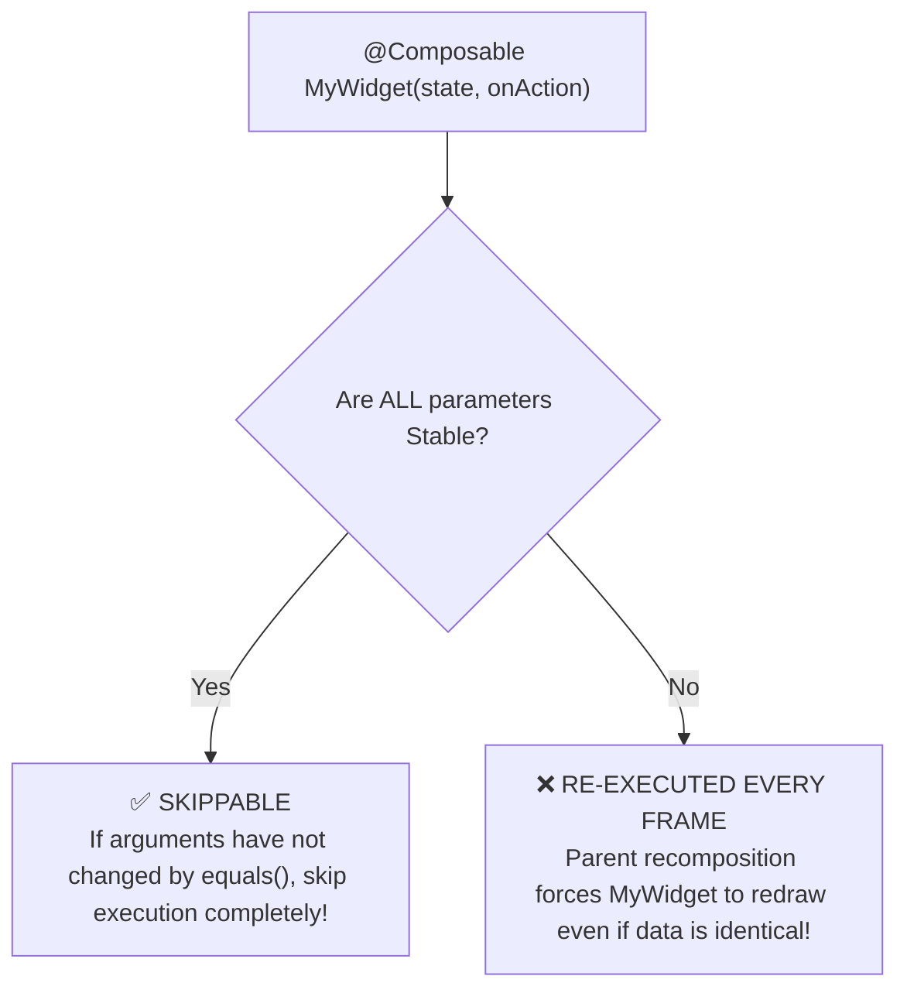

# ⚡ Compose Multiplatform Recomposition & Stability Optimization

This skill provides an enterprise architectural blueprint for mastering **Compose Compiler Stability**, eliminating **recomposition jank**, and achieving **60-120 FPS fluid rendering** across Android, iOS, Desktop, and Web.

---

## 🔍 1. The Stability Rule & The "Skippable" Contract

A `@Composable` function is **Skippable** if and only if **all of its parameters are Stable**:



### What makes a type Unstable?
1. **Standard Kotlin Collections**: `List<T>`, `Set<T>`, `Map<T>` are interfaces that can be backed by mutable implementations (`ArrayList`, `HashSet`). The Compose Compiler marks them **Unstable** by default.
2. **Classes with `var` properties**: Any class containing a mutable `var` is Unstable.
3. **Classes from external modules** without Compose runtime dependencies (unless configured via stability config).

---

## 📊 2. Enabling Compose Compiler Metrics in Gradle

Generate actionable diagnostic reports to identify non-skippable composables:

### `app/shared/build.gradle.kts`
```kotlin
composeCompiler {
    // Generate compiler stability reports in build/compose_metrics
    metricsDestination = layout.buildDirectory.dir("compose_metrics")
    reportsDestination = layout.buildDirectory.dir("compose_reports")
}
```

Run Gradle build:
```bash
./gradlew :app:shared:assembleRelease -Pandroidx.enableComposeCompilerMetrics=true
```

Examine output in `build/compose_reports/app_shared-composables.txt`:
```text
// ❌ BAD: Restartable, but NOT skippable because 'items' is unstable
restartable fun ProductList(
  unstable items: List<Product>
)

// ✅ OPTIMIZED: Restartable AND Skippable!
restartable skippable fun ProductList(
  stable items: ImmutableList<Product>
)
```

---

## 🛡️ 3. Fixing Unstable Parameters

### Solution A: `@Immutable` and `@Stable` Annotations
Mark domain/UI state models explicitly with `@Immutable`:

```kotlin
package com.example.app.core.ui.model

import androidx.compose.runtime.Immutable
import androidx.compose.runtime.Stable

@Immutable
data class ProductUiModel(
    val id: String,
    val title: String,
    val price: String,
    val tags: List<String> // Compiler trusts that this list will never be mutated
)

@Stable
interface ActionHandler {
    fun onProductClick(id: String)
}
```

### Solution B: Kotlinx Immutable Collections
In `gradle/libs.versions.toml`:
```toml
[libraries]
kotlinx-collections-immutable = { module = "org.jetbrains.kotlinx:kotlinx-collections-immutable", version = "0.3.8" }
```

In your UI State:
```kotlin
package com.example.app.features.product.presentation.mvi

import androidx.compose.runtime.Immutable
import kotlinx.collections.immutable.ImmutableList
import kotlinx.collections.immutable.persistentListOf

@Immutable
data class CatalogState(
    val products: ImmutableList<ProductUiModel> = persistentListOf(),
    val isLoading: Boolean = false
)
```

---

## 🏎️ 4. State Dampening with `derivedStateOf`

Prevent continuous recomposition when observing high-frequency inputs (such as scroll offsets):

### ❌ The Recomposition Disaster (Recomposes every 1px scroll)
```kotlin
@Composable
fun BadScrollToTopButton(lazyListState: LazyListState) {
    // Recomposes BadScrollToTopButton and its parent on EVERY pixel change!
    val showButton = lazyListState.firstVisibleItemIndex > 0
    if (showButton) {
        FloatingActionButton(onClick = { /* scroll */ })
    }
}
```

### ✅ The Optimized Architecture with `derivedStateOf`
```kotlin
@Composable
fun OptimizedScrollToTopButton(lazyListState: LazyListState) {
    // Only emits a new value when the BOOLEAN changes from false -> true or true -> false!
    val showButton by remember {
        derivedStateOf { lazyListState.firstVisibleItemIndex > 0 }
    }

    AnimatedVisibility(visible = showButton) {
        FloatingActionButton(onClick = { /* scroll */ })
    }
}
```

---

## 🗂️ 5. Lazy Layout Keys & Content Types

Always provide explicit keys and content types in `LazyColumn` and `LazyRow`:

```kotlin
@Composable
fun ProductGrid(
    products: ImmutableList<ProductUiModel>,
    onProductClick: (String) -> Unit,
    modifier: Modifier = Modifier
) {
    LazyColumn(modifier = modifier) {
        items(
            items = products,
            key = { item -> item.id }, // Enables item reordering animations without re-creating views
            contentType = { "product_item" } // Allows view recycling between identical item types
        ) { product ->
            ProductRow(
                product = product,
                onClick = onProductClick
            )
        }
    }
}
```

---

## 🚫 6. Recomposition Anti-Patterns

| Anti-Pattern | Root Problem | Correct Architecture |
|---|---|---|
| **Passing Unstable `List<T>`** | Compose cannot guarantee immutability; re-renders whole list on any parent state change. | Use `ImmutableList<T>` from `kotlinx.collections.immutable` or annotate data class with `@Immutable`. |
| **Instantiating Lambdas in `items()`** | Passing `{ onProductClick(item.id) }` creates a new function instance each recomposition. | Hoist callback or pass `item.id` directly via stable method reference. |
| **Reading State too High in Tree** | Reading `val count by vm.count.collectAsState()` in root `Scaffold` causes entire screen to re-evaluate when count changes. | Read state as close to the leaf node (widget) as possible (Defer reads). |
| **Omitting Lazy Layout Keys** | Adding/removing items forces Compose to destroy and re-measure every single visible item. | Always specify `key = { it.id }` in `items()`. |
