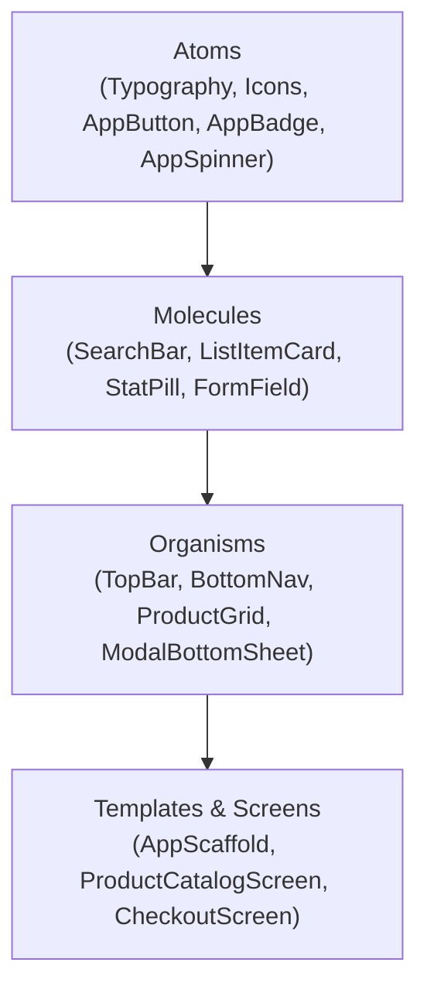

# 🎨 Compose Multiplatform UI Engine & Atomic Design System

This skill provides the definitive blueprint for creating production-grade, warning-free UI components in **Compose Multiplatform (CMP)**. It covers **Atomic Design hierarchy**, **Slot API composition**, **Coil 3.x asynchronous image loading**, and **Skiko rendering guardrails** across Android, iOS, Desktop (JVM), and Web (Wasm).

---

## 🏛️ 1. Atomic UI Component Hierarchy & Slot APIs

Organize composables using the **Atomic Design methodology** to maximize code reuse and testability:



### 🔒 Composable Function Golden Rules:
1. **Modifier as first optional parameter**: Every UI Composable must accept `modifier: Modifier = Modifier` and apply it to its outermost layout container.
2. **State Hoisting**: Never manage mutable business state internally; accept immutable state data classes and emit lambdas (`onAction: () -> Unit`).
3. **Slot APIs**: Use `@Composable () -> Unit` lambdas for flexible child composition rather than rigid configuration arguments.

---

## 🖼️ 2. Cross-Platform Coil 3.x Image Loading Pipeline

Coil 3.x is the official multiplatform image loading standard for KMP.

### A. Coil Dependency Setup (`libs.versions.toml`)
```toml
[libraries]
coil-compose = { module = "io.coil-kt.coil3:coil-compose", version = "3.0.4" }
coil-network-ktor = { module = "io.coil-kt.coil3:coil-network-ktor3", version = "3.0.4" }
coil-svg = { module = "io.coil-kt.coil3:coil-svg", version = "3.0.4" }
```

### B. Global `ImageLoader` Initializer (`commonMain`)
```kotlin
package com.example.app.core.image

import coil3.ImageLoader
import coil3.PlatformContext
import coil3.memory.MemoryCache
import coil3.network.ktor3.KtorNetworkFetcherFactory
import coil3.request.crossfade
import coil3.svg.SvgDecoder
import io.ktor.client.HttpClient

fun newAppImageLoader(
    context: PlatformContext,
    httpClient: HttpClient
): ImageLoader {
    return ImageLoader.Builder(context)
        .components {
            add(KtorNetworkFetcherFactory(httpClient))
            add(SvgDecoder.Factory())
        }
        .memoryCache {
            MemoryCache.Builder()
                .maxSizePercent(context, percent = 0.25)
                .build()
        }
        .crossfade(true)
        .build()
}
```

### C. Production `AppAsyncImage` Component
```kotlin
package com.example.app.core.ui.atoms

import androidx.compose.foundation.background
import androidx.compose.foundation.layout.Box
import androidx.compose.foundation.layout.fillMaxSize
import androidx.compose.foundation.shape.RoundedCornerShape
import androidx.compose.material3.CircularProgressIndicator
import androidx.compose.material3.MaterialTheme
import androidx.compose.runtime.Composable
import androidx.compose.ui.Alignment
import androidx.compose.ui.Modifier
import androidx.compose.ui.draw.clip
import androidx.compose.ui.graphics.Color
import androidx.compose.ui.graphics.Shape
import androidx.compose.ui.layout.ContentScale
import androidx.compose.ui.unit.dp
import coil3.compose.SubcomposeAsyncImage

@Composable
fun AppAsyncImage(
    imageUrl: String?,
    contentDescription: String?,
    modifier: Modifier = Modifier,
    shape: Shape = RoundedCornerShape(8.dp),
    contentScale: ContentScale = ContentScale.Crop,
    placeholderColor: Color = MaterialTheme.colorScheme.surfaceVariant
) {
    SubcomposeAsyncImage(
        model = imageUrl,
        contentDescription = contentDescription,
        contentScale = contentScale,
        modifier = modifier.clip(shape),
        loading = {
            Box(
                modifier = Modifier
                    .fillMaxSize()
                    .background(placeholderColor),
                contentAlignment = Alignment.Center
            ) {
                CircularProgressIndicator(strokeWidth = 2.dp)
            }
        },
        error = {
            Box(
                modifier = Modifier
                    .fillMaxSize()
                    .background(placeholderColor)
            )
        }
    )
}
```

---

## 🧱 3. Production Atomic UI Kit

### A. Atom: `AppButton` (Tactile Physics & Loading State)
```kotlin
package com.example.app.core.ui.atoms

import androidx.compose.animation.AnimatedVisibility
import androidx.compose.animation.fadeIn
import androidx.compose.animation.fadeOut
import androidx.compose.foundation.layout.*
import androidx.compose.foundation.shape.RoundedCornerShape
import androidx.compose.material3.*
import androidx.compose.runtime.Composable
import androidx.compose.ui.Alignment
import androidx.compose.ui.Modifier
import androidx.compose.ui.graphics.Shape
import androidx.compose.ui.unit.dp

@Composable
fun AppButton(
    text: String,
    onClick: () -> Unit,
    modifier: Modifier = Modifier,
    isLoading: Boolean = false,
    isEnabled: Boolean = true,
    shape: Shape = RoundedCornerShape(12.dp),
    leadingIcon: (@Composable () -> Unit)? = null
) {
    Button(
        onClick = onClick,
        modifier = modifier
            .heightIn(min = 48.dp)
            .fillMaxWidth(),
        enabled = isEnabled && !isLoading,
        shape = shape,
        colors = ButtonDefaults.buttonColors(
            containerColor = MaterialTheme.colorScheme.primary,
            contentColor = MaterialTheme.colorScheme.onPrimary,
            disabledContainerColor = MaterialTheme.colorScheme.onSurface.copy(alpha = 0.12f)
        )
    ) {
        Box(contentAlignment = Alignment.Center) {
            AnimatedVisibility(
                visible = isLoading,
                enter = fadeIn(),
                exit = fadeOut()
            ) {
                CircularProgressIndicator(
                    modifier = Modifier.size(20.dp),
                    color = MaterialTheme.colorScheme.onPrimary,
                    strokeWidth = 2.5.dp
                )
            }

            AnimatedVisibility(
                visible = !isLoading,
                enter = fadeIn(),
                exit = fadeOut()
            ) {
                Row(
                    verticalAlignment = Alignment.CenterVertically,
                    horizontalArrangement = Arrangement.spacedBy(8.dp)
                ) {
                    leadingIcon?.invoke()
                    Text(
                        text = text,
                        style = MaterialTheme.typography.labelLarge
                    )
                }
            }
        }
    }
}
```

### B. Molecule: `AppCard` (Elevation, Hard Outlines & Slot API)
```kotlin
package com.example.app.core.ui.molecules

import androidx.compose.foundation.BorderStroke
import androidx.compose.foundation.layout.Column
import androidx.compose.foundation.layout.ColumnScope
import androidx.compose.foundation.layout.padding
import androidx.compose.foundation.shape.RoundedCornerShape
import androidx.compose.material3.Card
import androidx.compose.material3.CardDefaults
import androidx.compose.material3.MaterialTheme
import androidx.compose.runtime.Composable
import androidx.compose.ui.Modifier
import androidx.compose.ui.graphics.Color
import androidx.compose.ui.graphics.Shape
import androidx.compose.ui.unit.Dp
import androidx.compose.ui.unit.dp

@Composable
fun AppCard(
    modifier: Modifier = Modifier,
    shape: Shape = RoundedCornerShape(16.dp),
    containerColor: Color = MaterialTheme.colorScheme.surface,
    borderColor: Color = MaterialTheme.colorScheme.outlineVariant,
    borderWidth: Dp = 1.dp,
    contentPadding: Dp = 16.dp,
    content: @Composable ColumnScope.() -> Unit
) {
    Card(
        modifier = modifier,
        shape = shape,
        colors = CardDefaults.cardColors(containerColor = containerColor),
        border = BorderStroke(borderWidth, borderColor),
        elevation = CardDefaults.cardElevation(defaultElevation = 2.dp)
    ) {
        Column(
            modifier = Modifier.padding(contentPadding),
            content = content
        )
    }
}
```

### C. Organism: `AppTopBar` (Multiplatform Responsive App Bar)
```kotlin
package com.example.app.core.ui.organisms

import androidx.compose.foundation.layout.RowScope
import androidx.compose.material3.*
import androidx.compose.runtime.Composable
import androidx.compose.ui.Modifier
import androidx.compose.ui.text.font.FontWeight

@OptIn(ExperimentalMaterial3Api::class)
@Composable
fun AppTopBar(
    title: String,
    modifier: Modifier = Modifier,
    navigationIcon: (@Composable () -> Unit)? = null,
    actions: @Composable RowScope.() -> Unit = {},
    scrollBehavior: TopAppBarScrollBehavior? = null
) {
    CenterAlignedTopAppBar(
        title = {
            Text(
                text = title,
                style = MaterialTheme.typography.titleLarge,
                fontWeight = FontWeight.Bold
            )
        },
        modifier = modifier,
        navigationIcon = { navigationIcon?.invoke() },
        actions = actions,
        scrollBehavior = scrollBehavior,
        colors = TopAppBarDefaults.centerAlignedTopAppBarColors(
            containerColor = MaterialTheme.colorScheme.background,
            titleContentColor = MaterialTheme.colorScheme.onBackground
        )
    )
}
```

---

## 🖥️ 4. Skiko Desktop & Web Wasm Rendering Guardrails

### A. HiDPI & Retina Font Crispness
On Desktop (JVM Skiko) and Browser Wasm, fonts can appear blurry if canvas density is unhandled. Ensure proper font anti-aliasing:

```kotlin
// In desktopMain/kotlin/.../Main.kt
import androidx.compose.ui.window.Window
import androidx.compose.ui.window.application

fun main() = application {
    // Enables Skiko Direct3D / Metal / OpenGL hardware acceleration
    System.setProperty("skiko.renderApi", "OPENGL")
    
    Window(
        onCloseRequest = ::exitApplication,
        title = "Desktop Pro Application"
    ) {
        App()
    }
}
```

### B. Defensive Pointer Hover & Touch Compatibility
Avoid hardcoding `Modifier.clickable` without indication feedback on Desktop:
```kotlin
// Use standard Modifier.clickable which delegates to PointerMatcher on Desktop and TapGestureDetector on Mobile
Modifier.clickable(
    interactionSource = remember { MutableInteractionSource() },
    indication = ripple(bounded = true)
) {
    // Action
}
```

---

## 🚫 5. Compose UI Anti-Patterns

| Anti-Pattern | Root Cause | Best Practice |
|---|---|---|
| **Allocating objects in Composable body** | Writing `val painter = BitmapPainter(...)` directly in Composable causes allocations every single recomposition frame. | Wrap with `remember { ... }` or pass down pre-computed assets from ViewModel. |
| **Breaking Modifier Chaining** | Assigning `val mod = Modifier.fillMaxSize(); Modifier.padding(16.dp)` creates detached modifiers. | Maintain a fluent builder chain: `modifier.fillMaxSize().padding(16.dp)`. |
| **Hardcoding Colors & Sizes** | Writing `Color(0xFF1E88E5)` or `16.dp` inside deep widget hierarchies breaks theming and accessibility scaling. | Use `MaterialTheme.colorScheme` and `MaterialTheme.typography` design tokens. |
| **Over-nesting Layout Boxes** | Nesting `Box -> Box -> Column -> Box` generates redundant measuring and layout passes. | Flatten layout trees using `Modifier.align`, `Modifier.weight`, or custom subcompose layouts. |
