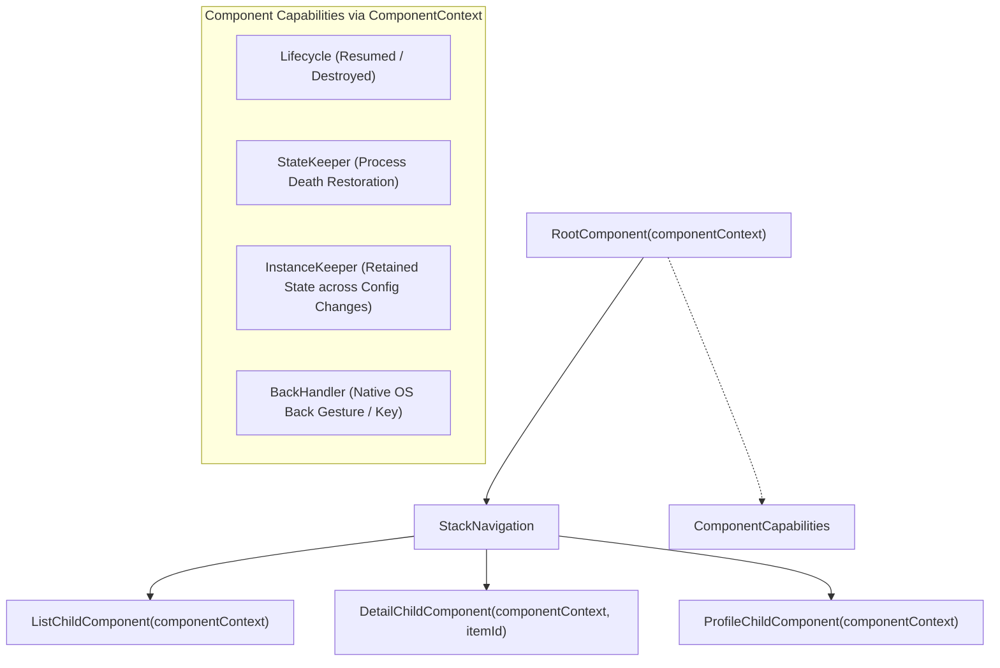

# 🧩 Decompose Retained Component Architecture & Lifecycle

This skill provides an enterprise architectural blueprint for implementing **Decompose 3.x** in **Kotlin Multiplatform (KMP)**. It enables **UI-independent business logic components**, **deterministic stack navigation**, and **retained lifecycles** that seamlessly survive configuration changes and process recreations across Android, iOS, Desktop, and Web.

---

## 🏛️ 1. Decompose Component Tree Architecture

Unlike traditional ViewModels which are bound to Android Activities or Compose NavHosts, Decompose components form a **pure Kotlin hierarchical tree** driven by `ComponentContext`:



---

## 📦 2. Dependencies Setup (`libs.versions.toml`)

```toml
[versions]
decompose = "3.2.2"

[libraries]
decompose-core = { module = "com.arkivanov.decompose:decompose", version.ref = "decompose" }
decompose-compose = { module = "com.arkivanov.decompose:extensions-compose", version.ref = "decompose" }
```

---

## 🧱 3. Building the Navigation Root Component

### A. Route Configuration Definition (`@Serializable`)
```kotlin
package com.example.app.core.decompose

import com.arkivanov.decompose.ComponentContext
import com.arkivanov.decompose.router.stack.ChildStack
import com.arkivanov.decompose.router.stack.StackNavigation
import com.arkivanov.decompose.router.stack.childStack
import com.arkivanov.decompose.router.stack.pop
import com.arkivanov.decompose.router.stack.push
import com.arkivanov.decompose.value.Value
import kotlinx.serialization.Serializable

sealed interface RootComponent {
    val childStack: Value<ChildStack<*, Child>>

    fun onNavigateToDetail(id: String)
    fun onNavigateBack()

    sealed class Child {
        class ListChild(val component: ProductListComponent) : Child()
        class DetailChild(val component: ProductDetailComponent) : Child()
    }
}

class DefaultRootComponent(
    componentContext: ComponentContext
) : RootComponent, ComponentContext by componentContext {

    private val navigation = StackNavigation<Config>()

    override val childStack: Value<ChildStack<*, RootComponent.Child>> =
        childStack(
            source = navigation,
            serializer = Config.serializer(),
            initialConfiguration = Config.List,
            handleBackButton = true,
            childFactory = ::createChild
        )

    private fun createChild(config: Config, context: ComponentContext): RootComponent.Child =
        when (config) {
            is Config.List -> RootComponent.Child.ListChild(
                DefaultProductListComponent(context, onProductSelected = ::onNavigateToDetail)
            )
            is Config.Detail -> RootComponent.Child.DetailChild(
                DefaultProductDetailComponent(context, productId = config.id, onBack = ::onNavigateBack)
            )
        }

    override fun onNavigateToDetail(id: String) {
        navigation.push(Config.Detail(id))
    }

    override fun onNavigateBack() {
        navigation.pop()
    }

    @Serializable
    private sealed interface Config {
        @Serializable
        data object List : Config

        @Serializable
        data class Detail(val id: String) : Config
    }
}
```

---

## 🧠 4. Child Component with Retained State (`InstanceKeeper`)

Preserve heavy objects or coroutines across Android configuration changes without re-fetching:

```kotlin
package com.example.app.core.decompose

import com.arkivanov.decompose.ComponentContext
import com.arkivanov.decompose.value.MutableValue
import com.arkivanov.decompose.value.Value
import com.arkivanov.essenty.instancekeeper.InstanceKeeper
import com.arkivanov.essenty.instancekeeper.getOrCreate
import kotlinx.coroutines.CoroutineScope
import kotlinx.coroutines.Dispatchers
import kotlinx.coroutines.SupervisorJob
import kotlinx.coroutines.cancel

interface ProductListComponent {
    val state: Value<State>
    fun onRefresh()

    data class State(val items: List<String> = emptyList(), val isLoading: Boolean = false)
}

class DefaultProductListComponent(
    componentContext: ComponentContext,
    private val onProductSelected: (String) -> Unit
) : ProductListComponent, ComponentContext by componentContext {

    // Retained Instance survives Android screen rotation and recreation
    private val scopeKeeper = instanceKeeper.getOrCreate { CoroutineScopeKeeper() }

    private val _state = MutableValue(ProductListComponent.State(isLoading = true))
    override val state: Value<ProductListComponent.State> = _state

    init {
        loadData()
    }

    override fun onRefresh() {
        loadData()
    }

    private fun loadData() {
        _state.value = ProductListComponent.State(items = listOf("Pro Camera", "4K Mic"), isLoading = false)
    }

    private class CoroutineScopeKeeper : InstanceKeeper.Instance {
        val scope = CoroutineScope(SupervisorJob() + Dispatchers.Main)
        override fun onDestroy() {
            scope.cancel()
        }
    }
}
```

---

## 🎨 5. Compose Multiplatform UI Binding (`Children`)

Render the Decompose stack using the official Compose extensions:

```kotlin
package com.example.app.core.decompose.ui

import androidx.compose.foundation.layout.fillMaxSize
import androidx.compose.material3.Text
import androidx.compose.runtime.Composable
import androidx.compose.ui.Modifier
import com.arkivanov.decompose.extensions.compose.stack.Children
import com.arkivanov.decompose.extensions.compose.stack.animation.fade
import com.arkivanov.decompose.extensions.compose.stack.animation.plus
import com.arkivanov.decompose.extensions.compose.stack.animation.scale
import com.arkivanov.decompose.extensions.compose.stack.animation.stackAnimation
import com.example.app.core.decompose.RootComponent

@Composable
fun RootScreen(
    component: RootComponent,
    modifier: Modifier = Modifier
) {
    Children(
        stack = component.childStack,
        modifier = modifier.fillMaxSize(),
        animation = stackAnimation(fade() + scale())
    ) { child ->
        when (val instance = child.instance) {
            is RootComponent.Child.ListChild -> {
                ProductListScreen(instance.component)
            }
            is RootComponent.Child.DetailChild -> {
                ProductDetailScreen(instance.component)
            }
        }
    }
}

@Composable
fun ProductListScreen(component: ProductListComponent) {
    Text("Product List Screen with Decompose")
}

@Composable
fun ProductDetailScreen(component: Any) {
    Text("Product Detail Screen with Decompose")
}
```

---

## 🚫 6. Decompose Anti-Patterns

| Anti-Pattern | Root Problem | Correct Architecture |
|---|---|---|
| **Holding `@Composable` inside Components** | Violates layer isolation; components must remain 100% pure Kotlin, testable without Compose runtime. | Components expose `Value<State>` or `StateFlow<State>`; Composable UI observes them. |
| **Instantiating Components inside Composables** | Creating `val comp = DefaultRootComponent(...)` inside a Composable creates duplicate components on recomposition. | Root components must be instantiated once at the platform application entry point (`MainActivity` or `MainViewController`). |
| **Ignoring `StateKeeper` for Process Death** | When Android OS kills the app in the background, non-serialized stack configurations are lost. | Always mark navigation `Config` as `@Serializable` and pass `serializer` to `childStack`. |
| **Leaking Coroutines in Components** | Launching coroutines on global scopes leaks memory when a child is popped off the backstack. | Use `InstanceKeeper.Instance` or attach coroutines to `componentContext.lifecycle`. |
