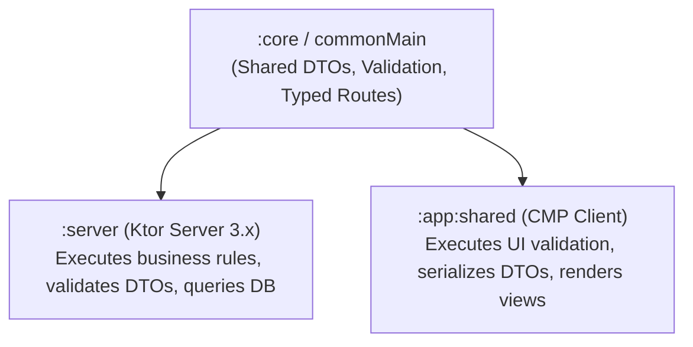

# 🌐 KMP Full-Stack Unification & Shared Ktor Server Models

This skill provides an enterprise architectural blueprint for achieving **Zero-Duplication Full-Stack Kotlin**, unifying data models, validation contracts, and API routes between the **Ktor Server backend (`/server`)** and **Compose Multiplatform clients (`/app/shared`)**.

---

## 🏗️ 1. Full-Stack Shared Code Topology



---

## 📦 2. Shared Data DTOs & Validation Logic (`core/commonMain`)

Define contracts once; compile to both JVM backend and Multiplatform clients:

```kotlin
package com.example.app.core.models

import kotlinx.serialization.Serializable

@Serializable
data class CreateUserRequest(
    val email: String,
    val username: String,
    val age: Int
)

@Serializable
data class UserResponse(
    val id: String,
    val email: String,
    val username: String,
    val createdAt: Long
)

// Shared validation rule running identically on Client Form and Server Security Filter
object UserValidator {
    sealed interface ValidationResult {
        data object Valid : ValidationResult
        data class Invalid(val error: String) : ValidationResult
    }

    fun validate(request: CreateUserRequest): ValidationResult {
        if (!request.email.contains("@") || !request.email.contains(".")) {
            return ValidationResult.Invalid("Invalid email address format")
        }
        if (request.username.length < 3) {
            return ValidationResult.Invalid("Username must be at least 3 characters")
        }
        if (request.age < 13) {
            return ValidationResult.Invalid("Users must be at least 13 years old")
        }
        return ValidationResult.Valid
    }
}
```

---

## 🖥️ 3. Backend Ktor Server Implementation (`server/src/main/kotlin/...`)

Consume the shared DTO and validation contract directly:

```kotlin
package com.example.app.server.routes

import com.example.app.core.models.CreateUserRequest
import com.example.app.core.models.UserResponse
import com.example.app.core.models.UserValidator
import io.ktor.http.HttpStatusCode
import io.ktor.server.application.call
import io.ktor.server.request.receive
import io.ktor.server.response.respond
import io.ktor.server.routing.Route
import io.ktor.server.routing.post
import io.ktor.server.routing.route

fun Route.userRoutes() {
    route("/v1/users") {
        post {
            val request = call.receive<CreateUserRequest>()

            // 1. Run shared validation rule on Server
            val validation = UserValidator.validate(request)
            if (validation is UserValidator.ValidationResult.Invalid) {
                call.respond(HttpStatusCode.BadRequest, mapOf("error" to validation.error))
                return@post
            }

            // 2. Process business logic & respond with shared UserResponse DTO
            val userResponse = UserResponse(
                id = "usr_${System.currentTimeMillis()}",
                email = request.email,
                username = request.username,
                createdAt = System.currentTimeMillis()
            )

            call.respond(HttpStatusCode.Created, userResponse)
        }
    }
}
```

---

## 📱 4. Client Ktor Client Consumption (`app/shared/src/commonMain/...`)

The client validates input before sending and consumes the identical response type:

```kotlin
package com.example.app.features.auth.data

import com.example.app.core.models.CreateUserRequest
import com.example.app.core.models.UserResponse
import com.example.app.core.models.UserValidator
import com.example.app.core.network.NetworkResult
import com.example.app.core.network.safeApiCall
import io.ktor.client.HttpClient
import io.ktor.client.request.post
import io.ktor.client.request.setBody

class UserRemoteDataSource(private val httpClient: HttpClient) {

    suspend fun registerUser(request: CreateUserRequest): NetworkResult<UserResponse> {
        // Client-side pre-validation
        val clientCheck = UserValidator.validate(request)
        if (clientCheck is UserValidator.ValidationResult.Invalid) {
            return NetworkResult.HttpError(400, clientCheck.error, null)
        }

        return safeApiCall {
            httpClient.post("v1/users") {
                setBody(request)
            }
        }
    }
}
```

---

## 🚫 5. Full-Stack Anti-Patterns

| Anti-Pattern | Root Problem | Correct Architecture |
|---|---|---|
| **Duplicating DTOs in Server and Client** | Schema changes on backend require manual synchronization across multiple repositories, causing runtime crashes. | Place DTOs in a shared `:core` module consumed by both client and server projects. |
| **Relying Solely on Client Validation** | Attackers can bypass frontend UI and send malicious payloads directly to the backend API. | Run shared validation rules on the client for instant UX AND on the server for strict security. |
| **Leaking Server-Only Dependencies to Core** | Importing database drivers (Exposed, Hibernate) into `:core` breaks iOS/Android compilation. | Keep `:core` pure Kotlin with zero server-specific or platform-specific runtime dependencies. |
