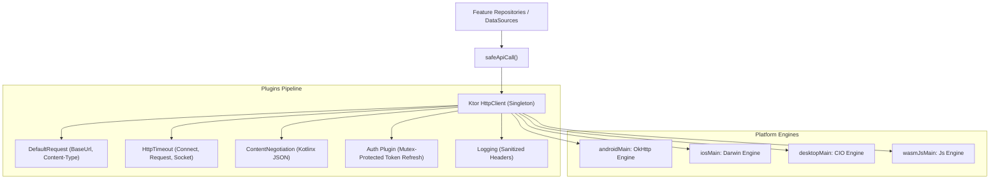

# 🌐 Ktor Client 3.x Resilient Networking & Auth Engine

This skill provides an enterprise architectural blueprint for implementing HTTP networking across **Android, iOS, Desktop (JVM), and Web (Wasm)** using **Ktor Client 3.x**, featuring **Silent Token Refresh**, **Multiplatform Engines**, and **Type-Safe Result Wrappers**.

---

## 🛰️ 1. Multiplatform Engine & Pipeline Architecture



---

## 📦 2. Dependencies Setup (`libs.versions.toml`)

```toml
[libraries]
ktor-client-core = { module = "io.ktor:ktor-client-core", version = "3.0.3" }
ktor-client-okhttp = { module = "io.ktor:ktor-client-okhttp", version = "3.0.3" }
ktor-client-darwin = { module = "io.ktor:ktor-client-darwin", version = "3.0.3" }
ktor-client-cio = { module = "io.ktor:ktor-client-cio", version = "3.0.3" }
ktor-client-js = { module = "io.ktor:ktor-client-js", version = "3.0.3" }
ktor-client-content-negotiation = { module = "io.ktor:ktor-client-content-negotiation", version = "3.0.3" }
ktor-serialization-kotlinx-json = { module = "io.ktor:ktor-serialization-kotlinx-json", version = "3.0.3" }
ktor-client-logging = { module = "io.ktor:ktor-client-logging", version = "3.0.3" }
ktor-client-auth = { module = "io.ktor:ktor-client-auth", version = "3.0.3" }
```

---

## 🛡️ 3. Safe API Call & Typed Result Modeling

Never throw unhandled network exceptions into the UI layer:

```kotlin
package com.example.app.core.network

import io.ktor.client.call.body
import io.ktor.client.statement.HttpResponse
import io.ktor.client.statement.bodyAsText
import io.ktor.http.isSuccess
import kotlinx.io.IOException
import kotlinx.serialization.SerializationException

sealed interface NetworkResult<out T> {
    data class Success<T>(val data: T, val statusCode: Int) : NetworkResult<T>
    data class HttpError(val code: Int, val message: String, val rawBody: String?) : NetworkResult<Nothing>
    data class NetworkFailure(val exception: Throwable) : NetworkResult<Nothing>
}

suspend inline fun <reified T> safeApiCall(
    crossinline apiCall: suspend () -> HttpResponse
): NetworkResult<T> {
    return try {
        val response = apiCall()
        if (response.status.isSuccess()) {
            NetworkResult.Success(data = response.body<T>(), statusCode = response.status.value)
        } else {
            val errorBody = response.bodyAsText()
            NetworkResult.HttpError(
                code = response.status.value,
                message = response.status.description,
                rawBody = errorBody
            )
        }
    } catch (e: IOException) {
        NetworkResult.NetworkFailure(e)
    } catch (e: SerializationException) {
        NetworkResult.NetworkFailure(e)
    } catch (e: Exception) {
        NetworkResult.NetworkFailure(e)
    }
}
```

---

## 🔑 4. Thread-Safe Mutex Silent Token Refresh

Prevent multiple parallel requests from triggering duplicate token refresh calls simultaneously:

```kotlin
package com.example.app.core.network

import com.example.app.core.storage.SecureStorage
import io.ktor.client.HttpClient
import io.ktor.client.call.body
import io.ktor.client.plugins.auth.Auth
import io.ktor.client.plugins.auth.providers.BearerTokens
import io.ktor.client.plugins.auth.providers.bearer
import io.ktor.client.request.post
import io.ktor.client.request.setBody
import io.ktor.http.ContentType
import io.ktor.http.contentType
import kotlinx.coroutines.sync.Mutex
import kotlinx.coroutines.sync.withLock
import kotlinx.serialization.Serializable

@Serializable
data class RefreshTokenRequest(val refreshToken: String)

@Serializable
data class TokenResponse(val accessToken: String, val refreshToken: String)

class AuthTokenManager(
    private val secureStorage: SecureStorage,
    private val tokenClient: HttpClient // Unauthenticated standalone client to avoid refresh recursion
) {
    private val refreshMutex = Mutex()

    suspend fun getAccessToken(): String? = secureStorage.get("KEY_ACCESS_TOKEN")
    suspend fun getRefreshToken(): String? = secureStorage.get("KEY_REFRESH_TOKEN")

    suspend fun saveTokens(accessToken: String, refreshToken: String) {
        secureStorage.set("KEY_ACCESS_TOKEN", accessToken)
        secureStorage.set("KEY_REFRESH_TOKEN", refreshToken)
    }

    suspend fun clearTokens() {
        secureStorage.remove("KEY_ACCESS_TOKEN")
        secureStorage.remove("KEY_REFRESH_TOKEN")
    }

    suspend fun refreshTokens(): BearerTokens? = refreshMutex.withLock {
        val currentRefreshToken = getRefreshToken() ?: return null

        try {
            val response: TokenResponse = tokenClient.post("https://api.example.com/v1/auth/refresh") {
                contentType(ContentType.Application.Json)
                setBody(RefreshTokenRequest(currentRefreshToken))
            }.body()

            saveTokens(response.accessToken, response.refreshToken)
            BearerTokens(response.accessToken, response.refreshToken)
        } catch (e: Exception) {
            clearTokens()
            null
        }
    }
}
```

---

## 🚀 5. Production `HttpClient` Factory

```kotlin
package com.example.app.core.network

import io.ktor.client.HttpClient
import io.ktor.client.engine.HttpClientEngine
import io.ktor.client.plugins.DefaultRequest
import io.ktor.client.plugins.HttpTimeout
import io.ktor.client.plugins.auth.Auth
import io.ktor.client.plugins.auth.providers.bearer
import io.ktor.client.plugins.contentnegotiation.ContentNegotiation
import io.ktor.client.plugins.logging.LogLevel
import io.ktor.client.plugins.logging.Logger
import io.ktor.client.plugins.logging.Logging
import io.ktor.client.request.header
import io.ktor.http.ContentType
import io.ktor.http.HttpHeaders
import io.ktor.serialization.kotlinx.json.json
import kotlinx.serialization.json.Json

// expect engine provider for platform-specific configurations
expect fun getPlatformHttpEngine(): HttpClientEngine

fun createHttpClient(
    engine: HttpClientEngine = getPlatformHttpEngine(),
    tokenManager: AuthTokenManager,
    baseUrl: String = "https://api.example.com/v1/"
): HttpClient {
    return HttpClient(engine) {
        // 1. JSON Content Negotiation
        install(ContentNegotiation) {
            json(Json {
                prettyPrint = false
                isLenient = true
                ignoreUnknownKeys = true
                coerceInputValues = true
                encodeDefaults = true
            })
        }

        // 2. Network Timeouts
        install(HttpTimeout) {
            connectTimeoutMillis = 15_000
            requestTimeoutMillis = 30_000
            socketTimeoutMillis = 15_000
        }

        // 3. Default Base Request
        install(DefaultRequest) {
            url(baseUrl)
            header(HttpHeaders.ContentType, ContentType.Application.Json)
            header("X-App-Platform", "ComposeMultiplatform")
        }

        // 4. Automated Silent Token Refresh
        install(Auth) {
            bearer {
                loadTokens {
                    val access = tokenManager.getAccessToken() ?: return@loadTokens null
                    val refresh = tokenManager.getRefreshToken() ?: return@loadTokens null
                    io.ktor.client.plugins.auth.providers.BearerTokens(access, refresh)
                }

                refreshTokens {
                    tokenManager.refreshTokens()
                }

                sendWithoutRequest { request ->
                    !request.url.encodedPath.contains("/auth/")
                }
            }
        }

        // 5. Sanitized Security Logging
        install(Logging) {
            level = LogLevel.INFO
            logger = object : Logger {
                override fun log(message: String) {
                    // Strip sensitive Authorization headers from console logs
                    val sanitized = message.replace(Regex("Bearer\\s+[A-Za-z0-9-_=.]+"), "Bearer [PROTECTED]")
                    println("[KtorClient] $sanitized")
                }
            }
        }
    }
}
```

---

## 🚫 6. Networking Anti-Patterns

| Anti-Pattern | Root Problem | Correct Architecture |
|---|---|---|
| **Creating multiple `HttpClient` instances** | Each `HttpClient` allocates separate connection pools and thread dispatchers, wasting memory and network sockets. | Inject `HttpClient` as a strict application singleton via Koin. |
| **Token Refresh Recursion Storm** | Using the authenticated client to make the refresh token request triggers infinite 401 loops when refresh fails. | Use a dedicated, unauthenticated lightweight client specifically for the refresh request. |
| **Ignoring Engine Thread Boundaries** | Calling blocking operations directly on Ktor network threads can deadlock Darwin (iOS) runloops. | Keep calls asynchronous with Kotlin Coroutines `suspend`. |
| **Leaking Plaintext Tokens in Logs** | Setting `LogLevel.ALL` logs user access tokens into Android Logcat or Desktop console. | Intercept and mask `Authorization: Bearer` headers in the `Logger`. |
