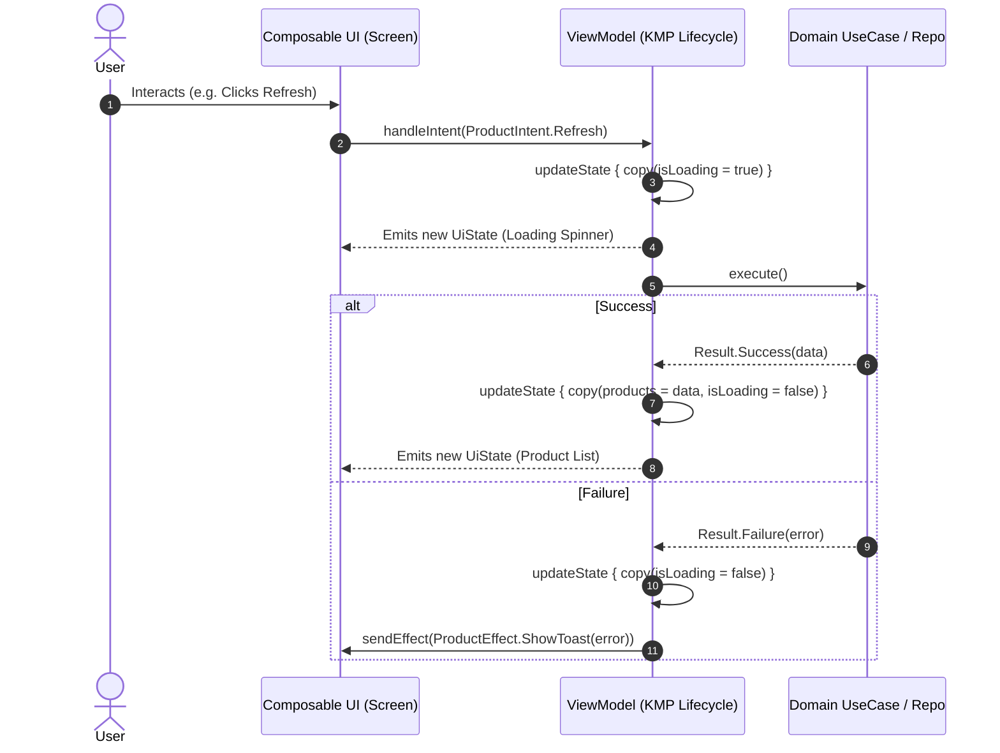

# 🔄 KMP MVI (Model-View-Intent) & Unidirectional StateFlow Architecture

This skill provides the definitive blueprint for implementing **Model-View-Intent (MVI)** with **Unidirectional Data Flow (UDF)** in **Compose Multiplatform (CMP)**. It guarantees predictable state transitions, prevents duplicate event execution on recomposition, and decouples UI rendering from business logic.

---

## 🔄 1. The Unidirectional Data Flow (UDF) Loop



---

## 🏛️ 2. The Core MVI Foundation Contracts (`commonMain`)

Create `core/base/MviContract.kt` in `commonMain`:

```kotlin
package com.example.app.core.base

import androidx.compose.runtime.Immutable
import androidx.lifecycle.ViewModel
import androidx.lifecycle.viewModelScope
import kotlinx.coroutines.channels.Channel
import kotlinx.coroutines.flow.Flow
import kotlinx.coroutines.flow.MutableStateFlow
import kotlinx.coroutines.flow.StateFlow
import kotlinx.coroutines.flow.asStateFlow
import kotlinx.coroutines.flow.receiveAsFlow
import kotlinx.coroutines.flow.update
import kotlinx.coroutines.launch

/**
 * Marker interface for all screen states. Must be immutable.
 */
@Immutable
interface UiState

/**
 * Sealed interface representing all user actions or system triggers.
 */
interface UiIntent

/**
 * Sealed interface representing one-off side effects (Navigation, Toast, Haptics).
 */
interface UiEffect

/**
 * Enterprise BaseViewModel implementing MVI and UDF for Compose Multiplatform.
 */
abstract class BaseViewModel<State : UiState, Intent : UiIntent, Effect : UiEffect>(
    initialState: State
) : ViewModel() {

    private val _uiState = MutableStateFlow(initialState)
    val uiState: StateFlow<State> = _uiState.asStateFlow()

    private val _uiEffect = Channel<Effect>(capacity = Channel.BUFFERED)
    val uiEffect: Flow<Effect> = _uiEffect.receiveAsFlow()

    /**
     * Entry point for the UI to dispatch intents.
     */
    abstract fun handleIntent(intent: Intent)

    /**
     * Atomically mutates the current UI state using a reducer function.
     */
    protected fun updateState(reducer: State.() -> State) {
        _uiState.update(reducer)
    }

    /**
     * Dispatches a single-shot effect that is consumed exactly once by the UI.
     */
    protected fun sendEffect(effect: Effect) {
        viewModelScope.launch {
            _uiEffect.send(effect)
        }
    }
}
```

---

## 💎 3. Real-World Feature Contract Implementation

### `ProductCatalogContract.kt`
```kotlin
package com.example.app.features.product.presentation.mvi

import androidx.compose.runtime.Immutable
import com.example.app.core.base.UiEffect
import com.example.app.core.base.UiIntent
import com.example.app.core.base.UiState
import com.example.app.features.product.domain.model.Product

@Immutable
data class ProductCatalogState(
    val isLoading: Boolean = false,
    val products: List<Product> = emptyList(),
    val searchQuery: String = "",
    val errorMessage: String? = null
) : UiState

sealed interface ProductCatalogIntent : UiIntent {
    data object Refresh : ProductCatalogIntent
    data class SearchQueryChanged(val query: String) : ProductCatalogIntent
    data class ProductClicked(val productId: String) : ProductCatalogIntent
    data object ClearError : ProductCatalogIntent
}

sealed interface ProductCatalogEffect : UiEffect {
    data class NavigateToDetail(val productId: String) : ProductCatalogEffect
    data class ShowSnackbar(val message: String) : ProductCatalogEffect
}
```

---

## 🧠 4. Feature ViewModel Implementation

### `ProductCatalogViewModel.kt`
```kotlin
package com.example.app.features.product.presentation

import androidx.lifecycle.viewModelScope
import com.example.app.core.base.BaseViewModel
import com.example.app.features.product.domain.repository.ProductRepository
import com.example.app.features.product.presentation.mvi.ProductCatalogEffect
import com.example.app.features.product.presentation.mvi.ProductCatalogIntent
import com.example.app.features.product.presentation.mvi.ProductCatalogState
import kotlinx.coroutines.flow.catch
import kotlinx.coroutines.launch

class ProductCatalogViewModel(
    private val repository: ProductRepository
) : BaseViewModel<ProductCatalogState, ProductCatalogIntent, ProductCatalogEffect>(
    initialState = ProductCatalogState()
) {

    init {
        observeProducts()
    }

    override fun handleIntent(intent: ProductCatalogIntent) {
        when (intent) {
            is ProductCatalogIntent.Refresh -> refreshProducts()
            is ProductCatalogIntent.SearchQueryChanged -> updateSearch(intent.query)
            is ProductCatalogIntent.ProductClicked -> {
                sendEffect(ProductCatalogEffect.NavigateToDetail(intent.productId))
            }
            is ProductCatalogIntent.ClearError -> {
                updateState { copy(errorMessage = null) }
            }
        }
    }

    private fun observeProducts() {
        viewModelScope.launch {
            updateState { copy(isLoading = true) }
            repository.observeProducts()
                .catch { cause ->
                    updateState { copy(isLoading = false, errorMessage = cause.message) }
                    sendEffect(ProductCatalogEffect.ShowSnackbar("Failed to load products"))
                }
                .collect { productList ->
                    updateState { copy(products = productList, isLoading = false) }
                }
        }
    }

    private fun refreshProducts() {
        viewModelScope.launch {
            updateState { copy(isLoading = true) }
            repository.refreshProducts()
                .onFailure { error ->
                    updateState { copy(isLoading = false) }
                    sendEffect(ProductCatalogEffect.ShowSnackbar(error.message ?: "Sync failed"))
                }
        }
    }

    private fun updateSearch(query: String) {
        updateState { copy(searchQuery = query) }
    }
}
```

---

## 📱 5. Compose Multiplatform UI Consumption

Consume the MVI loop using **Lifecycle-Aware Collection** and **Stateless Hoisting**:

```kotlin
package com.example.app.features.product.presentation

import androidx.compose.foundation.clickable
import androidx.compose.foundation.layout.*
import androidx.compose.foundation.lazy.LazyColumn
import androidx.compose.foundation.lazy.items
import androidx.compose.material3.*
import androidx.compose.runtime.Composable
import androidx.compose.runtime.LaunchedEffect
import androidx.compose.runtime.getValue
import androidx.compose.ui.Alignment
import androidx.compose.ui.Modifier
import androidx.compose.ui.unit.dp
import androidx.lifecycle.compose.collectAsStateWithLifecycle
import com.example.app.features.product.presentation.mvi.ProductCatalogEffect
import com.example.app.features.product.presentation.mvi.ProductCatalogIntent
import com.example.app.features.product.presentation.mvi.ProductCatalogState
import kotlinx.coroutines.flow.collectLatest
import org.koin.compose.viewmodel.koinViewModel

@Composable
fun ProductCatalogScreen(
    viewModel: ProductCatalogViewModel = koinViewModel(),
    onNavigateToDetail: (String) -> Unit,
    snackbarHostState: SnackbarHostState
) {
    val state by viewModel.uiState.collectAsStateWithLifecycle()

    // 1. Single-shot Effect Collector (Lifecycle-Aware, No duplicate triggers on recomposition)
    LaunchedEffect(Unit) {
        viewModel.uiEffect.collectLatest { effect ->
            when (effect) {
                is ProductCatalogEffect.NavigateToDetail -> onNavigateToDetail(effect.productId)
                is ProductCatalogEffect.ShowSnackbar -> snackbarHostState.showSnackbar(effect.message)
            }
        }
    }

    // 2. Stateless Content Composable
    ProductCatalogContent(
        state = state,
        onIntent = viewModel::handleIntent
    )
}

@Composable
fun ProductCatalogContent(
    state: ProductCatalogState,
    onIntent: (ProductCatalogIntent) -> Unit,
    modifier: Modifier = Modifier
) {
    Scaffold(modifier = modifier) { padding ->
        Box(
            modifier = Modifier
                .fillMaxSize()
                .padding(padding)
        ) {
            when {
                state.isLoading && state.products.isEmpty() -> {
                    CircularProgressIndicator(modifier = Modifier.align(Alignment.Center))
                }
                state.products.isEmpty() -> {
                    Text("No products found", modifier = Modifier.align(Alignment.Center))
                }
                else -> {
                    LazyColumn(modifier = Modifier.fillMaxSize()) {
                        items(state.products, key = { it.id }) { product ->
                            Card(
                                modifier = Modifier
                                    .fillMaxWidth()
                                    .padding(horizontal = 16.dp, vertical = 8.dp)
                                    .clickable {
                                        onIntent(ProductCatalogIntent.ProductClicked(product.id))
                                    }
                            ) {
                                Column(modifier = Modifier.padding(16.dp)) {
                                    Text(product.title, style = MaterialTheme.typography.titleMedium)
                                    Text(product.formattedPrice, style = MaterialTheme.typography.bodyMedium)
                                }
                            }
                        }
                    }
                }
            }
        }
    }
}
```

---

## 🚫 6. MVI Anti-Patterns & Best Practices

| Anti-Pattern | Root Problem | Correct Architecture |
|---|---|---|
| **One-shot events in `UiState`** | Storing `val showToast: Boolean` in `UiState` causes the Toast to reappear on screen rotation, resize, or recomposition. | Use a buffered `Channel` exposed as `receiveAsFlow()` for `UiEffect`. |
| **Exposing `MutableStateFlow`** | UI composables can mutate state directly, bypassing the ViewModel reducer and breaking UDF predictability. | Always expose read-only `val uiState: StateFlow<State> = _uiState.asStateFlow()`. |
| **Side-Effects inside Reducer** | Calling API requests or navigating directly inside `updateState { ... }`. | Keep reducers 100% pure functions (`State.() -> State`). Launch coroutines in ViewModel methods. |
| **Passing ViewModel deep into Composables** | Passing ViewModel instances down multiple Composable tree layers destroys previewability and testing. | Hoist state: Pass `state: State` and `onIntent: (Intent) -> Unit` to child composables. |

---

## 🧪 7. Testing MVI ViewModels with Turbine

Verify sequential state emissions and single-shot effects with zero flakiness:

```kotlin
package com.example.app.features.product.presentation

import app.cash.turbine.test
import com.example.app.features.product.domain.model.Product
import com.example.app.features.product.domain.repository.ProductRepository
import com.example.app.features.product.presentation.mvi.ProductCatalogEffect
import com.example.app.features.product.presentation.mvi.ProductCatalogIntent
import kotlinx.coroutines.Dispatchers
import kotlinx.coroutines.ExperimentalCoroutinesApi
import kotlinx.coroutines.flow.flowOf
import kotlinx.coroutines.test.StandardTestDispatcher
import kotlinx.coroutines.test.resetMain
import kotlinx.coroutines.test.runTest
import kotlinx.coroutines.test.setMain
import kotlin.test.AfterTest
import kotlin.test.BeforeTest
import kotlin.test.Test
import kotlin.test.assertEquals
import kotlin.test.assertFalse

@OptIn(ExperimentalCoroutinesApi::class)
class ProductCatalogViewModelTest {

    private val testDispatcher = StandardTestDispatcher()

    @BeforeTest
    fun setUp() {
        Dispatchers.setMain(testDispatcher)
    }

    @AfterTest
    fun tearDown() {
        Dispatchers.resetMain()
    }

    @Test
    fun `clicking product should emit NavigateToDetail effect`() = runTest(testDispatcher) {
        val fakeRepo = object : ProductRepository {
            override fun observeProducts() = flowOf(emptyList<Product>())
            override suspend fun getProductById(id: String) = Result.failure<Product>(NotImplementedError())
            override suspend fun refreshProducts() = Result.success(Unit)
        }

        val viewModel = ProductCatalogViewModel(fakeRepo)

        viewModel.uiEffect.test {
            viewModel.handleIntent(ProductCatalogIntent.ProductClicked("prod_123"))

            val effect = awaitItem()
            assertEquals(ProductCatalogEffect.NavigateToDetail("prod_123"), effect)
            expectNoEvents()
        }
    }
}
```
