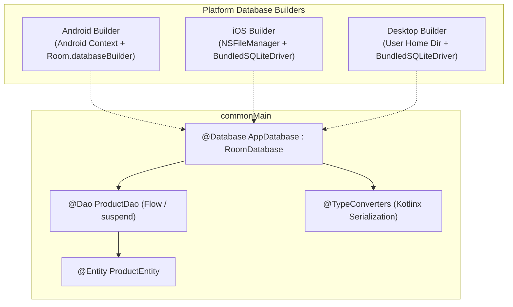

# 🗄️ Room Multiplatform Offline-First Database Mastery

This skill provides an enterprise architectural blueprint for implementing **official Room Multiplatform (`androidx.room` 2.7+)** across **Android, iOS, Desktop (JVM), and Web (Wasm)** using the **Bundled SQLite Driver**.

---

## 🏗️ 1. Multiplatform Room Architecture & Driver Topology



---

## 📦 2. Gradle Setup & KSP Multiplatform Configuration

In `gradle/libs.versions.toml`:
```toml
[versions]
room = "2.7.0-alpha12"
sqlite = "2.5.0-alpha12"
ksp = "2.1.0-1.0.29"

[libraries]
androidx-room-runtime = { module = "androidx.room:room-runtime", version.ref = "room" }
androidx-room-compiler = { module = "androidx.room:room-compiler", version.ref = "room" }
androidx-sqlite-bundled = { module = "androidx.sqlite:sqlite-bundled", version.ref = "sqlite" }

[plugins]
room = { id = "androidx.room", version.ref = "room" }
ksp = { id = "com.google.devtools.ksp", version.ref = "ksp" }
```

In `app/shared/build.gradle.kts`:
```kotlin
plugins {
    alias(libs.plugins.kotlinMultiplatform)
    alias(libs.plugins.ksp)
    alias(libs.plugins.room)
}

kotlin {
    sourceSets {
        commonMain.dependencies {
            implementation(libs.androidx.room.runtime)
            implementation(libs.androidx.sqlite.bundled)
            implementation(libs.kotlinx.coroutines.core)
            implementation(libs.kotlinx.serialization.json)
        }
    }
}

room {
    schemaDirectory("$projectDir/schemas")
}

// CRITICAL: Ensure KSP compiles Room metadata for both Common and Android targets
dependencies {
    add("kspCommonMainMetadata", libs.androidx.room.compiler)
    add("kspAndroid", libs.androidx.room.compiler)
}
```

---

## 🗄️ 3. Core Database & DAO Declarations (`commonMain`)

### Entity Definition
```kotlin
package com.example.app.core.database.entity

import androidx.room.Entity
import androidx.room.PrimaryKey
import kotlinx.serialization.Serializable

@Entity(tableName = "products")
@Serializable
data class ProductEntity(
    @PrimaryKey val id: String,
    val title: String,
    val description: String,
    val priceInCents: Long,
    val currency: String,
    val tags: List<String>,
    val updatedAtTimestamp: Long
)
```

### TypeConverters using Kotlinx Serialization
```kotlin
package com.example.app.core.database.converter

import androidx.room.TypeConverter
import kotlinx.serialization.encodeToString
import kotlinx.serialization.json.Json

class RoomTypeConverters {
    private val json = Json { ignoreUnknownKeys = true }

    @TypeConverter
    fun fromStringList(value: List<String>): String = json.encodeToString(value)

    @TypeConverter
    fun toStringList(value: String): List<String> =
        if (value.isBlank()) emptyList() else json.decodeFromString(value)
}
```

### Reactive DAO Contract
```kotlin
package com.example.app.core.database.dao

import androidx.room.Dao
import androidx.room.Query
import androidx.room.Upsert
import com.example.app.core.database.entity.ProductEntity
import kotlinx.coroutines.flow.Flow

@Dao
interface ProductDao {
    @Query("SELECT * FROM products ORDER BY updatedAtTimestamp DESC")
    fun observeAllProducts(): Flow<List<ProductEntity>>

    @Query("SELECT * FROM products WHERE id = :id LIMIT 1")
    suspend fun getProductById(id: String): ProductEntity?

    @Upsert
    suspend fun upsertProducts(products: List<ProductEntity>)

    @Upsert
    suspend fun upsertProduct(product: ProductEntity)

    @Query("DELETE FROM products WHERE id = :id")
    suspend fun deleteById(id: String)

    @Query("DELETE FROM products")
    suspend fun clearAll()
}
```

### Database Definition with `@ConstructedBy`
```kotlin
package com.example.app.core.database

import androidx.room.ConstructedBy
import androidx.room.Database
import androidx.room.RoomDatabase
import androidx.room.RoomDatabaseConstructor
import androidx.room.TypeConverters
import com.example.app.core.database.converter.RoomTypeConverters
import com.example.app.core.database.dao.ProductDao
import com.example.app.core.database.entity.ProductEntity

@Database(
    entities = [ProductEntity::class],
    version = 1
)
@TypeConverters(RoomTypeConverters::class)
@ConstructedBy(AppDatabaseConstructor::class)
abstract class AppDatabase : RoomDatabase() {
    abstract fun productDao(): ProductDao
}

// Room compiler generates the actual implementation of this constructor in KMP
@Suppress("NO_ACTUAL_FOR_EXPECT")
expect object AppDatabaseConstructor : RoomDatabaseConstructor<AppDatabase>
```

---

## 🔌 4. Multiplatform Database Builder (`expect/actual`)

### `commonMain/kotlin/.../DatabaseBuilder.kt`
```kotlin
package com.example.app.core.database

import androidx.room.RoomDatabase
import androidx.sqlite.driver.bundled.BundledSQLiteDriver
import kotlinx.coroutines.Dispatchers
import kotlinx.coroutines.IO

expect fun getDatabaseBuilder(): RoomDatabase.Builder<AppDatabase>

fun createRoomDatabase(
    builder: RoomDatabase.Builder<AppDatabase>
): AppDatabase {
    return builder
        .setDriver(BundledSQLiteDriver()) // High performance cross-platform driver
        .setQueryCoroutineContext(Dispatchers.IO)
        .build()
}
```

### `androidMain/kotlin/.../DatabaseBuilder.android.kt`
```kotlin
package com.example.app.core.database

import android.content.Context
import androidx.room.Room
import androidx.room.RoomDatabase

fun getAndroidDatabaseBuilder(context: Context): RoomDatabase.Builder<AppDatabase> {
    val dbFile = context.getDatabasePath("app_database.db")
    return Room.databaseBuilder<AppDatabase>(
        context = context,
        name = dbFile.absolutePath
    )
}
```

### `iosMain/kotlin/.../DatabaseBuilder.ios.kt`
```kotlin
package com.example.app.core.database

import androidx.room.Room
import androidx.room.RoomDatabase
import platform.Foundation.NSDocumentDirectory
import platform.Foundation.NSFileManager
import platform.Foundation.NSUserDomainMask

actual fun getDatabaseBuilder(): RoomDatabase.Builder<AppDatabase> {
    val documentDirectory = NSFileManager.defaultManager.URLForDirectory(
        directory = NSDocumentDirectory,
        inDomain = NSUserDomainMask,
        appropriateForURL = null,
        create = false,
        error = null
    )
    val dbFilePath = "${documentDirectory?.path}/app_database.db"
    return Room.databaseBuilder<AppDatabase>(
        name = dbFilePath
    )
}
```

### `desktopMain/kotlin/.../DatabaseBuilder.desktop.kt`
```kotlin
package com.example.app.core.database

import androidx.room.Room
import androidx.room.RoomDatabase
import java.io.File

actual fun getDatabaseBuilder(): RoomDatabase.Builder<AppDatabase> {
    val userHome = System.getProperty("user.home")
    val appDir = File(userHome, ".mykmpapp").apply { if (!exists()) mkdirs() }
    val dbFile = File(appDir, "app_database.db")
    
    return Room.databaseBuilder<AppDatabase>(
        name = dbFile.absolutePath
    )
}
```

---

## 🔄 5. Schema Migrations (Crash-Safe Upgrades)

```kotlin
package com.example.app.core.database.migration

import androidx.room.migration.Migration
import androidx.sqlite.SQLiteConnection
import androidx.sqlite.execSQL

val MIGRATION_1_2 = object : Migration(1, 2) {
    override fun migrate(connection: SQLiteConnection) {
        connection.execSQL("ALTER TABLE products ADD COLUMN isArchived INTEGER NOT NULL DEFAULT 0")
    }
}

// Add to Room builder
// builder.addMigrations(MIGRATION_1_2)
```

---

## 🚫 6. Room KMP Anti-Patterns & Gotchas

| Anti-Pattern | Root Problem | Correct Architecture |
|---|---|---|
| **Missing `BundledSQLiteDriver`** | iOS and Desktop do not have an Android FrameworkSQLiteOpenHelper; omitting the driver causes startup crashes. | Always invoke `.setDriver(BundledSQLiteDriver())` in database factory. |
| **Omitting `@ConstructedBy`** | Without `@ConstructedBy(AppDatabaseConstructor::class)`, Kotlin Multiplatform compiler cannot link the generated database implementation. | Always declare `@ConstructedBy` and the corresponding `expect object AppDatabaseConstructor`. |
| **Executing Queries on Main Thread** | Performing SQLite reads/writes on UI thread triggers ANRs on Android and frame drops on Desktop. | Configure `.setQueryCoroutineContext(Dispatchers.IO)`. |
| **KSP config missing `kspCommonMainMetadata`** | Common Room entities are not processed if KSP is only declared for `kspAndroid`. | Add `add("kspCommonMainMetadata", libs.androidx.room.compiler)`. |
