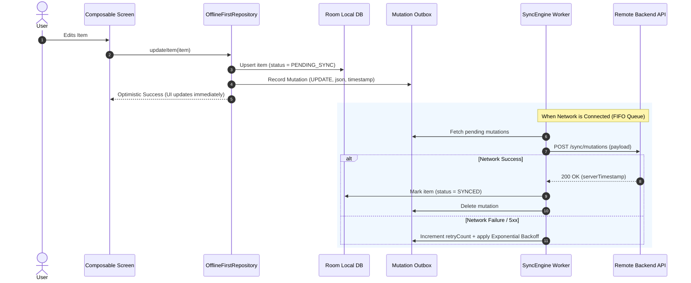

# 🔄 KMP Offline-First Sync Engine & Mutation Outbox

This skill provides an enterprise architectural blueprint for building **robust, offline-first synchronization engines** in **Kotlin Multiplatform (KMP)**. It implements **Optimistic UI updates**, the **Mutation Outbox Pattern**, and **deterministic conflict resolution**.

---

## 🏗️ 1. The Offline-First & Outbox Architecture

The user interface **never blocks on the network**. All user mutations are written immediately to local Room storage alongside an Outbox record:



---

## 🗄️ 2. Mutation Outbox Entity & DAO (`commonMain`)

### Outbox Entity
```kotlin
package com.example.app.core.sync.outbox

import androidx.room.Entity
import androidx.room.PrimaryKey

enum class MutationAction { CREATE, UPDATE, DELETE }
enum class MutationStatus { PENDING, PROCESSING, FAILED }

@Entity(tableName = "sync_mutations")
data class SyncMutationEntity(
    @PrimaryKey val id: String,
    val entityType: String,       // e.g. "product", "note", "cart_item"
    val entityId: String,
    val action: MutationAction,
    val payloadJson: String,      // Serialized DTO payload
    val createdAtTimestamp: Long,
    val retryCount: Int = 0,
    val status: MutationStatus = MutationStatus.PENDING,
    val lastError: String? = null
)
```

### Outbox DAO
```kotlin
package com.example.app.core.sync.outbox

import androidx.room.Dao
import androidx.room.Query
import androidx.room.Upsert
import kotlinx.coroutines.flow.Flow

@Dao
interface SyncMutationDao {
    @Query("SELECT * FROM sync_mutations WHERE status != 'FAILED' ORDER BY createdAtTimestamp ASC")
    suspend fun getPendingMutations(): List<SyncMutationEntity>

    @Query("SELECT COUNT(*) FROM sync_mutations WHERE status != 'FAILED'")
    fun observePendingCount(): Flow<Int>

    @Upsert
    suspend fun recordMutation(mutation: SyncMutationEntity)

    @Query("DELETE FROM sync_mutations WHERE id = :mutationId")
    suspend fun deleteMutation(mutationId: String)

    @Query("UPDATE sync_mutations SET retryCount = retryCount + 1, lastError = :error, status = :status WHERE id = :id")
    suspend fun updateRetry(id: String, error: String, status: MutationStatus)
}
```

---

## ⚖️ 3. Conflict Resolution Strategy (Last-Write-Wins)

When the client synchronizes delta changes with the server, conflicting updates are reconciled deterministically:

```kotlin
package com.example.app.core.sync.conflict

enum class ConflictStrategy {
    LAST_WRITE_WINS, // Compares client timestamp vs server timestamp
    SERVER_WINS,     // Always overwrites client cache with server truth
    CLIENT_WINS      // Preserves local client state
}

data class SyncRecord<T>(
    val data: T,
    val updatedAtTimestamp: Long,
    val isDeleted: Boolean = false
)

object ConflictResolver {
    fun <T> resolve(
        local: SyncRecord<T>,
        remote: SyncRecord<T>,
        strategy: ConflictStrategy = ConflictStrategy.LAST_WRITE_WINS
    ): SyncRecord<T> {
        return when (strategy) {
            ConflictStrategy.SERVER_WINS -> remote
            ConflictStrategy.CLIENT_WINS -> local
            ConflictStrategy.LAST_WRITE_WINS -> {
                if (remote.updatedAtTimestamp >= local.updatedAtTimestamp) {
                    remote
                } else {
                    local
                }
            }
        }
    }
}
```

---

## 🚀 4. The SyncCoordinator Engine

The central engine coordinating outbox flushing and delta synchronization:

```kotlin
package com.example.app.core.sync

import com.example.app.core.dispatchers.AppDispatchers
import com.example.app.core.network.safeApiCall
import com.example.app.core.sync.outbox.MutationAction
import com.example.app.core.sync.outbox.MutationStatus
import com.example.app.core.sync.outbox.SyncMutationDao
import com.example.app.core.sync.outbox.SyncMutationEntity
import io.ktor.client.HttpClient
import io.ktor.client.request.delete
import io.ktor.client.request.post
import io.ktor.client.request.put
import io.ktor.client.request.setBody
import kotlinx.coroutines.delay
import kotlinx.coroutines.sync.Mutex
import kotlinx.coroutines.sync.withLock
import kotlinx.coroutines.withContext
import kotlin.math.min
import kotlin.math.pow

class SyncCoordinator(
    private val mutationDao: SyncMutationDao,
    private val httpClient: HttpClient,
    private val dispatchers: AppDispatchers
) {
    private val syncMutex = Mutex()
    private val maxRetries = 5

    suspend fun synchronize(): Result<Unit> = syncMutex.withLock {
        withContext(dispatchers.io) {
            runCatching {
                // 1. Process Outbox Mutations in strict FIFO order
                flushOutbox()

                // 2. Pull remote delta updates from server
                pullRemoteDeltas()
            }
        }
    }

    private suspend fun flushOutbox() {
        val pendingMutations = mutationDao.getPendingMutations()

        for (mutation in pendingMutations) {
            val success = processSingleMutation(mutation)
            if (!success) {
                // Stop sequential processing on network failure to preserve causality
                break
            }
        }
    }

    private suspend fun processSingleMutation(mutation: SyncMutationEntity): Boolean {
        try {
            val response = when (mutation.action) {
                MutationAction.CREATE -> httpClient.post("https://api.example.com/v1/${mutation.entityType}") {
                    setBody(mutation.payloadJson)
                }
                MutationAction.UPDATE -> httpClient.put("https://api.example.com/v1/${mutation.entityType}/${mutation.entityId}") {
                    setBody(mutation.payloadJson)
                }
                MutationAction.DELETE -> httpClient.delete("https://api.example.com/v1/${mutation.entityType}/${mutation.entityId}")
            }

            // Mutation confirmed by backend
            mutationDao.deleteMutation(mutation.id)
            return true
        } catch (e: Exception) {
            val nextRetry = mutation.retryCount + 1
            val status = if (nextRetry >= maxRetries) MutationStatus.FAILED else MutationStatus.PENDING

            mutationDao.updateRetry(
                id = mutation.id,
                error = e.message ?: "Network error during sync",
                status = status
            )

            // Calculate exponential backoff delay before allowing retry
            val backoffMs = min(30_000L, (2.0.pow(nextRetry) * 1000).toLong())
            delay(backoffMs)
            return false
        }
    }

    private suspend fun pullRemoteDeltas() {
        // Implementation queries GET /sync?since={lastPulledTimestamp}
        // and reconciles changes via ConflictResolver
    }
}
```

---

## 🚫 5. Offline Sync Anti-Patterns

| Anti-Pattern | Root Problem | Correct Architecture |
|---|---|---|
| **Blocking UI on Network Responses** | Forbids user actions while offline or during slow 3G connections. | Write to local Room DB immediately (optimistic write); sync in the background via Outbox. |
| **Out-of-Order Queue Processing** | Processing mutation #2 (Update) before mutation #1 (Create) causes 404 Not Found on the backend. | Always consume mutations in strict sequential FIFO order (`createdAtTimestamp ASC`). |
| **Silent Mutation Drops on Crash** | Keeping mutations purely in-memory loses pending user edits if the app is killed. | Persist every mutation immediately into the Room `sync_mutations` table before returning to UI. |
| **Infinite Retries on 4xx Client Errors** | Retrying a `400 Bad Request` or `422 Unprocessable` indefinitely drains battery and blocks the sync queue. | Mark mutations as `MutationStatus.FAILED` immediately on 4xx responses; only retry on 5xx or IO drops. |
