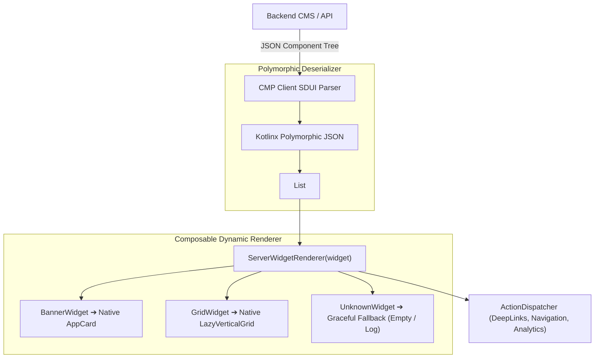

# 🧩 Server-Driven UI (SDUI) Engine for Compose Multiplatform

This skill provides an enterprise architectural blueprint for implementing a **Server-Driven UI (SDUI)** engine in **Compose Multiplatform (CMP)**. It allows product and marketing teams to change app layouts, banners, and flows dynamically via backend JSON **without releasing new app binary updates**.

---

## 🏗️ 1. The SDUI Rendering Pipeline



---

## 📦 2. Polymorphic Widget Contracts (`commonMain`)

Use `@JsonClassDiscriminator("type")` to deserialize heterogeneous component nodes safely:

```kotlin
package com.example.app.core.sdui.model

import kotlinx.serialization.ExperimentalSerializationApi
import kotlinx.serialization.SerialName
import kotlinx.serialization.Serializable
import kotlinx.serialization.json.JsonClassDiscriminator

@Serializable
sealed interface ServerAction {
    @Serializable
    @SerialName("navigate")
    data class Navigate(val destination: String) : ServerAction

    @Serializable
    @SerialName("open_url")
    data class OpenUrl(val url: String) : ServerAction

    @Serializable
    @SerialName("track_event")
    data class TrackEvent(val eventName: String) : ServerAction
}

@OptIn(ExperimentalSerializationApi::class)
@Serializable
@JsonClassDiscriminator("type")
sealed interface ServerWidget {
    val id: String

    @Serializable
    @SerialName("banner")
    data class Banner(
        override val id: String,
        val imageUrl: String,
        val title: String,
        val action: ServerAction? = null
    ) : ServerWidget

    @Serializable
    @SerialName("carousel")
    data class Carousel(
        override val id: String,
        val items: List<ServerWidget>
    ) : ServerWidget

    @Serializable
    @SerialName("text_block")
    data class TextBlock(
        override val id: String,
        val text: String,
        val style: String = "body"
    ) : ServerWidget

    @Serializable
    @SerialName("unknown")
    data class Unknown(
        override val id: String = "unknown"
    ) : ServerWidget
}
```

---

## 🛠️ 3. Defensive Polymorphic JSON Parser

Ensure that when the backend deploys new widget types, older client versions do not crash:

```kotlin
package com.example.app.core.sdui.parser

import com.example.app.core.sdui.model.ServerWidget
import kotlinx.serialization.json.Json
import kotlinx.serialization.modules.SerializersModule
import kotlinx.serialization.modules.polymorphic
import kotlinx.serialization.modules.subclass

object SduiJsonParser {
    val json = Json {
        ignoreUnknownKeys = true
        isLenient = true
        serializersModule = SerializersModule {
            polymorphic(ServerWidget::class) {
                subclass(ServerWidget.Banner::class)
                subclass(ServerWidget.Carousel::class)
                subclass(ServerWidget.TextBlock::class)
                defaultDeserializer { ServerWidget.Unknown.serializer() } // Fallback safe!
            }
        }
    }
}
```

---

## 🎨 4. Recursive Composable Widget Renderer

Map JSON models to high-performance native Compose Multiplatform components:

```kotlin
package com.example.app.core.sdui.ui

import androidx.compose.foundation.clickable
import androidx.compose.foundation.layout.*
import androidx.compose.foundation.lazy.LazyRow
import androidx.compose.foundation.lazy.items
import androidx.compose.foundation.shape.RoundedCornerShape
import androidx.compose.material3.MaterialTheme
import androidx.compose.material3.Text
import androidx.compose.runtime.Composable
import androidx.compose.ui.Modifier
import androidx.compose.ui.unit.dp
import com.example.app.core.sdui.model.ServerAction
import com.example.app.core.sdui.model.ServerWidget
import com.example.app.core.ui.atoms.AppAsyncImage
import com.example.app.core.ui.molecules.AppCard

@Composable
fun ServerWidgetRenderer(
    widget: ServerWidget,
    onAction: (ServerAction) -> Unit,
    modifier: Modifier = Modifier
) {
    when (widget) {
        is ServerWidget.Banner -> {
            AppCard(
                modifier = modifier
                    .fillMaxWidth()
                    .clickable { widget.action?.let(onAction) },
                shape = RoundedCornerShape(16.dp)
            ) {
                AppAsyncImage(
                    imageUrl = widget.imageUrl,
                    contentDescription = widget.title,
                    modifier = Modifier.fillMaxWidth().height(160.dp)
                )
                Spacer(Modifier.height(8.dp))
                Text(widget.title, style = MaterialTheme.typography.titleMedium)
            }
        }

        is ServerWidget.Carousel -> {
            LazyRow(
                modifier = modifier.fillMaxWidth(),
                contentPadding = PaddingValues(horizontal = 16.dp),
                horizontalArrangement = Arrangement.spacedBy(12.dp)
            ) {
                items(widget.items, key = { it.id }) { childWidget ->
                    ServerWidgetRenderer(
                        widget = childWidget,
                        onAction = onAction,
                        modifier = Modifier.width(280.dp)
                    )
                }
            }
        }

        is ServerWidget.TextBlock -> {
            Text(
                text = widget.text,
                style = if (widget.style == "headline") MaterialTheme.typography.headlineSmall else MaterialTheme.typography.bodyMedium,
                modifier = modifier.padding(vertical = 4.dp)
            )
        }

        is ServerWidget.Unknown -> {
            // Graceful degradation: render nothing, avoid app crash
        }
    }
}
```

---

## 🚫 5. SDUI Anti-Patterns

| Anti-Pattern | Root Problem | Correct Architecture |
|---|---|---|
| **No Fallback for Unknown Types** | When backend adds a new widget type, older clients crash on `SerializationException`. | Always configure `defaultDeserializer { Unknown.serializer() }`. |
| **Executing Raw Code or URLs blindly** | Executing arbitrary server-injected JS strings opens critical security vulnerabilities. | Map server actions strictly to a predefined sealed interface (`ServerAction`). |
| **Re-parsing JSON on Recomposition** | Calling `json.decodeFromString` inside Composable body blocks render frames. | Parse JSON in ViewModel background coroutines; pass immutable `List<ServerWidget>` to UI. |
| **Monolithic Giant JSON Payloads** | Downloading 10MB of nested JSON delays screen load. | Paginate SDUI sections or use lightweight skeleton layouts with deferred lazy fetching. |
