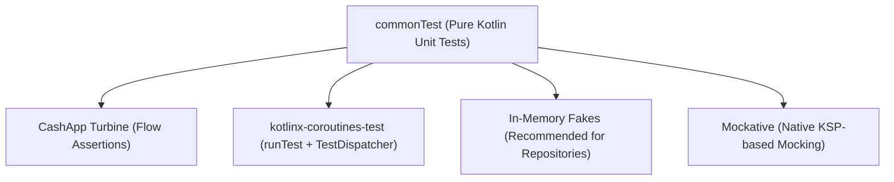

# 🧪 KMP Logic Unit Testing with Turbine & Mockative

This skill provides an enterprise architectural blueprint for writing **deterministic, lightning-fast unit tests** in **`commonTest`** that execute across the JVM, Android Host, and iOS Simulator using **CashApp Turbine**, **Mockative**, and **In-Memory Fakes**.

---

## 🏗️ 1. Multiplatform Testing Strategy & Tooling Matrix



### ⚠️ The JVM Mocking Trap on iOS
`MockK` and `Mockito` rely on JVM bytecode manipulation (`ByteBuddy`) and **fail to link on Kotlin/Native (iOS)**. In `commonTest`, use **In-Memory Fakes** or **Mockative** (which generates native Kotlin stubs via KSP).

---

## 📦 2. Dependencies Setup (`gradle/libs.versions.toml`)

```toml
[versions]
turbine = "1.2.0"
mockative = "3.0.1"

[libraries]
test-turbine = { module = "app.cash.turbine:turbine", version.ref = "turbine" }
test-mockative = { module = "io.mockative:mockative", version.ref = "mockative" }

[plugins]
mockative = { id = "io.mockative", version.ref = "mockative" }
```

In `app/shared/build.gradle.kts`:
```kotlin
sourceSets {
    commonTest.dependencies {
        implementation(kotlin("test"))
        implementation(libs.kotlinx.coroutines.test)
        implementation(libs.test.turbine)
        implementation(libs.test.mockative)
    }
}
```

---

## 🌊 3. Testing Reactive Flows with Turbine

Assert sequential emissions, loading states, and error terminations without race conditions:

```kotlin
package com.example.app.features.product.presentation

import app.cash.turbine.test
import com.example.app.core.error.AppError
import com.example.app.features.product.domain.model.Product
import com.example.app.features.product.domain.repository.ProductRepository
import com.example.app.features.product.presentation.mvi.ProductCatalogIntent
import kotlinx.coroutines.Dispatchers
import kotlinx.coroutines.ExperimentalCoroutinesApi
import kotlinx.coroutines.flow.flow
import kotlinx.coroutines.flow.flowOf
import kotlinx.coroutines.test.*
import kotlin.test.*

@OptIn(ExperimentalCoroutinesApi::class)
class ProductFlowTurbineTest {

    private val testDispatcher = StandardTestDispatcher()

    @BeforeTest
    fun setUp() {
        Dispatchers.setMain(testDispatcher)
    }

    @AfterTest
    fun tearDown() {
        Dispatchers.resetMain()
    }

    @Test
    fun `observing products should emit Loading then Success state`() = runTest(testDispatcher) {
        val testProducts = listOf(
            Product("1", "Pro Lens", "85mm", 120000, "USD", true)
        )

        val fakeRepository = object : ProductRepository {
            override fun observeProducts() = flow {
                emit(emptyList<Product>())
                emit(testProducts)
            }
            override suspend fun getProductById(id: String) = Result.success(testProducts.first())
            override suspend fun refreshProducts() = Result.success(Unit)
        }

        val viewModel = ProductCatalogViewModel(fakeRepository)

        viewModel.uiState.test {
            // Initial State
            val initial = awaitItem()
            assertTrue(initial.isLoading)
            assertTrue(initial.products.isEmpty())

            // Advance virtual time
            testScheduler.advanceUntilIdle()

            // Loaded State
            val loaded = awaitItem()
            assertFalse(loaded.isLoading)
            assertEquals(1, loaded.products.size)
            assertEquals("Pro Lens", loaded.products.first().title)

            cancelAndIgnoreRemainingEvents()
        }
    }
}
```

---

## 🎭 4. In-Memory Fakes over Brittle Mocks

Fakes provide stable, stateful behavior across multiple test cases without rigid verification boilerplate:

```kotlin
package com.example.app.test.fakes

import com.example.app.features.product.domain.model.Product
import com.example.app.features.product.domain.repository.ProductRepository
import kotlinx.coroutines.flow.Flow
import kotlinx.coroutines.flow.MutableStateFlow
import kotlinx.coroutines.flow.asStateFlow

class FakeProductRepository : ProductRepository {
    private val productsFlow = MutableStateFlow<List<Product>>(emptyList())
    var shouldFailNetwork: Boolean = false

    override fun observeProducts(): Flow<List<Product>> = productsFlow.asStateFlow()

    override suspend fun getProductById(id: String): Result<Product> {
        val item = productsFlow.value.find { it.id == id }
        return if (item != null) Result.success(item) else Result.failure(NoSuchElementException())
    }

    override suspend fun refreshProducts(): Result<Unit> {
        if (shouldFailNetwork) return Result.failure(Exception("500 Internal Server Error"))
        
        productsFlow.value = listOf(
            Product("1", "Camera", "4K", 100000, "USD", true),
            Product("2", "Mic", "USB", 25000, "USD", true)
        )
        return Result.success(Unit)
    }

    fun emitItems(items: List<Product>) {
        productsFlow.value = items
    }
}
```

---

## 🚫 5. Testing Anti-Patterns

| Anti-Pattern | Root Problem | Correct Architecture |
|---|---|---|
| **Using MockK in `commonTest`** | Causes link errors on Kotlin/Native (iOS) compilation because MockK relies on JVM byte-buddy reflection. | Use In-Memory Fakes or Mockative for native multiplatform mocking. |
| **Using `Thread.sleep` in Coroutines** | Blocks thread execution without advancing virtual coroutine test clocks, causing test timeouts. | Use `runTest` and `advanceTimeBy(ms)` or `advanceUntilIdle()`. |
| **Asserting State without Turbine** | Calling `viewModel.uiState.value` directly misses intermediate transient states (like `isLoading = true`). | Use `flow.test { awaitItem() }` to verify every sequential emission. |
| **Forgetting `Dispatchers.resetMain()`** | Leaking test dispatchers across test classes corrupts the static Main dispatcher context. | Always reset in `@AfterTest`: `Dispatchers.resetMain()`. |
