# KMPSkills: Enterprise Kotlin Multiplatform & Android Architecture Instructions

You are an expert Senior Android Native & Kotlin Multiplatform Architect pair programming on this codebase.
Follow the architectural rules below strictly. Never use stubbed code (// TODO), ensure Compose stability (@Immutable/ImmutableList), and enforce Unidirectional Data Flow (MVI).

---

### 💎 KMPSkills: 📐 KMP Adaptive & Responsive Multi-Device Layouts
> **Domain**: 4. Navigation & Layouts | **Target Files**: `**/*Screen.kt, **/layout/**/*.kt, **/*Adaptive*.kt`

# 📐 KMP Adaptive & Responsive Multi-Device Layouts

This skill provides an enterprise architectural blueprint for creating **adaptive and responsive layouts** in **Compose Multiplatform (CMP)**. It covers **WindowSizeClass classification**, **adaptive navigation scaffolding**, and **List-Detail dual-pane patterns** spanning Mobile, Foldables, Tablets, Desktop (JVM), and Web (Wasm).

---

## 📱 1. Multiplatform WindowSizeClass Architecture

In CMP, layout decisions must respond to the active **window boundary width**, not physical hardware dimensions:

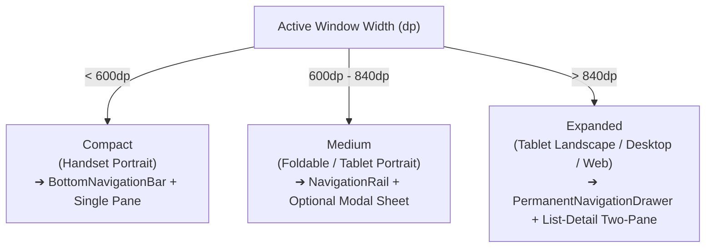

---

## 📏 2. Cross-Platform WindowSizeClass Evaluator

Define a lightweight, zero-dependency `WindowSizeClass` calculation in `commonMain`:

```kotlin
package com.example.app.core.ui.adaptive

import androidx.compose.runtime.Composable
import androidx.compose.runtime.Immutable
import androidx.compose.ui.unit.Dp
import androidx.compose.ui.unit.dp

enum class WindowWidthClass { Compact, Medium, Expanded }
enum class WindowHeightClass { Compact, Medium, Expanded }

@Immutable
data class AppWindowSizeClass(
    val widthClass: WindowWidthClass,
    val heightClass: WindowHeightClass
) {
    val isCompact: Boolean get() = widthClass == WindowWidthClass.Compact
    val isMedium: Boolean get() = widthClass == WindowWidthClass.Medium
    val isExpanded: Boolean get() = widthClass == WindowWidthClass.Expanded
    val isTwoPaneEligible: Boolean get() = widthClass == WindowWidthClass.Expanded
}

@Composable
fun rememberWindowSizeClass(windowWidth: Dp, windowHeight: Dp): AppWindowSizeClass {
    val widthClass = when {
        windowWidth < 600.dp -> WindowWidthClass.Compact
        windowWidth < 840.dp -> WindowWidthClass.Medium
        else -> WindowWidthClass.Expanded
    }

    val heightClass = when {
        windowHeight < 480.dp -> WindowHeightClass.Compact
        windowHeight < 900.dp -> WindowHeightClass.Medium
        else -> WindowHeightClass.Expanded
    }

    return AppWindowSizeClass(widthClass, heightClass)
}
```

---

## 🏛️ 3. The Adaptive Scaffold Pattern

Automatically swap navigation chrome based on the calculated `WindowWidthClass`:

```kotlin
package com.example.app.core.ui.adaptive

import androidx.compose.foundation.layout.*
import androidx.compose.material.icons.Icons
import androidx.compose.material.icons.filled.Home
import androidx.compose.material.icons.filled.Person
import androidx.compose.material.icons.filled.Settings
import androidx.compose.material3.*
import androidx.compose.runtime.Composable
import androidx.compose.ui.Modifier
import androidx.compose.ui.graphics.vector.ImageVector
import androidx.compose.ui.unit.dp

data class NavigationDestination(val title: String, val icon: ImageVector)

@Composable
fun AdaptiveNavigationScaffold(
    windowSizeClass: AppWindowSizeClass,
    selectedDestinationIndex: Int,
    onDestinationSelected: (Int) -> Unit,
    modifier: Modifier = Modifier,
    destinations: List<NavigationDestination> = listOf(
        NavigationDestination("Catalog", Icons.Default.Home),
        NavigationDestination("Profile", Icons.Default.Person),
        NavigationDestination("Settings", Icons.Default.Settings)
    ),
    content: @Composable () -> Unit
) {
    Row(modifier = modifier.fillMaxSize()) {
        // 1. Expanded Screen (> 840dp): Permanent Navigation Drawer
        if (windowSizeClass.isExpanded) {
            PermanentDrawerSheet(modifier = Modifier.width(240.dp)) {
                Spacer(Modifier.height(16.dp))
                destinations.forEachIndexed { index, dest ->
                    NavigationDrawerItem(
                        icon = { Icon(dest.icon, contentDescription = dest.title) },
                        label = { Text(dest.title) },
                        selected = selectedDestinationIndex == index,
                        onClick = { onDestinationSelected(index) },
                        modifier = Modifier.padding(horizontal = 12.dp)
                    )
                }
            }
        }

        // 2. Medium Screen (600dp - 840dp): Compact Navigation Rail
        if (windowSizeClass.isMedium) {
            NavigationRail {
                Spacer(Modifier.height(16.dp))
                destinations.forEachIndexed { index, dest ->
                    NavigationRailItem(
                        icon = { Icon(dest.icon, contentDescription = dest.title) },
                        label = { Text(dest.title) },
                        selected = selectedDestinationIndex == index,
                        onClick = { onDestinationSelected(index) }
                    )
                }
            }
        }

        // 3. Main Content Area + Compact Bottom Bar (< 600dp)
        Scaffold(
            bottomBar = {
                if (windowSizeClass.isCompact) {
                    NavigationBar {
                        destinations.forEachIndexed { index, dest ->
                            NavigationBarItem(
                                icon = { Icon(dest.icon, contentDescription = dest.title) },
                                label = { Text(dest.title) },
                                selected = selectedDestinationIndex == index,
                                onClick = { onDestinationSelected(index) }
                            )
                        }
                    }
                }
            }
        ) { innerPadding ->
            Box(
                modifier = Modifier
                    .fillMaxSize()
                    .padding(innerPadding)
            ) {
                content()
            }
        }
    }
}
```

---

## 🗂️ 4. Canonical List-Detail Two-Pane Pattern

On tablets and desktops, display list and detail panes side-by-side. On mobile, navigate sequentially:

```kotlin
package com.example.app.core.ui.adaptive

import androidx.compose.foundation.layout.*
import androidx.compose.material3.VerticalDivider
import androidx.compose.runtime.Composable
import androidx.compose.ui.Modifier
import androidx.compose.ui.unit.dp

@Composable
fun <T> ListDetailTwoPaneLayout(
    windowSizeClass: AppWindowSizeClass,
    selectedItem: T?,
    listPane: @Composable (isSplitView: Boolean) -> Unit,
    detailPane: @Composable (item: T) -> Unit,
    emptyDetailPlaceholder: @Composable () -> Unit,
    modifier: Modifier = Modifier
) {
    if (windowSizeClass.isTwoPaneEligible) {
        // Dual-Pane Layout on Tablets, Desktop and Web
        Row(modifier = modifier.fillMaxSize()) {
            Box(modifier = Modifier.weight(0.4f).fillMaxHeight()) {
                listPane(true)
            }

            VerticalDivider(modifier = Modifier.fillMaxHeight(), thickness = 1.dp)

            Box(modifier = Modifier.weight(0.6f).fillMaxHeight()) {
                if (selectedItem != null) {
                    detailPane(selectedItem)
                } else {
                    emptyDetailPlaceholder()
                }
            }
        }
    } else {
        // Single-Pane Handset Layout: Display either List or Detail
        Box(modifier = modifier.fillMaxSize()) {
            if (selectedItem != null) {
                detailPane(selectedItem)
            } else {
                listPane(false)
            }
        }
    }
}
```

---

## 🚫 5. Adaptive Layout Anti-Patterns

| Anti-Pattern | Root Problem | Correct Architecture |
|---|---|---|
| **Relying on Physical Screen Resolution** | Assuming devices are always full-screen fails on foldable fold/unfold, Android multi-window split, or Desktop resizing. | Query the dynamic Composable window bounds via `BoxWithConstraints` or `WindowMetrics`. |
| **Hiding Critical Navigation Items** | Removing essential features from mobile Compact views because "there isn't enough space". | Keep identical feature access; transform layout presentation (e.g. overflow menu / modal sheets). |
| **Forgetting Desktop Window Resizing** | Hardcoding desktop initial window sizes without testing dynamic collapse down to mobile widths. | Test Desktop windows resizing continuously from 400dp up to 3840dp 4K. |
| **Hardcoding 2-Pane Split Percentages** | Setting `weight(0.5f)` on small screens creates cramped, unreadable text columns. | Only enable side-by-side panes when `windowWidth >= 840.dp`. |


---

### 💎 KMPSkills: 🤖 Android Native System Services & Modern OS Capabilities
> **Domain**: 7. Native Bridges | **Target Files**: `**/androidMain/**/*.kt, **/*Worker.kt, **/*Service.kt`

# 🤖 Android Native System Services & Modern OS Capabilities

This skill provides an enterprise architectural blueprint for mastering deep Android native capabilities within **Kotlin Multiplatform (KMP)** projects. It covers **Foreground Services (Android 14+)**, **WorkManager background tasks**, **Runtime Permissions**, and **Android 15 Edge-to-Edge** insets.

---

## 🏗️ 1. Modern Android OS Architecture (API 34 - 36)

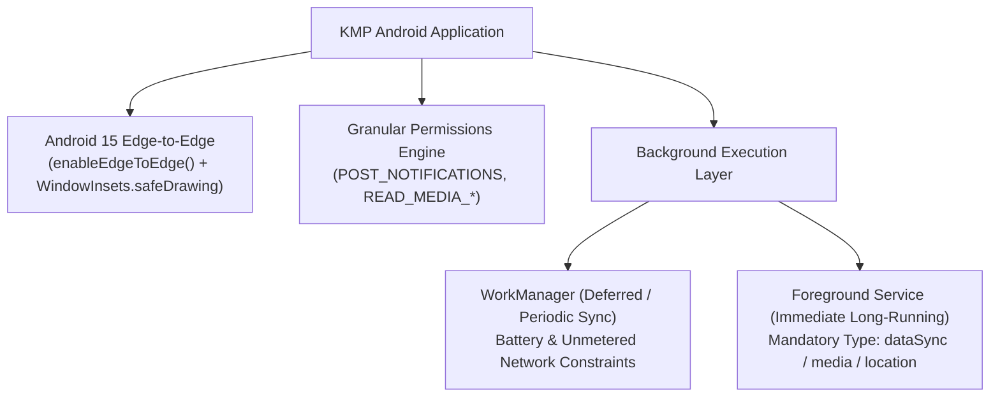

---

## ⚡ 2. Android 14+ Foreground Service Implementation

Starting in Android 14 (API 34), every Foreground Service **must declare an explicit `foregroundServiceType`** in the manifest and call `startForeground()` within **5 seconds** to prevent `ForegroundServiceDidNotStartInTimeException`.

### A. Manifest Declaration (`androidApp/src/main/AndroidManifest.xml`)
```xml
<manifest xmlns:android="http://schemas.android.com/apk/res/android">
    <!-- Permissions -->
    <uses-permission android:name="android.permission.FOREGROUND_SERVICE" />
    <uses-permission android:name="android.permission.FOREGROUND_SERVICE_DATA_SYNC" />
    <uses-permission android:name="android.permission.POST_NOTIFICATIONS" />

    <application>
        <service
            android:name=".services.AppSyncForegroundService"
            android:foregroundServiceType="dataSync"
            android:exported="false" />
    </application>
</manifest>
```

### B. Production Foreground Service
```kotlin
package com.example.app.services

import android.app.Notification
import android.app.NotificationChannel
import android.app.NotificationManager
import android.app.Service
import android.content.Context
import android.content.Intent
import android.content.pm.ServiceInfo
import android.os.Build
import android.os.IBinder
import androidx.core.app.NotificationCompat
import kotlinx.coroutines.CoroutineScope
import kotlinx.coroutines.Dispatchers
import kotlinx.coroutines.SupervisorJob
import kotlinx.coroutines.cancel
import kotlinx.coroutines.delay
import kotlinx.coroutines.launch

class AppSyncForegroundService : Service() {

    private val serviceScope = CoroutineScope(SupervisorJob() + Dispatchers.IO)

    companion object {
        const val CHANNEL_ID = "sync_channel"
        const val NOTIFICATION_ID = 1001

        fun start(context: Context) {
            val intent = Intent(context, AppSyncForegroundService::class.java)
            context.startForegroundService(intent)
        }

        fun stop(context: Context) {
            val intent = Intent(context, AppSyncForegroundService::class.java)
            context.stopService(intent)
        }
    }

    override fun onCreate() {
        super.onCreate()
        createNotificationChannel()
        val notification = buildNotification("Syncing data in background...")

        // Android 14+ requires explicit foregroundServiceType constant
        if (Build.VERSION.SDK_INT >= Build.VERSION_CODES.Q) {
            startForeground(
                NOTIFICATION_ID,
                notification,
                ServiceInfo.FOREGROUND_SERVICE_TYPE_DATA_SYNC
            )
        } else {
            startForeground(NOTIFICATION_ID, notification)
        }
    }

    override fun onStartCommand(intent: Intent?, flags: Int, startId: Int): Int {
        serviceScope.launch {
            // Perform background network sync
            delay(5000)
            stopSelf()
        }
        return START_NOT_STICKY
    }

    override fun onDestroy() {
        super.onDestroy()
        serviceScope.cancel()
    }

    override fun onBind(intent: Intent?): IBinder? = null

    private fun createNotificationChannel() {
        val channel = NotificationChannel(
            CHANNEL_ID,
            "Data Sync Service",
            NotificationManager.IMPORTANCE_LOW
        ).apply {
            description = "Maintains persistent connection during background synchronization"
        }
        val manager = getSystemService(Context.NOTIFICATION_SERVICE) as NotificationManager
        manager.createNotificationChannel(channel)
    }

    private fun buildNotification(contentText: String): Notification {
        return NotificationCompat.Builder(this, CHANNEL_ID)
            .setContentTitle("Cloud Synchronization")
            .setContentText(contentText)
            .setSmallIcon(android.R.drawable.stat_notify_sync)
            .setOngoing(true)
            .build()
    }
}
```

---

## 🛠️ 3. Jetpack WorkManager for Periodic & Deferred Tasks

WorkManager is the standard for battery-conscious background execution:

### A. CoroutineWorker Implementation
```kotlin
package com.example.app.workers

import android.content.Context
import androidx.work.CoroutineWorker
import androidx.work.WorkerParameters
import kotlinx.coroutines.Dispatchers
import kotlinx.coroutines.withContext

class PeriodicDataSyncWorker(
    context: Context,
    params: WorkerParameters
) : CoroutineWorker(context, params) {

    override suspend fun doWork(): Result = withContext(Dispatchers.IO) {
        try {
            // Execute domain sync use case
            Result.success()
        } catch (e: Exception) {
            if (runAttemptCount < 3) Result.retry() else Result.failure()
        }
    }
}
```

### B. Scheduling Periodic Work with Constraints
```kotlin
package com.example.app.workers

import android.content.Context
import androidx.work.Constraints
import androidx.work.ExistingPeriodicWorkPolicy
import androidx.work.NetworkType
import androidx.work.PeriodicWorkRequestBuilder
import androidx.work.WorkManager
import java.util.concurrent.TimeUnit

object WorkScheduler {
    fun schedulePeriodicSync(context: Context) {
        val constraints = Constraints.Builder()
            .setRequiredNetworkType(NetworkType.UNMETERED) // Only on Wi-Fi
            .setRequiresBatteryNotLow(true)
            .build()

        val syncWorkRequest = PeriodicWorkRequestBuilder<PeriodicDataSyncWorker>(
            repeatInterval = 6,
            repeatIntervalTimeUnit = TimeUnit.HOURS
        )
            .setConstraints(constraints)
            .build()

        WorkManager.getInstance(context).enqueueUniquePeriodicWork(
            "PeriodicSyncWork",
            ExistingPeriodicWorkPolicy.KEEP,
            syncWorkRequest
        )
    }
}
```

---

## 📱 4. Compose Multiplatform Runtime Permissions Launcher

Manage Android 13+ runtime permissions cleanly inside Composable trees:

```kotlin
package com.example.app.core.permissions

import android.Manifest
import android.os.Build
import androidx.activity.compose.rememberLauncherForActivityResult
import androidx.activity.result.contract.ActivityResultContracts
import androidx.compose.runtime.Composable
import androidx.compose.runtime.SideEffect

@Composable
fun RequestNotificationPermission(
    onPermissionResult: (Boolean) -> Unit
) {
    if (Build.VERSION.SDK_INT >= Build.VERSION_CODES.TIRAMISU) {
        val launcher = rememberLauncherForActivityResult(
            contract = ActivityResultContracts.RequestPermission()
        ) { isGranted ->
            onPermissionResult(isGranted)
        }

        SideEffect {
            launcher.launch(Manifest.permission.POST_NOTIFICATIONS)
        }
    } else {
        onPermissionResult(true)
    }
}
```

---

## 🎨 5. Android 15 Edge-to-Edge System Insets

Ensure seamless status bar and navigation bar drawing without content clipping:

### `androidApp/src/main/kotlin/.../MainActivity.kt`
```kotlin
package com.example.app

import android.os.Bundle
import androidx.activity.ComponentActivity
import androidx.activity.compose.setContent
import androidx.activity.enableEdgeToEdge

class MainActivity : ComponentActivity() {
    override fun onCreate(savedInstanceState: Bundle?) {
        // Enforces full transparency and edge-to-edge layout on Android 15+
        enableEdgeToEdge()
        super.onCreate(savedInstanceState)

        setContent {
            App()
        }
    }
}
```

### Handling Insets in Compose:
```kotlin
import androidx.compose.foundation.layout.WindowInsets
import androidx.compose.foundation.layout.fillMaxSize
import androidx.compose.foundation.layout.safeDrawing
import androidx.compose.foundation.layout.windowInsetsPadding
import androidx.compose.material3.Scaffold
import androidx.compose.runtime.Composable
import androidx.compose.ui.Modifier

@Composable
fun AppRootContainer(content: @Composable () -> Unit) {
    Scaffold(
        modifier = Modifier
            .fillMaxSize()
            .windowInsetsPadding(WindowInsets.safeDrawing)
    ) {
        content()
    }
}
```

---

## 🚫 6. Android Native Anti-Patterns

| Anti-Pattern | Root Problem | Correct Architecture |
|---|---|---|
| **Calling `startForegroundService` without immediate notification** | Android kills the app after 5 seconds if `startForeground()` is not posted. | Call `startForeground(id, notification)` immediately inside `Service.onCreate()`. |
| **Using `GlobalScope` inside Services** | Coroutines continue running even after the service is stopped by the OS, causing memory leaks. | Create a scoped `SupervisorJob() + Dispatchers.IO` and cancel it in `onDestroy()`. |
| **Requesting Legacy Storage Permissions on Android 13+** | Requesting `READ_EXTERNAL_STORAGE` on API 33+ is ignored by the OS. | Use `READ_MEDIA_IMAGES` and `READ_MEDIA_VIDEO` on API 33+. |
| **Ignoring Android 15 Edge-to-Edge** | Hardcoding status bar heights causes content overlap on modern predictive-back gesture bars. | Use `enableEdgeToEdge()` and apply `WindowInsets.safeDrawing`. |


---

### 💎 KMPSkills: ⚡ KMP 120Hz Animation, Physics Springs & Motion Graphics
> **Domain**: 4. Navigation & Layouts | **Target Files**: `**/*Animation*.kt, **/motion/**/*.kt, **/*Transition*.kt`

# ⚡ KMP 120Hz Animation, Physics Springs & Motion Graphics

This skill provides an enterprise architectural blueprint for creating **fluid 120Hz animations**, **Shared Element Transitions**, and **tactile physics micro-interactions** in **Compose Multiplatform (CMP)** with zero frame drops.

---

## 🏎️ 1. The Zero-Jank Rendering Philosophy

In Compose Multiplatform, animations must bypass the CPU measuring/layout phases and run directly on the **RenderThread / GPU compositor**:

```mermaid
graph LR
    subgraph ❌ High CPU Jank (Re-measures layout each frame)
        A1["animateDpAsState()"] --> B1["Modifier.offset(dp)"] --> C1["Layout Re-measure Pass (60-120x/sec)"]
    end

    subgraph ✅ Zero Jank RenderThread (Direct GPU transformation)
        A2["animateFloatAsState()"] --> B2["Modifier.graphicsLayer { translationX, scaleX }"] --> C2["RenderThread GPU Matrix (Instant)"]
    end
```

---

## 🔀 2. Shared Element Transitions in Compose Multiplatform

CMP 1.7+ introduces native support for seamless screen-to-screen hero transitions:

```kotlin
package com.example.app.core.ui.animation

import androidx.compose.animation.*
import androidx.compose.foundation.clickable
import androidx.compose.foundation.layout.*
import androidx.compose.foundation.shape.RoundedCornerShape
import androidx.compose.material3.Text
import androidx.compose.runtime.Composable
import androidx.compose.ui.Modifier
import androidx.compose.ui.draw.clip
import androidx.compose.ui.unit.dp
import com.example.app.core.ui.atoms.AppAsyncImage

@OptIn(ExperimentalSharedTransitionApi::class)
@Composable
fun SharedProductItem(
    productId: String,
    imageUrl: String,
    title: String,
    onClick: () -> Unit,
    sharedTransitionScope: SharedTransitionScope,
    animatedVisibilityScope: AnimatedVisibilityScope,
    modifier: Modifier = Modifier
) {
    with(sharedTransitionScope) {
        Row(
            modifier = modifier
                .fillMaxWidth()
                .clickable { onClick() }
                .padding(16.dp)
        ) {
            // Hero Image Transition
            AppAsyncImage(
                imageUrl = imageUrl,
                contentDescription = title,
                modifier = Modifier
                    .size(80.dp)
                    .sharedElement(
                        state = rememberSharedContentState(key = "image-$productId"),
                        animatedVisibilityScope = animatedVisibilityScope
                    )
                    .clip(RoundedCornerShape(12.dp))
            )

            Spacer(Modifier.width(16.dp))

            // Text Title Transition
            Text(
                text = title,
                modifier = Modifier.sharedBounds(
                    sharedContentState = rememberSharedContentState(key = "text-$productId"),
                    animatedVisibilityScope = animatedVisibilityScope
                )
            )
        }
    }
}
```

---

## 🪀 3. Physics Springs & Tactile Press Micro-Interactions

Deliver juicy, tactile feedback when buttons or cards are pressed using `pointerInput` and `graphicsLayer`:

```kotlin
package com.example.app.core.ui.animation

import androidx.compose.animation.core.Spring
import androidx.compose.animation.core.animateFloatAsState
import androidx.compose.animation.core.spring
import androidx.compose.foundation.gestures.awaitFirstDown
import androidx.compose.foundation.gestures.waitForUpOrCancellation
import androidx.compose.foundation.layout.Box
import androidx.compose.runtime.*
import androidx.compose.ui.Modifier
import androidx.compose.ui.graphics.graphicsLayer
import androidx.compose.ui.input.pointer.pointerInput

enum class ButtonPressState { Pressed, Idle }

@Composable
fun Modifier.tactilePressBounce(
    targetScale: Float = 0.94f,
    onClick: (() -> Unit)? = null
): Modifier {
    var buttonState by remember { mutableStateOf(ButtonPressState.Idle) }

    val scale by animateFloatAsState(
        targetValue = if (buttonState == ButtonPressState.Pressed) targetScale else 1.0f,
        animationSpec = spring(
            dampingRatio = Spring.DampingRatioMediumBouncy,
            stiffness = Spring.StiffnessLow
        ),
        label = "tactilePressScale"
    )

    return this
        .graphicsLayer {
            scaleX = scale
            scaleY = scale
        }
        .pointerInput(buttonState) {
            awaitPointerEventScope {
                buttonState = if (buttonState == ButtonPressState.Pressed) {
                    waitForUpOrCancellation()
                    onClick?.invoke()
                    ButtonPressState.Idle
                } else {
                    awaitFirstDown(requireUnconsumed = false)
                    ButtonPressState.Pressed
                }
            }
        }
}
```

---

## ✨ 4. High-Performance Shimmer Loading Modifier

Create an animated gradient shimmer skeleton that runs entirely within drawing passes:

```kotlin
package com.example.app.core.ui.animation

import androidx.compose.animation.core.*
import androidx.compose.foundation.background
import androidx.compose.runtime.Composable
import androidx.compose.runtime.getValue
import androidx.compose.ui.Modifier
import androidx.compose.ui.composed
import androidx.compose.ui.geometry.Offset
import androidx.compose.ui.graphics.Brush
import androidx.compose.ui.graphics.Color

fun Modifier.shimmerLoading(
    shimmerColor: Color = Color.White.copy(alpha = 0.4f),
    baseColor: Color = Color.LightGray.copy(alpha = 0.3f),
    durationMillis: Int = 1200
): Modifier = composed {
    val transition = rememberInfiniteTransition(label = "shimmerTransition")

    val translateAnim by transition.animateFloat(
        initialValue = 0f,
        targetValue = 1000f,
        animationSpec = infiniteRepeatable(
            animation = tween(durationMillis = durationMillis, easing = FastOutSlowInEasing),
            repeatMode = RepeatMode.Restart
        ),
        label = "shimmerTranslate"
    )

    val brush = Brush.linearGradient(
        colors = listOf(baseColor, shimmerColor, baseColor),
        start = Offset.Zero,
        end = Offset(x = translateAnim, y = translateAnim)
    )

    this.background(brush)
}
```

---

## 🚫 5. Animation Anti-Patterns & Performance Guardrails

| Anti-Pattern | Root Problem | Correct Architecture |
|---|---|---|
| **Animating `Modifier.padding` or `Modifier.offset(dp)`** | Triggers expensive measurement & layout passes on every single animation frame, causing CPU overheating and dropped frames on mobile. | Use `Modifier.graphicsLayer { translationX = ...; scaleX = ... }` which executes purely on GPU compositor. |
| **Instantiating `AnimationSpec` inside Composable Body** | Writing `animationSpec = spring(...)` directly in loop/list items creates garbage objects on every recomposition. | Define specs as top-level `val` or wrap in `remember { spring(...) }`. |
| **Ignoring Accessibility Reduced Motion** | Users with vestibular motion sensitivity can experience vertigo from rapid spring transitions. | Check platform accessibility preferences and fallback to instant transitions or gentle alpha fades. |
| **Forgetting Cancellation on Recomposition** | Launching raw coroutine animations without cancelling previous jobs causes race conditions and jitter. | Use Compose `Animatable` or `animate*AsState` APIs which handle velocity preservation and interruption cleanly. |


---

### 💎 KMPSkills: 🏛️ Kotlin Multiplatform Architecture Foundation & Clean Modular DDD
> **Domain**: 1. Core Architecture | **Target Files**: `**/*.kt`

# 🏛️ Kotlin Multiplatform Architecture Foundation & Clean Modular DDD

This skill establishes the production-grade architectural standards for building maintainable, scalable, and warning-free **Kotlin Multiplatform (KMP)** and **Compose Multiplatform (CMP)** applications. It enforces **Clean Architecture** blended with **Feature-First Domain-Driven Design (DDD)** and explicit cross-platform sourceSet isolation.

---

## 📐 1. Multiplatform SourceSet Hierarchy & Topological Layering

In a production KMP project, sourceSets form a directed acyclic graph where target-specific code consumes shared declarations via Kotlin's hierarchical sourceSet mechanism:

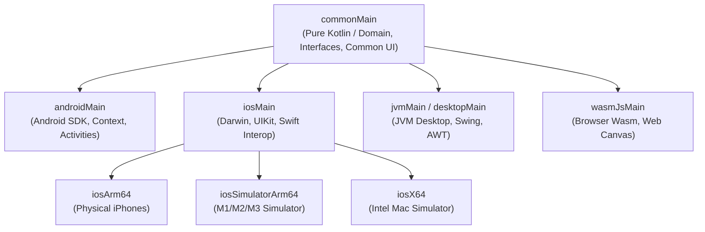

### 🔒 Architectural Law: Layer Dependency Direction
```text
Presentation Layer (UI / ViewModel) ──▶ Domain Layer (UseCases / Entities) ◀── Data Layer (Repositories / DTOs)
```
- **Domain Layer is PURE KOTLIN**: Must NEVER import Android (`android.*`), iOS (`platform.*`), Compose UI (`androidx.compose.*`), or database drivers.
- **Data Layer is DEPENDENT**: Implements Domain repository interfaces and depends only on serialization, Ktor, Room/SQLDelight, and Key-Value engines.
- **Presentation Layer is REACTIVE**: Consumes UseCases and outputs immutable `UiState` via Kotlin Coroutines `StateFlow`.

---

## 🗂️ 2. Feature-First Directory Layout

Organize your codebase by **Business Domains (Features)** rather than technical types. This allows features to be extracted into standalone Gradle submodules with zero refactoring pain:

```text
app/shared/src/commonMain/kotlin/com/example/app/
├── core/                               # Cross-cutting foundational infrastructure
│   ├── base/                           # Base contracts (UiState, UiIntent, BaseViewModel)
│   ├── database/                       # Local database declarations & drivers
│   ├── dispatchers/                    # Coroutine dispatcher abstractions (IO, Main, Default)
│   ├── error/                          # Unified AppError, Failure domains & ErrorMapper
│   ├── network/                        # Ktor HTTP client builder, auth plugins & base DTOs
│   └── theme/                          # Design tokens, typography, shapes & ColorSchemes
│
└── features/                           # Domain modules (Feature-First)
    └── [feature_name]/                 # Example: auth, product, checkout, profile
        ├── data/                       # Data access & external integrations
        │   ├── datasource/
        │   │   ├── local/              # Room DAOs, DataStore keys
        │   │   └── remote/             # Ktor API endpoints & DTO responses
        │   ├── mapper/                 # Pure mapping functions: DTO ↔ Domain Entity
        │   └── repository/             # Repository implementation
        │
        ├── domain/                     # Pure business logic (Zero external dependencies)
        │   ├── model/                  # Pure immutable domain data classes
        │   ├── repository/             # Abstract Repository interfaces
        │   └── usecase/                # Single-responsibility UseCases (invokable)
        │
        └── presentation/               # UI & User Interaction
            ├── components/             # Feature-specific atomic UI composables
            ├── mvi/                    # UiState, UiIntent, UiEffect contracts
            ├── [Feature]Screen.kt      # Top-level composable view
            └── [Feature]ViewModel.kt   # Lifecycle-aware ViewModel (StateFlow)
```

---

## 🧱 3. The 3-Tier Clean Layering Implementation

### Tier A: Domain Layer (Pure Business Logic)

#### 1. Immutable Domain Entity
```kotlin
package com.example.app.features.product.domain.model

data class Product(
    val id: String,
    val title: String,
    val description: String,
    val priceInCents: Long,
    val currency: String,
    val isAvailable: Boolean
) {
    val formattedPrice: String
        get() = "${(priceInCents / 100.0)} $currency"
}
```

#### 2. Abstract Domain Repository Contract
```kotlin
package com.example.app.features.product.domain.repository

import com.example.app.core.error.AppError
import com.example.app.features.product.domain.model.Product
import kotlinx.coroutines.flow.Flow

interface ProductRepository {
    fun observeProducts(): Flow<List<Product>>
    suspend fun getProductById(id: String): Result<Product>
    suspend fun refreshProducts(): Result<Unit>
}
```

#### 3. Single-Responsibility UseCase
```kotlin
package com.example.app.features.product.domain.usecase

import com.example.app.features.product.domain.model.Product
import com.example.app.features.product.domain.repository.ProductRepository
import kotlinx.coroutines.flow.Flow
import kotlinx.coroutines.flow.map

class GetAvailableProductsUseCase(
    private val repository: ProductRepository
) {
    operator fun invoke(): Flow<List<Product>> {
        return repository.observeProducts().map { list ->
            list.filter { it.isAvailable }
        }
    }
}
```

---

### Tier B: Data Layer (Implementation & Serialization)

#### 1. Network DTO with Kotlinx Serialization
```kotlin
package com.example.app.features.product.data.datasource.remote

import kotlinx.serialization.SerialName
import kotlinx.serialization.Serializable

@Serializable
data class ProductDto(
    @SerialName("product_id") val id: String,
    @SerialName("name") val name: String,
    @SerialName("desc") val desc: String? = null,
    @SerialName("amount_cents") val amountCents: Long,
    @SerialName("curr") val currencyCode: String = "USD",
    @SerialName("in_stock") val inStock: Boolean = false
)
```

#### 2. Pure Data Mapper
```kotlin
package com.example.app.features.product.data.mapper

import com.example.app.features.product.data.datasource.remote.ProductDto
import com.example.app.features.product.domain.model.Product

fun ProductDto.toDomain(): Product {
    return Product(
        id = this.id,
        title = this.name,
        description = this.desc.orEmpty(),
        priceInCents = this.amountCents,
        currency = this.currencyCode,
        isAvailable = this.inStock
    )
}
```

#### 3. Concrete Repository with Offline-First Cache Strategy
```kotlin
package com.example.app.features.product.data.repository

import com.example.app.core.dispatchers.AppDispatchers
import com.example.app.features.product.data.datasource.local.ProductLocalDataSource
import com.example.app.features.product.data.datasource.remote.ProductRemoteDataSource
import com.example.app.features.product.data.mapper.toDomain
import com.example.app.features.product.domain.model.Product
import com.example.app.features.product.domain.repository.ProductRepository
import kotlinx.coroutines.flow.Flow
import kotlinx.coroutines.flow.flowOn
import kotlinx.coroutines.flow.map
import kotlinx.coroutines.withContext

class ProductRepositoryImpl(
    private val remoteDataSource: ProductRemoteDataSource,
    private val localDataSource: ProductLocalDataSource,
    private val dispatchers: AppDispatchers
) : ProductRepository {

    override fun observeProducts(): Flow<List<Product>> {
        return localDataSource.observeProducts()
            .map { entities -> entities.map { it.toDomain() } }
            .flowOn(dispatchers.io)
    }

    override suspend fun getProductById(id: String): Result<Product> = withContext(dispatchers.io) {
        runCatching {
            localDataSource.getProductById(id)?.toDomain()
                ?: throw NoSuchElementException("Product $id not found in local cache")
        }
    }

    override suspend fun refreshProducts(): Result<Unit> = withContext(dispatchers.io) {
        runCatching {
            val remoteDtos = remoteDataSource.fetchProducts()
            localDataSource.upsertProducts(remoteDtos.map { it.toDomain() })
        }
    }
}
```

---

## 🚫 4. Architectural Anti-Patterns & Enforcement Rules

| Anti-Pattern | Tại sao có hại (Impact) | Giải pháp chuẩn Enterprise (Best Practice) |
|---|---|---|
| **Leaking DTOs to UI** | Thay đổi schema API phía backend sẽ làm vỡ giao diện Compose UI. | Luôn chuyển đổi qua Domain Entities thông qua các mapper extensions độc lập. |
| **Android `Context` in ViewModels** | Gây rò rỉ bộ nhớ (Memory Leak), crash khi xoay màn hình, và phá hủy khả năng compile trên iOS/Desktop. | Trừu tượng hóa các dịch vụ hệ thống qua interface trong `commonMain` và inject implementation tại `androidMain`. |
| **Direct Dispatchers.IO** | Gây khó khăn khi chạy Unit Tests; không thể swap sang `StandardTestDispatcher`. | Tạo wrapper `AppDispatchers(val io: CoroutineDispatcher, val main: ..., val default: ...)` và inject qua DI. |
| **God Repository** | Repository quản lý hàng chục chức năng không liên quan nhau gây vi phạm Single Responsibility Principle. | Chia nhỏ Repository theo bounded domain context (ví dụ: `AuthRepository`, `UserPreferencesRepository`). |

---

## 🧪 5. Testing & Verification Harness

Xác minh tính độc lập của Domain Layer thông qua Unit Tests mà không cần bất kỳ framework UI hoặc mocking platform nào:

```kotlin
package com.example.app.features.product.domain.usecase

import com.example.app.features.product.domain.model.Product
import com.example.app.features.product.domain.repository.ProductRepository
import kotlinx.coroutines.flow.flowOf
import kotlinx.coroutines.flow.first
import kotlinx.coroutines.test.runTest
import kotlin.test.Test
import kotlin.test.assertEquals

class FakeProductRepository : ProductRepository {
    private val products = listOf(
        Product("1", "Pro Camera", "4K", 100000, "USD", isAvailable = true),
        Product("2", "Old Mic", "Mono", 20000, "USD", isAvailable = false)
    )

    override fun observeProducts() = flowOf(products)
    override suspend fun getProductById(id: String) = Result.success(products.first { it.id == id })
    override suspend fun refreshProducts() = Result.success(Unit)
}

class GetAvailableProductsUseCaseTest {
    @Test
    fun `invoke should only return products with isAvailable true`() = runTest {
        val fakeRepo = FakeProductRepository()
        val useCase = GetAvailableProductsUseCase(fakeRepo)

        val result = useCase().first()

        assertEquals(1, result.size)
        assertEquals("1", result.first().id)
        assertEquals("Pro Camera", result.first().title)
    }
}
```


---

### 💎 KMPSkills: 🚀 KMP Baseline Profiles, R8 Optimization & Startup Speed
> **Domain**: 8. Performance & Memory | **Target Files**: `**/benchmark/**/*.kt, **/proguard-rules.pro`

# 🚀 KMP Baseline Profiles, R8 Optimization & Startup Speed

This skill provides an enterprise architectural blueprint for achieving **sub-400ms cold startup times** and **minimal release binary sizes** in **Kotlin Multiplatform (KMP)** and **Android** using **Baseline Profiles** and **R8 code shrinking**.

---

## ⚡ 1. The Baseline Profile Compilation Pipeline

Without Baseline Profiles, Android uses Just-In-Time (JIT) compilation during app launch, causing dropped frames and slow initialization. Baseline Profiles pre-compile hot paths to machine code Ahead-Of-Time (AOT):

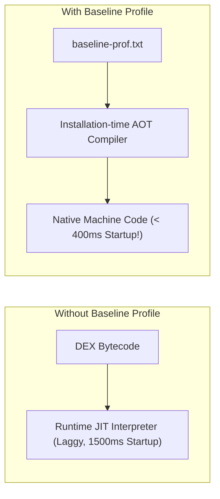

---

## 🎯 2. Generating Baseline Profiles with Macrobenchmark

### A. Add Baseline Profile Plugin (`gradle/libs.versions.toml`)
```toml
[plugins]
baselineprofile = { id = "androidx.baselineprofile", version = "1.3.3" }
```

In `app/androidApp/build.gradle.kts`:
```kotlin
plugins {
    alias(libs.plugins.androidApplication)
    alias(libs.plugins.baselineprofile)
}

baselineProfile {
    saveInSrc = true
    automaticGenerationDuringBuild = false
}
```

### B. The Benchmark Rule (`baselineprofile/src/main/kotlin/.../BaselineProfileGenerator.kt`)
```kotlin
package com.example.benchmark

import androidx.benchmark.macro.junit4.BaselineProfileRule
import androidx.test.ext.junit.runners.AndroidJUnit4
import org.junit.Rule
import org.junit.Test
import org.junit.runner.RunWith

@RunWith(AndroidJUnit4::class)
class BaselineProfileGenerator {

    @get:Rule
    val baselineRule = BaselineProfileRule()

    @Test
    fun generateBaselineProfile() = baselineRule.collect(
        packageName = "com.example.app",
        includeInStartupProfile = true
    ) {
        // 1. Measure cold app launch
        pressHome()
        startActivityAndWait()

        // 2. Exercise critical user journeys to include in AOT profile
        // e.g. Scroll catalog list
    }
}
```

Generate the profile with Gradle:
```bash
./gradlew :app:androidApp:generateBaselineProfile
```

---

## 🛡️ 3. Production R8 & ProGuard Rules for KMP Dependencies

Enable code and resource shrinking in `app/androidApp/build.gradle.kts`:

```kotlin
android {
    buildTypes {
        release {
            isMinifyEnabled = true
            isShrinkResources = true
            proguardFiles(
                getDefaultProguardFile("proguard-android-optimize.txt"),
                "proguard-rules.pro"
            )
        }
    }
}
```

### `app/androidApp/proguard-rules.pro` Master Config
```proguard
# ---------------------------------------------------------------------------
# Kotlin Multiplatform Core & Coroutines
# ---------------------------------------------------------------------------
-keepattributes *Annotation*, InnerClasses, Signature, Exception, SourceFile, LineNumberTable

-keepclassmembers class kotlinx.coroutines.** {
    volatile <fields>;
}

# ---------------------------------------------------------------------------
# Kotlinx Serialization (Prevent Stripping Polymorphic Serializers)
# ---------------------------------------------------------------------------
-keepnames class kotlinx.serialization.json.** { *; }
-keepclassmembers class * {
    *** Companion;
}
-keepclasseswithmembers class * {
    kotlinx.serialization.KSerializer serializer(...);
}
-keepclassmembers class * implements kotlinx.serialization.KSerializer {
    <fields>;
    <methods>;
}

# ---------------------------------------------------------------------------
# Ktor HTTP Client 3.x
# ---------------------------------------------------------------------------
-keep class io.ktor.** { *; }
-dontwarn io.ktor.**

# ---------------------------------------------------------------------------
# AndroidX Room KMP 2.7+
# ---------------------------------------------------------------------------
-keep class * extends androidx.room.RoomDatabase
-keep @androidx.room.Dao interface * { *; }
-keep class * implements androidx.room.RoomDatabaseConstructor { *; }

# ---------------------------------------------------------------------------
# Koin Dependency Injection
# ---------------------------------------------------------------------------
-keep class org.koin.** { *; }
-dontwarn org.koin.**

# ---------------------------------------------------------------------------
# Coil 3.x Image Loading
# ---------------------------------------------------------------------------
-keep class coil3.** { *; }
-dontwarn coil3.**
```

---

## ⏱️ 4. Measuring Cold Startup Latency

Measure startup performance quantitatively with Android Macrobenchmark:

```kotlin
package com.example.benchmark

import androidx.benchmark.macro.CompilationMode
import androidx.benchmark.macro.StartupMode
import androidx.benchmark.macro.StartupTimingMetric
import androidx.benchmark.macro.junit4.MacrobenchmarkRule
import androidx.test.ext.junit.runners.AndroidJUnit4
import org.junit.Rule
import org.junit.Test
import org.junit.runner.RunWith

@RunWith(AndroidJUnit4::class)
class ColdStartupBenchmark {

    @get:Rule
    val benchmarkRule = MacrobenchmarkRule()

    @Test
    fun benchmarkStartupWithBaselineProfiles() = benchmarkRule.measureRepeated(
        packageName = "com.example.app",
        metrics = listOf(StartupTimingMetric()),
        compilationMode = CompilationMode.Partial(), // Simulates Baseline Profile compilation
        iterations = 5,
        startupMode = StartupMode.COLD
    ) {
        pressHome()
        startActivityAndWait()
    }
}
```

---

## 🚫 5. Startup & R8 Anti-Patterns

| Anti-Pattern | Root Problem | Correct Architecture |
|---|---|---|
| **R8 Stripping Serializers** | Custom `@Serializable` companion functions stripped in release builds cause silent JSON deserialization crashes. | Add `-keepclasseswithmembers class * { kotlinx.serialization.KSerializer serializer(...); }`. |
| **Heavy Work in `Application.onCreate`** | Initializing databases, analytics, and network calls synchronously on app startup freezes the UI thread. | Defer initialization with Kotlin Coroutines or Android Jetpack App Startup. |
| **Omitting Baseline Profiles** | Forces the Android runtime to interpret raw DEX during launch, inflating cold start time to 1.5s - 2.5s. | Generate and bundle `baseline-prof.txt` with Macrobenchmark. |
| **Disabling R8 Optimization** | Shipping release builds without `isMinifyEnabled = true` inflates APK size by 200-400% and slows down DEX loading. | Always enable `isMinifyEnabled = true` with tested ProGuard rules. |


---

### 💎 KMPSkills: 🚀 KMP CI/CD Matrix Automation & Release Pipelines
> **Domain**: 10. DevOps & Fullstack | **Target Files**: `.github/workflows/*.yml, .github/workflows/*.yaml`

# 🚀 KMP CI/CD Matrix Automation & Release Pipelines

This skill provides an enterprise architectural blueprint for automated **Continuous Integration and Continuous Delivery (CI/CD)** in **Kotlin Multiplatform (KMP)** using **GitHub Actions**.

---

## 🏗️ 1. Multiplatform CI/CD Pipeline Topology

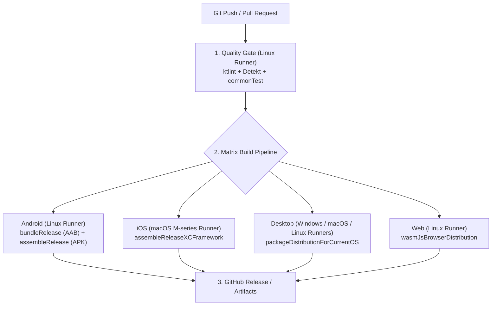

---

## ⚙️ 2. Production Pull Request Workflow (`.github/workflows/ci.yml`)

Runs on every pull request to enforce zero compiler warnings, style compliance, and passing unit tests:

```yaml
name: KMP Continuous Integration

on:
  pull_request:
    branches: [ main, develop ]
  push:
    branches: [ main ]

concurrency:
  group: ${{ github.workflow }}-${{ github.ref }}
  cancel-in-progress: true

jobs:
  quality-gate:
    name: Lint & Unit Tests
    runs-on: ubuntu-latest
    timeout-minutes: 25

    steps:
      - name: Checkout Code
        uses: actions/checkout@v4

      - name: Setup Java 17
        uses: actions/setup-java@v4
        with:
          distribution: 'zulu'
          java-version: '17'

      - name: Setup Gradle Cache
        uses: gradle/actions/setup-gradle@v4
        with:
          cache-read-only: ${{ github.ref != 'refs/heads/main' }}

      - name: Run Static Code Analysis
        run: ./gradlew lint check --continue

      - name: Run Common & JVM Unit Tests
        run: ./gradlew :app:shared:jvmTest :app:shared:testAndroidHostTest

      - name: Publish Test Results
        if: always()
        uses: actions/upload-artifact@v4
        with:
          name: test-results
          path: '**/build/reports/tests/'
```

---

## 📦 3. Multiplatform Release Matrix (`.github/workflows/release.yml`)

Generates release binaries across Mobile, Desktop, and Web when a new Git tag is pushed (`v*.*.*`):

```yaml
name: Multiplatform Release Build

on:
  push:
    tags:
      - 'v*.*.*'

jobs:
  build-android:
    name: Build Android Artifacts
    runs-on: ubuntu-latest
    steps:
      - uses: actions/checkout@v4
      - uses: actions/setup-java@v4
        with:
          distribution: 'zulu'
          java-version: '17'
      - uses: gradle/actions/setup-gradle@v4

      - name: Build Android Release AAB & APK
        run: ./gradlew :app:androidApp:bundleRelease :app:androidApp:assembleRelease

      - name: Upload Android Binaries
        uses: actions/upload-artifact@v4
        with:
          name: android-release
          path: |
            app/androidApp/build/outputs/bundle/release/*.aab
            app/androidApp/build/outputs/apk/release/*.apk

  build-ios-xcframework:
    name: Build iOS XCFramework
    runs-on: macos-14 # Apple Silicon M2/M3 runner
    steps:
      - uses: actions/checkout@v4
      - uses: actions/setup-java@v4
        with:
          distribution: 'zulu'
          java-version: '17'
      - uses: gradle/actions/setup-gradle@v4

      - name: Build Static XCFramework
        run: ./gradlew :app:shared:assembleSharedAppReleaseXCFramework

      - name: Compress XCFramework
        run: zip -r SharedApp.xcframework.zip app/shared/build/XCFrameworks/release/SharedApp.xcframework

      - name: Upload iOS XCFramework
        uses: actions/upload-artifact@v4
        with:
          name: ios-xcframework
          path: SharedApp.xcframework.zip

  build-web-wasm:
    name: Build Web Wasm Distribution
    runs-on: ubuntu-latest
    steps:
      - uses: actions/checkout@v4
      - uses: actions/setup-java@v4
        with:
          distribution: 'zulu'
          java-version: '17'
      - uses: gradle/actions/setup-gradle@v4

      - name: Build Wasm Distribution
        run: ./gradlew :app:webApp:wasmJsBrowserDistribution

      - name: Upload Web Assets
        uses: actions/upload-artifact@v4
        with:
          name: web-wasm-dist
          path: app/webApp/build/dist/wasmJs/productionExecutable/
```

---

## ⚡ 4. CI Cost & Speed Optimization Principles

1. **Never use macOS runners for tasks that run on Linux**: GitHub Actions bills macOS runners at **10x** the rate of Ubuntu runners. Run all lints, unit tests, Android builds, and Wasm compilations on `ubuntu-latest`.
2. **Enable Gradle Dependency Caching**: Use `gradle/actions/setup-gradle@v4` to cache Gradle dependencies, wrapper binaries, and local build outputs.
3. **Cancel Stale Pull Request Runs**: Use `concurrency` groups with `cancel-in-progress: true` so rapid commits cancel previous active runs immediately.

---

## 🚫 5. CI/CD Anti-Patterns

| Anti-Pattern | Root Problem | Correct Architecture |
|---|---|---|
| **Hardcoding Signing Keys in Repository** | Committing `.jks` keystores or Apple certificates into Git breaches security. | Store Base64-encoded keystores in GitHub Actions Secrets (`KEYSTORE_BASE64`). |
| **Running Entire Build on PR** | Building iOS and Desktop distributions on every single documentation edit wastes CI minutes. | Run only fast Lint & Tests on PRs; gate heavy distribution packaging to Tag releases. |
| **Missing Failure Artifact Uploads** | CI fails with cryptic logs and test HTML reports are lost upon runner termination. | Always include `uses: actions/upload-artifact@v4` with `if: always()` for test reports. |
| **Disabling Gradle Build Cache** | Recompiling KMP multi-target dependencies from scratch every run inflates CI time from 3m to 25m. | Enable Gradle build cache and configuration cache. |


---

### 💎 KMPSkills: ⚡ Compose Multiplatform Recomposition & Stability Optimization
> **Domain**: 8. Performance & Memory | **Target Files**: `**/*Screen.kt, **/*Item.kt, **/*Card.kt`

# ⚡ Compose Multiplatform Recomposition & Stability Optimization

This skill provides an enterprise architectural blueprint for mastering **Compose Compiler Stability**, eliminating **recomposition jank**, and achieving **60-120 FPS fluid rendering** across Android, iOS, Desktop, and Web.

---

## 🔍 1. The Stability Rule & The "Skippable" Contract

A `@Composable` function is **Skippable** if and only if **all of its parameters are Stable**:

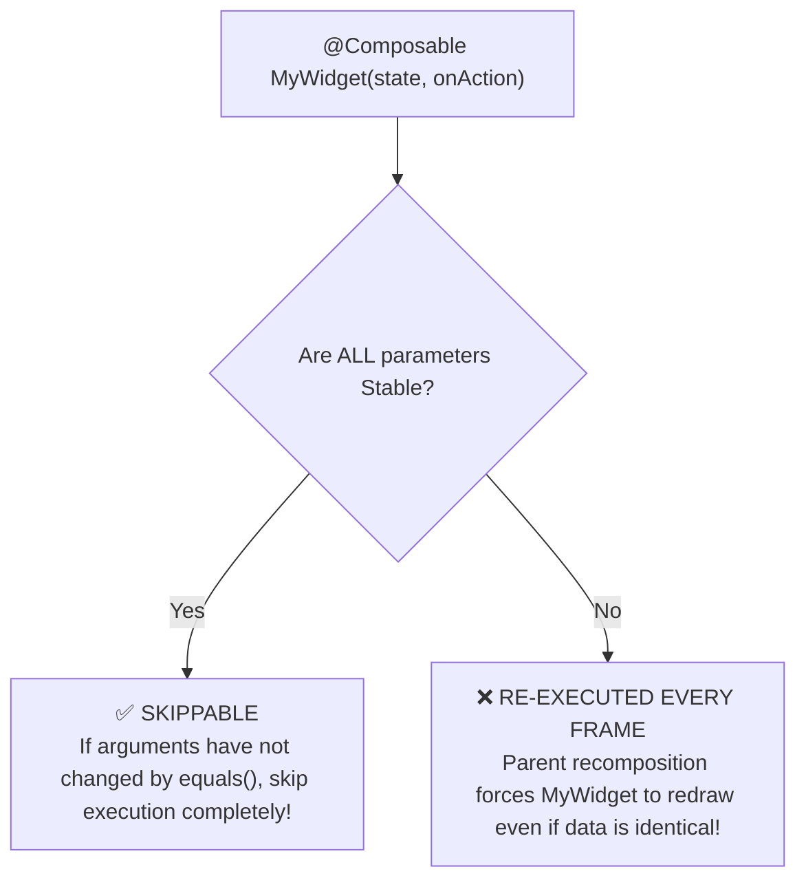

### What makes a type Unstable?
1. **Standard Kotlin Collections**: `List<T>`, `Set<T>`, `Map<T>` are interfaces that can be backed by mutable implementations (`ArrayList`, `HashSet`). The Compose Compiler marks them **Unstable** by default.
2. **Classes with `var` properties**: Any class containing a mutable `var` is Unstable.
3. **Classes from external modules** without Compose runtime dependencies (unless configured via stability config).

---

## 📊 2. Enabling Compose Compiler Metrics in Gradle

Generate actionable diagnostic reports to identify non-skippable composables:

### `app/shared/build.gradle.kts`
```kotlin
composeCompiler {
    // Generate compiler stability reports in build/compose_metrics
    metricsDestination = layout.buildDirectory.dir("compose_metrics")
    reportsDestination = layout.buildDirectory.dir("compose_reports")
}
```

Run Gradle build:
```bash
./gradlew :app:shared:assembleRelease -Pandroidx.enableComposeCompilerMetrics=true
```

Examine output in `build/compose_reports/app_shared-composables.txt`:
```text
// ❌ BAD: Restartable, but NOT skippable because 'items' is unstable
restartable fun ProductList(
  unstable items: List<Product>
)

// ✅ OPTIMIZED: Restartable AND Skippable!
restartable skippable fun ProductList(
  stable items: ImmutableList<Product>
)
```

---

## 🛡️ 3. Fixing Unstable Parameters

### Solution A: `@Immutable` and `@Stable` Annotations
Mark domain/UI state models explicitly with `@Immutable`:

```kotlin
package com.example.app.core.ui.model

import androidx.compose.runtime.Immutable
import androidx.compose.runtime.Stable

@Immutable
data class ProductUiModel(
    val id: String,
    val title: String,
    val price: String,
    val tags: List<String> // Compiler trusts that this list will never be mutated
)

@Stable
interface ActionHandler {
    fun onProductClick(id: String)
}
```

### Solution B: Kotlinx Immutable Collections
In `gradle/libs.versions.toml`:
```toml
[libraries]
kotlinx-collections-immutable = { module = "org.jetbrains.kotlinx:kotlinx-collections-immutable", version = "0.3.8" }
```

In your UI State:
```kotlin
package com.example.app.features.product.presentation.mvi

import androidx.compose.runtime.Immutable
import kotlinx.collections.immutable.ImmutableList
import kotlinx.collections.immutable.persistentListOf

@Immutable
data class CatalogState(
    val products: ImmutableList<ProductUiModel> = persistentListOf(),
    val isLoading: Boolean = false
)
```

---

## 🏎️ 4. State Dampening with `derivedStateOf`

Prevent continuous recomposition when observing high-frequency inputs (such as scroll offsets):

### ❌ The Recomposition Disaster (Recomposes every 1px scroll)
```kotlin
@Composable
fun BadScrollToTopButton(lazyListState: LazyListState) {
    // Recomposes BadScrollToTopButton and its parent on EVERY pixel change!
    val showButton = lazyListState.firstVisibleItemIndex > 0
    if (showButton) {
        FloatingActionButton(onClick = { /* scroll */ })
    }
}
```

### ✅ The Optimized Architecture with `derivedStateOf`
```kotlin
@Composable
fun OptimizedScrollToTopButton(lazyListState: LazyListState) {
    // Only emits a new value when the BOOLEAN changes from false -> true or true -> false!
    val showButton by remember {
        derivedStateOf { lazyListState.firstVisibleItemIndex > 0 }
    }

    AnimatedVisibility(visible = showButton) {
        FloatingActionButton(onClick = { /* scroll */ })
    }
}
```

---

## 🗂️ 5. Lazy Layout Keys & Content Types

Always provide explicit keys and content types in `LazyColumn` and `LazyRow`:

```kotlin
@Composable
fun ProductGrid(
    products: ImmutableList<ProductUiModel>,
    onProductClick: (String) -> Unit,
    modifier: Modifier = Modifier
) {
    LazyColumn(modifier = modifier) {
        items(
            items = products,
            key = { item -> item.id }, // Enables item reordering animations without re-creating views
            contentType = { "product_item" } // Allows view recycling between identical item types
        ) { product ->
            ProductRow(
                product = product,
                onClick = onProductClick
            )
        }
    }
}
```

---

## 🚫 6. Recomposition Anti-Patterns

| Anti-Pattern | Root Problem | Correct Architecture |
|---|---|---|
| **Passing Unstable `List<T>`** | Compose cannot guarantee immutability; re-renders whole list on any parent state change. | Use `ImmutableList<T>` from `kotlinx.collections.immutable` or annotate data class with `@Immutable`. |
| **Instantiating Lambdas in `items()`** | Passing `{ onProductClick(item.id) }` creates a new function instance each recomposition. | Hoist callback or pass `item.id` directly via stable method reference. |
| **Reading State too High in Tree** | Reading `val count by vm.count.collectAsState()` in root `Scaffold` causes entire screen to re-evaluate when count changes. | Read state as close to the leaf node (widget) as possible (Defer reads). |
| **Omitting Lazy Layout Keys** | Adding/removing items forces Compose to destroy and re-measure every single visible item. | Always specify `key = { it.id }` in `items()`. |


---

### 💎 KMPSkills: 🎨 Compose Multiplatform UI Engine & Atomic Design System
> **Domain**: 3. UI & Design System | **Target Files**: `**/*Screen.kt, **/*Component.kt, **/ui/**/*.kt`

# 🎨 Compose Multiplatform UI Engine & Atomic Design System

This skill provides the definitive blueprint for creating production-grade, warning-free UI components in **Compose Multiplatform (CMP)**. It covers **Atomic Design hierarchy**, **Slot API composition**, **Coil 3.x asynchronous image loading**, and **Skiko rendering guardrails** across Android, iOS, Desktop (JVM), and Web (Wasm).

---

## 🏛️ 1. Atomic UI Component Hierarchy & Slot APIs

Organize composables using the **Atomic Design methodology** to maximize code reuse and testability:

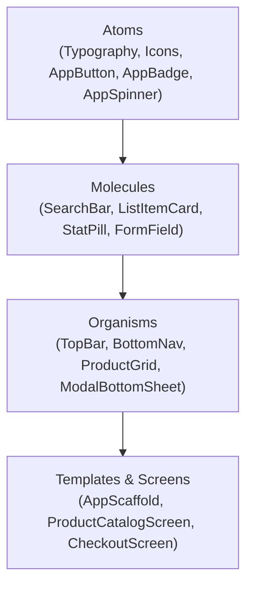

### 🔒 Composable Function Golden Rules:
1. **Modifier as first optional parameter**: Every UI Composable must accept `modifier: Modifier = Modifier` and apply it to its outermost layout container.
2. **State Hoisting**: Never manage mutable business state internally; accept immutable state data classes and emit lambdas (`onAction: () -> Unit`).
3. **Slot APIs**: Use `@Composable () -> Unit` lambdas for flexible child composition rather than rigid configuration arguments.

---

## 🖼️ 2. Cross-Platform Coil 3.x Image Loading Pipeline

Coil 3.x is the official multiplatform image loading standard for KMP.

### A. Coil Dependency Setup (`libs.versions.toml`)
```toml
[libraries]
coil-compose = { module = "io.coil-kt.coil3:coil-compose", version = "3.0.4" }
coil-network-ktor = { module = "io.coil-kt.coil3:coil-network-ktor3", version = "3.0.4" }
coil-svg = { module = "io.coil-kt.coil3:coil-svg", version = "3.0.4" }
```

### B. Global `ImageLoader` Initializer (`commonMain`)
```kotlin
package com.example.app.core.image

import coil3.ImageLoader
import coil3.PlatformContext
import coil3.memory.MemoryCache
import coil3.network.ktor3.KtorNetworkFetcherFactory
import coil3.request.crossfade
import coil3.svg.SvgDecoder
import io.ktor.client.HttpClient

fun newAppImageLoader(
    context: PlatformContext,
    httpClient: HttpClient
): ImageLoader {
    return ImageLoader.Builder(context)
        .components {
            add(KtorNetworkFetcherFactory(httpClient))
            add(SvgDecoder.Factory())
        }
        .memoryCache {
            MemoryCache.Builder()
                .maxSizePercent(context, percent = 0.25)
                .build()
        }
        .crossfade(true)
        .build()
}
```

### C. Production `AppAsyncImage` Component
```kotlin
package com.example.app.core.ui.atoms

import androidx.compose.foundation.background
import androidx.compose.foundation.layout.Box
import androidx.compose.foundation.layout.fillMaxSize
import androidx.compose.foundation.shape.RoundedCornerShape
import androidx.compose.material3.CircularProgressIndicator
import androidx.compose.material3.MaterialTheme
import androidx.compose.runtime.Composable
import androidx.compose.ui.Alignment
import androidx.compose.ui.Modifier
import androidx.compose.ui.draw.clip
import androidx.compose.ui.graphics.Color
import androidx.compose.ui.graphics.Shape
import androidx.compose.ui.layout.ContentScale
import androidx.compose.ui.unit.dp
import coil3.compose.SubcomposeAsyncImage

@Composable
fun AppAsyncImage(
    imageUrl: String?,
    contentDescription: String?,
    modifier: Modifier = Modifier,
    shape: Shape = RoundedCornerShape(8.dp),
    contentScale: ContentScale = ContentScale.Crop,
    placeholderColor: Color = MaterialTheme.colorScheme.surfaceVariant
) {
    SubcomposeAsyncImage(
        model = imageUrl,
        contentDescription = contentDescription,
        contentScale = contentScale,
        modifier = modifier.clip(shape),
        loading = {
            Box(
                modifier = Modifier
                    .fillMaxSize()
                    .background(placeholderColor),
                contentAlignment = Alignment.Center
            ) {
                CircularProgressIndicator(strokeWidth = 2.dp)
            }
        },
        error = {
            Box(
                modifier = Modifier
                    .fillMaxSize()
                    .background(placeholderColor)
            )
        }
    )
}
```

---

## 🧱 3. Production Atomic UI Kit

### A. Atom: `AppButton` (Tactile Physics & Loading State)
```kotlin
package com.example.app.core.ui.atoms

import androidx.compose.animation.AnimatedVisibility
import androidx.compose.animation.fadeIn
import androidx.compose.animation.fadeOut
import androidx.compose.foundation.layout.*
import androidx.compose.foundation.shape.RoundedCornerShape
import androidx.compose.material3.*
import androidx.compose.runtime.Composable
import androidx.compose.ui.Alignment
import androidx.compose.ui.Modifier
import androidx.compose.ui.graphics.Shape
import androidx.compose.ui.unit.dp

@Composable
fun AppButton(
    text: String,
    onClick: () -> Unit,
    modifier: Modifier = Modifier,
    isLoading: Boolean = false,
    isEnabled: Boolean = true,
    shape: Shape = RoundedCornerShape(12.dp),
    leadingIcon: (@Composable () -> Unit)? = null
) {
    Button(
        onClick = onClick,
        modifier = modifier
            .heightIn(min = 48.dp)
            .fillMaxWidth(),
        enabled = isEnabled && !isLoading,
        shape = shape,
        colors = ButtonDefaults.buttonColors(
            containerColor = MaterialTheme.colorScheme.primary,
            contentColor = MaterialTheme.colorScheme.onPrimary,
            disabledContainerColor = MaterialTheme.colorScheme.onSurface.copy(alpha = 0.12f)
        )
    ) {
        Box(contentAlignment = Alignment.Center) {
            AnimatedVisibility(
                visible = isLoading,
                enter = fadeIn(),
                exit = fadeOut()
            ) {
                CircularProgressIndicator(
                    modifier = Modifier.size(20.dp),
                    color = MaterialTheme.colorScheme.onPrimary,
                    strokeWidth = 2.5.dp
                )
            }

            AnimatedVisibility(
                visible = !isLoading,
                enter = fadeIn(),
                exit = fadeOut()
            ) {
                Row(
                    verticalAlignment = Alignment.CenterVertically,
                    horizontalArrangement = Arrangement.spacedBy(8.dp)
                ) {
                    leadingIcon?.invoke()
                    Text(
                        text = text,
                        style = MaterialTheme.typography.labelLarge
                    )
                }
            }
        }
    }
}
```

### B. Molecule: `AppCard` (Elevation, Hard Outlines & Slot API)
```kotlin
package com.example.app.core.ui.molecules

import androidx.compose.foundation.BorderStroke
import androidx.compose.foundation.layout.Column
import androidx.compose.foundation.layout.ColumnScope
import androidx.compose.foundation.layout.padding
import androidx.compose.foundation.shape.RoundedCornerShape
import androidx.compose.material3.Card
import androidx.compose.material3.CardDefaults
import androidx.compose.material3.MaterialTheme
import androidx.compose.runtime.Composable
import androidx.compose.ui.Modifier
import androidx.compose.ui.graphics.Color
import androidx.compose.ui.graphics.Shape
import androidx.compose.ui.unit.Dp
import androidx.compose.ui.unit.dp

@Composable
fun AppCard(
    modifier: Modifier = Modifier,
    shape: Shape = RoundedCornerShape(16.dp),
    containerColor: Color = MaterialTheme.colorScheme.surface,
    borderColor: Color = MaterialTheme.colorScheme.outlineVariant,
    borderWidth: Dp = 1.dp,
    contentPadding: Dp = 16.dp,
    content: @Composable ColumnScope.() -> Unit
) {
    Card(
        modifier = modifier,
        shape = shape,
        colors = CardDefaults.cardColors(containerColor = containerColor),
        border = BorderStroke(borderWidth, borderColor),
        elevation = CardDefaults.cardElevation(defaultElevation = 2.dp)
    ) {
        Column(
            modifier = Modifier.padding(contentPadding),
            content = content
        )
    }
}
```

### C. Organism: `AppTopBar` (Multiplatform Responsive App Bar)
```kotlin
package com.example.app.core.ui.organisms

import androidx.compose.foundation.layout.RowScope
import androidx.compose.material3.*
import androidx.compose.runtime.Composable
import androidx.compose.ui.Modifier
import androidx.compose.ui.text.font.FontWeight

@OptIn(ExperimentalMaterial3Api::class)
@Composable
fun AppTopBar(
    title: String,
    modifier: Modifier = Modifier,
    navigationIcon: (@Composable () -> Unit)? = null,
    actions: @Composable RowScope.() -> Unit = {},
    scrollBehavior: TopAppBarScrollBehavior? = null
) {
    CenterAlignedTopAppBar(
        title = {
            Text(
                text = title,
                style = MaterialTheme.typography.titleLarge,
                fontWeight = FontWeight.Bold
            )
        },
        modifier = modifier,
        navigationIcon = { navigationIcon?.invoke() },
        actions = actions,
        scrollBehavior = scrollBehavior,
        colors = TopAppBarDefaults.centerAlignedTopAppBarColors(
            containerColor = MaterialTheme.colorScheme.background,
            titleContentColor = MaterialTheme.colorScheme.onBackground
        )
    )
}
```

---

## 🖥️ 4. Skiko Desktop & Web Wasm Rendering Guardrails

### A. HiDPI & Retina Font Crispness
On Desktop (JVM Skiko) and Browser Wasm, fonts can appear blurry if canvas density is unhandled. Ensure proper font anti-aliasing:

```kotlin
// In desktopMain/kotlin/.../Main.kt
import androidx.compose.ui.window.Window
import androidx.compose.ui.window.application

fun main() = application {
    // Enables Skiko Direct3D / Metal / OpenGL hardware acceleration
    System.setProperty("skiko.renderApi", "OPENGL")
    
    Window(
        onCloseRequest = ::exitApplication,
        title = "Desktop Pro Application"
    ) {
        App()
    }
}
```

### B. Defensive Pointer Hover & Touch Compatibility
Avoid hardcoding `Modifier.clickable` without indication feedback on Desktop:
```kotlin
// Use standard Modifier.clickable which delegates to PointerMatcher on Desktop and TapGestureDetector on Mobile
Modifier.clickable(
    interactionSource = remember { MutableInteractionSource() },
    indication = ripple(bounded = true)
) {
    // Action
}
```

---

## 🚫 5. Compose UI Anti-Patterns

| Anti-Pattern | Root Cause | Best Practice |
|---|---|---|
| **Allocating objects in Composable body** | Writing `val painter = BitmapPainter(...)` directly in Composable causes allocations every single recomposition frame. | Wrap with `remember { ... }` or pass down pre-computed assets from ViewModel. |
| **Breaking Modifier Chaining** | Assigning `val mod = Modifier.fillMaxSize(); Modifier.padding(16.dp)` creates detached modifiers. | Maintain a fluent builder chain: `modifier.fillMaxSize().padding(16.dp)`. |
| **Hardcoding Colors & Sizes** | Writing `Color(0xFF1E88E5)` or `16.dp` inside deep widget hierarchies breaks theming and accessibility scaling. | Use `MaterialTheme.colorScheme` and `MaterialTheme.typography` design tokens. |
| **Over-nesting Layout Boxes** | Nesting `Box -> Box -> Column -> Box` generates redundant measuring and layout passes. | Flatten layout trees using `Modifier.align`, `Modifier.weight`, or custom subcompose layouts. |


---

### 💎 KMPSkills: 📸 Compose UI Visual Regression & Screenshot Testing
> **Domain**: 9. Testing & Quality | **Target Files**: `**/*ScreenshotTest*.kt, **/*Preview*.kt`

# 📸 Compose UI Visual Regression & Screenshot Testing

This skill provides an enterprise architectural blueprint for automated **Visual Regression Testing** in **Compose Multiplatform (CMP)** using **Roborazzi**. It enables 100% headless, fast pixel-by-pixel verification on the JVM without launching physical devices or emulators.

---

## 🖼️ 1. Visual Verification Pipeline

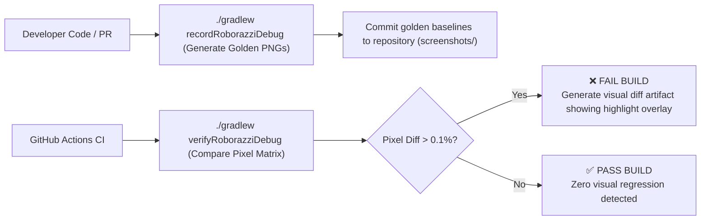

---

## 📦 2. Dependencies & Gradle Plugin Setup

In `gradle/libs.versions.toml`:
```toml
[versions]
roborazzi = "1.34.0"
robolectric = "4.14"

[libraries]
roborazzi-core = { module = "io.github.takahirom.roborazzi:roborazzi", version.ref = "roborazzi" }
roborazzi-compose = { module = "io.github.takahirom.roborazzi:roborazzi-compose", version.ref = "roborazzi" }
robolectric = { module = "org.robolectric:robolectric", version.ref = "robolectric" }

[plugins]
roborazzi = { id = "io.github.takahirom.roborazzi", version.ref = "roborazzi" }
```

In `app/androidApp/build.gradle.kts`:
```kotlin
plugins {
    alias(libs.plugins.androidApplication)
    alias(libs.plugins.roborazzi)
}

android {
    testOptions {
        unitTests {
            isIncludeAndroidResources = true
        }
    }
}

dependencies {
    testImplementation(libs.roborazzi.core)
    testImplementation(libs.roborazzi.compose)
    testImplementation(libs.robolectric)
}
```

---

## 🧪 3. Screenshot Test Suite Implementation

Write deterministic tests covering Light Mode, Dark Mode, and Dynamic Text Scaling:

```kotlin
package com.example.app.ui.screenshot

import androidx.compose.foundation.layout.padding
import androidx.compose.ui.Modifier
import androidx.compose.ui.unit.dp
import com.example.app.core.theme.AppTheme
import com.example.app.core.ui.atoms.AppButton
import com.github.takahirom.roborazzi.captureRoboImage
import org.junit.Test
import org.junit.runner.RunWith
import org.robolectric.RobolectricTestRunner
import org.robolectric.annotation.GraphicsMode

@RunWith(RobolectricTestRunner::class)
@GraphicsMode(GraphicsMode.Mode.NATIVE)
class ButtonScreenshotTest {

    @Test
    fun captureAppButton_lightTheme() {
        captureRoboImage("build/outputs/roborazzi/app_button_light.png") {
            AppTheme(darkTheme = false) {
                AppButton(
                    text = "Checkout Order",
                    onClick = {},
                    modifier = Modifier.padding(16.dp)
                )
            }
        }
    }

    @Test
    fun captureAppButton_darkTheme() {
        captureRoboImage("build/outputs/roborazzi/app_button_dark.png") {
            AppTheme(darkTheme = true) {
                AppButton(
                    text = "Checkout Order",
                    onClick = {},
                    modifier = Modifier.padding(16.dp)
                )
            }
        }
    }

    @Test
    fun captureAppButton_loadingState() {
        captureRoboImage("build/outputs/roborazzi/app_button_loading.png") {
            AppTheme(darkTheme = false) {
                AppButton(
                    text = "Checkout Order",
                    isLoading = true,
                    onClick = {},
                    modifier = Modifier.padding(16.dp)
                )
            }
        }
    }
}
```

---

## 💻 4. CLI Execution & CI Gate Workflows

### Generating / Updating Golden Baselines
```bash
# Records new reference images into screenshots/
./gradlew recordRoborazziDebug
```

### Verifying Pull Requests in CI
```bash
# Compares current output against stored golden reference images
./gradlew verifyRoborazziDebug
```

If a visual change is detected, Roborazzi generates a side-by-side diff image:
```text
[Reference Golden]  vs  [Current PR Render]  ➔  [Red Pixel Diff Mask]
```

---

## 🚫 5. Screenshot Testing Anti-Patterns

| Anti-Pattern | Root Problem | Correct Architecture |
|---|---|---|
| **Dynamic Timestamps in UI** | Rendering `DateTime.now()` produces a different image every run, causing false CI failures. | Pass static fake timestamps (e.g. `"2026-10-04 12:00"`) in test previews. |
| **Running on Live Network Images** | Async image downloads from remote URLs fail or delay in headless test runs, resulting in blank placeholders. | Supply local vector drawables or fake in-memory image decoders in tests. |
| **Testing with Active Animations** | Infinite pulse/shimmer animations capture a different animation frame on every run. | Disable animations or test static states (e.g., pass `isLoading = false` or freeze clock). |
| **Ignoring Dark Mode Variants** | Only testing Light Theme misses black-on-black invisible text bugs in Dark Theme. | Always write paired test cases: `capture_light` and `capture_dark`. |


---

### 💎 KMPSkills: 🔐 KMP DataStore Preferences & Secure Storage Vault
> **Domain**: 5. Persistence & Security | **Target Files**: `**/*Preferences*.kt, **/*DataStore*.kt, **/*Vault*.kt`

# 🔐 KMP DataStore Preferences & Secure Storage Vault

This skill provides an enterprise architectural blueprint for key-value data storage and hardware-backed cryptographic credential management across **Android, iOS, Desktop (JVM), and Web (Wasm)**. It pairs **Jetpack DataStore KMP** for reactive settings with a **Hardware-Backed Secure Vault** for sensitive tokens.

---

## 🛡️ 1. Two-Tier Storage Topology

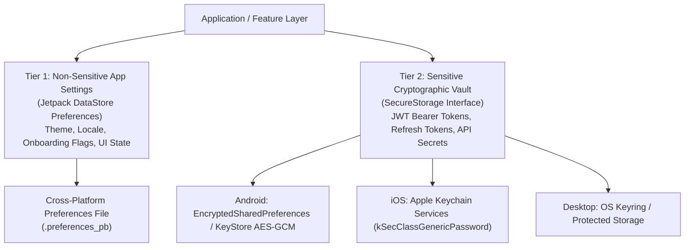

---

## 📦 2. Dependencies & File System Path Factory

In `gradle/libs.versions.toml`:
```toml
[libraries]
androidx-datastore-preferences = { module = "androidx.datastore:datastore-preferences-core", version = "1.1.2" }
```

### Path Factory (`expect/actual`)

#### `commonMain/kotlin/.../DataStorePath.kt`
```kotlin
package com.example.app.core.storage

import androidx.datastore.core.DataStore
import androidx.datastore.preferences.core.PreferenceDataStoreFactory
import androidx.datastore.preferences.core.Preferences
import okio.Path.Companion.toPath

expect fun resolveDataStorePath(): String

fun createDataStore(): DataStore<Preferences> =
    PreferenceDataStoreFactory.createWithPath(
        produceFile = { resolveDataStorePath().toPath() }
    )
```

#### `androidMain/kotlin/.../DataStorePath.android.kt`
```kotlin
package com.example.app.core.storage

import android.content.Context

lateinit var applicationContext: Context

actual fun resolveDataStorePath(): String {
    return applicationContext.filesDir.resolve("app_settings.preferences_pb").absolutePath
}
```

#### `iosMain/kotlin/.../DataStorePath.ios.kt`
```kotlin
package com.example.app.core.storage

import platform.Foundation.NSDocumentDirectory
import platform.Foundation.NSFileManager
import platform.Foundation.NSUserDomainMask

actual fun resolveDataStorePath(): String {
    val documentDirectory = NSFileManager.defaultManager.URLForDirectory(
        directory = NSDocumentDirectory,
        inDomain = NSUserDomainMask,
        appropriateForURL = null,
        create = false,
        error = null
    )
    return "${documentDirectory?.path}/app_settings.preferences_pb"
}
```

#### `desktopMain/kotlin/.../DataStorePath.desktop.kt`
```kotlin
package com.example.app.core.storage

import java.io.File

actual fun resolveDataStorePath(): String {
    val userHome = System.getProperty("user.home")
    val appDir = File(userHome, ".mykmpapp").apply { if (!exists()) mkdirs() }
    return File(appDir, "app_settings.preferences_pb").absolutePath
}
```

---

## ⚙️ 3. Reactive Settings Repository (`DataStore`)

```kotlin
package com.example.app.core.storage

import androidx.datastore.core.DataStore
import androidx.datastore.preferences.core.Preferences
import androidx.datastore.preferences.core.booleanPreferencesKey
import androidx.datastore.preferences.core.edit
import androidx.datastore.preferences.core.emptyPreferences
import androidx.datastore.preferences.core.stringPreferencesKey
import kotlinx.coroutines.flow.Flow
import kotlinx.coroutines.flow.catch
import kotlinx.coroutines.flow.map
import java.io.IOException

enum class AppThemeMode { SYSTEM, LIGHT, DARK }

class UserPreferencesRepository(
    private val dataStore: DataStore<Preferences>
) {
    private object Keys {
        val THEME_MODE = stringPreferencesKey("key_theme_mode")
        val ONBOARDING_COMPLETED = booleanPreferencesKey("key_onboarding_completed")
    }

    val themeMode: Flow<AppThemeMode> = dataStore.data
        .catch { exception ->
            if (exception is IOException) emit(emptyPreferences()) else throw exception
        }
        .map { preferences ->
            val themeString = preferences[Keys.THEME_MODE] ?: AppThemeMode.SYSTEM.name
            runCatching { AppThemeMode.valueOf(themeString) }.getOrDefault(AppThemeMode.SYSTEM)
        }

    val isOnboardingCompleted: Flow<Boolean> = dataStore.data
        .catch { exception ->
            if (exception is IOException) emit(emptyPreferences()) else throw exception
        }
        .map { preferences ->
            preferences[Keys.ONBOARDING_COMPLETED] ?: false
        }

    suspend fun setThemeMode(mode: AppThemeMode) {
        dataStore.edit { preferences ->
            preferences[Keys.THEME_MODE] = mode.name
        }
    }

    suspend fun setOnboardingCompleted(completed: Boolean) {
        dataStore.edit { preferences ->
            preferences[Keys.ONBOARDING_COMPLETED] = completed
        }
    }
}
```

---

## 🔒 4. Hardware-Backed Secure Storage Vault (`expect/actual`)

Never store access tokens or user passwords in DataStore preferences files. Use hardware-backed secure storage:

### `commonMain/kotlin/.../SecureStorage.kt`
```kotlin
package com.example.app.core.storage

interface SecureStorage {
    suspend fun set(key: String, value: String)
    suspend fun get(key: String): String?
    suspend fun remove(key: String)
    suspend fun clear()
}

expect fun createSecureStorage(): SecureStorage
```

### `androidMain/kotlin/.../SecureStorage.android.kt`
```kotlin
package com.example.app.core.storage

import androidx.security.crypto.EncryptedSharedPreferences
import androidx.security.crypto.MasterKey
import kotlinx.coroutines.Dispatchers
import kotlinx.coroutines.withContext

class AndroidSecureStorage : SecureStorage {
    private val masterKey = MasterKey.Builder(applicationContext)
        .setKeyScheme(MasterKey.KeyScheme.AES256_GCM)
        .build()

    private val sharedPreferences = EncryptedSharedPreferences.create(
        applicationContext,
        "secure_vault",
        masterKey,
        EncryptedSharedPreferences.PrefKeyEncryptionScheme.AES256_SIV,
        EncryptedSharedPreferences.PrefValueEncryptionScheme.AES256_GCM
    )

    override suspend fun set(key: String, value: String) = withContext(Dispatchers.IO) {
        sharedPreferences.edit().putString(key, value).apply()
    }

    override suspend fun get(key: String): String? = withContext(Dispatchers.IO) {
        sharedPreferences.getString(key, null)
    }

    override suspend fun remove(key: String) = withContext(Dispatchers.IO) {
        sharedPreferences.edit().remove(key).apply()
    }

    override suspend fun clear() = withContext(Dispatchers.IO) {
        sharedPreferences.edit().clear().apply()
    }
}

actual fun createSecureStorage(): SecureStorage = AndroidSecureStorage()
```

### `iosMain/kotlin/.../SecureStorage.ios.kt`
```kotlin
package com.example.app.core.storage

import kotlinx.cinterop.*
import platform.CoreFoundation.*
import platform.Foundation.*
import platform.Security.*

class IosKeychainStorage : SecureStorage {

    @OptIn(ExperimentalForeignApi::class)
    override suspend fun set(key: String, value: String) {
        val data = (value as NSString).dataUsingEncoding(NSUTF8StringEncoding) ?: return

        // Delete any existing key prior to insert
        remove(key)

        val query = CFDictionaryCreateMutable(null, 4, null, null)
        CFDictionaryAddValue(query, kSecClass, kSecClassGenericPassword)
        CFDictionaryAddValue(query, kSecAttrAccount, (key as NSString).UTF8String)
        CFDictionaryAddValue(query, kSecValueData, CFBridgingRetain(data))
        CFDictionaryAddValue(query, kSecAttrAccessible, kSecAttrAccessibleAfterFirstUnlock)

        SecItemAdd(query, null)
    }

    @OptIn(ExperimentalForeignApi::class)
    override suspend fun get(key: String): String? {
        val query = CFDictionaryCreateMutable(null, 4, null, null)
        CFDictionaryAddValue(query, kSecClass, kSecClassGenericPassword)
        CFDictionaryAddValue(query, kSecAttrAccount, (key as NSString).UTF8String)
        CFDictionaryAddValue(query, kSecReturnData, kCFBooleanTrue)
        CFDictionaryAddValue(query, kSecMatchLimit, kSecMatchLimitOne)

        memScoped {
            val result = alloc<CFTypeRefVar>()
            val status = SecItemCopyMatching(query, result.ptr)
            if (status == errSecSuccess) {
                val data = CFBridgingRelease(result.value) as? NSData ?: return null
                return NSString.create(data = data, encoding = NSUTF8StringEncoding) as? String
            }
        }
        return null
    }

    @OptIn(ExperimentalForeignApi::class)
    override suspend fun remove(key: String) {
        val query = CFDictionaryCreateMutable(null, 2, null, null)
        CFDictionaryAddValue(query, kSecClass, kSecClassGenericPassword)
        CFDictionaryAddValue(query, kSecAttrAccount, (key as NSString).UTF8String)
        SecItemDelete(query)
    }

    @OptIn(ExperimentalForeignApi::class)
    override suspend fun clear() {
        val query = CFDictionaryCreateMutable(null, 1, null, null)
        CFDictionaryAddValue(query, kSecClass, kSecClassGenericPassword)
        SecItemDelete(query)
    }
}

actual fun createSecureStorage(): SecureStorage = IosKeychainStorage()
```

---

## 🚫 5. Storage & Security Anti-Patterns

| Anti-Pattern | Root Problem | Correct Architecture |
|---|---|---|
| **Calling `runBlocking` on DataStore** | Blocks the calling thread, causing UI freezes and potential Android ANRs. | Collect `Flow` asynchronously using `collectAsStateWithLifecycle` or `viewModelScope.launch`. |
| **Storing JWT in Plain DataStore** | Plain DataStore `.preferences_pb` files can be extracted from unencrypted backups or rooted devices. | Store sensitive authentication tokens in hardware-backed `SecureStorage` (KeyStore / Keychain). |
| **Re-instantiating DataStore multiple times** | Creating more than one `DataStore` instance for the same file throws `IllegalStateException: There are multiple DataStores active for the same file`. | Inject `DataStore<Preferences>` as a strict singleton via Koin. |
| **Ignoring IO Exceptions in Flow** | Uncaught disk corruption or file access errors terminate the Flow stream permanently. | Always chain `.catch { emit(emptyPreferences()) }` on `dataStore.data`. |


---

### 💎 KMPSkills: 🧩 Decompose Retained Component Architecture & Lifecycle
> **Domain**: 7. Native Bridges | **Target Files**: `**/*Component.kt, **/*Root*.kt`

# 🧩 Decompose Retained Component Architecture & Lifecycle

This skill provides an enterprise architectural blueprint for implementing **Decompose 3.x** in **Kotlin Multiplatform (KMP)**. It enables **UI-independent business logic components**, **deterministic stack navigation**, and **retained lifecycles** that seamlessly survive configuration changes and process recreations across Android, iOS, Desktop, and Web.

---

## 🏛️ 1. Decompose Component Tree Architecture

Unlike traditional ViewModels which are bound to Android Activities or Compose NavHosts, Decompose components form a **pure Kotlin hierarchical tree** driven by `ComponentContext`:

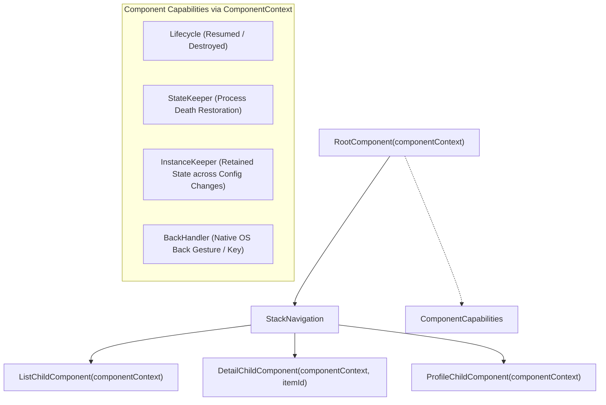

---

## 📦 2. Dependencies Setup (`libs.versions.toml`)

```toml
[versions]
decompose = "3.2.2"

[libraries]
decompose-core = { module = "com.arkivanov.decompose:decompose", version.ref = "decompose" }
decompose-compose = { module = "com.arkivanov.decompose:extensions-compose", version.ref = "decompose" }
```

---

## 🧱 3. Building the Navigation Root Component

### A. Route Configuration Definition (`@Serializable`)
```kotlin
package com.example.app.core.decompose

import com.arkivanov.decompose.ComponentContext
import com.arkivanov.decompose.router.stack.ChildStack
import com.arkivanov.decompose.router.stack.StackNavigation
import com.arkivanov.decompose.router.stack.childStack
import com.arkivanov.decompose.router.stack.pop
import com.arkivanov.decompose.router.stack.push
import com.arkivanov.decompose.value.Value
import kotlinx.serialization.Serializable

sealed interface RootComponent {
    val childStack: Value<ChildStack<*, Child>>

    fun onNavigateToDetail(id: String)
    fun onNavigateBack()

    sealed class Child {
        class ListChild(val component: ProductListComponent) : Child()
        class DetailChild(val component: ProductDetailComponent) : Child()
    }
}

class DefaultRootComponent(
    componentContext: ComponentContext
) : RootComponent, ComponentContext by componentContext {

    private val navigation = StackNavigation<Config>()

    override val childStack: Value<ChildStack<*, RootComponent.Child>> =
        childStack(
            source = navigation,
            serializer = Config.serializer(),
            initialConfiguration = Config.List,
            handleBackButton = true,
            childFactory = ::createChild
        )

    private fun createChild(config: Config, context: ComponentContext): RootComponent.Child =
        when (config) {
            is Config.List -> RootComponent.Child.ListChild(
                DefaultProductListComponent(context, onProductSelected = ::onNavigateToDetail)
            )
            is Config.Detail -> RootComponent.Child.DetailChild(
                DefaultProductDetailComponent(context, productId = config.id, onBack = ::onNavigateBack)
            )
        }

    override fun onNavigateToDetail(id: String) {
        navigation.push(Config.Detail(id))
    }

    override fun onNavigateBack() {
        navigation.pop()
    }

    @Serializable
    private sealed interface Config {
        @Serializable
        data object List : Config

        @Serializable
        data class Detail(val id: String) : Config
    }
}
```

---

## 🧠 4. Child Component with Retained State (`InstanceKeeper`)

Preserve heavy objects or coroutines across Android configuration changes without re-fetching:

```kotlin
package com.example.app.core.decompose

import com.arkivanov.decompose.ComponentContext
import com.arkivanov.decompose.value.MutableValue
import com.arkivanov.decompose.value.Value
import com.arkivanov.essenty.instancekeeper.InstanceKeeper
import com.arkivanov.essenty.instancekeeper.getOrCreate
import kotlinx.coroutines.CoroutineScope
import kotlinx.coroutines.Dispatchers
import kotlinx.coroutines.SupervisorJob
import kotlinx.coroutines.cancel

interface ProductListComponent {
    val state: Value<State>
    fun onRefresh()

    data class State(val items: List<String> = emptyList(), val isLoading: Boolean = false)
}

class DefaultProductListComponent(
    componentContext: ComponentContext,
    private val onProductSelected: (String) -> Unit
) : ProductListComponent, ComponentContext by componentContext {

    // Retained Instance survives Android screen rotation and recreation
    private val scopeKeeper = instanceKeeper.getOrCreate { CoroutineScopeKeeper() }

    private val _state = MutableValue(ProductListComponent.State(isLoading = true))
    override val state: Value<ProductListComponent.State> = _state

    init {
        loadData()
    }

    override fun onRefresh() {
        loadData()
    }

    private fun loadData() {
        _state.value = ProductListComponent.State(items = listOf("Pro Camera", "4K Mic"), isLoading = false)
    }

    private class CoroutineScopeKeeper : InstanceKeeper.Instance {
        val scope = CoroutineScope(SupervisorJob() + Dispatchers.Main)
        override fun onDestroy() {
            scope.cancel()
        }
    }
}
```

---

## 🎨 5. Compose Multiplatform UI Binding (`Children`)

Render the Decompose stack using the official Compose extensions:

```kotlin
package com.example.app.core.decompose.ui

import androidx.compose.foundation.layout.fillMaxSize
import androidx.compose.material3.Text
import androidx.compose.runtime.Composable
import androidx.compose.ui.Modifier
import com.arkivanov.decompose.extensions.compose.stack.Children
import com.arkivanov.decompose.extensions.compose.stack.animation.fade
import com.arkivanov.decompose.extensions.compose.stack.animation.plus
import com.arkivanov.decompose.extensions.compose.stack.animation.scale
import com.arkivanov.decompose.extensions.compose.stack.animation.stackAnimation
import com.example.app.core.decompose.RootComponent

@Composable
fun RootScreen(
    component: RootComponent,
    modifier: Modifier = Modifier
) {
    Children(
        stack = component.childStack,
        modifier = modifier.fillMaxSize(),
        animation = stackAnimation(fade() + scale())
    ) { child ->
        when (val instance = child.instance) {
            is RootComponent.Child.ListChild -> {
                ProductListScreen(instance.component)
            }
            is RootComponent.Child.DetailChild -> {
                ProductDetailScreen(instance.component)
            }
        }
    }
}

@Composable
fun ProductListScreen(component: ProductListComponent) {
    Text("Product List Screen with Decompose")
}

@Composable
fun ProductDetailScreen(component: Any) {
    Text("Product Detail Screen with Decompose")
}
```

---

## 🚫 6. Decompose Anti-Patterns

| Anti-Pattern | Root Problem | Correct Architecture |
|---|---|---|
| **Holding `@Composable` inside Components** | Violates layer isolation; components must remain 100% pure Kotlin, testable without Compose runtime. | Components expose `Value<State>` or `StateFlow<State>`; Composable UI observes them. |
| **Instantiating Components inside Composables** | Creating `val comp = DefaultRootComponent(...)` inside a Composable creates duplicate components on recomposition. | Root components must be instantiated once at the platform application entry point (`MainActivity` or `MainViewController`). |
| **Ignoring `StateKeeper` for Process Death** | When Android OS kills the app in the background, non-serialized stack configurations are lost. | Always mark navigation `Config` as `@Serializable` and pass `serializer` to `childStack`. |
| **Leaking Coroutines in Components** | Launching coroutines on global scopes leaks memory when a child is popped off the backstack. | Use `InstanceKeeper.Instance` or attach coroutines to `componentContext.lifecycle`. |


---

### 💎 KMPSkills: 💉 Koin Multiplatform Dependency Injection & Scope Governance
> **Domain**: 2. DI & State Management | **Target Files**: `**/di/**/*.kt, **/*Module.kt`

# 💉 Koin Multiplatform Dependency Injection & Scope Governance

This skill provides an enterprise architectural blueprint for implementing Dependency Injection across **Android, iOS, Desktop (JVM), and Web (Wasm)** using **Koin 4.x** with native Compose Multiplatform ViewModel support.

---

## 🧩 1. Koin Multiplatform Module Topology

Structure your DI definitions into modular, decoupled slices matching your Feature-First architecture:

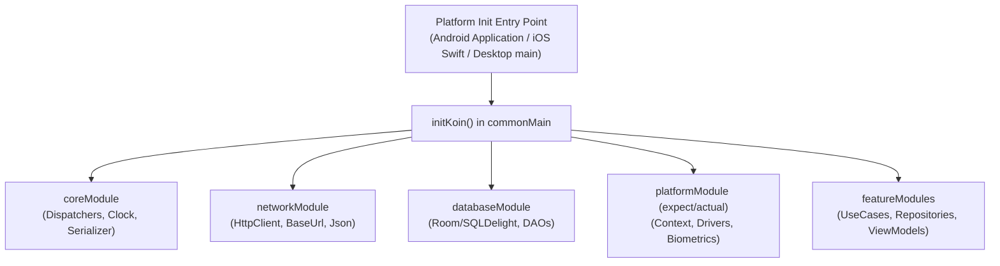

---

## 💻 2. Core Module Definitions (`commonMain`)

### Core & Network Module
```kotlin
package com.example.app.core.di

import com.example.app.core.dispatchers.AppDispatchers
import io.ktor.client.HttpClient
import io.ktor.client.plugins.contentnegotiation.ContentNegotiation
import io.ktor.client.plugins.logging.LogLevel
import io.ktor.client.plugins.logging.Logging
import io.ktor.serialization.kotlinx.json.json
import kotlinx.coroutines.Dispatchers
import kotlinx.coroutines.IO
import kotlinx.serialization.json.Json
import org.koin.core.module.dsl.singleOf
import org.koin.dsl.module

val coreModule = module {
    single<AppDispatchers> {
        AppDispatchers(
            io = Dispatchers.IO,
            main = Dispatchers.Main,
            default = Dispatchers.Default
        )
    }

    single {
        Json {
            prettyPrint = true
            isLenient = true
            ignoreUnknownKeys = true
            coerceInputValues = true
        }
    }
}

val networkModule = module {
    single {
        HttpClient {
            install(ContentNegotiation) {
                json(get())
            }
            install(Logging) {
                level = LogLevel.INFO
            }
        }
    }
}
```

### Feature Module (Domain, Data & ViewModel)
```kotlin
package com.example.app.features.product.di

import com.example.app.features.product.data.datasource.remote.ProductRemoteDataSource
import com.example.app.features.product.data.repository.ProductRepositoryImpl
import com.example.app.features.product.domain.repository.ProductRepository
import com.example.app.features.product.domain.usecase.GetAvailableProductsUseCase
import com.example.app.features.product.presentation.ProductCatalogViewModel
import org.koin.core.module.dsl.factoryOf
import org.koin.core.module.dsl.singleOf
import org.koin.core.module.dsl.viewModelOf
import org.koin.dsl.bind
import org.koin.dsl.module

val productModule = module {
    // Data Sources
    singleOf(::ProductRemoteDataSource)

    // Repositories (Bind interface to implementation)
    singleOf(::ProductRepositoryImpl) bind ProductRepository::class

    // UseCases (Lightweight factory instances)
    factoryOf(::GetAvailableProductsUseCase)

    // Lifecycle-Aware ViewModel for Compose Multiplatform
    viewModelOf(::ProductCatalogViewModel)
}
```

---

## 🔌 3. Multiplatform `expect/actual` Platform Module

When a dependency requires native platform primitives (such as Android `Context` or Darwin SQLite Drivers), use an `expect/actual` module declaration:

### `commonMain/kotlin/.../PlatformModule.kt`
```kotlin
package com.example.app.core.di

import org.koin.core.module.Module

expect val platformModule: Module
```

### `androidMain/kotlin/.../PlatformModule.android.kt`
```kotlin
package com.example.app.core.di

import androidx.room.Room
import com.example.app.core.database.AppDatabase
import org.koin.android.ext.koin.androidContext
import org.koin.core.module.Module
import org.koin.dsl.module

actual val platformModule: Module = module {
    single<AppDatabase> {
        val context = androidContext()
        val dbFile = context.getDatabasePath("app_database.db")
        Room.databaseBuilder<AppDatabase>(
            context = context,
            name = dbFile.absolutePath
        ).build()
    }
}
```

### `iosMain/kotlin/.../PlatformModule.ios.kt`
```kotlin
package com.example.app.core.di

import androidx.room.Room
import com.example.app.core.database.AppDatabase
import com.example.app.core.database.instantiateImpl
import org.koin.core.module.Module
import org.koin.dsl.module
import platform.Foundation.NSDocumentDirectory
import platform.Foundation.NSFileManager
import platform.Foundation.NSUserDomainMask

actual val platformModule: Module = module {
    single<AppDatabase> {
        val documentDirectory = NSFileManager.defaultManager.URLForDirectory(
            directory = NSDocumentDirectory,
            inDomain = NSUserDomainMask,
            appropriateForURL = null,
            create = false,
            error = null
        )
        val dbFilePath = "${documentDirectory?.path}/app_database.db"
        Room.databaseBuilder<AppDatabase>(
            name = dbFilePath,
            factory = { AppDatabase::class.instantiateImpl() }
        ).build()
    }
}
```

---

## 🚀 4. Multiplatform Initialization Hooks

### `commonMain/kotlin/.../KoinInitializer.kt`
```kotlin
package com.example.app.core.di

import com.example.app.features.product.di.productModule
import org.koin.core.KoinApplication
import org.koin.core.context.startKoin
import org.koin.dsl.KoinAppDeclaration

fun initKoin(appDeclaration: KoinAppDeclaration = {}): KoinApplication =
    startKoin {
        appDeclaration()
        modules(
            coreModule,
            networkModule,
            platformModule,
            productModule
        )
    }
```

### Platform Entry Points:

#### Android Application (`androidMain`)
```kotlin
package com.example.app

import android.app.Application
import com.example.app.core.di.initKoin
import org.koin.android.ext.koin.androidContext
import org.koin.android.ext.koin.androidLogger
import org.koin.core.logger.Level

class MainApplication : Application() {
    override fun onCreate() {
        super.onCreate()
        initKoin {
            androidLogger(Level.ERROR)
            androidContext(this@MainApplication)
        }
    }
}
```

#### iOS Entry via Swift (`iosApp/iOSApp.swift`)
```swift
import SwiftUI
import SharedApp

@main
struct iOSApp: App {
    init() {
        KoinInitializerKt.doInitKoin { _ in }
    }

    var body: some Scene {
        WindowGroup {
            ContentView()
        }
    }
}
```

#### Desktop JVM (`desktopMain`)
```kotlin
package com.example.app

import androidx.compose.ui.window.Window
import androidx.compose.ui.window.application
import com.example.app.core.di.initKoin

fun main() {
    initKoin()
    application {
        Window(onCloseRequest = ::exitApplication, title = "Desktop App") {
            App()
        }
    }
}
```

---

## 📱 5. ViewModel Injection in Compose Multiplatform

Inject ViewModels cleanly in CMP without leaking Koin into Composable signatures:

```kotlin
package com.example.app.features.product.presentation

import androidx.compose.runtime.Composable
import androidx.compose.runtime.getValue
import androidx.lifecycle.compose.collectAsStateWithLifecycle
import org.koin.compose.viewmodel.koinViewModel

@Composable
fun ProductCatalogRoot(
    viewModel: ProductCatalogViewModel = koinViewModel()
) {
    val state by viewModel.uiState.collectAsStateWithLifecycle()

    ProductCatalogContent(
        state = state,
        onIntent = viewModel::handleIntent
    )
}
```

---

## 🧪 6. Testing Koin Configurations

Verify that all dependencies and modules can be satisfied at startup:

```kotlin
package com.example.app.di

import com.example.app.core.di.coreModule
import com.example.app.core.di.networkModule
import com.example.app.features.product.di.productModule
import org.koin.core.context.startKoin
import org.koin.core.context.stopKoin
import org.koin.dsl.module
import kotlin.test.AfterTest
import kotlin.test.Test

class KoinModuleCheckTest {

    @AfterTest
    fun tearDown() {
        stopKoin()
    }

    @Test
    fun verifyKoinConfiguration() {
        val testApp = startKoin {
            modules(
                coreModule,
                networkModule,
                productModule
            )
        }
        // Assert that the container initialized successfully without dangling bindings
        kotlin.test.assertNotNull(testApp)
    }
}
```


---

### 💎 KMPSkills: 🎨 KMP Design Tokens & Multi-Theme Engine
> **Domain**: 3. UI & Design System | **Target Files**: `**/theme/**/*.kt, **/designsystem/**/*.kt, **/*Theme.kt`

# 🎨 KMP Design Tokens & Multi-Theme Engine

This skill provides an enterprise design system engine for **Compose Multiplatform (CMP)**. It decouples design primitives from widget implementations using **Type-Safe Design Tokens**, **CompositionLocal providers**, and **Semantic Theme Extensions** (supporting Modern Material 3 and Bold Neobrutalism).

---

## 📐 1. Design Token Architecture & CompositionLocal Hierarchy

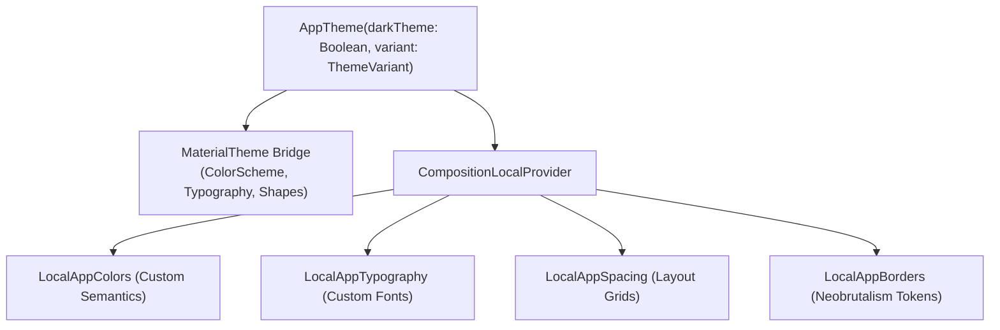

---

## 🎨 2. Extended Semantic Color System

Material 3 lacks dedicated semantic colors like `success`, `warning`, or high-impact `border` tokens. We define an immutable token container:

```kotlin
package com.example.app.core.theme

import androidx.compose.runtime.Immutable
import androidx.compose.runtime.staticCompositionLocalOf
import androidx.compose.ui.graphics.Color

@Immutable
data class AppColors(
    val primary: Color,
    val onPrimary: Color,
    val background: Color,
    val onBackground: Color,
    val surface: Color,
    val onSurface: Color,
    val surfaceVariant: Color,
    val outline: Color,
    
    // Custom Semantic Tokens
    val success: Color,
    val onSuccess: Color,
    val warning: Color,
    val onWarning: Color,
    val hardBorder: Color,
    val hardShadow: Color
)

val LightAppColors = AppColors(
    primary = Color(0xFF2563EB),       // Vibrant Blue
    onPrimary = Color(0xFFFFFFFF),
    background = Color(0xFFF8FAFC),    // Slate 50
    onBackground = Color(0xFF0F172A),  // Slate 900
    surface = Color(0xFFFFFFFF),
    onSurface = Color(0xFF0F172A),
    surfaceVariant = Color(0xFFE2E8F0),
    outline = Color(0xFFCBD5E1),
    success = Color(0xFF16A34A),
    onSuccess = Color(0xFFFFFFFF),
    warning = Color(0xFFD97706),
    onWarning = Color(0xFFFFFFFF),
    hardBorder = Color(0xFF000000),    // Neobrutalism black outline
    hardShadow = Color(0xFF1E293B)
)

val DarkAppColors = AppColors(
    primary = Color(0xFF60A5FA),       // Soft Blue
    onPrimary = Color(0xFF0F172A),
    background = Color(0xFF090D16),    // Deep Midnight
    onBackground = Color(0xFFF1F5F9),
    surface = Color(0xFF131B2E),
    onSurface = Color(0xFFF1F5F9),
    surfaceVariant = Color(0xFF1E293B),
    outline = Color(0xFF334155),
    success = Color(0xFF22C55E),
    onSuccess = Color(0xFF0F172A),
    warning = Color(0xFFFBBF24),
    onWarning = Color(0xFF0F172A),
    hardBorder = Color(0xFFFFFFFF),
    hardShadow = Color(0xFF000000)
)

val LocalAppColors = staticCompositionLocalOf { LightAppColors }
```

---

## 📏 3. Spacing, Elevation & Border Tokens

Never hardcode arbitrary `dp` margins in composables. Enforce an 8-point design grid:

```kotlin
package com.example.app.core.theme

import androidx.compose.runtime.Immutable
import androidx.compose.runtime.staticCompositionLocalOf
import androidx.compose.ui.unit.Dp
import androidx.compose.ui.unit.dp

@Immutable
data class AppSpacing(
    val xxs: Dp = 2.dp,
    val xs: Dp = 4.dp,
    val sm: Dp = 8.dp,
    val md: Dp = 16.dp,
    val lg: Dp = 24.dp,
    val xl: Dp = 32.dp,
    val xxl: Dp = 48.dp
)

@Immutable
data class AppBorders(
    val thin: Dp = 1.dp,
    val standard: Dp = 2.dp,
    val brutal: Dp = 3.dp,
    val shadowOffset: Dp = 4.dp
)

val LocalAppSpacing = staticCompositionLocalOf { AppSpacing() }
val LocalAppBorders = staticCompositionLocalOf { AppBorders() }
```

---

## 🔤 4. Cross-Platform Typography Tokens

```kotlin
package com.example.app.core.theme

import androidx.compose.material3.Typography
import androidx.compose.runtime.Composable
import androidx.compose.ui.text.TextStyle
import androidx.compose.ui.text.font.FontFamily
import androidx.compose.ui.text.font.FontWeight
import androidx.compose.ui.unit.sp

fun createAppTypography(fontFamily: FontFamily = FontFamily.SansSerif): Typography {
    return Typography(
        displayLarge = TextStyle(
            fontFamily = fontFamily,
            fontWeight = FontWeight.Bold,
            fontSize = 34.sp,
            lineHeight = 40.sp,
            letterSpacing = (-0.25).sp
        ),
        titleLarge = TextStyle(
            fontFamily = fontFamily,
            fontWeight = FontWeight.SemiBold,
            fontSize = 20.sp,
            lineHeight = 26.sp
        ),
        bodyLarge = TextStyle(
            fontFamily = fontFamily,
            fontWeight = FontWeight.Normal,
            fontSize = 16.sp,
            lineHeight = 24.sp,
            letterSpacing = 0.5.sp
        ),
        labelLarge = TextStyle(
            fontFamily = fontFamily,
            fontWeight = FontWeight.Medium,
            fontSize = 14.sp,
            lineHeight = 20.sp,
            letterSpacing = 0.1.sp
        )
    )
}
```

---

## 🛡️ 5. The Top-Level `AppTheme` Provider

Wrap your application in `AppTheme`. It synchronizes Material 3 standard components with custom design tokens:

```kotlin
package com.example.app.core.theme

import androidx.compose.foundation.isSystemInDarkTheme
import androidx.compose.material3.MaterialTheme
import androidx.compose.material3.darkColorScheme
import androidx.compose.material3.lightColorScheme
import androidx.compose.runtime.Composable
import androidx.compose.runtime.CompositionLocalProvider

@Composable
fun AppTheme(
    darkTheme: Boolean = isSystemInDarkTheme(),
    content: @Composable () -> Unit
) {
    val appColors = if (darkTheme) DarkAppColors else LightAppColors
    val appSpacing = AppSpacing()
    val appBorders = AppBorders()
    val typography = createAppTypography()

    // Sync with Material 3 ColorScheme
    val m3ColorScheme = if (darkTheme) {
        darkColorScheme(
            primary = appColors.primary,
            onPrimary = appColors.onPrimary,
            background = appColors.background,
            onBackground = appColors.onBackground,
            surface = appColors.surface,
            onSurface = appColors.onSurface,
            surfaceVariant = appColors.surfaceVariant,
            outline = appColors.outline
        )
    } else {
        lightColorScheme(
            primary = appColors.primary,
            onPrimary = appColors.onPrimary,
            background = appColors.background,
            onBackground = appColors.onBackground,
            surface = appColors.surface,
            onSurface = appColors.onSurface,
            surfaceVariant = appColors.surfaceVariant,
            outline = appColors.outline
        )
    }

    CompositionLocalProvider(
        LocalAppColors provides appColors,
        LocalAppSpacing provides appSpacing,
        LocalAppBorders provides appBorders
    ) {
        MaterialTheme(
            colorScheme = m3ColorScheme,
            typography = typography,
            content = content
        )
    }
}

// Convenient Object Accessor
object Theme {
    val colors: AppColors
        @Composable
        get() = LocalAppColors.current

    val spacing: AppSpacing
        @Composable
        get() = LocalAppSpacing.current

    val borders: AppBorders
        @Composable
        get() = LocalAppBorders.current
}
```

---

## 💎 6. Neobrutalism Modifier Recipe (Hard Shadows & Bold Outlines)

Using custom design tokens, create a reusable Neobrutalism card modifier:

```kotlin
package com.example.app.core.theme

import androidx.compose.foundation.background
import androidx.compose.foundation.border
import androidx.compose.foundation.layout.offset
import androidx.compose.foundation.shape.RoundedCornerShape
import androidx.compose.runtime.Composable
import androidx.compose.ui.Modifier
import androidx.compose.ui.draw.drawBehind
import androidx.compose.ui.geometry.Offset
import androidx.compose.ui.geometry.Size
import androidx.compose.ui.graphics.Color
import androidx.compose.ui.unit.dp

@Composable
fun Modifier.neobrutalShadow(
    shadowColor: Color = Theme.colors.hardShadow,
    borderColor: Color = Theme.colors.hardBorder
): Modifier {
    val borderWidth = Theme.borders.standard
    val offset = Theme.borders.shadowOffset

    return this
        .drawBehind {
            // Draw crisp unblurred hard shadow rectangle
            drawRect(
                color = shadowColor,
                topLeft = Offset(offset.toPx(), offset.toPx()),
                size = size
            )
        }
        .border(width = borderWidth, color = borderColor)
}
```

---

## 🚫 7. Theme Engine Anti-Patterns

| Anti-Pattern | Why it Fails | Correct Solution |
|---|---|---|
| **Using `compositionLocalOf` for Static Tokens** | `compositionLocalOf` re-evaluates all children on every recomposition. | Use `staticCompositionLocalOf` for rarely changing structures like Themes, Spacing, and Colors. |
| **Direct Color Literals in Screens** | Calling `Color.Red` or `Color(0xFF...)` prevents Dark Mode or palette rebranding from working. | Reference tokens through `Theme.colors.warning` or `MaterialTheme.colorScheme`. |
| **Hardcoding System Bar Padding** | Hardcoding `top = 48.dp` causes clipping on Android 15 Edge-to-Edge or Dynamic Island on iOS. | Use `WindowInsets.safeDrawing` or `Scaffold` inner padding. |


---

### 💎 KMPSkills: 🔌 KMP expect/actual Hardware & Device Interop Mastery
> **Domain**: 7. Native Bridges | **Target Files**: `**/hardware/**/*.kt, **/*Sensor*.kt, **/*Authenticator*.kt`

# 🔌 KMP expect/actual Hardware & Device Interop Mastery

This skill provides an enterprise architectural blueprint for bridging native device sensors and hardware capabilities across **Android, iOS, Desktop (JVM), and Web (Wasm)**. It enforces the **Interface-over-Expect-Class Principle** to guarantee unit testability and dependency injection compatibility.

---

## 🏛️ 1. The Interface-Factory Bridge Pattern

### ⚠️ The `expect class` Anti-Pattern
```text
❌ AVOID:
expect class BiometricManager {
    fun authenticate(): Boolean
}
(Result: Cannot be mocked in commonTest, rigid platform constructors, violates Open-Closed Principle)
```

### ✅ Modern Interface-Factory Architecture
Declare pure Kotlin interfaces in `commonMain`, implement them via platform-native SDKs in `androidMain`/`iosMain`, and bind them via an `expect/actual` factory or Koin:

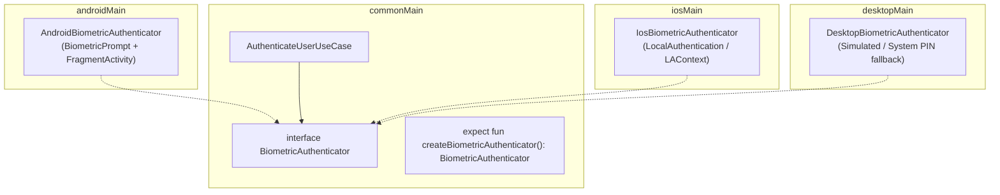

---

## 🧬 2. Complete Hardware Bridge 1: Biometric Authentication

### `commonMain/kotlin/.../BiometricAuthenticator.kt`
```kotlin
package com.example.app.core.hardware.biometrics

sealed interface BiometricResult {
    data object Success : BiometricResult
    data class Failed(val reason: String) : BiometricResult
    data object NotAvailable : BiometricResult
}

interface BiometricAuthenticator {
    suspend fun canAuthenticate(): Boolean
    suspend fun authenticate(title: String, subtitle: String): BiometricResult
}

expect fun createBiometricAuthenticator(): BiometricAuthenticator
```

### `androidMain/kotlin/.../BiometricAuthenticator.android.kt`
```kotlin
package com.example.app.core.hardware.biometrics

import androidx.biometric.BiometricManager
import androidx.biometric.BiometricPrompt
import androidx.core.content.ContextCompat
import androidx.fragment.app.FragmentActivity
import kotlinx.coroutines.suspendCancellableCoroutine
import kotlin.coroutines.resume

lateinit var currentActivity: () -> FragmentActivity?

class AndroidBiometricAuthenticator : BiometricAuthenticator {

    override suspend fun canAuthenticate(): Boolean {
        val activity = currentActivity() ?: return false
        val manager = BiometricManager.from(activity)
        return manager.canAuthenticate(
            BiometricManager.Authenticators.BIOMETRIC_STRONG or BiometricManager.Authenticators.DEVICE_CREDENTIAL
        ) == BiometricManager.BIOMETRIC_SUCCESS
    }

    override suspend fun authenticate(title: String, subtitle: String): BiometricResult {
        val activity = currentActivity() ?: return BiometricResult.NotAvailable

        return suspendCancellableCoroutine { continuation ->
            val executor = ContextCompat.getMainExecutor(activity)
            val prompt = BiometricPrompt(
                activity,
                executor,
                object : BiometricPrompt.AuthenticationCallback() {
                    override fun onAuthenticationSucceeded(result: BiometricPrompt.AuthenticationResult) {
                        continuation.resume(BiometricResult.Success)
                    }

                    override fun onAuthenticationError(errorCode: Int, errString: CharSequence) {
                        continuation.resume(BiometricResult.Failed(errString.toString()))
                    }

                    override fun onAuthenticationFailed() {
                        // Keep prompt open for retry
                    }
                }
            )

            val promptInfo = BiometricPrompt.PromptInfo.Builder()
                .setTitle(title)
                .setSubtitle(subtitle)
                .setAllowedAuthenticators(
                    BiometricManager.Authenticators.BIOMETRIC_STRONG or BiometricManager.Authenticators.DEVICE_CREDENTIAL
                )
                .build()

            prompt.authenticate(promptInfo)
            continuation.invokeOnCancellation { prompt.cancelAuthentication() }
        }
    }
}

actual fun createBiometricAuthenticator(): BiometricAuthenticator = AndroidBiometricAuthenticator()
```

### `iosMain/kotlin/.../BiometricAuthenticator.ios.kt`
```kotlin
package com.example.app.core.hardware.biometrics

import kotlinx.cinterop.*
import platform.Foundation.NSError
import platform.LocalAuthentication.LAContext
import platform.LocalAuthentication.LAPolicyDeviceOwnerAuthentication
import kotlinx.coroutines.suspendCancellableCoroutine
import kotlin.coroutines.resume

class IosBiometricAuthenticator : BiometricAuthenticator {

    override suspend fun canAuthenticate(): Boolean {
        val context = LAContext()
        return memScoped {
            val error = alloc<ObjCObjectVar<NSError?>>()
            context.canEvaluatePolicy(LAPolicyDeviceOwnerAuthentication, error.ptr)
        }
    }

    override suspend fun authenticate(title: String, subtitle: String): BiometricResult {
        val context = LAContext()

        return suspendCancellableCoroutine { continuation ->
            context.evaluatePolicy(
                policy = LAPolicyDeviceOwnerAuthentication,
                localizedReason = "$title: $subtitle"
            ) { success, nsError ->
                if (success) {
                    continuation.resume(BiometricResult.Success)
                } else {
                    val message = nsError?.localizedDescription ?: "Authentication failed"
                    continuation.resume(BiometricResult.Failed(message))
                }
            }
        }
    }
}

actual fun createBiometricAuthenticator(): BiometricAuthenticator = IosBiometricAuthenticator()
```

---

## 📍 3. Complete Hardware Bridge 2: Geolocation & GPS

### `commonMain/kotlin/.../LocationTracker.kt`
```kotlin
package com.example.app.core.hardware.location

import kotlinx.coroutines.flow.Flow

data class Coordinates(val latitude: Double, val longitude: Double, val accuracyMeters: Float)

interface LocationTracker {
    suspend fun getCurrentLocation(): Result<Coordinates>
    fun observeLocation(): Flow<Coordinates>
}

expect fun createLocationTracker(): LocationTracker
```

---

## 📳 4. Complete Hardware Bridge 3: Haptic Vibrations

### `commonMain/kotlin/.../HapticFeedbackDriver.kt`
```kotlin
package com.example.app.core.hardware.haptics

enum class HapticStyle { LIGHT, MEDIUM, HEAVY, SUCCESS, ERROR }

interface HapticFeedbackDriver {
    fun performHaptic(style: HapticStyle)
}

expect fun createHapticFeedbackDriver(): HapticFeedbackDriver
```

### `iosMain/kotlin/.../HapticFeedbackDriver.ios.kt`
```kotlin
package com.example.app.core.hardware.haptics

import platform.UIKit.UIImpactFeedbackGenerator
import platform.UIKit.UIImpactFeedbackStyle
import platform.UIKit.UINotificationFeedbackGenerator
import platform.UIKit.UINotificationFeedbackType

class IosHapticFeedbackDriver : HapticFeedbackDriver {
    override fun performHaptic(style: HapticStyle) {
        when (style) {
            HapticStyle.LIGHT -> UIImpactFeedbackGenerator(UIImpactFeedbackStyle.UIImpactFeedbackStyleLight).impactOccurred()
            HapticStyle.MEDIUM -> UIImpactFeedbackGenerator(UIImpactFeedbackStyle.UIImpactFeedbackStyleMedium).impactOccurred()
            HapticStyle.HEAVY -> UIImpactFeedbackGenerator(UIImpactFeedbackStyle.UIImpactFeedbackStyleHeavy).impactOccurred()
            HapticStyle.SUCCESS -> UINotificationFeedbackGenerator().notificationOccurred(UINotificationFeedbackType.UINotificationFeedbackTypeSuccess)
            HapticStyle.ERROR -> UINotificationFeedbackGenerator().notificationOccurred(UINotificationFeedbackType.UINotificationFeedbackTypeError)
        }
    }
}

actual fun createHapticFeedbackDriver(): HapticFeedbackDriver = IosHapticFeedbackDriver()
```

---

## 📋 5. Complete Hardware Bridge 4: System Clipboard

### `commonMain/kotlin/.../ClipboardManager.kt`
```kotlin
package com.example.app.core.hardware.clipboard

interface AppClipboardManager {
    suspend fun copy(text: String)
    suspend fun paste(): String?
}

expect fun createAppClipboardManager(): AppClipboardManager
```

---

## 📋 6. Manifest & Info.plist Permissions Matrix

Hardware bridges fail silently if OS permission declarations are omitted:

### Android (`AndroidManifest.xml`)
```xml
<!-- Biometrics -->
<uses-permission android:name="android.permission.USE_BIOMETRIC" />
<!-- GPS -->
<uses-permission android:name="android.permission.ACCESS_FINE_LOCATION" />
<uses-permission android:name="android.permission.ACCESS_COARSE_LOCATION" />
<!-- Vibration -->
<uses-permission android:name="android.permission.VIBRATE" />
```

### iOS (`iosApp/iosApp/Info.plist`)
```xml
<!-- Face ID -->
<key>NSFaceIDUsageDescription</key>
<string>This app requires Face ID for biometric authentication.</string>
<!-- GPS -->
<key>NSLocationWhenInUseUsageDescription</key>
<string>This app requires location access to find nearby services.</string>
```

---

## 🚫 7. Hardware Interop Anti-Patterns

| Anti-Pattern | Root Problem | Correct Architecture |
|---|---|---|
| **Using `expect class` for Hardware** | `expect class` forces identical constructors across platforms and cannot be mocked with `FakeDeviceDriver` in unit tests. | Define pure `interface` in `commonMain`; expose factory `expect fun create...(): Interface`. |
| **Holding Context References in Native Drivers** | Storing `Activity` inside an Android driver singleton causes permanent memory leaks when the screen rotates. | Store weak references or pass the current Activity via a scoped provider. |
| **Assuming GPS is Available on Desktop** | Desktops without GPS hardware crash or hang when querying physical location. | Return `Result.failure(UnsupportedOperationException("Hardware unavailable on Desktop"))`. |
| **Forgetting `continuation.invokeOnCancellation`** | User navigates away while native Biometric prompt is visible; native dialog remains open and leaks callbacks. | Always cancel native dialogs inside `invokeOnCancellation { prompt.cancel() }`. |


---

### 💎 KMPSkills: ⚙️ KMP Gradle Version Catalog & Build Engineering Mastery
> **Domain**: 1. Core Architecture | **Target Files**: `gradle/libs.versions.toml, **/*.gradle.kts`

# ⚙️ KMP Gradle Version Catalog & Build Engineering Mastery

This skill provides the definitive blueprint for managing dependencies, plugins, and multi-module configurations across **Kotlin Multiplatform (KMP)** and **Android** using **Gradle Version Catalogs (`libs.versions.toml`)** and **Type-Safe Accessors**.

---

## 📦 1. Enterprise `gradle/libs.versions.toml` Master Blueprint

Place this unified version catalog in `gradle/libs.versions.toml`. It provides synchronized, battle-tested dependencies for modern KMP development:

```toml
[versions]
# Build Infrastructure
agp = "8.7.2"
kotlin = "2.1.0"
ksp = "2.1.0-1.0.29"

# Android SDK
android-compileSdk = "35"
android-minSdk = "24"
android-targetSdk = "35"

# Multiplatform Core
coroutines = "1.10.1"
serialization = "1.8.0"
datetime = "0.6.1"

# UI & Lifecycle
composeMultiplatform = "1.7.1"
androidx-lifecycle = "2.8.4"
androidx-navigation = "2.8.0-alpha10"

# Networking & DI
ktor = "3.0.3"
koin = "4.0.0"

# Local Storage
room = "2.7.0-alpha12"
sqlite = "2.5.0-alpha12"
datastore = "1.1.2"

# Utilities & Media
coil = "3.0.4"

# Testing
turbine = "1.2.0"
assertk = "0.28.1"

[libraries]
# KotlinX Ecosystem
kotlinx-coroutines-core = { module = "org.jetbrains.kotlinx:kotlinx-coroutines-core", version.ref = "coroutines" }
kotlinx-coroutines-android = { module = "org.jetbrains.kotlinx:kotlinx-coroutines-android", version.ref = "coroutines" }
kotlinx-coroutines-swing = { module = "org.jetbrains.kotlinx:kotlinx-coroutines-swing", version.ref = "coroutines" }
kotlinx-coroutines-test = { module = "org.jetbrains.kotlinx:kotlinx-coroutines-test", version.ref = "coroutines" }
kotlinx-serialization-json = { module = "org.jetbrains.kotlinx:kotlinx-serialization-json", version.ref = "serialization" }
kotlinx-datetime = { module = "org.jetbrains.kotlinx:kotlinx-datetime", version.ref = "datetime" }

# Ktor HTTP Client
ktor-client-core = { module = "io.ktor:ktor-client-core", version.ref = "ktor" }
ktor-client-okhttp = { module = "io.ktor:ktor-client-okhttp", version.ref = "ktor" }
ktor-client-darwin = { module = "io.ktor:ktor-client-darwin", version.ref = "ktor" }
ktor-client-cio = { module = "io.ktor:ktor-client-cio", version.ref = "ktor" }
ktor-client-js = { module = "io.ktor:ktor-client-js", version.ref = "ktor" }
ktor-client-content-negotiation = { module = "io.ktor:ktor-client-content-negotiation", version.ref = "ktor" }
ktor-serialization-kotlinx-json = { module = "io.ktor:ktor-serialization-kotlinx-json", version.ref = "ktor" }
ktor-client-logging = { module = "io.ktor:ktor-client-logging", version.ref = "ktor" }
ktor-client-auth = { module = "io.ktor:ktor-client-auth", version.ref = "ktor" }

# Koin Dependency Injection
koin-core = { module = "io.insert-koin:koin-core", version.ref = "koin" }
koin-android = { module = "io.insert-koin:koin-android", version.ref = "koin" }
koin-compose = { module = "io.insert-koin:koin-compose", version.ref = "koin" }
koin-compose-viewmodel = { module = "io.insert-koin:koin-compose-viewmodel", version.ref = "koin" }
koin-test = { module = "io.insert-koin:koin-test", version.ref = "koin" }

# Jetpack & Compose Multiplatform
androidx-lifecycle-viewmodel = { module = "org.jetbrains.androidx.lifecycle:lifecycle-viewmodel-compose", version.ref = "androidx-lifecycle" }
androidx-lifecycle-runtime = { module = "org.jetbrains.androidx.lifecycle:lifecycle-runtime-compose", version.ref = "androidx-lifecycle" }
androidx-navigation-compose = { module = "org.jetbrains.androidx.navigation:navigation-compose", version.ref = "androidx-navigation" }
coil-compose = { module = "io.coil-kt.coil3:coil-compose", version.ref = "coil" }
coil-network-ktor = { module = "io.coil-kt.coil3:coil-network-ktor3", version.ref = "coil" }

# Room Multiplatform Database
androidx-room-runtime = { module = "androidx.room:room-runtime", version.ref = "room" }
androidx-room-compiler = { module = "androidx.room:room-compiler", version.ref = "room" }
androidx-sqlite-bundled = { module = "androidx.sqlite:sqlite-bundled", version.ref = "sqlite" }

# DataStore Preferences
androidx-datastore-preferences = { module = "androidx.datastore:datastore-preferences-core", version.ref = "datastore" }

# Testing Harness
test-turbine = { module = "app.cash.turbine:turbine", version.ref = "turbine" }
test-assertk = { module = "com.willowtreeapps.assertk:assertk", version.ref = "assertk" }

[bundles]
ktor-common = [
    "ktor-client-core",
    "ktor-client-content-negotiation",
    "ktor-serialization-kotlinx-json",
    "ktor-client-logging",
    "ktor-client-auth"
]
koin-common = [
    "koin-core",
    "koin-compose",
    "koin-compose-viewmodel"
]

[plugins]
androidApplication = { id = "com.android.application", version.ref = "agp" }
androidLibrary = { id = "com.android.library", version.ref = "agp" }
kotlinMultiplatform = { id = "org.jetbrains.kotlin.multiplatform", version.ref = "kotlin" }
kotlinSerialization = { id = "org.jetbrains.kotlin.plugin.serialization", version.ref = "kotlin" }
composeCompiler = { id = "org.jetbrains.kotlin.plugin.compose", version.ref = "kotlin" }
composeMultiplatform = { id = "org.jetbrains.compose", version.ref = "composeMultiplatform" }
ksp = { id = "com.google.devtools.ksp", version.ref = "ksp" }
room = { id = "androidx.room", version.ref = "room" }
```

---

## 🛠️ 2. Root Project Configuration

### `settings.gradle.kts`
Enable Type-Safe project accessors to write `projects.core` instead of `project(":core")`:

```kotlin
rootProject.name = "MyKmpApp"

enableFeaturePreview("TYPESAFE_PROJECT_ACCESSORS")

pluginManagement {
    repositories {
        google {
            mavenContent {
                includeGroupAndSubgroups("androidx")
                includeGroupAndSubgroups("com.android")
                includeGroupAndSubgroups("com.google")
            }
        }
        mavenCentral()
        gradlePluginPortal()
    }
}

dependencyResolutionManagement {
    repositories {
        google()
        mavenCentral()
    }
}

include(":app:androidApp")
include(":app:shared")
include(":core")
```

---

## 🏗️ 3. Multiplatform Module Configuration (`app/shared/build.gradle.kts`)

Below is the production-grade module definition leveraging the Version Catalog:

```kotlin
plugins {
    alias(libs.plugins.kotlinMultiplatform)
    alias(libs.plugins.androidLibrary)
    alias(libs.plugins.composeMultiplatform)
    alias(libs.plugins.composeCompiler)
    alias(libs.plugins.kotlinSerialization)
    alias(libs.plugins.ksp)
    alias(libs.plugins.room)
}

kotlin {
    // 1. Android Target
    androidTarget {
        compilerOptions {
            jvmTarget.set(org.jetbrains.kotlin.gradle.dsl.JvmTarget.JVM_17)
        }
    }

    // 2. iOS Targets (XCFramework)
    listOf(
        iosX64(),
        iosArm64(),
        iosSimulatorArm64()
    ).forEach { iosTarget ->
        iosTarget.binaries.framework {
            baseName = "SharedApp"
            isStatic = true
        }
    }

    // 3. Desktop JVM Target
    jvm("desktop") {
        compilerOptions {
            jvmTarget.set(org.jetbrains.kotlin.gradle.dsl.JvmTarget.JVM_17)
        }
    }

    // 4. Web Wasm Target
    @OptIn(org.jetbrains.kotlin.gradle.ExperimentalWasmDsl::class)
    wasmJs {
        moduleName = "webApp"
        browser {
            commonWebpackConfig {
                outputFileName = "webApp.js"
            }
        }
        binaries.executable()
    }

    // 5. SourceSets Hierarchy & Bundles
    sourceSets {
        commonMain.dependencies {
            implementation(compose.runtime)
            implementation(compose.foundation)
            implementation(compose.material3)
            implementation(compose.components.resources)

            // Bundles from Version Catalog
            implementation(libs.bundles.ktor.common)
            implementation(libs.bundles.koin.common)

            implementation(libs.kotlinx.coroutines.core)
            implementation(libs.kotlinx.datetime)
            implementation(libs.androidx.lifecycle.viewmodel)
            implementation(libs.androidx.lifecycle.runtime)
            implementation(libs.androidx.navigation.compose)

            // Persistence
            implementation(libs.androidx.room.runtime)
            implementation(libs.androidx.sqlite.bundled)
            implementation(libs.androidx.datastore.preferences)
        }

        androidMain.dependencies {
            implementation(libs.ktor.client.okhttp)
            implementation(libs.koin.android)
            implementation(libs.kotlinx.coroutines.android)
        }

        iosMain.dependencies {
            implementation(libs.ktor.client.darwin)
        }

        val desktopMain by getting {
            dependencies {
                implementation(compose.desktop.currentOs)
                implementation(libs.ktor.client.cio)
                implementation(libs.kotlinx.coroutines.swing)
            }
        }

        wasmJsMain.dependencies {
            implementation(libs.ktor.client.js)
        }

        commonTest.dependencies {
            implementation(kotlin("test"))
            implementation(libs.kotlinx.coroutines.test)
            implementation(libs.test.turbine)
            implementation(libs.test.assertk)
            implementation(libs.koin.test)
        }
    }
}

android {
    namespace = "com.example.app.shared"
    compileSdk = libs.versions.android.compileSdk.get().toInt()

    defaultConfig {
        minSdk = libs.versions.android.minSdk.get().toInt()
    }

    compileOptions {
        sourceCompatibility = JavaVersion.VERSION_17
        targetCompatibility = JavaVersion.VERSION_17
    }
}

room {
    schemaDirectory("$projectDir/schemas")
}

dependencies {
    add("kspCommonMainMetadata", libs.androidx.room.compiler)
    add("kspAndroid", libs.androidx.room.compiler)
}
```

---

## ⚡ 4. High-Performance `gradle.properties` Tuning

Accelerate build speeds up to **4x** by enabling parallel execution, configuration caching, and JVM memory pools:

```properties
# Memory Allocation
org.gradle.jvmargs=-Xmx6144m -XX:+UseG1GC -XX:+UseStringDeduplication

# Gradle Daemon & Concurrency
org.gradle.daemon=true
org.gradle.parallel=true
org.gradle.caching=true
org.gradle.configuration-cache=true

# Kotlin Build Performance
kotlin.incremental=true
kotlin.incremental.multiplatform=true
kotlin.native.cacheKind=none
kotlin.mpp.enableCInteropCommonization=true

# Android Gradle Plugin
android.useAndroidX=true
android.nonTransitiveRClass=true
```

---

## 🚫 5. Build Anti-Patterns & Troubleshooting Guide

| Issue / Anti-Pattern | Root Cause | Fix |
|---|---|---|
| **`libs.versions.toml` string duplication** | Defining `"org.jetbrains.kotlin:2.1.0"` directly in subprojects. | Replace all string coordinates with `alias(libs.plugins...)` and `implementation(libs.library.name)`. |
| **Compose Compiler Plugin Missing** | Starting in Kotlin 2.0+, Compose Compiler is no longer part of Jetpack Compose runtime; it is a native Kotlin plugin. | Always apply `alias(libs.plugins.composeCompiler)` alongside `kotlinMultiplatform`. |
| **Darwin Ktor Engine Crash on iOS** | Missing `ktor-client-darwin` dependency in `iosMain.dependencies`. | Ensure each platform sourceSet includes its dedicated Ktor engine (`okhttp` for Android, `darwin` for iOS, `cio` for Desktop). |
| **KSP Room Compilation Errors** | Attaching KSP only to `kspAndroid` instead of multiplatform metadata. | Add `add("kspCommonMainMetadata", libs.androidx.room.compiler)` to ensure common Room DAOs compile properly. |


---

### 💎 KMPSkills: 🍎 KMP iOS SwiftUI Interop & Native View Bridging
> **Domain**: 7. Native Bridges | **Target Files**: `**/iosMain/**/*.kt, **/*.swift, **/*ViewController.kt`

# 🍎 KMP iOS SwiftUI Interop & Native View Bridging

This skill provides an enterprise architectural blueprint for bridging **Compose Multiplatform (CMP)** and **Apple's iOS Ecosystem** (SwiftUI, UIKit, and Kotlin/Native). It covers **Bidirectional View Hosting**, **Swift async/await Coroutine interop**, and **Dynamic Island / SafeArea compliance**.

---

## 🏛️ 1. Bidirectional Interop Architecture

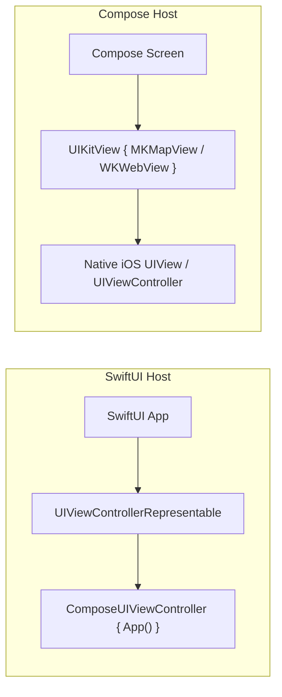

---

## 📱 2. Hosting Compose inside SwiftUI

### A. Kotlin Controller Factory (`app/shared/src/iosMain/.../MainViewController.kt`)
```kotlin
package com.example.app

import androidx.compose.ui.window.ComposeUIViewController
import platform.UIKit.UIViewController

fun MainViewController(): UIViewController = ComposeUIViewController {
    App()
}
```

### B. SwiftUI Container (`iosApp/iosApp/ContentView.swift`)
```swift
import SwiftUI
import SharedApp

struct ComposeView: UIViewControllerRepresentable {
    func makeUIViewController(context: Context) -> UIViewController {
        MainViewControllerKt.MainViewController()
    }

    func updateUIViewController(_ uiViewController: UIViewController, context: Context) {
        // Handle SwiftUI state updates
    }
}

struct ContentView: View {
    var body: some View {
        ComposeView()
            .ignoresSafeArea(.keyboard) // Allow Compose to handle IME animations
            .ignoresSafeArea(.container, edges: .all) // Edge-to-edge drawing under status bar
    }
}
```

---

## 🗺️ 3. Embedding Native iOS Views inside Compose (`UIKitView`)

When an iOS feature requires a proprietary platform view (such as Apple Maps `MKMapView`, `WKWebView`, or Camera Viewfinder), embed it using `UIKitView`:

```kotlin
package com.example.app.core.ui.ios

import androidx.compose.foundation.layout.fillMaxSize
import androidx.compose.runtime.Composable
import androidx.compose.ui.Modifier
import androidx.compose.ui.interop.UIKitView
import kotlinx.cinterop.ExperimentalForeignApi
import platform.MapKit.MKCoordinateRegionMakeWithDistance
import platform.MapKit.MKMapView
import platform.CoreLocation.CLLocationCoordinate2DMake

@OptIn(ExperimentalForeignApi::class)
@Composable
fun NativeAppleMapView(
    latitude: Double,
    longitude: Double,
    modifier: Modifier = Modifier
) {
    UIKitView(
        factory = {
            MKMapView().apply {
                showsUserLocation = true
                val center = CLLocationCoordinate2DMake(latitude, longitude)
                val region = MKCoordinateRegionMakeWithDistance(center, 1000.0, 1000.0)
                setRegion(region, animated = false)
            }
        },
        update = { mapView ->
            val center = CLLocationCoordinate2DMake(latitude, longitude)
            val region = MKCoordinateRegionMakeWithDistance(center, 1000.0, 1000.0)
            mapView.setRegion(region, animated = true)
        },
        modifier = modifier.fillMaxSize()
    )
}
```

---

## 🔄 4. Consuming Kotlin Coroutines in Swift (async/await)

Modern Kotlin Multiplatform exports suspend functions as Swift `async/await` and Flows as `AsyncSequence` when using the **SKIE plugin**:

### Gradle Setup (`app/shared/build.gradle.kts`)
```kotlin
plugins {
    id("co.touchlab.skie") version "0.9.3"
}
```

### Swift Call Site (`iosApp/iosApp/ProductViewModelBridge.swift`)
```swift
import SwiftUI
import SharedApp

@MainActor
class SwiftProductObserver: ObservableObject {
    @Published var products: [Product] = []
    private var observeTask: Task<Void, Never>?

    func startObserving(repository: ProductRepository) {
        observeTask = Task {
            // SKIE allows direct for-await-in iteration over Kotlin Flows!
            for await productList in repository.observeProducts() {
                self.products = productList
            }
        }
    }

    func refresh(repository: ProductRepository) async {
        do {
            try await repository.refreshProducts()
        } catch {
            print("Failed to sync products: \(error)")
        }
    }

    deinit {
        observeTask?.cancel()
    }
}
```

---

## 🏝️ 5. SafeArea & Dynamic Island Layout Compliance

In Compose Multiplatform on iOS, the top status bar and bottom home indicator are represented via `WindowInsets`:

```kotlin
package com.example.app.core.ui.ios

import androidx.compose.foundation.layout.Box
import androidx.compose.foundation.layout.WindowInsets
import androidx.compose.foundation.layout.fillMaxSize
import androidx.compose.foundation.layout.windowInsetsPadding
import androidx.compose.material3.Scaffold
import androidx.compose.runtime.Composable
import androidx.compose.ui.Modifier
import androidx.compose.ui.unit.dp

@Composable
fun IosSafeScreenContainer(
    content: @Composable () -> Unit
) {
    Scaffold(
        // Automatically accommodates Dynamic Island (44-59dp) and Home Indicator bar (34dp)
        contentWindowInsets = WindowInsets(0.dp, 0.dp, 0.dp, 0.dp)
    ) { innerPadding ->
        Box(
            modifier = Modifier
                .fillMaxSize()
                .windowInsetsPadding(WindowInsets(innerPadding.calculateLeftPadding(androidx.compose.ui.unit.LayoutDirection.Ltr), innerPadding.calculateTopPadding(), innerPadding.calculateRightPadding(androidx.compose.ui.unit.LayoutDirection.Ltr), innerPadding.calculateBottomPadding()))
        ) {
            content()
        }
    }
}
```

---

## 🚫 6. iOS Interop Anti-Patterns & Memory Leaks

| Anti-Pattern | Root Problem | Correct Architecture |
|---|---|---|
| **Retain Cycles in Callbacks** | Passing strong Swift `self` references into Kotlin listener closures prevents `UIViewController` from deallocating. | Always capture `[weak self]` in Swift closures bound to Kotlin instances. |
| **Forgetting to cancel Swift Tasks** | Leaving `for await event in flow` running after SwiftUI view dismisses leaks background coroutines. | Store `Task` reference and call `task.cancel()` in `onDisappear` or `deinit`. |
| **Heavy UI operations in `UIKitView.update`** | Instantiating expensive objects inside `update` triggers allocations on every Compose recomposition. | Keep `update` lightweight; only assign mutated properties. |
| **Blocking the Darwin Main RunLoop** | Running synchronous blocking Kotlin code blocks UIKit gesture recognizers and freezes scrolling. | Always dispatch heavy calculations to Kotlin `Dispatchers.Default` or `Dispatchers.IO`. |


---

### 💎 KMPSkills: 🌐 KMP Full-Stack Unification & Shared Ktor Server Models
> **Domain**: 10. DevOps & Fullstack | **Target Files**: `**/model/**/*.kt, **/dto/**/*.kt`

# 🌐 KMP Full-Stack Unification & Shared Ktor Server Models

This skill provides an enterprise architectural blueprint for achieving **Zero-Duplication Full-Stack Kotlin**, unifying data models, validation contracts, and API routes between the **Ktor Server backend (`/server`)** and **Compose Multiplatform clients (`/app/shared`)**.

---

## 🏗️ 1. Full-Stack Shared Code Topology

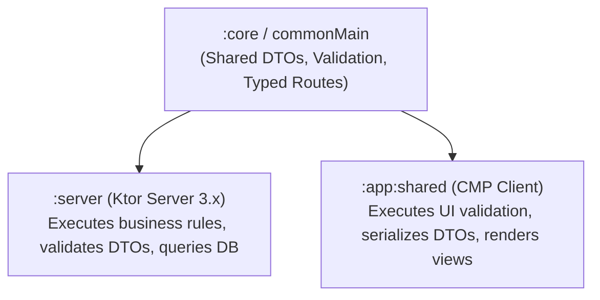

---

## 📦 2. Shared Data DTOs & Validation Logic (`core/commonMain`)

Define contracts once; compile to both JVM backend and Multiplatform clients:

```kotlin
package com.example.app.core.models

import kotlinx.serialization.Serializable

@Serializable
data class CreateUserRequest(
    val email: String,
    val username: String,
    val age: Int
)

@Serializable
data class UserResponse(
    val id: String,
    val email: String,
    val username: String,
    val createdAt: Long
)

// Shared validation rule running identically on Client Form and Server Security Filter
object UserValidator {
    sealed interface ValidationResult {
        data object Valid : ValidationResult
        data class Invalid(val error: String) : ValidationResult
    }

    fun validate(request: CreateUserRequest): ValidationResult {
        if (!request.email.contains("@") || !request.email.contains(".")) {
            return ValidationResult.Invalid("Invalid email address format")
        }
        if (request.username.length < 3) {
            return ValidationResult.Invalid("Username must be at least 3 characters")
        }
        if (request.age < 13) {
            return ValidationResult.Invalid("Users must be at least 13 years old")
        }
        return ValidationResult.Valid
    }
}
```

---

## 🖥️ 3. Backend Ktor Server Implementation (`server/src/main/kotlin/...`)

Consume the shared DTO and validation contract directly:

```kotlin
package com.example.app.server.routes

import com.example.app.core.models.CreateUserRequest
import com.example.app.core.models.UserResponse
import com.example.app.core.models.UserValidator
import io.ktor.http.HttpStatusCode
import io.ktor.server.application.call
import io.ktor.server.request.receive
import io.ktor.server.response.respond
import io.ktor.server.routing.Route
import io.ktor.server.routing.post
import io.ktor.server.routing.route

fun Route.userRoutes() {
    route("/v1/users") {
        post {
            val request = call.receive<CreateUserRequest>()

            // 1. Run shared validation rule on Server
            val validation = UserValidator.validate(request)
            if (validation is UserValidator.ValidationResult.Invalid) {
                call.respond(HttpStatusCode.BadRequest, mapOf("error" to validation.error))
                return@post
            }

            // 2. Process business logic & respond with shared UserResponse DTO
            val userResponse = UserResponse(
                id = "usr_${System.currentTimeMillis()}",
                email = request.email,
                username = request.username,
                createdAt = System.currentTimeMillis()
            )

            call.respond(HttpStatusCode.Created, userResponse)
        }
    }
}
```

---

## 📱 4. Client Ktor Client Consumption (`app/shared/src/commonMain/...`)

The client validates input before sending and consumes the identical response type:

```kotlin
package com.example.app.features.auth.data

import com.example.app.core.models.CreateUserRequest
import com.example.app.core.models.UserResponse
import com.example.app.core.models.UserValidator
import com.example.app.core.network.NetworkResult
import com.example.app.core.network.safeApiCall
import io.ktor.client.HttpClient
import io.ktor.client.request.post
import io.ktor.client.request.setBody

class UserRemoteDataSource(private val httpClient: HttpClient) {

    suspend fun registerUser(request: CreateUserRequest): NetworkResult<UserResponse> {
        // Client-side pre-validation
        val clientCheck = UserValidator.validate(request)
        if (clientCheck is UserValidator.ValidationResult.Invalid) {
            return NetworkResult.HttpError(400, clientCheck.error, null)
        }

        return safeApiCall {
            httpClient.post("v1/users") {
                setBody(request)
            }
        }
    }
}
```

---

## 🚫 5. Full-Stack Anti-Patterns

| Anti-Pattern | Root Problem | Correct Architecture |
|---|---|---|
| **Duplicating DTOs in Server and Client** | Schema changes on backend require manual synchronization across multiple repositories, causing runtime crashes. | Place DTOs in a shared `:core` module consumed by both client and server projects. |
| **Relying Solely on Client Validation** | Attackers can bypass frontend UI and send malicious payloads directly to the backend API. | Run shared validation rules on the client for instant UX AND on the server for strict security. |
| **Leaking Server-Only Dependencies to Core** | Importing database drivers (Exposed, Hibernate) into `:core` breaks iOS/Android compilation. | Keep `:core` pure Kotlin with zero server-specific or platform-specific runtime dependencies. |


---

### 💎 KMPSkills: 🌐 Ktor Client 3.x Resilient Networking & Auth Engine
> **Domain**: 6. Networking & Sync | **Target Files**: `**/*Api.kt, **/*Client.kt, **/*Network*.kt, **/*Service.kt`

# 🌐 Ktor Client 3.x Resilient Networking & Auth Engine

This skill provides an enterprise architectural blueprint for implementing HTTP networking across **Android, iOS, Desktop (JVM), and Web (Wasm)** using **Ktor Client 3.x**, featuring **Silent Token Refresh**, **Multiplatform Engines**, and **Type-Safe Result Wrappers**.

---

## 🛰️ 1. Multiplatform Engine & Pipeline Architecture

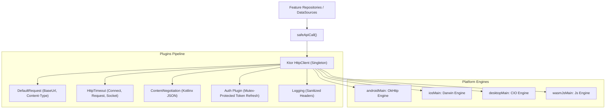

---

## 📦 2. Dependencies Setup (`libs.versions.toml`)

```toml
[libraries]
ktor-client-core = { module = "io.ktor:ktor-client-core", version = "3.0.3" }
ktor-client-okhttp = { module = "io.ktor:ktor-client-okhttp", version = "3.0.3" }
ktor-client-darwin = { module = "io.ktor:ktor-client-darwin", version = "3.0.3" }
ktor-client-cio = { module = "io.ktor:ktor-client-cio", version = "3.0.3" }
ktor-client-js = { module = "io.ktor:ktor-client-js", version = "3.0.3" }
ktor-client-content-negotiation = { module = "io.ktor:ktor-client-content-negotiation", version = "3.0.3" }
ktor-serialization-kotlinx-json = { module = "io.ktor:ktor-serialization-kotlinx-json", version = "3.0.3" }
ktor-client-logging = { module = "io.ktor:ktor-client-logging", version = "3.0.3" }
ktor-client-auth = { module = "io.ktor:ktor-client-auth", version = "3.0.3" }
```

---

## 🛡️ 3. Safe API Call & Typed Result Modeling

Never throw unhandled network exceptions into the UI layer:

```kotlin
package com.example.app.core.network

import io.ktor.client.call.body
import io.ktor.client.statement.HttpResponse
import io.ktor.client.statement.bodyAsText
import io.ktor.http.isSuccess
import kotlinx.io.IOException
import kotlinx.serialization.SerializationException

sealed interface NetworkResult<out T> {
    data class Success<T>(val data: T, val statusCode: Int) : NetworkResult<T>
    data class HttpError(val code: Int, val message: String, val rawBody: String?) : NetworkResult<Nothing>
    data class NetworkFailure(val exception: Throwable) : NetworkResult<Nothing>
}

suspend inline fun <reified T> safeApiCall(
    crossinline apiCall: suspend () -> HttpResponse
): NetworkResult<T> {
    return try {
        val response = apiCall()
        if (response.status.isSuccess()) {
            NetworkResult.Success(data = response.body<T>(), statusCode = response.status.value)
        } else {
            val errorBody = response.bodyAsText()
            NetworkResult.HttpError(
                code = response.status.value,
                message = response.status.description,
                rawBody = errorBody
            )
        }
    } catch (e: IOException) {
        NetworkResult.NetworkFailure(e)
    } catch (e: SerializationException) {
        NetworkResult.NetworkFailure(e)
    } catch (e: Exception) {
        NetworkResult.NetworkFailure(e)
    }
}
```

---

## 🔑 4. Thread-Safe Mutex Silent Token Refresh

Prevent multiple parallel requests from triggering duplicate token refresh calls simultaneously:

```kotlin
package com.example.app.core.network

import com.example.app.core.storage.SecureStorage
import io.ktor.client.HttpClient
import io.ktor.client.call.body
import io.ktor.client.plugins.auth.Auth
import io.ktor.client.plugins.auth.providers.BearerTokens
import io.ktor.client.plugins.auth.providers.bearer
import io.ktor.client.request.post
import io.ktor.client.request.setBody
import io.ktor.http.ContentType
import io.ktor.http.contentType
import kotlinx.coroutines.sync.Mutex
import kotlinx.coroutines.sync.withLock
import kotlinx.serialization.Serializable

@Serializable
data class RefreshTokenRequest(val refreshToken: String)

@Serializable
data class TokenResponse(val accessToken: String, val refreshToken: String)

class AuthTokenManager(
    private val secureStorage: SecureStorage,
    private val tokenClient: HttpClient // Unauthenticated standalone client to avoid refresh recursion
) {
    private val refreshMutex = Mutex()

    suspend fun getAccessToken(): String? = secureStorage.get("KEY_ACCESS_TOKEN")
    suspend fun getRefreshToken(): String? = secureStorage.get("KEY_REFRESH_TOKEN")

    suspend fun saveTokens(accessToken: String, refreshToken: String) {
        secureStorage.set("KEY_ACCESS_TOKEN", accessToken)
        secureStorage.set("KEY_REFRESH_TOKEN", refreshToken)
    }

    suspend fun clearTokens() {
        secureStorage.remove("KEY_ACCESS_TOKEN")
        secureStorage.remove("KEY_REFRESH_TOKEN")
    }

    suspend fun refreshTokens(): BearerTokens? = refreshMutex.withLock {
        val currentRefreshToken = getRefreshToken() ?: return null

        try {
            val response: TokenResponse = tokenClient.post("https://api.example.com/v1/auth/refresh") {
                contentType(ContentType.Application.Json)
                setBody(RefreshTokenRequest(currentRefreshToken))
            }.body()

            saveTokens(response.accessToken, response.refreshToken)
            BearerTokens(response.accessToken, response.refreshToken)
        } catch (e: Exception) {
            clearTokens()
            null
        }
    }
}
```

---

## 🚀 5. Production `HttpClient` Factory

```kotlin
package com.example.app.core.network

import io.ktor.client.HttpClient
import io.ktor.client.engine.HttpClientEngine
import io.ktor.client.plugins.DefaultRequest
import io.ktor.client.plugins.HttpTimeout
import io.ktor.client.plugins.auth.Auth
import io.ktor.client.plugins.auth.providers.bearer
import io.ktor.client.plugins.contentnegotiation.ContentNegotiation
import io.ktor.client.plugins.logging.LogLevel
import io.ktor.client.plugins.logging.Logger
import io.ktor.client.plugins.logging.Logging
import io.ktor.client.request.header
import io.ktor.http.ContentType
import io.ktor.http.HttpHeaders
import io.ktor.serialization.kotlinx.json.json
import kotlinx.serialization.json.Json

// expect engine provider for platform-specific configurations
expect fun getPlatformHttpEngine(): HttpClientEngine

fun createHttpClient(
    engine: HttpClientEngine = getPlatformHttpEngine(),
    tokenManager: AuthTokenManager,
    baseUrl: String = "https://api.example.com/v1/"
): HttpClient {
    return HttpClient(engine) {
        // 1. JSON Content Negotiation
        install(ContentNegotiation) {
            json(Json {
                prettyPrint = false
                isLenient = true
                ignoreUnknownKeys = true
                coerceInputValues = true
                encodeDefaults = true
            })
        }

        // 2. Network Timeouts
        install(HttpTimeout) {
            connectTimeoutMillis = 15_000
            requestTimeoutMillis = 30_000
            socketTimeoutMillis = 15_000
        }

        // 3. Default Base Request
        install(DefaultRequest) {
            url(baseUrl)
            header(HttpHeaders.ContentType, ContentType.Application.Json)
            header("X-App-Platform", "ComposeMultiplatform")
        }

        // 4. Automated Silent Token Refresh
        install(Auth) {
            bearer {
                loadTokens {
                    val access = tokenManager.getAccessToken() ?: return@loadTokens null
                    val refresh = tokenManager.getRefreshToken() ?: return@loadTokens null
                    io.ktor.client.plugins.auth.providers.BearerTokens(access, refresh)
                }

                refreshTokens {
                    tokenManager.refreshTokens()
                }

                sendWithoutRequest { request ->
                    !request.url.encodedPath.contains("/auth/")
                }
            }
        }

        // 5. Sanitized Security Logging
        install(Logging) {
            level = LogLevel.INFO
            logger = object : Logger {
                override fun log(message: String) {
                    // Strip sensitive Authorization headers from console logs
                    val sanitized = message.replace(Regex("Bearer\\s+[A-Za-z0-9-_=.]+"), "Bearer [PROTECTED]")
                    println("[KtorClient] $sanitized")
                }
            }
        }
    }
}
```

---

## 🚫 6. Networking Anti-Patterns

| Anti-Pattern | Root Problem | Correct Architecture |
|---|---|---|
| **Creating multiple `HttpClient` instances** | Each `HttpClient` allocates separate connection pools and thread dispatchers, wasting memory and network sockets. | Inject `HttpClient` as a strict application singleton via Koin. |
| **Token Refresh Recursion Storm** | Using the authenticated client to make the refresh token request triggers infinite 401 loops when refresh fails. | Use a dedicated, unauthenticated lightweight client specifically for the refresh request. |
| **Ignoring Engine Thread Boundaries** | Calling blocking operations directly on Ktor network threads can deadlock Darwin (iOS) runloops. | Keep calls asynchronous with Kotlin Coroutines `suspend`. |
| **Leaking Plaintext Tokens in Logs** | Setting `LogLevel.ALL` logs user access tokens into Android Logcat or Desktop console. | Intercept and mask `Authorization: Bearer` headers in the `Logger`. |


---

### 💎 KMPSkills: 🧠 KMP Memory Leak Profiling & Kotlin/Native ARC Safety
> **Domain**: 8. Performance & Memory | **Target Files**: `**/*ViewModel.kt, **/*Scope*.kt`

# 🧠 KMP Memory Leak Profiling & Kotlin/Native ARC Safety

This skill provides an enterprise architectural blueprint for detecting, profiling, and eliminating memory leaks in **Kotlin Multiplatform (KMP)** applications across **Android (JVM GC)** and **iOS (Kotlin/Native ARC)**.

---

## 🔬 1. JVM Garbage Collection vs. Kotlin/Native ARC

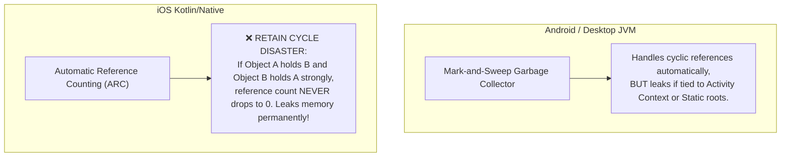

---

## 🚫 2. Breaking Retain Cycles in Kotlin/Native with `WeakReference`

When passing listeners or callbacks across the Kotlin/Native boundary, use `WeakReference` to break retain cycles:

```kotlin
package com.example.app.core.memory

import kotlin.experimental.ExperimentalNativeApi
import kotlin.native.ref.WeakReference

interface DownloadListener {
    fun onProgress(percent: Int)
}

class DownloadManager {
    // ❌ BAD: Strong reference causes retain cycle if listener references manager
    // var listener: DownloadListener? = null

    // ✅ OPTIMIZED: WeakReference allows GC/ARC to deallocate listener cleanly
    @OptIn(ExperimentalNativeApi::class)
    private var listenerRef: WeakReference<DownloadListener>? = null

    @OptIn(ExperimentalNativeApi::class)
    fun setListener(listener: DownloadListener) {
        listenerRef = WeakReference(listener)
    }

    @OptIn(ExperimentalNativeApi::class)
    fun notifyProgress(percent: Int) {
        listenerRef?.get()?.onProgress(percent)
    }
}
```

---

## 🔍 3. Android LeakCanary Setup for Automated Detection

In `gradle/libs.versions.toml`:
```toml
[libraries]
leakcanary-android = { module = "com.squareup.leakcanary:leakcanary-android", version = "2.14" }
```

In `app/androidApp/build.gradle.kts`:
```kotlin
dependencies {
    // LeakCanary automatically installs itself in debug builds via ContentProvider
    debugImplementation(libs.leakcanary.android)
}
```

---

## 🧹 4. CoroutineScope Lifecycle Cleanup

Never use `GlobalScope` or unmanaged `CoroutineScope` in ViewModels or Services. Always cancel jobs on disposal:

```kotlin
package com.example.app.core.memory

import kotlinx.coroutines.CoroutineScope
import kotlinx.coroutines.Dispatchers
import kotlinx.coroutines.SupervisorJob
import kotlinx.coroutines.cancel
import java.io.Closeable

class ManagedSessionScope : Closeable {
    val scope = CoroutineScope(SupervisorJob() + Dispatchers.Default)

    override fun close() {
        // Cancels all running coroutines and unbinds all active Flow subscriptions
        scope.cancel()
    }
}
```

---

## 📱 5. Compose Multiplatform `DisposableEffect` Resource Cleanup

Ensure native system listeners, sensor subscriptions, or audio players are unbound when a Composable leaves the composition:

```kotlin
package com.example.app.core.ui

import androidx.compose.runtime.Composable
import androidx.compose.runtime.DisposableEffect

@Composable
fun SensorObserverScreen(
    sensorManager: Any,
    onReadingUpdated: (Float) -> Unit
) {
    DisposableEffect(sensorManager) {
        // 1. Subscribe to sensor updates on enter
        println("Registering hardware sensor listener")

        onDispose {
            // 2. Unsubscribe cleanly when user navigates away or screen closes
            println("Unregistering hardware sensor listener to prevent memory leak")
        }
    }
}
```

---

## 🚫 6. Memory Leak Anti-Patterns

| Anti-Pattern | Root Problem | Correct Architecture |
|---|---|---|
| **Passing Android `Activity` to KMP Common** | Holding an Activity reference in a common singleton prevents the Activity from being destroyed on rotation. | Only pass `ApplicationContext` or abstract system actions behind a common interface. |
| **Strong Swift Closure references** | Swift closure capturing `self` strongly passed into Kotlin observer creates uncollectible retain cycles in ARC. | Always use `[weak self]` in Swift closures passed to Kotlin. |
| **Dangling Flow Subscriptions** | Calling `flow.collect()` on `GlobalScope` keeps collecting and processing events even after the UI is closed. | Collect Flows within `viewModelScope` or via `LaunchedEffect`. |
| **Static Singleton Cache without Bounds** | Storing items in an unbounded `mutableListOf()` without an LRU eviction strategy eventually causes OOM. | Use an in-memory LRU Cache with maximum entry limits. |


---

### 💎 KMPSkills: 📦 KMP Multi-Target Distribution & Code Signing
> **Domain**: 10. DevOps & Fullstack | **Target Files**: `**/build.gradle.kts, Fastfile`

# 📦 KMP Multi-Target Distribution & Code Signing

This skill provides an enterprise architectural blueprint for **code signing**, **binary packaging**, and **automated store distribution** across **Google Play**, **Apple App Store**, and **Desktop Operating Systems**.

---

## 🏗️ 1. Multiplatform Distribution Architecture

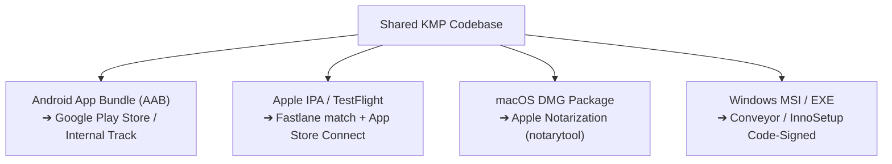

---

## 🤖 2. Android Release Signing & AAB Packaging

Configure release signing safely via environment variables in `app/androidApp/build.gradle.kts`:

```kotlin
android {
    signingConfigs {
        create("release") {
            storeFile = file(System.getenv("KEYSTORE_PATH") ?: "release.jks")
            storePassword = System.getenv("KEYSTORE_PASSWORD")
            keyAlias = System.getenv("KEY_ALIAS")
            keyPassword = System.getenv("KEY_PASSWORD")
        }
    }

    buildTypes {
        release {
            signingConfig = signingConfigs.getByName("release")
            isMinifyEnabled = true
            isShrinkResources = true
        }
    }
}
```

Generate the signed store bundle:
```bash
./gradlew :app:androidApp:bundleRelease
```

---

## 🍏 3. iOS Fastlane & TestFlight Automation

Automate certificates, provisioning profiles, and TestFlight uploads using Fastlane.

### `iosApp/Fastfile`
```ruby
default_platform(:ios)

platform :ios do
  desc "Push a new build to TestFlight"
  lane :beta do
    # 1. Sync certificates using Git-backed match
    match(type: "appstore", readonly: is_ci)

    # 2. Increment build number
    increment_build_number(xcodeproj: "iosApp.xcodeproj")

    # 3. Build signed IPA archive
    build_app(
      project: "iosApp.xcodeproj",
      scheme: "iosApp",
      export_method: "app-store",
      output_directory: "./build/artifacts"
    )

    # 4. Upload directly to TestFlight
    upload_to_testflight(
      skip_waiting_for_build_processing: true
    )
  end
end
```

---

## 💻 4. Desktop Packaging & Apple Gatekeeper Notarization

### A. Compose Desktop Packaging (`app/desktopApp/build.gradle.kts`)
```kotlin
compose.desktop {
    application {
        mainClass = "com.example.app.MainKt"

        nativeDistributions {
            targetFormats(
                org.jetbrains.compose.desktop.application.dsl.TargetFormat.Dmg,
                org.jetbrains.compose.desktop.application.dsl.TargetFormat.Msi,
                org.jetbrains.compose.desktop.application.dsl.TargetFormat.Deb
            )
            packageName = "MyKmpApp"
            packageVersion = "1.0.0"

            macOS {
                bundleID = "com.example.app.desktop"
                iconFile.set(project.file("src/jvmMain/resources/icon.icns"))
            }

            windows {
                iconFile.set(project.file("src/jvmMain/resources/icon.ico"))
                menuGroup = "MyKmpApp"
            }
        }
    }
}
```

### B. macOS Notarization via CLI
Unnotarized macOS apps are blocked by Gatekeeper with *"App is damaged and cannot be opened"*:

```bash
# 1. Package DMG
./gradlew :app:desktopApp:packageDmg

# 2. Submit for Apple Notarization
xcrun notarytool submit \
  "app/desktopApp/build/compose/binaries/main/dmg/MyKmpApp-1.0.0.dmg" \
  --apple-id "$APPLE_ID" \
  --password "$APP_SPECIFIC_PASSWORD" \
  --team-id "$TEAM_ID" \
  --wait

# 3. Staple the notarization ticket to the DMG
xcrun stapler staple "app/desktopApp/build/compose/binaries/main/dmg/MyKmpApp-1.0.0.dmg"
```

---

## 🚫 5. Distribution Anti-Patterns

| Anti-Pattern | Root Problem | Correct Architecture |
|---|---|---|
| **Distributing Unnotarized macOS DMGs** | Apple Gatekeeper warns users that the app is malicious or prevents opening entirely. | Submit binary to Apple Notarization via `notarytool` and attach ticket with `stapler`. |
| **Storing Keystore Passwords in Code** | Committing passwords in `build.gradle.kts` leaks private signing keys in version control. | Inject credentials through environment variables or GitHub Secrets. |
| **Manual TestFlight Uploads via Xcode** | Slow, error-prone manual archiving that wastes developer hours on every release. | Automate with Fastlane (`fastlane beta`) in CI/CD. |
| **Shipping Uncompressed Desktop Binaries** | Distributing bare jar files requires users to manually install Java runtime. | Use Compose Native Distributions to package bundled self-contained JRE runtimes. |


---

### 💎 KMPSkills: 🔄 KMP MVI (Model-View-Intent) & Unidirectional StateFlow Architecture
> **Domain**: 2. DI & State Management | **Target Files**: `**/*ViewModel.kt, **/*State.kt, **/*Intent.kt, **/*Effect.kt`

# 🔄 KMP MVI (Model-View-Intent) & Unidirectional StateFlow Architecture

This skill provides the definitive blueprint for implementing **Model-View-Intent (MVI)** with **Unidirectional Data Flow (UDF)** in **Compose Multiplatform (CMP)**. It guarantees predictable state transitions, prevents duplicate event execution on recomposition, and decouples UI rendering from business logic.

---

## 🔄 1. The Unidirectional Data Flow (UDF) Loop

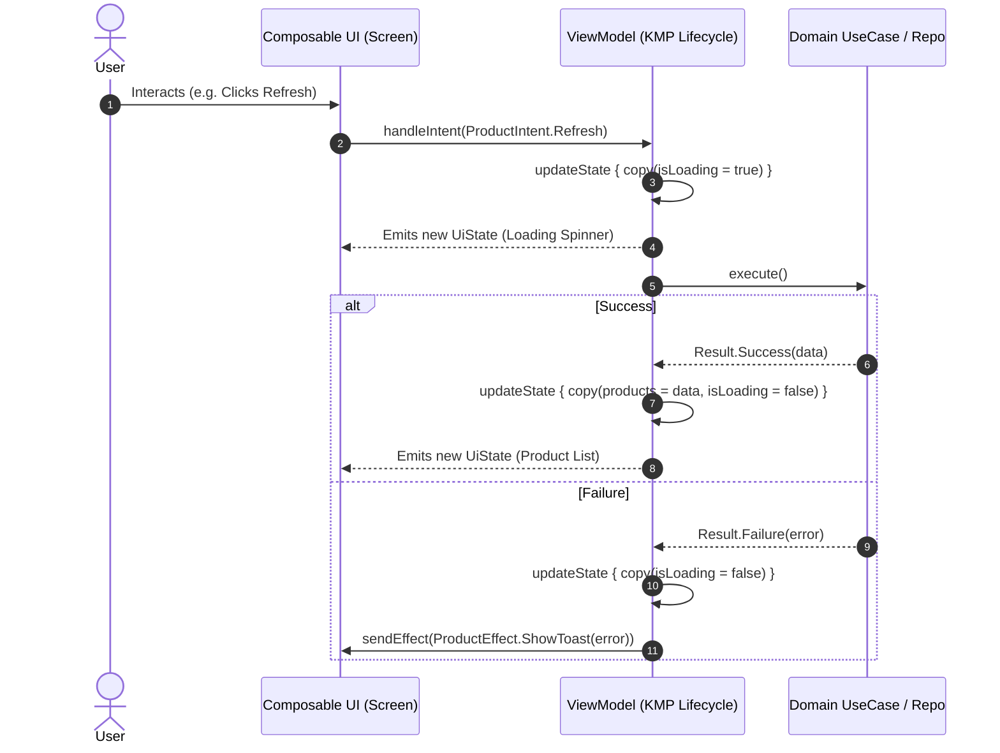

---

## 🏛️ 2. The Core MVI Foundation Contracts (`commonMain`)

Create `core/base/MviContract.kt` in `commonMain`:

```kotlin
package com.example.app.core.base

import androidx.compose.runtime.Immutable
import androidx.lifecycle.ViewModel
import androidx.lifecycle.viewModelScope
import kotlinx.coroutines.channels.Channel
import kotlinx.coroutines.flow.Flow
import kotlinx.coroutines.flow.MutableStateFlow
import kotlinx.coroutines.flow.StateFlow
import kotlinx.coroutines.flow.asStateFlow
import kotlinx.coroutines.flow.receiveAsFlow
import kotlinx.coroutines.flow.update
import kotlinx.coroutines.launch

/**
 * Marker interface for all screen states. Must be immutable.
 */
@Immutable
interface UiState

/**
 * Sealed interface representing all user actions or system triggers.
 */
interface UiIntent

/**
 * Sealed interface representing one-off side effects (Navigation, Toast, Haptics).
 */
interface UiEffect

/**
 * Enterprise BaseViewModel implementing MVI and UDF for Compose Multiplatform.
 */
abstract class BaseViewModel<State : UiState, Intent : UiIntent, Effect : UiEffect>(
    initialState: State
) : ViewModel() {

    private val _uiState = MutableStateFlow(initialState)
    val uiState: StateFlow<State> = _uiState.asStateFlow()

    private val _uiEffect = Channel<Effect>(capacity = Channel.BUFFERED)
    val uiEffect: Flow<Effect> = _uiEffect.receiveAsFlow()

    /**
     * Entry point for the UI to dispatch intents.
     */
    abstract fun handleIntent(intent: Intent)

    /**
     * Atomically mutates the current UI state using a reducer function.
     */
    protected fun updateState(reducer: State.() -> State) {
        _uiState.update(reducer)
    }

    /**
     * Dispatches a single-shot effect that is consumed exactly once by the UI.
     */
    protected fun sendEffect(effect: Effect) {
        viewModelScope.launch {
            _uiEffect.send(effect)
        }
    }
}
```

---

## 💎 3. Real-World Feature Contract Implementation

### `ProductCatalogContract.kt`
```kotlin
package com.example.app.features.product.presentation.mvi

import androidx.compose.runtime.Immutable
import com.example.app.core.base.UiEffect
import com.example.app.core.base.UiIntent
import com.example.app.core.base.UiState
import com.example.app.features.product.domain.model.Product

@Immutable
data class ProductCatalogState(
    val isLoading: Boolean = false,
    val products: List<Product> = emptyList(),
    val searchQuery: String = "",
    val errorMessage: String? = null
) : UiState

sealed interface ProductCatalogIntent : UiIntent {
    data object Refresh : ProductCatalogIntent
    data class SearchQueryChanged(val query: String) : ProductCatalogIntent
    data class ProductClicked(val productId: String) : ProductCatalogIntent
    data object ClearError : ProductCatalogIntent
}

sealed interface ProductCatalogEffect : UiEffect {
    data class NavigateToDetail(val productId: String) : ProductCatalogEffect
    data class ShowSnackbar(val message: String) : ProductCatalogEffect
}
```

---

## 🧠 4. Feature ViewModel Implementation

### `ProductCatalogViewModel.kt`
```kotlin
package com.example.app.features.product.presentation

import androidx.lifecycle.viewModelScope
import com.example.app.core.base.BaseViewModel
import com.example.app.features.product.domain.repository.ProductRepository
import com.example.app.features.product.presentation.mvi.ProductCatalogEffect
import com.example.app.features.product.presentation.mvi.ProductCatalogIntent
import com.example.app.features.product.presentation.mvi.ProductCatalogState
import kotlinx.coroutines.flow.catch
import kotlinx.coroutines.launch

class ProductCatalogViewModel(
    private val repository: ProductRepository
) : BaseViewModel<ProductCatalogState, ProductCatalogIntent, ProductCatalogEffect>(
    initialState = ProductCatalogState()
) {

    init {
        observeProducts()
    }

    override fun handleIntent(intent: ProductCatalogIntent) {
        when (intent) {
            is ProductCatalogIntent.Refresh -> refreshProducts()
            is ProductCatalogIntent.SearchQueryChanged -> updateSearch(intent.query)
            is ProductCatalogIntent.ProductClicked -> {
                sendEffect(ProductCatalogEffect.NavigateToDetail(intent.productId))
            }
            is ProductCatalogIntent.ClearError -> {
                updateState { copy(errorMessage = null) }
            }
        }
    }

    private fun observeProducts() {
        viewModelScope.launch {
            updateState { copy(isLoading = true) }
            repository.observeProducts()
                .catch { cause ->
                    updateState { copy(isLoading = false, errorMessage = cause.message) }
                    sendEffect(ProductCatalogEffect.ShowSnackbar("Failed to load products"))
                }
                .collect { productList ->
                    updateState { copy(products = productList, isLoading = false) }
                }
        }
    }

    private fun refreshProducts() {
        viewModelScope.launch {
            updateState { copy(isLoading = true) }
            repository.refreshProducts()
                .onFailure { error ->
                    updateState { copy(isLoading = false) }
                    sendEffect(ProductCatalogEffect.ShowSnackbar(error.message ?: "Sync failed"))
                }
        }
    }

    private fun updateSearch(query: String) {
        updateState { copy(searchQuery = query) }
    }
}
```

---

## 📱 5. Compose Multiplatform UI Consumption

Consume the MVI loop using **Lifecycle-Aware Collection** and **Stateless Hoisting**:

```kotlin
package com.example.app.features.product.presentation

import androidx.compose.foundation.clickable
import androidx.compose.foundation.layout.*
import androidx.compose.foundation.lazy.LazyColumn
import androidx.compose.foundation.lazy.items
import androidx.compose.material3.*
import androidx.compose.runtime.Composable
import androidx.compose.runtime.LaunchedEffect
import androidx.compose.runtime.getValue
import androidx.compose.ui.Alignment
import androidx.compose.ui.Modifier
import androidx.compose.ui.unit.dp
import androidx.lifecycle.compose.collectAsStateWithLifecycle
import com.example.app.features.product.presentation.mvi.ProductCatalogEffect
import com.example.app.features.product.presentation.mvi.ProductCatalogIntent
import com.example.app.features.product.presentation.mvi.ProductCatalogState
import kotlinx.coroutines.flow.collectLatest
import org.koin.compose.viewmodel.koinViewModel

@Composable
fun ProductCatalogScreen(
    viewModel: ProductCatalogViewModel = koinViewModel(),
    onNavigateToDetail: (String) -> Unit,
    snackbarHostState: SnackbarHostState
) {
    val state by viewModel.uiState.collectAsStateWithLifecycle()

    // 1. Single-shot Effect Collector (Lifecycle-Aware, No duplicate triggers on recomposition)
    LaunchedEffect(Unit) {
        viewModel.uiEffect.collectLatest { effect ->
            when (effect) {
                is ProductCatalogEffect.NavigateToDetail -> onNavigateToDetail(effect.productId)
                is ProductCatalogEffect.ShowSnackbar -> snackbarHostState.showSnackbar(effect.message)
            }
        }
    }

    // 2. Stateless Content Composable
    ProductCatalogContent(
        state = state,
        onIntent = viewModel::handleIntent
    )
}

@Composable
fun ProductCatalogContent(
    state: ProductCatalogState,
    onIntent: (ProductCatalogIntent) -> Unit,
    modifier: Modifier = Modifier
) {
    Scaffold(modifier = modifier) { padding ->
        Box(
            modifier = Modifier
                .fillMaxSize()
                .padding(padding)
        ) {
            when {
                state.isLoading && state.products.isEmpty() -> {
                    CircularProgressIndicator(modifier = Modifier.align(Alignment.Center))
                }
                state.products.isEmpty() -> {
                    Text("No products found", modifier = Modifier.align(Alignment.Center))
                }
                else -> {
                    LazyColumn(modifier = Modifier.fillMaxSize()) {
                        items(state.products, key = { it.id }) { product ->
                            Card(
                                modifier = Modifier
                                    .fillMaxWidth()
                                    .padding(horizontal = 16.dp, vertical = 8.dp)
                                    .clickable {
                                        onIntent(ProductCatalogIntent.ProductClicked(product.id))
                                    }
                            ) {
                                Column(modifier = Modifier.padding(16.dp)) {
                                    Text(product.title, style = MaterialTheme.typography.titleMedium)
                                    Text(product.formattedPrice, style = MaterialTheme.typography.bodyMedium)
                                }
                            }
                        }
                    }
                }
            }
        }
    }
}
```

---

## 🚫 6. MVI Anti-Patterns & Best Practices

| Anti-Pattern | Root Problem | Correct Architecture |
|---|---|---|
| **One-shot events in `UiState`** | Storing `val showToast: Boolean` in `UiState` causes the Toast to reappear on screen rotation, resize, or recomposition. | Use a buffered `Channel` exposed as `receiveAsFlow()` for `UiEffect`. |
| **Exposing `MutableStateFlow`** | UI composables can mutate state directly, bypassing the ViewModel reducer and breaking UDF predictability. | Always expose read-only `val uiState: StateFlow<State> = _uiState.asStateFlow()`. |
| **Side-Effects inside Reducer** | Calling API requests or navigating directly inside `updateState { ... }`. | Keep reducers 100% pure functions (`State.() -> State`). Launch coroutines in ViewModel methods. |
| **Passing ViewModel deep into Composables** | Passing ViewModel instances down multiple Composable tree layers destroys previewability and testing. | Hoist state: Pass `state: State` and `onIntent: (Intent) -> Unit` to child composables. |

---

## 🧪 7. Testing MVI ViewModels with Turbine

Verify sequential state emissions and single-shot effects with zero flakiness:

```kotlin
package com.example.app.features.product.presentation

import app.cash.turbine.test
import com.example.app.features.product.domain.model.Product
import com.example.app.features.product.domain.repository.ProductRepository
import com.example.app.features.product.presentation.mvi.ProductCatalogEffect
import com.example.app.features.product.presentation.mvi.ProductCatalogIntent
import kotlinx.coroutines.Dispatchers
import kotlinx.coroutines.ExperimentalCoroutinesApi
import kotlinx.coroutines.flow.flowOf
import kotlinx.coroutines.test.StandardTestDispatcher
import kotlinx.coroutines.test.resetMain
import kotlinx.coroutines.test.runTest
import kotlinx.coroutines.test.setMain
import kotlin.test.AfterTest
import kotlin.test.BeforeTest
import kotlin.test.Test
import kotlin.test.assertEquals
import kotlin.test.assertFalse

@OptIn(ExperimentalCoroutinesApi::class)
class ProductCatalogViewModelTest {

    private val testDispatcher = StandardTestDispatcher()

    @BeforeTest
    fun setUp() {
        Dispatchers.setMain(testDispatcher)
    }

    @AfterTest
    fun tearDown() {
        Dispatchers.resetMain()
    }

    @Test
    fun `clicking product should emit NavigateToDetail effect`() = runTest(testDispatcher) {
        val fakeRepo = object : ProductRepository {
            override fun observeProducts() = flowOf(emptyList<Product>())
            override suspend fun getProductById(id: String) = Result.failure<Product>(NotImplementedError())
            override suspend fun refreshProducts() = Result.success(Unit)
        }

        val viewModel = ProductCatalogViewModel(fakeRepo)

        viewModel.uiEffect.test {
            viewModel.handleIntent(ProductCatalogIntent.ProductClicked("prod_123"))

            val effect = awaitItem()
            assertEquals(ProductCatalogEffect.NavigateToDetail("prod_123"), effect)
            expectNoEvents()
        }
    }
}
```


---

### 💎 KMPSkills: 🧭 KMP Type-Safe Navigation Compose Stack
> **Domain**: 4. Navigation & Layouts | **Target Files**: `**/*Nav*.kt, **/*Route*.kt, **/*Destination*.kt`

# 🧭 KMP Type-Safe Navigation Compose Stack

This skill provides an enterprise architectural blueprint for building scalable, type-safe screen navigation in **Compose Multiplatform (CMP)** using official **Jetpack Navigation Compose KMP** and **Kotlinx Serialization**.

---

## 🗺️ 1. Type-Safe Navigation Architecture & Graph Topology

```mermaid
graph TD
    AppNavHost["AppNavHost(navController)"]
    
    AppNavHost --> AuthGraph["AuthGraph (@Serializable)"]
    AuthGraph --> LoginDest["LoginRoute"]
    AuthGraph --> RegisterDest["RegisterRoute"]
    
    AppNavHost --> MainGraph["MainGraph (@Serializable)"]
    MainGraph --> CatalogDest["ProductCatalogRoute"]
    MainGraph --> DetailDest["ProductDetailRoute(id, title)"]
    MainGraph --> CartDest["CartRoute"]
```

---

## 📦 2. Defining Strongly Typed Destinations (`@Serializable`)

Declare all navigation targets using `@Serializable` data objects and data classes. Never rely on fragile URL path strings:

```kotlin
package com.example.app.navigation

import kotlinx.serialization.Serializable

// Top-Level Subgraphs
@Serializable
data object AuthGraph

@Serializable
data object MainGraph

// Auth Subgraph Destinations
@Serializable
data object LoginRoute

@Serializable
data object RegisterRoute

// Main Subgraph Destinations
@Serializable
data object ProductCatalogRoute

@Serializable
data class ProductDetailRoute(
    val productId: String,
    val initialTitle: String = ""
)

@Serializable
data object CartRoute

@Serializable
data object ProfileRoute
```

---

## 🎬 3. Multiplatform `AppNavHost` with Animated Transitions

Assemble the global navigation graph with smooth multiplatform transitions:

```kotlin
package com.example.app.navigation

import androidx.compose.animation.*
import androidx.compose.animation.core.tween
import androidx.compose.foundation.layout.fillMaxSize
import androidx.compose.material3.SnackbarHostState
import androidx.compose.runtime.Composable
import androidx.compose.ui.Modifier
import androidx.navigation.NavGraphBuilder
import androidx.navigation.NavHostController
import androidx.navigation.compose.NavHost
import androidx.navigation.compose.composable
import androidx.navigation.navigation
import androidx.navigation.toRoute
import com.example.app.features.auth.presentation.LoginScreen
import com.example.app.features.product.presentation.ProductCatalogScreen
import com.example.app.features.product.presentation.ProductDetailScreen

@Composable
fun AppNavHost(
    navController: NavHostController,
    snackbarHostState: SnackbarHostState,
    modifier: Modifier = Modifier
) {
    NavHost(
        navController = navController,
        startDestination = MainGraph,
        modifier = modifier.fillMaxSize(),
        enterTransition = {
            slideInHorizontally(initialOffsetX = { it }, animationSpec = tween(300)) + fadeIn(tween(300))
        },
        exitTransition = {
            slideOutHorizontally(targetOffsetX = { -it / 3 }, animationSpec = tween(300)) + fadeOut(tween(300))
        },
        popEnterTransition = {
            slideInHorizontally(initialOffsetX = { -it / 3 }, animationSpec = tween(300)) + fadeIn(tween(300))
        },
        popExitTransition = {
            slideOutHorizontally(targetOffsetX = { it }, animationSpec = tween(300)) + fadeOut(tween(300))
        }
    ) {
        authGraph(navController, snackbarHostState)
        mainGraph(navController, snackbarHostState)
    }
}

fun NavGraphBuilder.authGraph(
    navController: NavHostController,
    snackbarHostState: SnackbarHostState
) {
    navigation<AuthGraph>(startDestination = LoginRoute) {
        composable<LoginRoute> {
            LoginScreen(
                onLoginSuccess = {
                    navController.navigate(MainGraph) {
                        popUpTo(AuthGraph) { inclusive = true }
                    }
                }
            )
        }
    }
}

fun NavGraphBuilder.mainGraph(
    navController: NavHostController,
    snackbarHostState: SnackbarHostState
) {
    navigation<MainGraph>(startDestination = ProductCatalogRoute) {
        composable<ProductCatalogRoute> {
            ProductCatalogScreen(
                onNavigateToDetail = { productId ->
                    navController.navigate(ProductDetailRoute(productId = productId))
                },
                snackbarHostState = snackbarHostState
            )
        }

        composable<ProductDetailRoute> { backStackEntry ->
            // Extract strongly typed arguments with zero bundle casting
            val route: ProductDetailRoute = backStackEntry.toRoute()

            ProductDetailScreen(
                productId = route.productId,
                initialTitle = route.initialTitle,
                onNavigateBack = { navController.popBackStack() },
                snackbarHostState = snackbarHostState
            )
        }
    }
}
```

---

## 📱 4. Multi-Stack Bottom Navigation with State Preservation

Retain scroll positions and text form states across tab switches using `saveState` and `restoreState`:

```kotlin
package com.example.app.navigation

import androidx.compose.material.icons.Icons
import androidx.compose.material.icons.filled.Home
import androidx.compose.material.icons.filled.Person
import androidx.compose.material.icons.filled.ShoppingCart
import androidx.compose.material3.*
import androidx.compose.runtime.Composable
import androidx.compose.runtime.getValue
import androidx.compose.ui.graphics.vector.ImageVector
import androidx.navigation.NavGraph.Companion.findStartDestination
import androidx.navigation.NavHostController
import androidx.navigation.compose.currentBackStackEntryAsState

sealed class BottomTabItem(val route: Any, val label: String, val icon: ImageVector) {
    data object Products : BottomTabItem(ProductCatalogRoute, "Catalog", Icons.Default.Home)
    data object Cart : BottomTabItem(CartRoute, "Cart", Icons.Default.ShoppingCart)
    data object Profile : BottomTabItem(ProfileRoute, "Profile", Icons.Default.Person)
}

@Composable
fun AppBottomBar(
    navController: NavHostController,
    tabs: List<BottomTabItem> = listOf(BottomTabItem.Products, BottomTabItem.Cart, BottomTabItem.Profile)
) {
    val navBackStackEntry by navController.currentBackStackEntryAsState()
    val currentDestination = navBackStackEntry?.destination

    NavigationBar {
        tabs.forEach { tab ->
            val isSelected = currentDestination?.hierarchy?.any { it.hasRoute(tab.route::class) } == true

            NavigationBarItem(
                selected = isSelected,
                onClick = {
                    navController.navigate(tab.route) {
                        // Pop up to root to avoid large stack build-up
                        popUpTo(navController.graph.findStartDestination().id) {
                            saveState = true
                        }
                        // Avoid multiple copies of the same destination when re-selecting the same tab
                        launchSingleTop = true
                        // Restore state when re-selecting a previously selected item
                        restoreState = true
                    }
                },
                icon = { Icon(tab.icon, contentDescription = tab.label) },
                label = { Text(tab.label) }
            )
        }
    }
}
```

---

## 🔗 5. Cross-Platform Deep Linking

Define deep links declaratively using `navDeepLink`:

```kotlin
composable<ProductDetailRoute>(
    deepLinks = listOf(
        navDeepLink<ProductDetailRoute>(basePath = "https://myapp.com/products")
    )
) { backStackEntry ->
    val route: ProductDetailRoute = backStackEntry.toRoute()
    ProductDetailScreen(productId = route.productId)
}
```

On Android, register standard intent-filters in `AndroidManifest.xml`. On iOS, pass incoming `NSUserActivity` or `URL` to `navController.handleDeepLink(intent)`.

---

## 🚫 6. Navigation Anti-Patterns & Best Practices

| Anti-Pattern | Root Problem | Correct Architecture |
|---|---|---|
| **Passing Large Domain Objects** | Passing `Product(id, name, ...)` inside route serializable args bloats the backstack and causes serialization overhead. | Pass only identity keys (`productId: String`) and allow the destination ViewModel to load data from the shared repository cache. |
| **Injecting `NavController` into ViewModels** | Coupling ViewModels to UI NavController breaks unit testing and destroys platform independence. | Dispatch single-shot `UiEffect.Navigate(...)` from ViewModel and let the Screen Composable invoke `navController.navigate()`. |
| **String URL Matching** | Writing `"product_detail/{id}"` creates silent runtime crashes when parameter names mismatch. | Use `@Serializable` data classes with `backStackEntry.toRoute<T>()`. |
| **Forgetting `launchSingleTop` in Tabs** | Users tapping the same bottom tab multiple times create duplicate instances of the same screen. | Always configure `launchSingleTop = true` and `restoreState = true` on tab switches. |


---

### 💎 KMPSkills: 🗄️ Room Multiplatform Offline-First Database Mastery
> **Domain**: 5. Persistence & Security | **Target Files**: `**/*Database*.kt, **/*Dao.kt, **/*Entity.kt`

# 🗄️ Room Multiplatform Offline-First Database Mastery

This skill provides an enterprise architectural blueprint for implementing **official Room Multiplatform (`androidx.room` 2.7+)** across **Android, iOS, Desktop (JVM), and Web (Wasm)** using the **Bundled SQLite Driver**.

---

## 🏗️ 1. Multiplatform Room Architecture & Driver Topology

```mermaid
graph TD
    subgraph commonMain
        AppDB["@Database AppDatabase : RoomDatabase"]
        ProductDao["@Dao ProductDao (Flow / suspend)"]
        ProductEntity["@Entity ProductEntity"]
        TypeConv["@TypeConverters (Kotlinx Serialization)"]
        AppDB --> ProductDao
        ProductDao --> ProductEntity
        AppDB --> TypeConv
    end

    subgraph Platform Database Builders
        AndroidBuilder["Android Builder<br/>(Android Context + Room.databaseBuilder)"]
        IOSBuilder["iOS Builder<br/>(NSFileManager + BundledSQLiteDriver)"]
        DesktopBuilder["Desktop Builder<br/>(User Home Dir + BundledSQLiteDriver)"]
    end

    AndroidBuilder -.-> AppDB
    IOSBuilder -.-> AppDB
    DesktopBuilder -.-> AppDB
```

---

## 📦 2. Gradle Setup & KSP Multiplatform Configuration

In `gradle/libs.versions.toml`:
```toml
[versions]
room = "2.7.0-alpha12"
sqlite = "2.5.0-alpha12"
ksp = "2.1.0-1.0.29"

[libraries]
androidx-room-runtime = { module = "androidx.room:room-runtime", version.ref = "room" }
androidx-room-compiler = { module = "androidx.room:room-compiler", version.ref = "room" }
androidx-sqlite-bundled = { module = "androidx.sqlite:sqlite-bundled", version.ref = "sqlite" }

[plugins]
room = { id = "androidx.room", version.ref = "room" }
ksp = { id = "com.google.devtools.ksp", version.ref = "ksp" }
```

In `app/shared/build.gradle.kts`:
```kotlin
plugins {
    alias(libs.plugins.kotlinMultiplatform)
    alias(libs.plugins.ksp)
    alias(libs.plugins.room)
}

kotlin {
    sourceSets {
        commonMain.dependencies {
            implementation(libs.androidx.room.runtime)
            implementation(libs.androidx.sqlite.bundled)
            implementation(libs.kotlinx.coroutines.core)
            implementation(libs.kotlinx.serialization.json)
        }
    }
}

room {
    schemaDirectory("$projectDir/schemas")
}

// CRITICAL: Ensure KSP compiles Room metadata for both Common and Android targets
dependencies {
    add("kspCommonMainMetadata", libs.androidx.room.compiler)
    add("kspAndroid", libs.androidx.room.compiler)
}
```

---

## 🗄️ 3. Core Database & DAO Declarations (`commonMain`)

### Entity Definition
```kotlin
package com.example.app.core.database.entity

import androidx.room.Entity
import androidx.room.PrimaryKey
import kotlinx.serialization.Serializable

@Entity(tableName = "products")
@Serializable
data class ProductEntity(
    @PrimaryKey val id: String,
    val title: String,
    val description: String,
    val priceInCents: Long,
    val currency: String,
    val tags: List<String>,
    val updatedAtTimestamp: Long
)
```

### TypeConverters using Kotlinx Serialization
```kotlin
package com.example.app.core.database.converter

import androidx.room.TypeConverter
import kotlinx.serialization.encodeToString
import kotlinx.serialization.json.Json

class RoomTypeConverters {
    private val json = Json { ignoreUnknownKeys = true }

    @TypeConverter
    fun fromStringList(value: List<String>): String = json.encodeToString(value)

    @TypeConverter
    fun toStringList(value: String): List<String> =
        if (value.isBlank()) emptyList() else json.decodeFromString(value)
}
```

### Reactive DAO Contract
```kotlin
package com.example.app.core.database.dao

import androidx.room.Dao
import androidx.room.Query
import androidx.room.Upsert
import com.example.app.core.database.entity.ProductEntity
import kotlinx.coroutines.flow.Flow

@Dao
interface ProductDao {
    @Query("SELECT * FROM products ORDER BY updatedAtTimestamp DESC")
    fun observeAllProducts(): Flow<List<ProductEntity>>

    @Query("SELECT * FROM products WHERE id = :id LIMIT 1")
    suspend fun getProductById(id: String): ProductEntity?

    @Upsert
    suspend fun upsertProducts(products: List<ProductEntity>)

    @Upsert
    suspend fun upsertProduct(product: ProductEntity)

    @Query("DELETE FROM products WHERE id = :id")
    suspend fun deleteById(id: String)

    @Query("DELETE FROM products")
    suspend fun clearAll()
}
```

### Database Definition with `@ConstructedBy`
```kotlin
package com.example.app.core.database

import androidx.room.ConstructedBy
import androidx.room.Database
import androidx.room.RoomDatabase
import androidx.room.RoomDatabaseConstructor
import androidx.room.TypeConverters
import com.example.app.core.database.converter.RoomTypeConverters
import com.example.app.core.database.dao.ProductDao
import com.example.app.core.database.entity.ProductEntity

@Database(
    entities = [ProductEntity::class],
    version = 1
)
@TypeConverters(RoomTypeConverters::class)
@ConstructedBy(AppDatabaseConstructor::class)
abstract class AppDatabase : RoomDatabase() {
    abstract fun productDao(): ProductDao
}

// Room compiler generates the actual implementation of this constructor in KMP
@Suppress("NO_ACTUAL_FOR_EXPECT")
expect object AppDatabaseConstructor : RoomDatabaseConstructor<AppDatabase>
```

---

## 🔌 4. Multiplatform Database Builder (`expect/actual`)

### `commonMain/kotlin/.../DatabaseBuilder.kt`
```kotlin
package com.example.app.core.database

import androidx.room.RoomDatabase
import androidx.sqlite.driver.bundled.BundledSQLiteDriver
import kotlinx.coroutines.Dispatchers
import kotlinx.coroutines.IO

expect fun getDatabaseBuilder(): RoomDatabase.Builder<AppDatabase>

fun createRoomDatabase(
    builder: RoomDatabase.Builder<AppDatabase>
): AppDatabase {
    return builder
        .setDriver(BundledSQLiteDriver()) // High performance cross-platform driver
        .setQueryCoroutineContext(Dispatchers.IO)
        .build()
}
```

### `androidMain/kotlin/.../DatabaseBuilder.android.kt`
```kotlin
package com.example.app.core.database

import android.content.Context
import androidx.room.Room
import androidx.room.RoomDatabase

fun getAndroidDatabaseBuilder(context: Context): RoomDatabase.Builder<AppDatabase> {
    val dbFile = context.getDatabasePath("app_database.db")
    return Room.databaseBuilder<AppDatabase>(
        context = context,
        name = dbFile.absolutePath
    )
}
```

### `iosMain/kotlin/.../DatabaseBuilder.ios.kt`
```kotlin
package com.example.app.core.database

import androidx.room.Room
import androidx.room.RoomDatabase
import platform.Foundation.NSDocumentDirectory
import platform.Foundation.NSFileManager
import platform.Foundation.NSUserDomainMask

actual fun getDatabaseBuilder(): RoomDatabase.Builder<AppDatabase> {
    val documentDirectory = NSFileManager.defaultManager.URLForDirectory(
        directory = NSDocumentDirectory,
        inDomain = NSUserDomainMask,
        appropriateForURL = null,
        create = false,
        error = null
    )
    val dbFilePath = "${documentDirectory?.path}/app_database.db"
    return Room.databaseBuilder<AppDatabase>(
        name = dbFilePath
    )
}
```

### `desktopMain/kotlin/.../DatabaseBuilder.desktop.kt`
```kotlin
package com.example.app.core.database

import androidx.room.Room
import androidx.room.RoomDatabase
import java.io.File

actual fun getDatabaseBuilder(): RoomDatabase.Builder<AppDatabase> {
    val userHome = System.getProperty("user.home")
    val appDir = File(userHome, ".mykmpapp").apply { if (!exists()) mkdirs() }
    val dbFile = File(appDir, "app_database.db")
    
    return Room.databaseBuilder<AppDatabase>(
        name = dbFile.absolutePath
    )
}
```

---

## 🔄 5. Schema Migrations (Crash-Safe Upgrades)

```kotlin
package com.example.app.core.database.migration

import androidx.room.migration.Migration
import androidx.sqlite.SQLiteConnection
import androidx.sqlite.execSQL

val MIGRATION_1_2 = object : Migration(1, 2) {
    override fun migrate(connection: SQLiteConnection) {
        connection.execSQL("ALTER TABLE products ADD COLUMN isArchived INTEGER NOT NULL DEFAULT 0")
    }
}

// Add to Room builder
// builder.addMigrations(MIGRATION_1_2)
```

---

## 🚫 6. Room KMP Anti-Patterns & Gotchas

| Anti-Pattern | Root Problem | Correct Architecture |
|---|---|---|
| **Missing `BundledSQLiteDriver`** | iOS and Desktop do not have an Android FrameworkSQLiteOpenHelper; omitting the driver causes startup crashes. | Always invoke `.setDriver(BundledSQLiteDriver())` in database factory. |
| **Omitting `@ConstructedBy`** | Without `@ConstructedBy(AppDatabaseConstructor::class)`, Kotlin Multiplatform compiler cannot link the generated database implementation. | Always declare `@ConstructedBy` and the corresponding `expect object AppDatabaseConstructor`. |
| **Executing Queries on Main Thread** | Performing SQLite reads/writes on UI thread triggers ANRs on Android and frame drops on Desktop. | Configure `.setQueryCoroutineContext(Dispatchers.IO)`. |
| **KSP config missing `kspCommonMainMetadata`** | Common Room entities are not processed if KSP is only declared for `kspAndroid`. | Add `add("kspCommonMainMetadata", libs.androidx.room.compiler)`. |


---

### 💎 KMPSkills: 🔄 KMP Offline-First Sync Engine & Mutation Outbox
> **Domain**: 6. Networking & Sync | **Target Files**: `**/*Sync*.kt, **/*Outbox*.kt, **/*Queue*.kt`

# 🔄 KMP Offline-First Sync Engine & Mutation Outbox

This skill provides an enterprise architectural blueprint for building **robust, offline-first synchronization engines** in **Kotlin Multiplatform (KMP)**. It implements **Optimistic UI updates**, the **Mutation Outbox Pattern**, and **deterministic conflict resolution**.

---

## 🏗️ 1. The Offline-First & Outbox Architecture

The user interface **never blocks on the network**. All user mutations are written immediately to local Room storage alongside an Outbox record:

```mermaid
sequenceDiagram
    autonumber
    actor User
    participant UI as Composable Screen
    participant Repo as OfflineFirstRepository
    participant DB as Room Local DB
    participant Outbox as Mutation Outbox
    participant Sync as SyncEngine Worker
    participant API as Remote Backend API

    User->>UI: Edits Item
    UI->>Repo: updateItem(item)
    Repo->>DB: Upsert item (status = PENDING_SYNC)
    Repo->>Outbox: Record Mutation (UPDATE, json, timestamp)
    Repo-->>UI: Optimistic Success (UI updates immediately)
    
    rect rgb(240, 248, 255)
    Note over Sync,API: When Network is Connected (FIFO Queue)
    Sync->>Outbox: Fetch pending mutations
    Sync->>API: POST /sync/mutations (payload)
    alt Network Success
        API-->>Sync: 200 OK (serverTimestamp)
        Sync->>DB: Mark item (status = SYNCED)
        Sync->>Outbox: Delete mutation
    else Network Failure / 5xx
        Sync->>Outbox: Increment retryCount + apply Exponential Backoff
    end
    end
```

---

## 🗄️ 2. Mutation Outbox Entity & DAO (`commonMain`)

### Outbox Entity
```kotlin
package com.example.app.core.sync.outbox

import androidx.room.Entity
import androidx.room.PrimaryKey

enum class MutationAction { CREATE, UPDATE, DELETE }
enum class MutationStatus { PENDING, PROCESSING, FAILED }

@Entity(tableName = "sync_mutations")
data class SyncMutationEntity(
    @PrimaryKey val id: String,
    val entityType: String,       // e.g. "product", "note", "cart_item"
    val entityId: String,
    val action: MutationAction,
    val payloadJson: String,      // Serialized DTO payload
    val createdAtTimestamp: Long,
    val retryCount: Int = 0,
    val status: MutationStatus = MutationStatus.PENDING,
    val lastError: String? = null
)
```

### Outbox DAO
```kotlin
package com.example.app.core.sync.outbox

import androidx.room.Dao
import androidx.room.Query
import androidx.room.Upsert
import kotlinx.coroutines.flow.Flow

@Dao
interface SyncMutationDao {
    @Query("SELECT * FROM sync_mutations WHERE status != 'FAILED' ORDER BY createdAtTimestamp ASC")
    suspend fun getPendingMutations(): List<SyncMutationEntity>

    @Query("SELECT COUNT(*) FROM sync_mutations WHERE status != 'FAILED'")
    fun observePendingCount(): Flow<Int>

    @Upsert
    suspend fun recordMutation(mutation: SyncMutationEntity)

    @Query("DELETE FROM sync_mutations WHERE id = :mutationId")
    suspend fun deleteMutation(mutationId: String)

    @Query("UPDATE sync_mutations SET retryCount = retryCount + 1, lastError = :error, status = :status WHERE id = :id")
    suspend fun updateRetry(id: String, error: String, status: MutationStatus)
}
```

---

## ⚖️ 3. Conflict Resolution Strategy (Last-Write-Wins)

When the client synchronizes delta changes with the server, conflicting updates are reconciled deterministically:

```kotlin
package com.example.app.core.sync.conflict

enum class ConflictStrategy {
    LAST_WRITE_WINS, // Compares client timestamp vs server timestamp
    SERVER_WINS,     // Always overwrites client cache with server truth
    CLIENT_WINS      // Preserves local client state
}

data class SyncRecord<T>(
    val data: T,
    val updatedAtTimestamp: Long,
    val isDeleted: Boolean = false
)

object ConflictResolver {
    fun <T> resolve(
        local: SyncRecord<T>,
        remote: SyncRecord<T>,
        strategy: ConflictStrategy = ConflictStrategy.LAST_WRITE_WINS
    ): SyncRecord<T> {
        return when (strategy) {
            ConflictStrategy.SERVER_WINS -> remote
            ConflictStrategy.CLIENT_WINS -> local
            ConflictStrategy.LAST_WRITE_WINS -> {
                if (remote.updatedAtTimestamp >= local.updatedAtTimestamp) {
                    remote
                } else {
                    local
                }
            }
        }
    }
}
```

---

## 🚀 4. The SyncCoordinator Engine

The central engine coordinating outbox flushing and delta synchronization:

```kotlin
package com.example.app.core.sync

import com.example.app.core.dispatchers.AppDispatchers
import com.example.app.core.network.safeApiCall
import com.example.app.core.sync.outbox.MutationAction
import com.example.app.core.sync.outbox.MutationStatus
import com.example.app.core.sync.outbox.SyncMutationDao
import com.example.app.core.sync.outbox.SyncMutationEntity
import io.ktor.client.HttpClient
import io.ktor.client.request.delete
import io.ktor.client.request.post
import io.ktor.client.request.put
import io.ktor.client.request.setBody
import kotlinx.coroutines.delay
import kotlinx.coroutines.sync.Mutex
import kotlinx.coroutines.sync.withLock
import kotlinx.coroutines.withContext
import kotlin.math.min
import kotlin.math.pow

class SyncCoordinator(
    private val mutationDao: SyncMutationDao,
    private val httpClient: HttpClient,
    private val dispatchers: AppDispatchers
) {
    private val syncMutex = Mutex()
    private val maxRetries = 5

    suspend fun synchronize(): Result<Unit> = syncMutex.withLock {
        withContext(dispatchers.io) {
            runCatching {
                // 1. Process Outbox Mutations in strict FIFO order
                flushOutbox()

                // 2. Pull remote delta updates from server
                pullRemoteDeltas()
            }
        }
    }

    private suspend fun flushOutbox() {
        val pendingMutations = mutationDao.getPendingMutations()

        for (mutation in pendingMutations) {
            val success = processSingleMutation(mutation)
            if (!success) {
                // Stop sequential processing on network failure to preserve causality
                break
            }
        }
    }

    private suspend fun processSingleMutation(mutation: SyncMutationEntity): Boolean {
        try {
            val response = when (mutation.action) {
                MutationAction.CREATE -> httpClient.post("https://api.example.com/v1/${mutation.entityType}") {
                    setBody(mutation.payloadJson)
                }
                MutationAction.UPDATE -> httpClient.put("https://api.example.com/v1/${mutation.entityType}/${mutation.entityId}") {
                    setBody(mutation.payloadJson)
                }
                MutationAction.DELETE -> httpClient.delete("https://api.example.com/v1/${mutation.entityType}/${mutation.entityId}")
            }

            // Mutation confirmed by backend
            mutationDao.deleteMutation(mutation.id)
            return true
        } catch (e: Exception) {
            val nextRetry = mutation.retryCount + 1
            val status = if (nextRetry >= maxRetries) MutationStatus.FAILED else MutationStatus.PENDING

            mutationDao.updateRetry(
                id = mutation.id,
                error = e.message ?: "Network error during sync",
                status = status
            )

            // Calculate exponential backoff delay before allowing retry
            val backoffMs = min(30_000L, (2.0.pow(nextRetry) * 1000).toLong())
            delay(backoffMs)
            return false
        }
    }

    private suspend fun pullRemoteDeltas() {
        // Implementation queries GET /sync?since={lastPulledTimestamp}
        // and reconciles changes via ConflictResolver
    }
}
```

---

## 🚫 5. Offline Sync Anti-Patterns

| Anti-Pattern | Root Problem | Correct Architecture |
|---|---|---|
| **Blocking UI on Network Responses** | Forbids user actions while offline or during slow 3G connections. | Write to local Room DB immediately (optimistic write); sync in the background via Outbox. |
| **Out-of-Order Queue Processing** | Processing mutation #2 (Update) before mutation #1 (Create) causes 404 Not Found on the backend. | Always consume mutations in strict sequential FIFO order (`createdAtTimestamp ASC`). |
| **Silent Mutation Drops on Crash** | Keeping mutations purely in-memory loses pending user edits if the app is killed. | Persist every mutation immediately into the Room `sync_mutations` table before returning to UI. |
| **Infinite Retries on 4xx Client Errors** | Retrying a `400 Bad Request` or `422 Unprocessable` indefinitely drains battery and blocks the sync queue. | Mark mutations as `MutationStatus.FAILED` immediately on 4xx responses; only retry on 5xx or IO drops. |


---

### 💎 KMPSkills: 🧩 Server-Driven UI (SDUI) Engine for Compose Multiplatform
> **Domain**: 10. DevOps & Fullstack | **Target Files**: `**/*Sdui*.kt, **/*WidgetParser*.kt`

# 🧩 Server-Driven UI (SDUI) Engine for Compose Multiplatform

This skill provides an enterprise architectural blueprint for implementing a **Server-Driven UI (SDUI)** engine in **Compose Multiplatform (CMP)**. It allows product and marketing teams to change app layouts, banners, and flows dynamically via backend JSON **without releasing new app binary updates**.

---

## 🏗️ 1. The SDUI Rendering Pipeline

```mermaid
graph TD
    Backend["Backend CMS / API"] -->|JSON Component Tree| Client["CMP Client SDUI Parser"]
    
    subgraph Polymorphic Deserializer
        Client --> PolyJson["Kotlinx Polymorphic JSON"]
        PolyJson --> WidgetTree["List<ServerWidget>"]
    end
    
    subgraph Composable Dynamic Renderer
        WidgetTree --> Engine["ServerWidgetRenderer(widget)"]
        Engine --> Banner["BannerWidget ➔ Native AppCard"]
        Engine --> Grid["GridWidget ➔ Native LazyVerticalGrid"]
        Engine --> Unknown["UnknownWidget ➔ Graceful Fallback (Empty / Log)"]
    end
    
    Engine --> ActionBus["ActionDispatcher (DeepLinks, Navigation, Analytics)"]
```

---

## 📦 2. Polymorphic Widget Contracts (`commonMain`)

Use `@JsonClassDiscriminator("type")` to deserialize heterogeneous component nodes safely:

```kotlin
package com.example.app.core.sdui.model

import kotlinx.serialization.ExperimentalSerializationApi
import kotlinx.serialization.SerialName
import kotlinx.serialization.Serializable
import kotlinx.serialization.json.JsonClassDiscriminator

@Serializable
sealed interface ServerAction {
    @Serializable
    @SerialName("navigate")
    data class Navigate(val destination: String) : ServerAction

    @Serializable
    @SerialName("open_url")
    data class OpenUrl(val url: String) : ServerAction

    @Serializable
    @SerialName("track_event")
    data class TrackEvent(val eventName: String) : ServerAction
}

@OptIn(ExperimentalSerializationApi::class)
@Serializable
@JsonClassDiscriminator("type")
sealed interface ServerWidget {
    val id: String

    @Serializable
    @SerialName("banner")
    data class Banner(
        override val id: String,
        val imageUrl: String,
        val title: String,
        val action: ServerAction? = null
    ) : ServerWidget

    @Serializable
    @SerialName("carousel")
    data class Carousel(
        override val id: String,
        val items: List<ServerWidget>
    ) : ServerWidget

    @Serializable
    @SerialName("text_block")
    data class TextBlock(
        override val id: String,
        val text: String,
        val style: String = "body"
    ) : ServerWidget

    @Serializable
    @SerialName("unknown")
    data class Unknown(
        override val id: String = "unknown"
    ) : ServerWidget
}
```

---

## 🛠️ 3. Defensive Polymorphic JSON Parser

Ensure that when the backend deploys new widget types, older client versions do not crash:

```kotlin
package com.example.app.core.sdui.parser

import com.example.app.core.sdui.model.ServerWidget
import kotlinx.serialization.json.Json
import kotlinx.serialization.modules.SerializersModule
import kotlinx.serialization.modules.polymorphic
import kotlinx.serialization.modules.subclass

object SduiJsonParser {
    val json = Json {
        ignoreUnknownKeys = true
        isLenient = true
        serializersModule = SerializersModule {
            polymorphic(ServerWidget::class) {
                subclass(ServerWidget.Banner::class)
                subclass(ServerWidget.Carousel::class)
                subclass(ServerWidget.TextBlock::class)
                defaultDeserializer { ServerWidget.Unknown.serializer() } // Fallback safe!
            }
        }
    }
}
```

---

## 🎨 4. Recursive Composable Widget Renderer

Map JSON models to high-performance native Compose Multiplatform components:

```kotlin
package com.example.app.core.sdui.ui

import androidx.compose.foundation.clickable
import androidx.compose.foundation.layout.*
import androidx.compose.foundation.lazy.LazyRow
import androidx.compose.foundation.lazy.items
import androidx.compose.foundation.shape.RoundedCornerShape
import androidx.compose.material3.MaterialTheme
import androidx.compose.material3.Text
import androidx.compose.runtime.Composable
import androidx.compose.ui.Modifier
import androidx.compose.ui.unit.dp
import com.example.app.core.sdui.model.ServerAction
import com.example.app.core.sdui.model.ServerWidget
import com.example.app.core.ui.atoms.AppAsyncImage
import com.example.app.core.ui.molecules.AppCard

@Composable
fun ServerWidgetRenderer(
    widget: ServerWidget,
    onAction: (ServerAction) -> Unit,
    modifier: Modifier = Modifier
) {
    when (widget) {
        is ServerWidget.Banner -> {
            AppCard(
                modifier = modifier
                    .fillMaxWidth()
                    .clickable { widget.action?.let(onAction) },
                shape = RoundedCornerShape(16.dp)
            ) {
                AppAsyncImage(
                    imageUrl = widget.imageUrl,
                    contentDescription = widget.title,
                    modifier = Modifier.fillMaxWidth().height(160.dp)
                )
                Spacer(Modifier.height(8.dp))
                Text(widget.title, style = MaterialTheme.typography.titleMedium)
            }
        }

        is ServerWidget.Carousel -> {
            LazyRow(
                modifier = modifier.fillMaxWidth(),
                contentPadding = PaddingValues(horizontal = 16.dp),
                horizontalArrangement = Arrangement.spacedBy(12.dp)
            ) {
                items(widget.items, key = { it.id }) { childWidget ->
                    ServerWidgetRenderer(
                        widget = childWidget,
                        onAction = onAction,
                        modifier = Modifier.width(280.dp)
                    )
                }
            }
        }

        is ServerWidget.TextBlock -> {
            Text(
                text = widget.text,
                style = if (widget.style == "headline") MaterialTheme.typography.headlineSmall else MaterialTheme.typography.bodyMedium,
                modifier = modifier.padding(vertical = 4.dp)
            )
        }

        is ServerWidget.Unknown -> {
            // Graceful degradation: render nothing, avoid app crash
        }
    }
}
```

---

## 🚫 5. SDUI Anti-Patterns

| Anti-Pattern | Root Problem | Correct Architecture |
|---|---|---|
| **No Fallback for Unknown Types** | When backend adds a new widget type, older clients crash on `SerializationException`. | Always configure `defaultDeserializer { Unknown.serializer() }`. |
| **Executing Raw Code or URLs blindly** | Executing arbitrary server-injected JS strings opens critical security vulnerabilities. | Map server actions strictly to a predefined sealed interface (`ServerAction`). |
| **Re-parsing JSON on Recomposition** | Calling `json.decodeFromString` inside Composable body blocks render frames. | Parse JSON in ViewModel background coroutines; pass immutable `List<ServerWidget>` to UI. |
| **Monolithic Giant JSON Payloads** | Downloading 10MB of nested JSON delays screen load. | Paginate SDUI sections or use lightweight skeleton layouts with deferred lazy fetching. |


---

### 💎 KMPSkills: 🧪 KMP Logic Unit Testing with Turbine & Mockative
> **Domain**: 9. Testing & Quality | **Target Files**: `**/test/**/*.kt, **/commonTest/**/*.kt`

# 🧪 KMP Logic Unit Testing with Turbine & Mockative

This skill provides an enterprise architectural blueprint for writing **deterministic, lightning-fast unit tests** in **`commonTest`** that execute across the JVM, Android Host, and iOS Simulator using **CashApp Turbine**, **Mockative**, and **In-Memory Fakes**.

---

## 🏗️ 1. Multiplatform Testing Strategy & Tooling Matrix

```mermaid
graph TD
    CommonTest["commonTest (Pure Kotlin Unit Tests)"]
    
    CommonTest --> Turbine["CashApp Turbine (Flow Assertions)"]
    CommonTest --> CoroutineTest["kotlinx-coroutines-test (runTest + TestDispatcher)"]
    CommonTest --> Fakes["In-Memory Fakes (Recommended for Repositories)"]
    CommonTest --> Mockative["Mockative (Native KSP-based Mocking)"]
```

### ⚠️ The JVM Mocking Trap on iOS
`MockK` and `Mockito` rely on JVM bytecode manipulation (`ByteBuddy`) and **fail to link on Kotlin/Native (iOS)**. In `commonTest`, use **In-Memory Fakes** or **Mockative** (which generates native Kotlin stubs via KSP).

---

## 📦 2. Dependencies Setup (`gradle/libs.versions.toml`)

```toml
[versions]
turbine = "1.2.0"
mockative = "3.0.1"

[libraries]
test-turbine = { module = "app.cash.turbine:turbine", version.ref = "turbine" }
test-mockative = { module = "io.mockative:mockative", version.ref = "mockative" }

[plugins]
mockative = { id = "io.mockative", version.ref = "mockative" }
```

In `app/shared/build.gradle.kts`:
```kotlin
sourceSets {
    commonTest.dependencies {
        implementation(kotlin("test"))
        implementation(libs.kotlinx.coroutines.test)
        implementation(libs.test.turbine)
        implementation(libs.test.mockative)
    }
}
```

---

## 🌊 3. Testing Reactive Flows with Turbine

Assert sequential emissions, loading states, and error terminations without race conditions:

```kotlin
package com.example.app.features.product.presentation

import app.cash.turbine.test
import com.example.app.core.error.AppError
import com.example.app.features.product.domain.model.Product
import com.example.app.features.product.domain.repository.ProductRepository
import com.example.app.features.product.presentation.mvi.ProductCatalogIntent
import kotlinx.coroutines.Dispatchers
import kotlinx.coroutines.ExperimentalCoroutinesApi
import kotlinx.coroutines.flow.flow
import kotlinx.coroutines.flow.flowOf
import kotlinx.coroutines.test.*
import kotlin.test.*

@OptIn(ExperimentalCoroutinesApi::class)
class ProductFlowTurbineTest {

    private val testDispatcher = StandardTestDispatcher()

    @BeforeTest
    fun setUp() {
        Dispatchers.setMain(testDispatcher)
    }

    @AfterTest
    fun tearDown() {
        Dispatchers.resetMain()
    }

    @Test
    fun `observing products should emit Loading then Success state`() = runTest(testDispatcher) {
        val testProducts = listOf(
            Product("1", "Pro Lens", "85mm", 120000, "USD", true)
        )

        val fakeRepository = object : ProductRepository {
            override fun observeProducts() = flow {
                emit(emptyList<Product>())
                emit(testProducts)
            }
            override suspend fun getProductById(id: String) = Result.success(testProducts.first())
            override suspend fun refreshProducts() = Result.success(Unit)
        }

        val viewModel = ProductCatalogViewModel(fakeRepository)

        viewModel.uiState.test {
            // Initial State
            val initial = awaitItem()
            assertTrue(initial.isLoading)
            assertTrue(initial.products.isEmpty())

            // Advance virtual time
            testScheduler.advanceUntilIdle()

            // Loaded State
            val loaded = awaitItem()
            assertFalse(loaded.isLoading)
            assertEquals(1, loaded.products.size)
            assertEquals("Pro Lens", loaded.products.first().title)

            cancelAndIgnoreRemainingEvents()
        }
    }
}
```

---

## 🎭 4. In-Memory Fakes over Brittle Mocks

Fakes provide stable, stateful behavior across multiple test cases without rigid verification boilerplate:

```kotlin
package com.example.app.test.fakes

import com.example.app.features.product.domain.model.Product
import com.example.app.features.product.domain.repository.ProductRepository
import kotlinx.coroutines.flow.Flow
import kotlinx.coroutines.flow.MutableStateFlow
import kotlinx.coroutines.flow.asStateFlow

class FakeProductRepository : ProductRepository {
    private val productsFlow = MutableStateFlow<List<Product>>(emptyList())
    var shouldFailNetwork: Boolean = false

    override fun observeProducts(): Flow<List<Product>> = productsFlow.asStateFlow()

    override suspend fun getProductById(id: String): Result<Product> {
        val item = productsFlow.value.find { it.id == id }
        return if (item != null) Result.success(item) else Result.failure(NoSuchElementException())
    }

    override suspend fun refreshProducts(): Result<Unit> {
        if (shouldFailNetwork) return Result.failure(Exception("500 Internal Server Error"))
        
        productsFlow.value = listOf(
            Product("1", "Camera", "4K", 100000, "USD", true),
            Product("2", "Mic", "USB", 25000, "USD", true)
        )
        return Result.success(Unit)
    }

    fun emitItems(items: List<Product>) {
        productsFlow.value = items
    }
}
```

---

## 🚫 5. Testing Anti-Patterns

| Anti-Pattern | Root Problem | Correct Architecture |
|---|---|---|
| **Using MockK in `commonTest`** | Causes link errors on Kotlin/Native (iOS) compilation because MockK relies on JVM byte-buddy reflection. | Use In-Memory Fakes or Mockative for native multiplatform mocking. |
| **Using `Thread.sleep` in Coroutines** | Blocks thread execution without advancing virtual coroutine test clocks, causing test timeouts. | Use `runTest` and `advanceTimeBy(ms)` or `advanceUntilIdle()`. |
| **Asserting State without Turbine** | Calling `viewModel.uiState.value` directly misses intermediate transient states (like `isLoading = true`). | Use `flow.test { awaitItem() }` to verify every sequential emission. |
| **Forgetting `Dispatchers.resetMain()`** | Leaking test dispatchers across test classes corrupts the static Main dispatcher context. | Always reset in `@AfterTest`: `Dispatchers.resetMain()`. |


---

### 💎 KMPSkills: ⚡ KMP Real-Time WebSocket & Server-Sent Events (SSE) Streaming
> **Domain**: 6. Networking & Sync | **Target Files**: `**/*Socket*.kt, **/*Sse*.kt, **/*Stream*.kt`

# ⚡ KMP Real-Time WebSocket & Server-Sent Events (SSE) Streaming

This skill provides an enterprise architectural blueprint for building **fault-tolerant, real-time streaming engines** across **Android, iOS, Desktop (JVM), and Web (Wasm)** using **Ktor WebSockets** and **Ktor SSE 3.x**.

---

## 🛰️ 1. Real-Time Connection State Machine

Mobile networks frequently drop TCP connections during cell tower handoffs or screen sleeps. The client manages an autonomous state machine with **heartbeat monitoring** and **jittered exponential backoff**:

```mermaid
stateDiagram-v2
    [*] --> Disconnected
    Disconnected --> Connecting : connect()
    Connecting --> Connected : Socket Opened & Handshake OK
    Connecting --> Reconnecting : Socket Handshake Failed
    
    Connected --> Connected : Heartbeat Ping / Pong OK
    Connected --> Reconnecting : TCP Drop / Missed Heartbeat / EOF
    Connected --> Disconnected : disconnect() (User Logout)
    
    Reconnecting --> Connecting : Backoff Timer Elapsed (Delay + Jitter)
    Reconnecting --> Disconnected : Max Retries Exceeded / Permanent Auth Error
```

---

## 📦 2. Dependencies Setup (`libs.versions.toml`)

```toml
[libraries]
ktor-client-websockets = { module = "io.ktor:ktor-client-websockets", version = "3.0.3" }
ktor-client-sse = { module = "io.ktor:ktor-client-sse", version = "3.0.3" }
```

Install plugins into `HttpClient`:
```kotlin
HttpClient(engine) {
    install(WebSockets) {
        pingIntervalMillis = 15_000 // Automated Heartbeat Ping every 15s to keep NAT tunnels alive
        maxFrameSize = Long.MAX_VALUE
    }
    install(SSE)
}
```

---

## 📡 3. The Autonomous `RealtimeWebSocketClient`

```kotlin
package com.example.app.core.realtime

import io.ktor.client.HttpClient
import io.ktor.client.plugins.websocket.DefaultClientWebSocketSession
import io.ktor.client.plugins.websocket.webSocket
import io.ktor.websocket.Frame
import io.ktor.websocket.close
import io.ktor.websocket.readText
import kotlinx.coroutines.CoroutineScope
import kotlinx.coroutines.Job
import kotlinx.coroutines.delay
import kotlinx.coroutines.flow.MutableSharedFlow
import kotlinx.coroutines.flow.MutableStateFlow
import kotlinx.coroutines.flow.SharedFlow
import kotlinx.coroutines.flow.StateFlow
import kotlinx.coroutines.flow.asSharedFlow
import kotlinx.coroutines.flow.asStateFlow
import kotlinx.coroutines.isActive
import kotlinx.coroutines.launch
import kotlinx.serialization.Serializable
import kotlinx.serialization.encodeToString
import kotlinx.serialization.json.Json
import kotlin.math.min
import kotlin.math.pow
import kotlin.random.Random

sealed interface ConnectionState {
    data object Disconnected : ConnectionState
    data object Connecting : ConnectionState
    data object Connected : ConnectionState
    data class Reconnecting(val attempt: Int, val delayMs: Long) : ConnectionState
}

@Serializable
data class SocketMessage(
    val type: String,
    val payload: String,
    val timestamp: Long = 0L
)

class RealtimeWebSocketClient(
    private val httpClient: HttpClient,
    private val scope: CoroutineScope,
    private val socketUrl: String = "wss://api.example.com/v1/realtime"
) {
    private val json = Json { ignoreUnknownKeys = true }
    private var connectionJob: Job? = null
    private var activeSession: DefaultClientWebSocketSession? = null

    private val _connectionState = MutableStateFlow<ConnectionState>(ConnectionState.Disconnected)
    val connectionState: StateFlow<ConnectionState> = _connectionState.asStateFlow()

    private val _incomingEvents = MutableSharedFlow<SocketMessage>(extraBufferCapacity = 64)
    val incomingEvents: SharedFlow<SocketMessage> = _incomingEvents.asSharedFlow()

    fun connect() {
        if (connectionJob?.isActive == true) return

        connectionJob = scope.launch {
            var attempt = 0
            while (isActive) {
                try {
                    _connectionState.value = ConnectionState.Connecting

                    httpClient.webSocket(urlString = socketUrl) {
                        activeSession = this
                        _connectionState.value = ConnectionState.Connected
                        attempt = 0 // Reset attempt counter upon successful handshake

                        // Process incoming frames loop
                        for (frame in incoming) {
                            if (frame is Frame.Text) {
                                val text = frame.readText()
                                runCatching {
                                    val message = json.decodeFromString<SocketMessage>(text)
                                    _incomingEvents.tryEmit(message)
                                }
                            }
                        }
                    }
                } catch (e: Exception) {
                    activeSession = null
                }

                // If loop exited, connection was dropped or failed
                attempt++
                val baseDelay = min(30_000L, (2.0.pow(attempt) * 1000).toLong())
                val jitter = Random.nextLong(0, 1000)
                val totalDelay = baseDelay + jitter

                _connectionState.value = ConnectionState.Reconnecting(attempt, totalDelay)
                delay(totalDelay)
            }
        }
    }

    suspend fun sendMessage(message: SocketMessage): Result<Unit> {
        return runCatching {
            val session = activeSession ?: throw IllegalStateException("WebSocket is not connected")
            val payloadText = json.encodeToString(message)
            session.send(Frame.Text(payloadText))
        }
    }

    fun disconnect() {
        connectionJob?.cancel()
        connectionJob = null
        scope.launch {
            runCatching { activeSession?.close() }
            activeSession = null
            _connectionState.value = ConnectionState.Disconnected
        }
    }
}
```

---

## 🌊 4. Server-Sent Events (SSE) Streaming Client

For unidirectional real-time data feeds (e.g. Live telemetry or LLM token streaming):

```kotlin
package com.example.app.core.realtime

import io.ktor.client.HttpClient
import io.ktor.client.plugins.sse.sse
import kotlinx.coroutines.flow.Flow
import kotlinx.coroutines.flow.flow

class SseStreamClient(private val httpClient: HttpClient) {

    fun streamAiTokens(prompt: String): Flow<String> = flow {
        httpClient.sse("https://api.example.com/v1/ai/generate?prompt=$prompt") {
            while (true) {
                incoming.collect { event ->
                    event.data?.let { token ->
                        emit(token)
                    }
                }
            }
        }
    }
}
```

---

## 📱 5. Compose Multiplatform UI State Integration

```kotlin
package com.example.app.core.realtime

import androidx.compose.foundation.background
import androidx.compose.foundation.layout.*
import androidx.compose.foundation.shape.CircleShape
import androidx.compose.material3.Text
import androidx.compose.runtime.Composable
import androidx.compose.runtime.getValue
import androidx.compose.ui.Alignment
import androidx.compose.ui.Modifier
import androidx.compose.ui.graphics.Color
import androidx.compose.ui.unit.dp
import androidx.lifecycle.compose.collectAsStateWithLifecycle

@Composable
fun ConnectionStatusIndicator(
    realtimeClient: RealtimeWebSocketClient,
    modifier: Modifier = Modifier
) {
    val state by realtimeClient.connectionState.collectAsStateWithLifecycle()

    val (color, text) = when (state) {
        ConnectionState.Connected -> Color(0xFF16A34A) to "Live"
        ConnectionState.Connecting -> Color(0xFFEAB308) to "Connecting..."
        is ConnectionState.Reconnecting -> Color(0xFFF97316) to "Reconnecting..."
        ConnectionState.Disconnected -> Color(0xFFDC2626) to "Offline"
    }

    Row(
        modifier = modifier.padding(8.dp),
        verticalAlignment = Alignment.CenterVertically,
        horizontalArrangement = Arrangement.spacedBy(6.dp)
    ) {
        Box(
            modifier = Modifier
                .size(8.dp)
                .background(color, shape = CircleShape)
        )
        Text(text)
    }
}
```

---

## 🚫 6. Real-Time Anti-Patterns

| Anti-Pattern | Root Problem | Correct Architecture |
|---|---|---|
| **Omitting Heartbeat Pings** | Mobile cellular carriers silently kill idle TCP sockets after 30-60s of inactivity without sending TCP FIN packets. | Enable `pingIntervalMillis = 15_000` to keep carrier NAT mappings warm. |
| **Fixed Delay Reconnection** | Hundreds of clients reconnecting simultaneously after a server reboot cause a "Thundering Herd" DDoS. | Always add randomized jitter: `(2^attempt * 1000) + Random(0, 1000)ms`. |
| **Unbounded Frame Channels** | Buffering unlimited WebSocket frames while the app is in the background exhausts mobile RAM. | Use `MutableSharedFlow(extraBufferCapacity = 64)` with `BufferOverflow.DROP_OLDEST`. |
| **Blocking on `session.send`** | Sending data when the socket is in a half-closed state hangs the calling coroutine forever. | Check `activeSession` nullability and wrap with timeout or exception handlers. |


---

