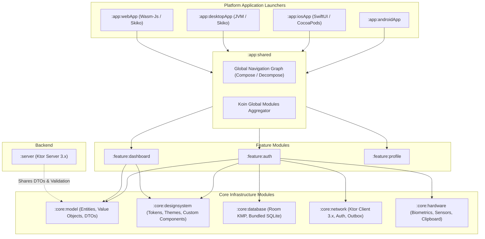
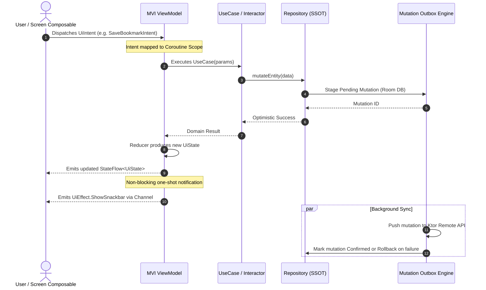
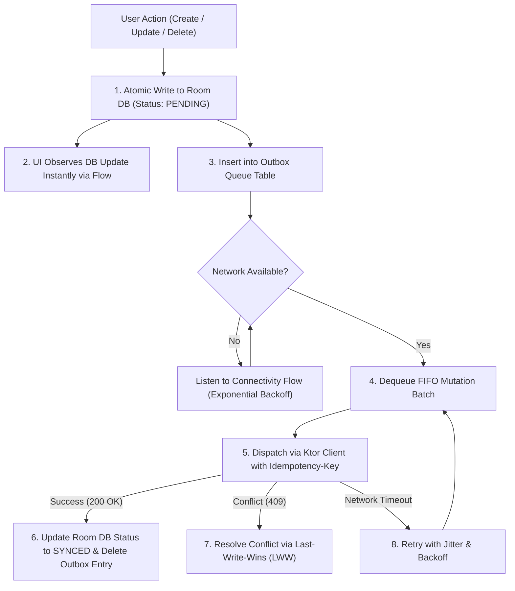
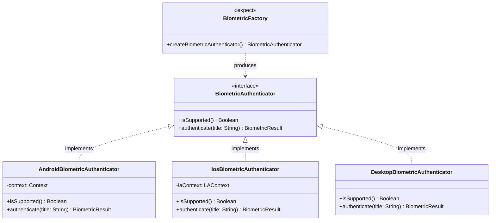
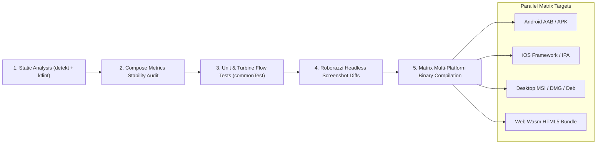

# KMPSkills — System Architecture & Multiplatform Blueprint

[](https://kotlinlang.org)
[](https://www.jetbrains.com/lp/compose-multiplatform/)
[](#high-level-architectural-topology)
[](#target-platforms--entry-points)

---

## Executive Summary

**KMPSkills** is an enterprise-grade architectural blueprint and design system built upon **Kotlin Multiplatform (KMP)** and **Compose Multiplatform (CMP)**. It demonstrates how to structure, build, test, and ship mission-critical software across **Android, iOS, Desktop (macOS/Windows/Linux), Web (Wasm), and Ktor Server** from a unified, zero-duplication codebase.

This document formalizes the architectural contracts, module topology, data flow constraints, memory management models, and design trade-offs governing the entire system.

---

## 1. High-Level Architectural Topology

KMPSkills follows **Hexagonal / Clean Architecture** principles adapted for Kotlin Multiplatform. Business logic remains completely isolated from UI rendering frameworks, database engines, and native OS APIs.

```mermaid
graph TD
    subgraph Presentation ["Presentation Layer (Compose Multiplatform)"]
        UI["Composables / Screens / Widgets"]
        VM["MVI ViewModels / StateFlow"]
        Design["Core Design Tokens / Theming"]
    end

    subgraph Domain ["Domain Layer (Pure Kotlin Multiplatform)"]
        UC["UseCases / Interactors"]
        Models["Domain Entities & Value Objects"]
        Repos["Repository Interfaces (Ports)"]
        Validation["Shared Business Rules & Validators"]
    end

    subgraph Data ["Data Layer (KMP Infrastructure)"]
        RepoImpl["Repository Implementations (Adapters)"]
        LocalDB["Room Multiplatform (Bundled SQLite)"]
        RemoteNet["Ktor Client 3.x (OkHttp / Darwin / CIO / Js)"]
        Outbox["Mutation Outbox Sync Engine"]
        Vault["Secure Keystore / Keychain Vault"]
    end

    subgraph PlatformAdapters ["Hardware & OS Bridges (Interface-Factory Pattern)"]
        HW["expect/actual Hardware Bridges (Biometrics, GPS, Haptics)"]
        NativeOS["Android Services / WorkManager / iOS UIKitView"]
    end

    UI --> VM
    VM --> UC
    UC --> Models
    UC --> Repos
    Repos <|-- RepoImpl
    RepoImpl --> LocalDB
    RepoImpl --> RemoteNet
    RepoImpl --> Outbox
    RepoImpl --> Vault
    RepoImpl --> HW
    HW --> NativeOS
```

### Architectural Axioms
1. **Dependency Inversion**: Dependencies point strictly inwards toward the **Domain Layer**. The Domain contains pure Kotlin code and has zero dependencies on Android, iOS CocoaPods, Compose UI, or native platform libraries.
2. **Single Source of Truth (SSOT)**: Local persistent storage (Room KMP) serves as the sole ground truth for application state. Network operations push changes into local storage; UI observes local storage via Coroutine `Flow`.
3. **Unidirectional Data Flow (UDF / MVI)**: States flow down to the UI via immutable `StateFlow`; user intents flow up to the ViewModel via typed `Intent` actions; transient one-off events are delivered via unbuffered `Channel` effects.

---

## 2. Multi-Module Topology & Layer Boundaries

The codebase is organized into granular, decoupled Gradle modules to maximize build parallelism, enforce encapsulation, and prevent transitive dependency pollution.



### Module Responsibilities

| Module | Platforms | Scope & Responsibilities | Prohibited Dependencies |
| :--- | :--- | :--- | :--- |
| **`:core:model`** | Common (JVM, iOS, Desktop, Wasm, Server) | Plain Kotlin data classes, `@Serializable` DTOs, domain value objects, and shared validation logic. | Compose UI, Android SDK, Ktor Server, Room |
| **`:core:designsystem`** | CMP (Android, iOS, Desktop, Wasm) | Design tokens (Colors, Typography, Elevation, Spacing), Neobrutalist components, Markdown highlighters. | Database, Network, Business UseCases |
| **`:core:database`** | KMP | Room KMP 2.7+ entities, DAOs, cross-platform migrations, and `BundledSQLiteDriver`. | Compose UI, ViewModels |
| **`:core:network`** | KMP | Ktor Client 3.x engine configs (Darwin/OkHttp/CIO/Js), Auth token refresh Mutex, NetworkResult wrapper. | Room DAOs, ViewModels |
| **`:core:hardware`** | KMP | Interface-Factory bridges for Biometrics, GPS, Haptic feedback, and System Clipboard. | Compose UI, Server |
| **`:feature:*`** | CMP | Self-contained user journeys (Auth, Feed, Settings). Owns MVI ViewModels, UI Composables, and feature navigation. | Other feature modules (Enforces isolation) |
| **`:app:shared`** | CMP | Entry point wiring, global Koin DI container assembly, and root Compose Multiplatform scaffold. | None (Aggregator) |
| **`:server`** | JVM | Ktor Server 3.x backend providing REST & WebSocket endpoints, consuming shared models from `:core:model`. | Compose UI, Mobile OS APIs |

---

## 3. Unidirectional Data Flow (MVI State Machine)

Every interactive screen is driven by a strict, contract-first **Model-View-Intent (MVI)** state machine.



### MVI Architectural Contract
```kotlin
// 1. Immutable State (Guaranteed Compose Stability)
@Immutable
data class BookmarkUiState(
    val isLoading: Boolean = false,
    val items: ImmutableList<BookmarkItem> = persistentListOf(),
    val errorMessage: String? = null
)

// 2. User Intent Actions
sealed interface BookmarkUiIntent {
    data class ToggleBookmark(val itemId: String) : BookmarkUiIntent
    data object RefreshRequested : BookmarkUiIntent
    data class FilterCategorySelected(val category: String) : BookmarkUiIntent
}

// 3. One-off Side Effects (Non-state events)
sealed interface BookmarkUiEffect {
    data class ShowToast(val message: String) : BookmarkUiEffect
    data class NavigateToDetail(val itemId: String) : BookmarkUiEffect
}
```

---

## 4. Offline-First Synchronization & Mutation Outbox Engine

The application implements an enterprise **Mutation Outbox Pattern** to provide deterministic offline usability with zero data loss.



### Key Outbox Guarantees
- **Idempotency**: Every outbound mutation generates a deterministic UUID `Idempotency-Key` sent in HTTP headers, preventing duplicate server-side side-effects during network retries.
- **Ordered FIFO Replay**: Dependent mutations (e.g., Create Post -> Add Comment to Post) execute in strict chronological sequence.
- **Crash Safety**: All outbox transactions occur within Room ACID transactions. Even if the OS terminates the process mid-action, uncommitted operations safely resume upon app relaunch.

---

## 5. Native Hardware Bridges: Interface-Factory Pattern

To avoid brittle, tightly coupled `expect class` implementations, KMPSkills enforces the **Interface-Factory Pattern** for native hardware and OS capabilities.



### Architectural Benefits
1. **Mockability**: Domain and Feature ViewModels accept pure interfaces (`BiometricAuthenticator`), allowing unit tests in `commonTest` to substitute mocks or in-memory fakes without native runtime engines.
2. **Graceful Degradation**: On platforms lacking physical hardware (Desktop or Web), the factory returns a no-op fallback implementation rather than throwing runtime unlinked-symbol exceptions.

---

## 6. Kotlin/Native Memory Governance & Swift Interop

Kotlin/Native operates under an **Automatic Reference Counting (ARC)** runtime. Bridging Kotlin coroutines and Swift views introduces retain-cycle hazards if not governed properly.

```mermaid
graph LR
    subgraph SwiftIOS ["Swift / SwiftUI Runtime (ARC)"]
        SwiftView["SwiftUI View"]
        SwiftCoordinator["ObservableObject Coordinator"]
    end

    subgraph BridgeBoundary ["Interop Boundary (SKIE / Objective-C)"]
        WeakRef["Weak Reference / Lifetime Binder"]
    end

    subgraph KotlinNative ["Kotlin/Native Runtime (ARC)"]
        KMPScope["CoroutineScope (SupervisorJob + Dispatchers.Main.immediate)"]
        KMPViewModel["Shared ViewModel / Flow Producer"]
    end

    SwiftView -->|Retains| SwiftCoordinator
    SwiftCoordinator -->|Binds to| WeakRef
    WeakRef -->|Observes| KMPViewModel
    KMPViewModel -->|Owns| KMPScope
    SwiftCoordinator -.->|On View Disappear: onCleared()| KMPViewModel
    KMPViewModel -.->|Cancels Children| KMPScope
```

### Critical Native Safety Rules
- **No Strong Cycles Across Language Boundaries**: Swift closures or listeners held by Kotlin objects must use weak wrappers.
- **Explicit Scope Cancellation**: Every multiplatform ViewModel exposes a lifecycle termination hook (`onCleared()`), invoked by Android `ViewModel.onCleared()`, Desktop window close handlers, and SwiftUI `.onDisappear()`.
- **SKIE Integration**: Coroutine `Flow` streams are exported as native Swift `AsyncSequence` types, allowing native `for await item in viewModel.state` ergonomics without manual callback wrapping.

---

## 7. Performance & Optimization Envelope

| Dimension | Production Standard | Enforcement Mechanism |
| :--- | :--- | :--- |
| **Android Startup Time** | Cold start < 400ms | Android Baseline Profiles generated via Macrobenchmark + R8 Full Mode. |
| **Recomposition Frequency** | Zero non-skipped renders on stable state | Compose Compiler Metrics audit (`-Pplugin:androidx.compose.compiler.plugins.kotlin:reportsDestination=...`). All models use `@Immutable` or `ImmutableList<T>`. |
| **Frame Budgeting** | Zero jank at 120Hz (8.33ms / frame) | Dynamic transforms offloaded to `Modifier.graphicsLayer { ... }` bypass layout and draw phases. |
| **Binary Footprint** | Stripped release binaries | ProGuard/R8 code and resource shrinking, dead-code elimination, and SVG vector asset conversion. |
| **Memory Leak Guard** | Zero activity/view retain cycles | LeakCanary on Android, Instruments Leaks Trace on iOS, and strict Coroutine scope cancellation guards. |

---

## 8. Build & Verification Matrix

Every pull request and release build undergoes strict static and dynamic verification:



For guidelines on authoring and extending this architecture, consult [CONTRIBUTING.md](file:///c:/VPS/KMPSkills/CONTRIBUTING.md).
