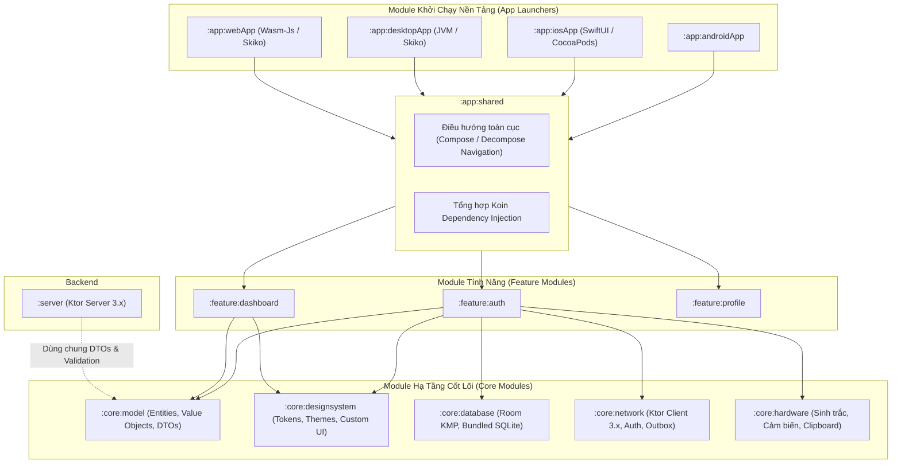
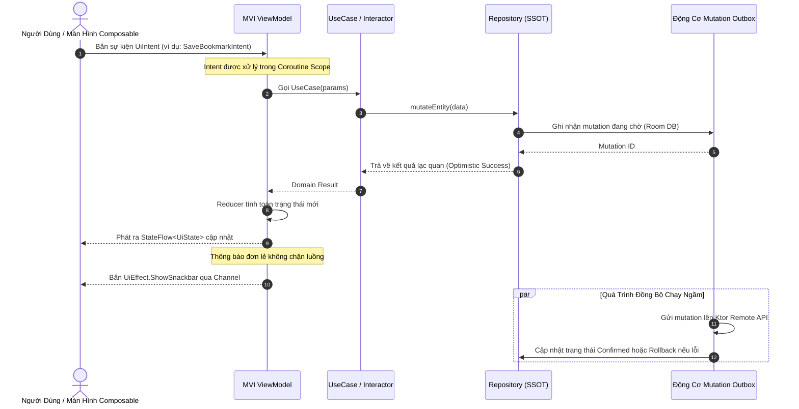
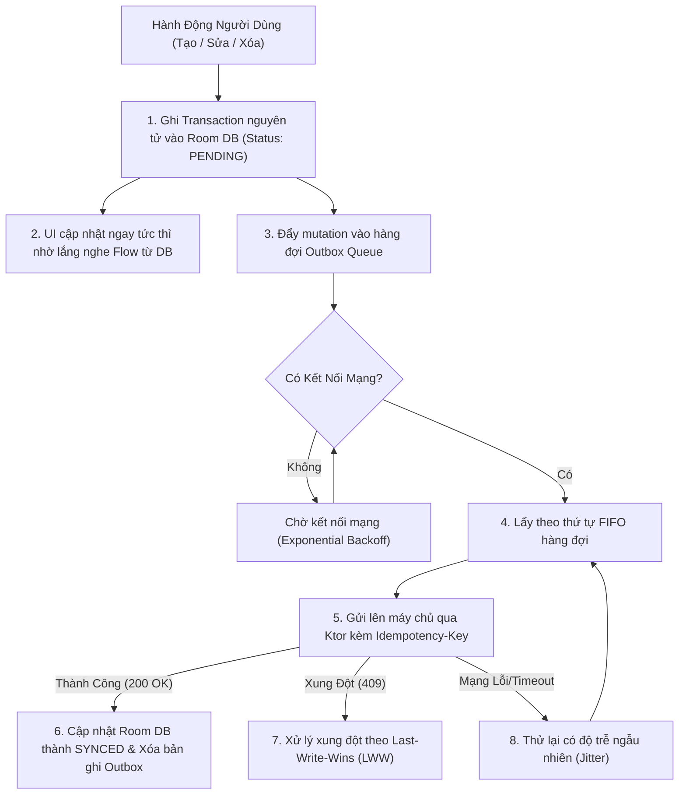
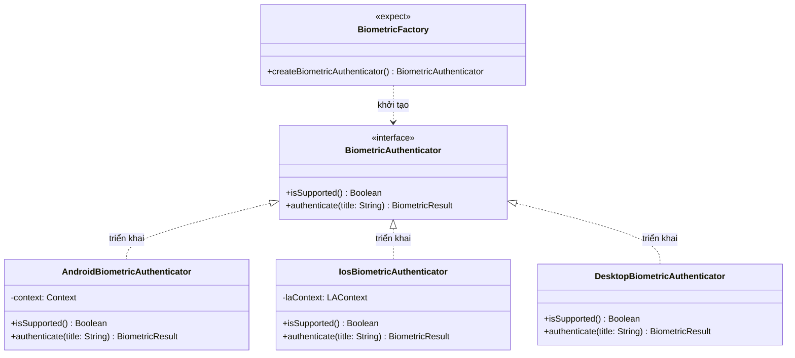
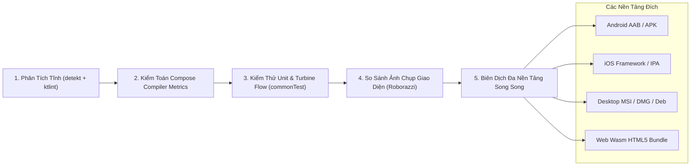

# KMPSkills — Tài Liệu Thiết Kế Kiến Trúc Hệ Thống Đa Nền Tảng

[](https://kotlinlang.org)
[](https://www.jetbrains.com/lp/compose-multiplatform/)
[](#tổng-quan-kiến-trúc-hệ-thống)
[](#nền-tảng-mục-tiêu--điểm-khởi-chạy)

---

## Tóm Tắt Định Hướng (Executive Summary)

**KMPSkills** là bản thiết kế kiến trúc chuẩn doanh nghiệp (Enterprise Architectural Blueprint) và hệ thống thiết kế phần mềm xây dựng trên nền tảng **Kotlin Multiplatform (KMP)** và **Compose Multiplatform (CMP)**. Dự án chứng minh phương pháp tổ chức, xây dựng, kiểm thử tự động và phát hành ứng dụng quy mô lớn đồng thời trên **Android, iOS, Desktop (macOS/Windows/Linux), Web (Wasm), và Ktor Server** từ một mã nguồn hợp nhất, không trùng lặp (Zero Duplication).

Tài liệu này chuẩn hóa toàn bộ các giao ước kiến trúc (Architectural Contracts), phân bổ module, luồng dữ liệu đơn hướng (UDF), cơ chế quản lý bộ nhớ, cùng các tiêu chuẩn kỹ thuật áp dụng cho toàn hệ thống.

---

## 1. Tổng Quan Kiến Trúc Hệ Thống (Architectural Topology)

KMPSkills tuân thủ triệt để mô hình **Kiến trúc Lục giác (Hexagonal Architecture) kết hợp Clean Architecture**, được tối ưu riêng cho đặc thù đa nền tảng của Kotlin Multiplatform. Logic nghiệp vụ (Business Rules) hoàn toàn tách biệt khỏi framework giao diện người dùng, cơ sở dữ liệu và các API hệ điều hành gốc.

```mermaid
graph TD
    subgraph Presentation ["Tầng Hiển Thị (Presentation Layer - Compose Multiplatform)"]
        UI["Composables / Màn hình / UI Components"]
        VM["MVI ViewModels / StateFlow"]
        Design["Core Design Tokens / Hệ thống Theme"]
    end

    subgraph Domain ["Tầng Nghiệp Vụ (Domain Layer - Pure Kotlin Multiplatform)"]
        UC["UseCases / Interactors"]
        Models["Domain Entities & Value Objects"]
        Repos["Giao diện Repository (Ports)"]
        Validation["Quy tắc nghiệp vụ dùng chung (Validators)"]
    end

    subgraph Data ["Tầng Dữ Liệu (Data Layer - KMP Infrastructure)"]
        RepoImpl["Triển khai Repository (Adapters)"]
        LocalDB["Room Multiplatform (Bundled SQLite)"]
        RemoteNet["Ktor Client 3.x (OkHttp / Darwin / CIO / Js)"]
        Outbox["Động cơ đồng bộ Mutation Outbox"]
        Vault["Secure Keystore / Keychain Vault"]
    end

    subgraph PlatformAdapters ["Cầu Nối Phần Cứng & OS (Interface-Factory Pattern)"]
        HW["expect/actual Hardware Bridges (Sinh trắc học, GPS, Haptic)"]
        NativeOS["Android Services / WorkManager / iOS UIKitView"]
    end

    UI --> VM
    VM --> UC
    UC --> Models
    UC --> Repos
    Repos <|-- RepoImpl
    RepoImpl --> LocalDB
    RepoImpl --> RemoteNet
    RepoImpl --> Outbox
    RepoImpl --> Vault
    RepoImpl --> HW
    HW --> NativeOS
```

### Các Nguyên Tắc Kiến Trúc Cốt Lõi
1. **Đảo Ngược Phụ Thuộc (Dependency Inversion)**: Các luồng phụ thuộc luôn hướng vào trong về phía **Domain Layer**. Tầng Domain chỉ chứa mã nguồn Kotlin thuần khiết (Pure Kotlin), không phụ thuộc vào Android SDK, CocoaPods của iOS, thư viện giao diện Compose UI hay bất kỳ API native nào.
2. **Nguồn Chân Lý Duy Nhất (Single Source of Truth - SSOT)**: Cơ sở dữ liệu lưu trữ cục bộ (Room KMP) đóng vai trò là nguồn dữ liệu chuẩn duy nhất. Các thao tác mạng chỉ cập nhật dữ liệu vào kho lưu trữ nội bộ; giao diện người dùng sẽ lắng nghe (observe) dữ liệu nội bộ thông qua Coroutines `Flow`.
3. **Luồng Dữ Liệu Đơn Hướng (Unidirectional Data Flow - UDF / MVI)**: Trạng thái (State) chảy xuống UI qua luồng bất biến `StateFlow`; ý định người dùng (User Intents) gửi lên ViewModel dưới dạng các `Intent` kiểu tĩnh; các sự kiện dùng một lần (One-off Events) được truyền phát qua `Channel` không lưu đệm.

---

## 2. Phân Tách Module & Ranh Giới Trách Nhiệm

Dự án được phân chia thành các Gradle module chuyên biệt nhằm tối ưu tốc độ biên dịch song song, đảm bảo tính đóng gói (encapsulation) và ngăn chặn việc ô nhiễm phụ thuộc chéo.



### Bảng Phân Quyền & Ranh Giới Giữa Các Module

| Module | Nền Tảng Áp Dụng | Phạm Vi & Trách Nhiệm | Phụ Thuộc Bị Cấm (Prohibited) |
| :--- | :--- | :--- | :--- |
| **`:core:model`** | Toàn bộ (JVM, iOS, Desktop, Wasm, Server) | Chứa các data classes thuần Kotlin, `@Serializable` DTOs, domain value objects, và logic kiểm tra tính hợp lệ (validation). | Compose UI, Android SDK, Ktor Server, Room |
| **`:core:designsystem`** | CMP (Android, iOS, Desktop, Wasm) | Design tokens (Màu sắc, Typography, Độ cao đổ bóng, Spacing), Neobrutalism widgets, bộ render Markdown. | Cơ sở dữ liệu, Network client, Business UseCases |
| **`:core:database`** | KMP | Room KMP 2.7+ entities, DAOs, cross-platform migrations, cấu hình `BundledSQLiteDriver`. | Compose UI, ViewModels |
| **`:core:network`** | KMP | Ktor Client 3.x engines (Darwin/OkHttp/CIO/Js), Mutex cấp lại token không gây race condition, wrapper `NetworkResult`. | Room DAOs, ViewModels |
| **`:core:hardware`** | KMP | Interface-Factory pattern cho cảm biến sinh trắc học, GPS, phản hồi xúc giác rung (Haptic), và Clipboard hệ thống. | Compose UI, Server |
| **`:feature:*`** | CMP | Chứa các luồng người dùng khép kín (Auth, Dashboard, Profile). Sở hữu ViewModels MVI, Composables, và đồ thị điều hướng nội bộ. | Không được phụ thuộc trực tiếp vào `:feature:*` khác |
| **`:app:shared`** | CMP | Điểm ghép nối toàn cục, khởi tạo container Koin DI và khung sườn điều hướng cấp ứng dụng. | Không (Là module tổng hợp) |
| **`:server`** | JVM | Máy chủ Ktor Server 3.x cung cấp REST API & WebSocket, tiêu thụ trực tiếp các DTO từ `:core:model`. | Compose UI, Mobile OS APIs |

---

## 3. Luồng Dữ Liệu Đơn Hướng (MVI State Machine)

Mọi màn hình giao diện tương tác đều vận hành dựa trên máy trạng thái hữu hạn **Model-View-Intent (MVI)** với hợp đồng kiểu dữ liệu rõ ràng.



### Hợp Đồng Kiến Trúc MVI Mẫu
```kotlin
// 1. Trạng thái bất biến (Đảm bảo độ ổn định cho Compose Compiler)
@Immutable
data class BookmarkUiState(
    val isLoading: Boolean = false,
    val items: ImmutableList<BookmarkItem> = persistentListOf(),
    val errorMessage: String? = null
)

// 2. Ý định người dùng (User Intents)
sealed interface BookmarkUiIntent {
    data class ToggleBookmark(val itemId: String) : BookmarkUiIntent
    data object RefreshRequested : BookmarkUiIntent
    data class FilterCategorySelected(val category: String) : BookmarkUiIntent
}

// 3. Hiệu ứng một lần (Side Effects không lưu trạng thái)
sealed interface BookmarkUiEffect {
    data class ShowToast(val message: String) : BookmarkUiEffect
    data class NavigateToDetail(val itemId: String) : BookmarkUiEffect
}
```

---

## 4. Kiến Trúc Offline-First & Động Cơ Mutation Outbox

Hệ thống triển khai mẫu thiết kế **Mutation Outbox Pattern** chuẩn công nghiệp nhằm đem lại trải nghiệm ngoại tuyến tuyệt đối và không bao giờ mất mát dữ liệu của người dùng.



### Các Cam Kết Chất Lượng Của Outbox
- **Tính Bất Biến Lặp (Idempotency)**: Mỗi lệnh thay đổi gửi đi đều gắn kèm UUID `Idempotency-Key` trong HTTP Header, giúp ngăn chặn việc nhân bản hành động trên server khi có thử lại mạng.
- **Tuần Tự Tuyệt Đối (Ordered FIFO Replay)**: Các tác vụ phụ thuộc lẫn nhau (ví dụ: Tạo bài viết -> Bình luận vào bài viết) luôn được thực thi theo đúng thứ tự thời gian gốc.
- **An Toàn Khi Ứng Dụng Đột Ngột Tắt (Crash Safety)**: Mọi thao tác outbox diễn ra trong transaction ACID của Room DB. Nếu hệ điều hành buộc dừng tiến trình giữa chừng, dữ liệu chưa gửi sẽ được tự động phục hồi và tiếp tục gửi lại khi mở lại app.

---

## 5. Cầu Nối Phần Cứng Native: Mẫu Interface-Factory

Để tránh sự ràng buộc lỏng lẻo và khó kiểm thử của `expect class`, KMPSkills áp dụng tiêu chuẩn **Interface-Factory Pattern** cho toàn bộ các tương tác phần cứng và API hệ điều hành.



### Lợi Ích Vượt Trội Của Thiết Kế Này
1. **Khả Năng Viết Test Tuyệt Đối (Mockability)**: Domain và ViewModel chỉ phụ thuộc vào interface trừu tượng (`BiometricAuthenticator`), cho phép viết unit test trong `commonTest` với các Mock hoặc Fake class mà không cần nạp bất kỳ thư viện native nào.
2. **Suy Thoái Dịu Dàng (Graceful Degradation)**: Trên các nền tảng không hỗ trợ phần cứng (ví dụ: Desktop hoặc Web không có cảm biến vân tay), Factory sẽ trả về một triển khai No-Op an toàn thay vì ném lỗi thiếu ký hiệu liên kết (Unlinked Symbol Exception).

---

## 6. Cơ Chế Quản Lý Bộ Nhớ Kotlin/Native & Tương Tác Swift

Kotlin/Native hoạt động dựa trên cơ chế gom rác đếm tham chiếu tự động **Automatic Reference Counting (ARC)**. Việc bắc cầu giữa Kotlin Coroutines và giao diện SwiftUI rất dễ dẫn đến rò rỉ bộ nhớ (Retain Cycles) nếu không được giám sát chặt chẽ.

```mermaid
graph LR
    subgraph SwiftIOS ["Môi Trường Swift / SwiftUI (ARC)"]
        SwiftView["SwiftUI View"]
        SwiftCoordinator["ObservableObject Coordinator"]
    end

    subgraph BridgeBoundary ["Ranh Giới Liên Kết (SKIE / Objective-C)"]
        WeakRef["Tham Chiếu Yếu (Weak Reference / Lifetime Binder)"]
    end

    subgraph KotlinNative ["Môi Trường Kotlin/Native (ARC)"]
        KMPScope["CoroutineScope (SupervisorJob + Dispatchers.Main.immediate)"]
        KMPViewModel["Shared ViewModel / Flow Producer"]
    end

    SwiftView -->|Nắm giữ| SwiftCoordinator
    SwiftCoordinator -->|Gắn kết| WeakRef
    WeakRef -->|Quan sát| KMPViewModel
    KMPViewModel -->|Sở hữu| KMPScope
    SwiftCoordinator -.->|Khi View Biến Mất: gọi onCleared()| KMPViewModel
    KMPViewModel -.->|Hủy toàn bộ Coroutines con| KMPScope
```

### Các Quy Tắc An Toàn Bộ Nhớ Tối Thượng
- **Không Tạo Vòng Lặp Tham Chiếu Mạnh (Strong Cycles)**: Bất kỳ closure hoặc listener nào từ Swift được truyền sang Kotlin phải được bọc trong các cấu trúc tham chiếu yếu (Weak Reference).
- **Hủy Scope Tường Minh**: Mọi ViewModel đa nền tảng đều cung cấp hàm giải phóng vòng đời `onCleared()`, được gọi tự động bởi `ViewModel.onCleared()` trên Android, sự kiện đóng cửa sổ trên Desktop và `.onDisappear()` trên SwiftUI.
- **Tích Hợp SKIE**: Các luồng Coroutine `Flow` được chuyển đổi sang kiểu `AsyncSequence` nguyên bản của Swift, giúp lập trình viên iOS dùng cú pháp tự nhiên `for await item in viewModel.state` mà không bị rò rỉ callback.

---

## 7. Bộ Tiêu Chuẩn Hiệu Năng & Tối Ưu Hóa (Performance Envelope)

| Chỉ Số Kỹ Thuật | Chuẩn Doanh Nghiệp Đạt Được | Cơ Chế Đảm Bảo |
| :--- | :--- | :--- |
| **Tốc Độ Khởi Động Android** | Cold start < 400ms | Tạo Baseline Profiles tự động với Macrobenchmark + kích hoạt R8 Full Mode. |
| **Tần Suất Recomposition** | 0 lần vẽ thừa đối với State không đổi | Kiểm toán tự động qua Compose Compiler Metrics. Sử dụng `@Immutable` và `ImmutableList<T>`. |
| **Tốc Độ Khung Hình** | Đạt 120Hz mượt mà (8.33ms / frame) | Chuyển toàn bộ các phép biến đổi hoạt ảnh sang `Modifier.graphicsLayer { ... }` để bỏ qua giai đoạn layout/draw. |
| **Dung Lượng Ứng Dụng (Size)** | Tối ưu kích thước file đóng gói | R8/ProGuard loại bỏ code chết (Tree-shaking) và chuyển đổi toàn bộ icon sang vector SVG. |
| **Chống Rò Rỉ Bộ Nhớ** | Không tồn tại vòng giữ Activity / View | Tích hợp LeakCanary trên Android, Instruments Leaks Trace trên iOS và dọn dẹp CoroutineScope chặt chẽ. |

---

## 8. Ma Trận Tự Động Hóa CI/CD & Kiểm Định Chất Lượng

Toàn bộ các đóng góp và bản phát hành đều phải vượt qua cổng kiểm tra nghiêm ngặt:



Để tìm hiểu quy trình đóng góp và mở rộng hệ thống, vui lòng tham khảo [CONTRIBUTING.vi.md](file:///c:/VPS/KMPSkills/CONTRIBUTING.vi.md).
