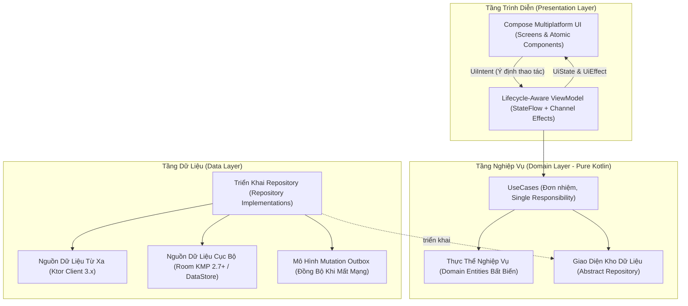

# 💎 KMPSkills: Hệ Sinh Thái Kiến Trúc Kotlin Multiplatform & Android Doanh Nghiệp

<p align="center">
  
  
  
  
  
  
  
  
</p>

---

<p align="center">
  <a href="README.md">English</a> | <b>Tiếng Việt</b> | <a href="curriculum/README.md">🎓 Giáo Trình 10 Cấp Độ</a> | <a href="ARCHITECTURE.vi.md">Thiết Kế Kiến Trúc</a> | <a href="CONTRIBUTING.vi.md">Hướng Dẫn Đóng Góp</a>
</p>

---

## 🌟 Tổng Quan Chiến Lược

**KMPSkills** là kho tàng tri thức kỹ thuật và bộ công cụ kỹ năng AI (Antigravity Skills Suite) toàn diện, đồ sộ nhất dành riêng cho phát triển ứng dụng **Kotlin Multiplatform (KMP/CMP)** và **Android Native** quy mô lớn.

Dự án được xây dựng dựa trên tiêu chuẩn kép khắt khe:
1. **Kiến Trúc Sư Hệ Thống / Di Động Trưởng (Principal Mobile & Systems Architect):** Áp dụng triệt để Clean Architecture kết hợp Feature-First Domain-Driven Design (DDD), phân tầng topological sourceSets, an toàn bộ nhớ tuyệt đối (chống Retain Cycle trong Kotlin/Native ARC), tối ưu recomposition 120Hz và build không cảnh báo (zero-warning builds).
2. **Kỹ Sư Prompt Cấp Cao (Senior AI Prompt Developer):** Hệ thống Frontmatter YAML với bộ lọc triggers chính xác 100% (`Use this skill whenever` vs `Do NOT use when`), code mẫu hoàn chỉnh 100% compile-ready (không placeholder/TODO nửa vời), sơ đồ trực quan Mermaid và hướng dẫn phòng chống lỗi (anti-patterns).

Kho lưu trữ này cung cấp **27 Siêu Skills thực chiến** bao phủ từ Mobile, Desktop, Web Wasm cho đến Backend Ktor Server.

> 🎓 **Giáo Trình Đào Tạo Thực Chiến**: Bạn muốn học bài bản từ Zero đến Master Architect? Khám phá ngay [**Bộ Giáo Trình 10 Cấp Độ Android & KMP**](curriculum/README.md).
>
> 📖 **Khám Phá Chi Tiết**: Để tra cứu chi tiết phân bổ module, ranh giới phụ thuộc và cơ chế quản lý bộ nhớ, vui lòng xem tài liệu [ARCHITECTURE.vi.md](ARCHITECTURE.vi.md).

---

## ⚡ Cài Đặt Tức Thì Vào MỌI Dự Án (`npx kmp-skills`)

Bạn có thể trang bị toàn bộ 27 Siêu Kỹ Năng và quy tắc kiến trúc KMPSkills vào **BẤT KỲ** dự án Android Native hoặc Kotlin Multiplatform nào chỉ trong chưa đầy 10 giây:

```bash
# Chạy trực tiếp tại thư mục gốc của dự án:
npx kmp-skills init
```

Công cụ CLI sẽ tự động quét cấu hình dự án và thiết lập tương thích:
- **Cursor IDE**: Tự động sinh `.cursor/rules/*.mdc` với cơ chế kích hoạt thông minh theo file (`**/*ViewModel.kt`, `**/*Dao.kt`, v.v.).
- **Android Studio & VS Code**: Sinh `.github/copilot-instructions.md` phục vụ GitHub Copilot và Google Gemini Code Assist.
- **Claude Code CLI & Windsurf**: Tự động sinh `CLAUDE.md` và `.windsurfrules`.
- **Google Antigravity**: Đồng bộ 27 kỹ năng vào thư mục toàn cục `~/.gemini/config/skills/kmp-*`.

Để chẩn đoán sức khỏe kiến trúc dự án hiện tại, hãy chạy:
```bash
npx kmp-skills doctor
```

Xem hướng dẫn chi tiết các tùy chọn CLI tại [`packages/cli`](packages/cli).

---

## 🧩 Plugin Cài Đặt Trực Tiếp Cho Android Studio (`KMPSkills Assistant`)

Nếu bạn muốn có giao diện đồ họa GUI trực quan ngay bên trong Android Studio, hãy cài đặt plugin **KMPSkills Assistant**:

1. Trong Android Studio, vào **Settings > Plugins > ⚙️ > Install Plugin from Disk...**
2. Chọn file zip đã được biên dịch sẵn:
   ```text
   plugins/android-studio/build/distributions/kmpskills-android-studio-plugin-1.0.0.zip
   ```
3. Bấm **Apply** và **Restart IDE**.

**Các Tính Năng Tích Hợp Sẵn**:
- **Cửa Sổ Sidebar Tool Window**: Tra cứu nhanh 27 Skills, đọc giáo trình 10 cấp độ, và nút bấm 1-click nạp AI context vào project.
- **Menu Chuột Phải Sinh Mã Tự Động**: `KMPSkills > New MVI Feature Screen...` (State, Intent, Effect, ViewModel, Screen) và `New Room KMP Entity & DAO...`.
- **Bộ Kiểm Toán Kiến Trúc**: `Tools > KMPSkills > Run Architecture Doctor` kiểm tra tự động `libs.versions.toml`.

Xem hướng dẫn chi tiết và cách tùy biến tại [`plugins/android-studio`](plugins/android-studio).

---

## 🏛️ Sơ Đồ Kiến Trúc Tổng Thể

Dự án tuân thủ nghiêm ngặt **Kiến trúc Clean Architecture** phối hợp cùng **Mô hình Dữ liệu Đơn Luồng (Unidirectional Data Flow - MVI)**:



---

## 📚 Danh Mục 27 Siêu Skills Doanh Nghiệp

Toàn bộ 27 kỹ năng được phân chia khoa học thành 10 phân hệ nghiệp vụ. Nhấp vào tên từng skill để xem chi tiết mã nguồn và hướng dẫn thực thi:

### Phân Hệ 1: Kiến Trúc Cốt Lõi & Kỹ Thuật Build
| Định Danh Skill | Nghiệp Vụ & Ngăn Xếp Công Nghệ | Tài Liệu Chi Tiết |
|---|---|---|
| **`kmp-architecture-foundation`** | Clean Architecture + Feature-First DDD; Phân chia 3 tầng; Topological sourceSets; Quy tắc chống rò rỉ Activity Context & Memory Leaks. | [Xem SKILL.md](./skills/kmp-architecture-foundation/SKILL.md) |
| **`kmp-gradle-version-catalog`** | Master `libs.versions.toml`; Type-Safe Project Accessors; Tối ưu `gradle.properties` tăng tốc độ build x4 lần. | [Xem SKILL.md](./skills/kmp-gradle-version-catalog/SKILL.md) |
| **`kmp-dependency-injection-koin`** | Koin 4.x Multiplatform; Khởi tạo đa nền tảng (Android, iOS Swift, Desktop, Wasm); `expect/actual` platform modules; CMP `koinViewModel()`. | [Xem SKILL.md](./skills/kmp-dependency-injection-koin/SKILL.md) |

### Phân Hệ 2: Động Cơ Giao Diện & Compose Multiplatform
| Định Danh Skill | Nghiệp Vụ & Ngăn Xếp Công Nghệ | Tài Liệu Chi Tiết |
|---|---|---|
| **`kmp-compose-multiplatform-ui`** | Phân tầng Atomic Design (Atoms, Molecules, Organisms); Slot APIs; Tải và cache ảnh đa nền tảng với **Coil 3.x**; Chuẩn Skiko Retina HiDPI. | [Xem SKILL.md](./skills/kmp-compose-multiplatform-ui/SKILL.md) |
| **`kmp-design-tokens-theme-engine`** | Bộ Design Tokens bất biến (Colors, Typography, Spacing 8pt, Borders); Cầu nối Material 3 + Custom Tokens; Phong cách **Neobrutalism** viền đậm bóng cứng. | [Xem SKILL.md](./skills/kmp-design-tokens-theme-engine/SKILL.md) |
| **`kmp-adaptive-responsive-layouts`** | Phân loại `WindowSizeClass` (Compact, Medium, Expanded); Hoán đổi điều hướng (BottomBar ➔ NavRail ➔ Drawer); List-Detail Two-Pane. | [Xem SKILL.md](./skills/kmp-adaptive-responsive-layouts/SKILL.md) |
| **`kmp-animation-motion-graphics`** | Triết lý Zero-Jank 120Hz (`Modifier.graphicsLayer`); **Shared Element Transitions** trên CMP; Lò xo vật lý (Spring bounce); Shimmer loading skeleton. | [Xem SKILL.md](./skills/kmp-animation-motion-graphics/SKILL.md) |

### Phân Hệ 3: Điều Hướng & Quản Lý Trạng Thái
| Định Danh Skill | Nghiệp Vụ & Ngăn Xếp Công Nghệ | Tài Liệu Chi Tiết |
|---|---|---|
| **`kmp-navigation-compose-stack`** | Type-safe Navigation Compose KMP (với `@Serializable` routes); Nested subgraphs (Auth vs Main); Giữ nguyên scroll & backstack bottom tab; Deep-links. | [Xem SKILL.md](./skills/kmp-navigation-compose-stack/SKILL.md) |
| **`kmp-mvi-stateflow-architecture`** | Model-View-Intent (MVI) & UDF; `BaseViewModel` KMP; Phân lập `UiState` bất biến vs `UiEffect` Channel (chống kích hoạt trùng lặp khi recomposition). | [Xem SKILL.md](./skills/kmp-mvi-stateflow-architecture/SKILL.md) |
| **`kmp-decompose-retained-lifecycle`** | Decompose 3.x; Phân lập logic điều hướng độc lập khỏi UI; Giữ state sống qua process death (`StateKeeper`) và xoay màn hình (`InstanceKeeper`). | [Xem SKILL.md](./skills/kmp-decompose-retained-lifecycle/SKILL.md) |

### Phân Hệ 4: Dữ Liệu & Lưu Trữ Ngoại Tuyến (Offline-First)
| Định Danh Skill | Nghiệp Vụ & Ngăn Xếp Công Nghệ | Tài Liệu Chi Tiết |
|---|---|---|
| **`kmp-offline-room-database`** | Room KMP 2.7+ chính thức; `BundledSQLiteDriver` (Android, iOS, Desktop, Web); `@ConstructedBy` compiler bridge; Reactive Flow DAOs; Schema migrations. | [Xem SKILL.md](./skills/kmp-offline-room-database/SKILL.md) |
| **`kmp-datastore-preferences-security`** | Kiến trúc 2 tầng: DataStore Preferences cho settings phản ứng qua Flow + **SecureStorage Vault** phần cứng (Android KeyStore AES-GCM & iOS Keychain). | [Xem SKILL.md](./skills/kmp-datastore-preferences-security/SKILL.md) |
| **`kmp-offline-sync-engine`** | Local-First Optimistic UI; **Mutation Outbox Pattern** với bảng hàng đợi `sync_mutations` chuẩn FIFO; Thuật toán giải quyết xung đột Last-Write-Wins (LWW). | [Xem SKILL.md](./skills/kmp-offline-sync-engine/SKILL.md) |

### Phân Hệ 5: Mạng & Giao Tiếp Thời Gian Thực (Real-Time)
| Định Danh Skill | Nghiệp Vụ & Ngăn Xếp Công Nghệ | Tài Liệu Chi Tiết |
|---|---|---|
| **`kmp-ktor-network-client`** | Ktor Client 3.x (OkHttp, Darwin, CIO, Js); **Silent Token Refresh** tự động phòng chống lỗi song song với Mutex; Masked logging; `safeApiCall<T>` wrapper. | [Xem SKILL.md](./skills/kmp-ktor-network-client/SKILL.md) |
| **`kmp-websocket-sse-realtime`** | State Machine kết nối tự phục hồi; Heartbeat Ping 15s giữ ấm NAT carrier; Tự động reconnect với Exponential Backoff & Jitter; Server-Sent Events (SSE). | [Xem SKILL.md](./skills/kmp-websocket-sse-realtime/SKILL.md) |

### Phân Hệ 6: Cầu Nối Phần Cứng & Khả Năng Gốc Nền Tảng
| Định Danh Skill | Nghiệp Vụ & Ngăn Xếp Công Nghệ | Tài Liệu Chi Tiết |
|---|---|---|
| **`kmp-expect-actual-hardware-interop`** | Mô hình Interface-Factory: Sinh trắc học Biometrics (Face ID/Fingerprint), Định vị GPS, Rung xúc giác Haptics, Clipboard hệ thống; Ma trận permissions OS. | [Xem SKILL.md](./skills/kmp-expect-actual-hardware-interop/SKILL.md) |
| **`kmp-android-native-system-services`** | Chuyên sâu Android SDK 34 - 36: **Foreground Service** (`dataSync`), ongoing notification; **WorkManager** chạy ngầm định kỳ; Android 15 Edge-to-Edge. | [Xem SKILL.md](./skills/kmp-android-native-system-services/SKILL.md) |
| **`kmp-ios-swiftui-interop`** | Cầu nối 2 chiều: Nhúng Compose vào SwiftUI (`ComposeUIViewController`), nhúng native UIKit view (`MKMapView`) vào Compose (`UIKitView`); SKIE Swift coroutines. | [Xem SKILL.md](./skills/kmp-ios-swiftui-interop/SKILL.md) |

### Phân Hệ 7: Tối Ưu Hiệu Năng & Quản Trị Bộ Nhớ
| Định Danh Skill | Nghiệp Vụ & Ngăn Xếp Công Nghệ | Tài Liệu Chi Tiết |
|---|---|---|
| **`kmp-compose-compiler-recomposition-optimization`** | Compose Stability inference; Khắc phục List re-render bằng `ImmutableList` & `@Immutable`; Bật Compose Compiler Metrics; Giảm giật lag với `derivedStateOf`. | [Xem SKILL.md](./skills/kmp-compose-compiler-recomposition-optimization/SKILL.md) |
| **`kmp-memory-leak-profiling`** | JVM GC vs Kotlin/Native ARC; Phá vỡ **Retain Cycles** trên iOS bằng `WeakReference`; Tích hợp LeakCanary; Hủy Coroutine Scope an toàn với `DisposableEffect`. | [Xem SKILL.md](./skills/kmp-memory-leak-profiling/SKILL.md) |
| **`kmp-baseline-profiles-r8-shrinking`** | Khởi động app lạnh dưới 400ms bằng **Baseline Profiles** (Macrobenchmark); Bộ quy tắc R8/ProGuard tối ưu cho Ktor, Room, Koin thu nhỏ APK/AAB tối đa. | [Xem SKILL.md](./skills/kmp-baseline-profiles-r8-shrinking/SKILL.md) |

### Phân Hệ 8: Đảm Bảo Chất Lượng & Kiểm Thử Tự Động
| Định Danh Skill | Nghiệp Vụ & Ngăn Xếp Công Nghệ | Tài Liệu Chi Tiết |
|---|---|---|
| **`kmp-testing-mocking-turbines`** | Unit test bất đồng bộ trong `commonTest`; Kiểm thử Flow bằng **CashApp Turbine**; Mocking an toàn trên iOS với **Mockative**; In-Memory Test Fakes. | [Xem SKILL.md](./skills/kmp-testing-mocking-turbines/SKILL.md) |
| **`kmp-compose-ui-screenshot-testing`** | Kiểm thử hồi quy giao diện tự động không cần emulator bằng **Roborazzi**; Ma trận test Light/Dark Theme & Font Scaling; Chặn PR trên CI/CD nếu lệch pixel. | [Xem SKILL.md](./skills/kmp-compose-ui-screenshot-testing/SKILL.md) |

### Phân Hệ 9: Tự Động Hóa CI/CD & Phân Phối Cửa Hàng
| Định Danh Skill | Nghiệp Vụ & Ngăn Xếp Công Nghệ | Tài Liệu Chi Tiết |
|---|---|---|
| **`kmp-ci-cd-matrix-automation`** | Pipeline GitHub Actions đa nền tảng tối ưu chi phí (Linux cho Android/Wasm, macOS cho iOS XCFramework); Quality Gate kiểm tra ktlint & Detekt. | [Xem SKILL.md](./skills/kmp-ci-cd-matrix-automation/SKILL.md) |
| **`kmp-multiplatform-packaging-distribution`** | Ký số Google Play (AAB), TestFlight (Fastlane `match` + `gym`), macOS Notarization qua `notarytool` (vượt qua Gatekeeper), Native Desktop Installers (MSI, DMG, Deb). | [Xem SKILL.md](./skills/kmp-multiplatform-packaging-distribution/SKILL.md) |

### Phân Hệ 10: Full-Stack Ktor & Giao Diện Điều Khiển Từ Máy Chủ
| Định Danh Skill | Nghiệp Vụ & Ngăn Xếp Công Nghệ | Tài Liệu Chi Tiết |
|---|---|---|
| **`kmp-ktor-fullstack-shared-models`** | Full-Stack Kotlin đồng nhất: Dùng chung DTOs `@Serializable`, Shared Validation Logic và Type-safe Resources giữa Ktor Server (`/server`) và CMP Client (`/app/shared`). | [Xem SKILL.md](./skills/kmp-ktor-fullstack-shared-models/SKILL.md) |
| **`kmp-server-driven-ui-engine`** | Động cơ Server-Driven UI (SDUI); Phân tích cây component JSON đa hình (`@JsonClassDiscriminator`); Render widget linh hoạt; Tự động xử lý fallback an toàn. | [Xem SKILL.md](./skills/kmp-server-driven-ui-engine/SKILL.md) |

---

## 🗂️ Cấu Trúc Thư Mục Dự Án

```text
KMPSkills/
├── .github/workflows/                 # Tự động hóa CI/CD (Lint, Tests, Release Matrix)
├── app/
│   ├── androidApp/                    # Điểm khởi chạy Android (MainActivity, Manifest)
│   ├── iosApp/                        # Điểm khởi chạy iOS Xcode (SwiftUI App, Info.plist)
│   ├── desktopApp/                    # Điểm khởi chạy Desktop JVM (Main.kt)
│   ├── webApp/                        # Điểm khởi chạy Web Wasm/JS (main.kt, index.html)
│   └── shared/                        # Mã nguồn giao diện và tính năng Compose Multiplatform
│       └── src/
│           ├── commonMain/            # Code dùng chung (ViewModels, Navigation, UI Kit)
│           ├── androidMain/           # Triển khai cầu nối Android & SDK drivers
│           ├── iosMain/               # Triển khai cầu nối iOS UIKit & Darwin drivers
│           ├── jvmMain/               # Triển khai cầu nối Desktop Skiko/AWT
│           └── wasmJsMain/            # Tương tác trình duyệt Web Canvas & DOM
├── core/                              # Nền tảng Nghiệp vụ & Dữ liệu cốt lõi (KMP)
│   └── src/commonMain/kotlin/         # Entities, UseCases, Room DB, Ktor Client, Outbox
├── server/                            # Ứng dụng máy chủ Backend Ktor 3.x
├── gradle/
│   └── libs.versions.toml             # Danh mục phiên bản tập trung (Dependencies & Plugins)
└── skills/                            # Hệ thống 27 Siêu Skills Doanh Nghiệp
    ├── kmp-architecture-foundation/
    ├── kmp-compose-multiplatform-ui/
    ├── kmp-offline-room-database/
    └── ... (đầy đủ 27 kỹ năng)
```

---

## 💻 Hướng Dẫn Nhanh: Khởi Chạy & Kiểm Thử

### Khởi Chạy Ứng Dụng
```bash
# Chạy ứng dụng Android (Debug)
./gradlew :app:androidApp:assembleDebug

# Chạy ứng dụng Desktop (Hot Reload)
./gradlew :app:desktopApp:hotRun --auto

# Chạy ứng dụng Desktop (Chế độ thường)
./gradlew :app:desktopApp:run

# Chạy ứng dụng Web Wasm (Trình duyệt hiện đại)
./gradlew :app:webApp:wasmJsBrowserDevelopmentRun

# Chạy máy chủ Backend Ktor
./gradlew :server:run

# Chạy ứng dụng iOS: Mở thư mục 'app/iosApp' trong Xcode và Run
```

### Chạy Bộ Kiểm Thử Tự Động
```bash
# Chạy Unit Tests chung và Android Host
./gradlew :app:shared:testAndroidHostTest

# Chạy Unit Tests Desktop JVM
./gradlew :app:shared:jvmTest

# Chạy Unit Tests iOS Simulator
./gradlew :app:shared:iosSimulatorArm64Test

# Chạy Web Wasm Tests
./gradlew :app:shared:wasmJsTest

# Chạy Server Tests
./gradlew :server:test
```

---

## 🤖 Tích Hợp AI Agent Toàn Cục

Toàn bộ 27 kỹ năng được đồng bộ trực tiếp vào thư mục cấu hình toàn cục của hệ thống AI Antigravity:
```text
~/.gemini/config/skills/kmp-*
```
Bất kỳ trợ lý lập trình AI nào trên máy tính đều có thể tự động nhận diện và áp dụng chính xác các quy chuẩn kỹ thuật này khi xử lý các yêu cầu liên quan đến KMP và Android.

---

## 🤝 Đóng Góp Phát Triển

Chúng tôi hoan nghênh mọi đóng góp, cải tiến và bổ sung các kỹ năng mới! Vui lòng đọc kỹ tài liệu [CONTRIBUTING.vi.md](CONTRIBUTING.vi.md) để nắm rõ quy chuẩn biên soạn kỹ năng.

---

## 📄 Bản Quyền (License)

Dự án được phân phối dưới giấy phép [MIT License](LICENSE).
