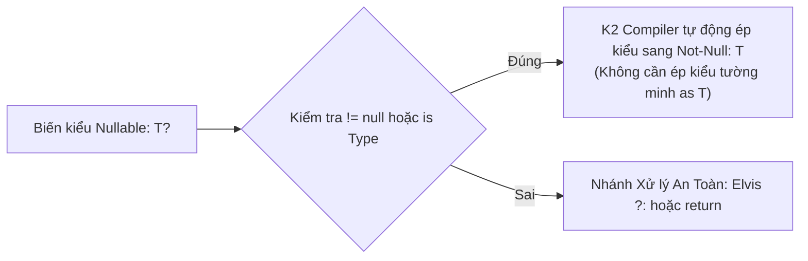
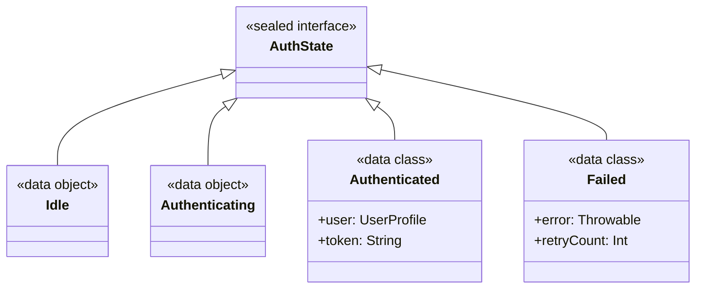
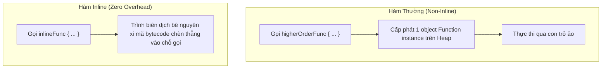

# Học Phần 01: Kotlin 2.x Hiện Đại & Nền Tảng Lập Trình Hàm

[](#mục-tiêu-học-tập)
[-blue.svg)](#1-bản-chất-compiler-k2--smart-casting-đột-phá)
[](../skills/kmp-architecture-foundation/SKILL.md)

---

## 🎯 Mục Tiêu Học Tập
1. Làm chủ hệ thống kiểm soát kiểu dữ liệu và an toàn con trỏ rỗng (Null Safety) dưới trình biên dịch **Kotlin 2.x K2 Compiler**.
2. Nắm vững kỹ thuật mô hình hóa miền nghiệp vụ (Domain Modeling) bằng `sealed interface`, `data object`, và `value class`.
3. Phân biệt chính xác cách sử dụng các hàm phạm vi (Scope Functions: `let`, `apply`, `also`, `run`, `with`) mà không gây ô nhiễm mã nguồn.
4. Hiểu sâu cơ chế tối ưu hóa bộ nhớ với `inline`, `reified type parameters` để triệt tiêu chi phí cấp phát đối tượng (Zero-Allocation Overhead).
5. Xây dựng tư duy Bất Biến (Immutability-First) làm nền tảng cho Jetpack Compose và Compose Multiplatform.

---

## 🧠 1. Bản Chất Compiler K2 & Smart Casting Đột Phá

Trong Kotlin 2.x, trình biên dịch **K2** tái cấu trúc toàn bộ cây phân tích cú pháp (Frontend IR), giúp tính năng **Smart Casting** trở nên cực kỳ thông minh qua nhiều điều kiện phức tạp.



### Mã Nguồn Thực Chiến: Khai Thác K2 Smart Cast & Guard Clauses
```kotlin
package com.example.curriculum.level1

// 1. Value Class: Bọc kiểu dữ liệu nguyên thủy mà KHÔNG tốn bộ nhớ Heap (Unboxed at runtime)
@JvmInline
value class UserId(val raw: String) {
    init {
        require(raw.isNotBlank()) { "UserId không được để trống" }
    }
}

@JvmInline
value class Email(val value: String) {
    init {
        require(value.contains("@") && value.contains(".")) { "Email không đúng định dạng: $value" }
    }
}

// 2. Mô hình hóa Domain Entity bất biến
data class UserProfile(
    val id: UserId,
    val email: Email,
    val displayName: String,
    val bio: String? = null,
    val roles: List<String> = emptyList() // Bất biến theo thiết kế
)

// 3. K2 Smart Cast nâng cao qua hàm kiểm tra logic
fun validateAndFormatGreeting(user: UserProfile?): String {
    // Guard clause với toán tử Elvis
    if (user == null || user.bio.isNullOrBlank()) {
        return "Xin chào Khách!"
    }
    
    // K2 Compiler tự động nhận biết: user != null VÀ user.bio != null
    return "Xin chào ${user.displayName}! Giới thiệu: ${user.bio.trim()}"
}
```

---

## 🏛️ 2. Mô Hình Hóa Trạng Thái An Toàn: `sealed interface` & `data object`

Tại sao các Senior Architect luôn ưu tiên `sealed interface` thay vì `sealed class` hay `enum` trong lập trình di động hiện đại?
- **Đa kế thừa**: Một class có thể kế thừa nhiều `sealed interface`.
- **Bộ nhớ siêu nhẹ**: `data object` chỉ tạo đúng 1 thể hiện duy nhất trong bộ nhớ (Singleton), tự động hỗ trợ `toString()`, `equals()` và `hashCode()` phục vụ log trạng thái rõ ràng.



### Mã Nguồn Thực Chiến: Thiết Kế Máy Trạng Thái Đóng (Closed State Hierarchy)
```kotlin
package com.example.curriculum.level1

sealed interface NetworkResource<out T> {
    data object Idle : NetworkResource<Nothing>
    data object Loading : NetworkResource<Nothing>
    data class Success<out T>(val data: T) : NetworkResource<T>
    data class Error(val cause: Throwable, val message: String = cause.localizedMessage.orEmpty()) : NetworkResource<Nothing>
}

// Hàm xử lý tận dụng kiểm tra cạn kiệt (Exhaustive when) của Kotlin
fun renderUI(state: NetworkResource<UserProfile>): String = when (state) {
    is NetworkResource.Idle -> "Đang chờ thao tác..."
    is NetworkResource.Loading -> "Đang tải dữ liệu từ máy chủ..."
    is NetworkResource.Success -> "Chào mừng trở lại, ${state.data.displayName}!"
    is NetworkResource.Error -> "Lỗi hệ thống: ${state.message}"
    // Không cần nhánh 'else' vì sealed interface đảm bảo tính toàn vẹn 100% trường hợp!
}
```

---

## ⚡ 3. Hàm Bậc Cao (Higher-Order Functions) & Inline Optimization

Khi truyền một Lambda function trong Kotlin, nếu không có từ khóa `inline`, JVM và Kotlin/Native sẽ phải khởi tạo một đối tượng ẩn danh `Function<T, R>` trên Heap, gây áp lực lên Garbage Collector (GC).



### Mã Nguồn Thực Chiến: Tự Viết Helper Đo Đạc Hiệu Năng Với `inline` và `reified`
```kotlin
package com.example.curriculum.level1

import kotlin.system.measureNanoTime

// inline giúp loại bỏ chi phí object function
inline fun <T> measureExecution(blockName: String, block: () -> T): T {
    val result: T
    val elapsedNanos = measureNanoTime {
        result = block()
    }
    println("[Performance Tracker] $blockName hoàn thành trong: ${elapsedNanos / 1_000_000.0} ms")
    return result
}

// reified: Giữ lại thông tin kiểu dữ liệu tại Runtime mà không cần truyền Class<T>
inline fun <reified T> filterByType(list: List<Any>): List<T> {
    val matched = mutableListOf<T>()
    for (item in list) {
        if (item is T) { // Khả thi nhờ 'reified'
            matched.add(item)
        }
    }
    return matched
}
```

---

## 🔍 4. Tiêu Chuẩn Phân Biệt Scope Functions Chuẩn Doanh Nghiệp

| Hàm | Đối Tượng Tham Chiếu | Giá Trị Trả Về | Khi Nào Sử Dụng Chuẩn Kiến Trúc? |
| :--- | :---: | :---: | :--- |
| **`let`** | `it` | Kết quả dòng cuối Lambda | Kiểm tra biến Nullable (`user?.let { ... }`) hoặc biến đổi kiểu dữ liệu. |
| **`apply`** | `this` | Chính đối tượng gốc | Khởi tạo, cấu hình thuộc tính của Object (Builder pattern). |
| **`also`** | `it` | Chính đối tượng gốc | Thực hiện hành động phụ trợ không đổi dữ liệu (Side-effects: Logging, Audit). |
| **`run`** | `this` | Kết quả dòng cuối Lambda | Tính toán một khối lệnh phức tạp hoặc vừa cấu hình vừa trả về kết quả. |
| **`with`** | `this` | Kết quả dòng cuối Lambda | Gọi liên tiếp nhiều hàm trên cùng một đối tượng mà không phải lặp lại tên nó. |

---

## 🚫 5. Bảng Đối Chiếu Anti-Patterns (Bẫy Sai Thường Gặp)

| Anti-Pattern (Lỗi Sơ Cấp) | Hậu Quả Trong Môi Trường Doanh Nghiệp | Giải Pháp Kiến Trúc Chuẩn |
| :--- | :--- | :--- |
| **Dùng `var` và `MutableList` vô tội vạ** | Trạng thái bị sửa lén từ nhiều luồng, gây Race Condition và lỗi crash khó tái hiện. | Luôn dùng `val` và `List<T>`, khi cần thay đổi hãy dùng `copy()` tạo bản sao mới. |
| **Lạm dụng toán tử `!!` (Force unwrap)** | Ứng dụng đột tử vì lỗi `NullPointerException` khi API trả về thiếu trường. | Thay bằng Elvis `?:`, `checkNotNull()`, hoặc ném lỗi có ngữ nghĩa rõ ràng. |
| **Lồng ghép Scope Functions quá sâu** | Code trở nên khó đọc, không phân biệt được `it` và `this` của tầng nào. | Giới hạn tối đa 1 tầng scope function, đặt tên tham số lambda rõ ràng thay vì `it`. |

---

## 📝 6. Bài Tập Thực Hành & Thử Thách Đồ Án

1. **Thử Thách 1**: Thiết kế một hệ thống quản lý giao dịch ngân hàng bất biến (`Transaction`). Giao dịch gồm 3 trạng thái: `Pending`, `Completed(transactionHash: String, timestamp: Long)`, `Failed(errorCode: Int, reason: String)`. Sử dụng `sealed interface` và đảm bảo 100% hàm tính toán không dùng biến `var`.
2. **Thử Thách 2**: Tự viết một hàm `inline fun <reified T : Exception, R> runCatchingSpecific(block: () -> R): Result<R>` chỉ bắt lỗi thuộc đúng kiểu exception `T`, còn các lỗi khác thì cho phép ném ra ngoài bình thường.

---

👉 **Bước Tiếp Theo**: Chuyển sang [**Học Phần 02: Bất Đồng Bộ Với Kotlin Coroutines & Flow Mastery**](02-level-2-coroutines-flow.md)!
