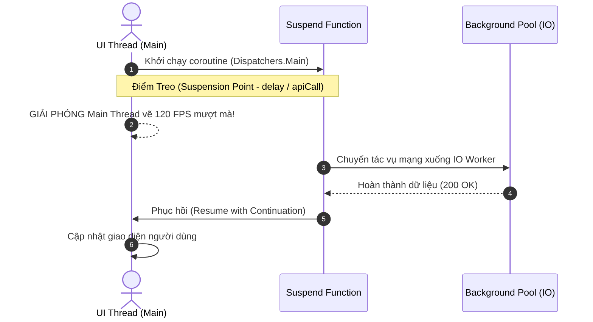
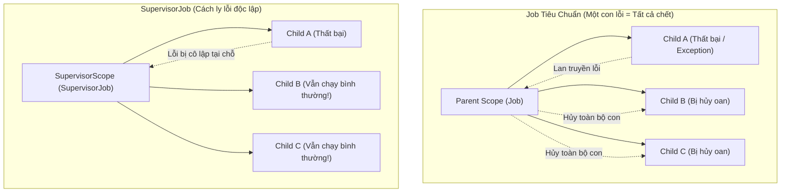
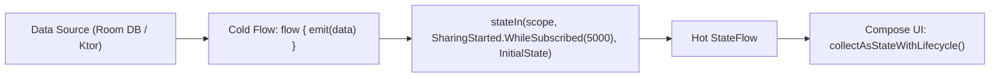

# Học Phần 02: Bất Đồng Bộ Với Kotlin Coroutines & Flow Mastery

[](#mục-tiêu-học-tập)
[](#1-bản-chất-cơ-chế-treo-suspension-vs-blocking)
[](../skills/kmp-mvi-stateflow-architecture/SKILL.md)

---

## 🎯 Mục Tiêu Học Tập
1. Hiểu cặn kẽ cơ chế **Treo luồng (Suspension)** thông qua máy trạng thái Continuation (Continuation-Passing Style) so với việc Chặn luồng (Thread Blocking).
2. Làm chủ nguyên lý **Đồng thời có cấu trúc (Structured Concurrency)**: phân biệt rạch ròi giữa `Job` và `SupervisorJob` để ngăn chặn lỗi làm sập toàn bộ ứng dụng.
3. Điều phối chính xác các **Dispatchers** (`Main.immediate`, `Default`, `IO`) phù hợp với từng loại tác vụ (UI render, CPU bound, Network/Disk I/O).
4. Phân biệt sâu sắc giữa **Cold Flow** (luồng lạnh thụ động) và **Hot Flow** (`StateFlow`, `SharedFlow`).
5. Áp dụng các toán tử lọc và khử nhiễu cao cấp (`debounce`, `distinctUntilChanged`, `flatMapLatest`, `combine`) cho các tác vụ tìm kiếm và xử lý sự kiện thời gian thực.

---

## 🧠 1. Bản Chất Cơ Chế Treo (Suspension vs Blocking)

Tại sao một thiết bị di động có thể chạy đồng thời **100,000 coroutines** nhưng chỉ cần một vài thread hệ điều hành?



- **Thread Blocking**: Khi gọi `Thread.sleep(1000)` hoặc lệnh mạng đồng bộ, luồng hệ điều hành bị "đóng băng", tiêu tốn khoảng 1MB bộ nhớ stack cho mỗi thread và gây giật khung hình (ANR - Application Not Responding).
- **Coroutine Suspension**: Khi gặp hàm `suspend`, Coroutine lưu lại trạng thái biến cục bộ vào một đối tượng `Continuation`, nhả luồng cho các công việc khác xử lý, và tự động được đánh thức lại khi có kết quả.

---

## 🏛️ 2. Structured Concurrency: `Job` vs `SupervisorJob`

Một trong những sai lầm phổ biến nhất trong phát triển ứng dụng di động là dùng sai loại `Job`, khiến một tác vụ nhỏ thất bại làm sập dây chuyền toàn bộ ứng dụng.



### Mã Nguồn Thực Chiến: Tạo Scope An Toàn Cho ViewModel
```kotlin
package com.example.curriculum.level2

import kotlinx.coroutines.*
import kotlin.coroutines.CoroutineContext

// Scope chuẩn mực: Sử dụng SupervisorJob và Dispatchers.Main.immediate
class SafeViewModelScope : CoroutineScope {
    // 1. Quản lý vòng đời với SupervisorJob
    private val masterJob = SupervisorJob()
    
    // 2. Exception Handler toàn cục để log sự cố không mong muốn
    private val errorHandler = CoroutineExceptionHandler { _, throwable ->
        println("[CRITICAL ERROR] Coroutine gặp sự cố: ${throwable.message}")
    }

    // 3. Kết hợp Context: Main.immediate bỏ qua bước xếp hàng lại nếu đang ở Main thread
    override val coroutineContext: CoroutineContext
        get() = Dispatchers.Main.immediate + masterJob + errorHandler

    fun cancelAllWork() {
        masterJob.cancel() // Hủy toàn bộ công việc khi ViewModel bị giải phóng
    }
}
```

---

## 🌊 3. Làm Chủ Dữ Liệu Dòng Chảy: Cold Flow vs StateFlow vs SharedFlow

| Đặc Điểm | Cold Flow | StateFlow (Hot) | SharedFlow (Hot) |
| :--- | :--- | :--- | :--- |
| **Thời điểm phát dữ liệu** | Chỉ chạy khi có bên `collect()` | Chạy liên tục ngầm, giữ giá trị cuối | Chạy liên tục ngầm |
| **Giá trị ban đầu** | Không yêu cầu | **Bắt buộc có `initialValue`** | Tùy chọn (theo `replay`) |
| **Khử trùng lặp giá trị** | Không tự động | **Tự động khử trùng lặp (`equals`)** | Không tự động |
| **Mục đích chuẩn kiến trúc** | Truy vấn DB, gọi API mạng một lần | **Lưu trữ trạng thái màn hình (`UiState`)** | **Bắn sự kiện một lần (`UiEffect` / Navigation)** |



### Mã Nguồn Thực Chiến: Xây Dựng Luồng Tìm Kiếm Tối Ưu Với Flow Operators
```kotlin
package com.example.curriculum.level2

import kotlinx.coroutines.flow.*
import kotlinx.coroutines.CoroutineScope
import kotlinx.coroutines.Dispatchers

data class SearchResult(val query: String, val items: List<String>)

class ProductSearchManager(private val externalScope: CoroutineScope) {
    // 1. Input query từ người dùng (MutableStateFlow)
    private val _searchQuery = MutableStateFlow("")
    val searchQuery: StateFlow<String> = _searchQuery.asStateFlow()

    // 2. Luồng xử lý tìm kiếm với các toán tử bảo vệ hiệu năng
    val searchResults: StateFlow<SearchResult> = _searchQuery
        // Giảm tải gõ phím: Chỉ phát khi người dùng dừng gõ 300ms
        .debounce(300L)
        // Lược bỏ ký tự thừa và bỏ qua nếu từ khóa không đổi
        .map { it.trim() }
        .distinctUntilChanged()
        // Hủy bỏ request tìm kiếm cũ nếu có từ khóa mới gõ vào (flatMapLatest)
        .flatMapLatest { query ->
            if (query.length < 2) {
                flowOf(SearchResult(query = query, items = emptyList()))
            } else {
                searchProductsFromRemote(query)
            }
        }
        // Chuyển đổi luồng lạnh thành Hot StateFlow với chiến lược WhileSubscribed
        .stateIn(
            scope = externalScope,
            started = SharingStarted.WhileSubscribed(stopTimeoutMillis = 5_000L),
            initialValue = SearchResult(query = "", items = emptyList())
        )

    fun onQueryChanged(newQuery: String) {
        _searchQuery.value = newQuery
    }

    private fun searchProductsFromRemote(query: String): Flow<SearchResult> = flow {
        // Mô phỏng gọi API Ktor trên luồng IO
        println("--> Đang gọi máy chủ tìm kiếm: '$query'")
        kotlinx.coroutines.delay(400) // Giả lập độ trễ mạng
        val fakeData = listOf("$query Pro", "$query Max", "$query Ultra")
        emit(SearchResult(query = query, items = fakeData))
    }.flowOn(Dispatchers.IO) // Ép luồng chạy trên IO Dispatcher
}
```

---

## 🚫 4. Bảng Đối Chiếu Anti-Patterns (Bẫy Sai Trong Bất Đồng Bộ)

| Anti-Pattern (Lỗi Nguy Hiểm) | Hậu Quả Thực Tế | Giải Pháp Chuẩn Doanh Nghiệp |
| :--- | :--- | :--- |
| **Dùng `GlobalScope.launch`** | Tác vụ chạy vô tận không thể hủy khi màn hình đóng, gây rò rỉ bộ nhớ nghiêm trọng. | Ràng buộc Coroutine vào `viewModelScope`, `lifecycleScope` hoặc Scope có cấu trúc. |
| **Nuốt lỗi bằng `try/catch` bắt `CancellationException`** | Phá hủy cơ chế Cooperative Cancellation, khiến Coroutine không thể dừng khi người dùng thoát màn hình. | Bắt `Exception` thông thường, hoặc luôn ném lại `CancellationException` (`if (e is CancellationException) throw e`). |
| **Chạy tính toán nặng trên `Dispatchers.Main`** | Giao diện bị đơ cứng, xuất hiện hiện tượng giật khung hình và lỗi ANR. | Chuyển sang `withContext(Dispatchers.Default)` cho tính toán CPU, hoặc `Dispatchers.IO` cho mạng/đĩa. |
| **Dùng `SharedFlow` lưu trạng thái UI** | Khi xoay màn hình hoặc recompose, người dùng bị mất trạng thái hiện tại hoặc phải chờ phát lại. | Dùng `StateFlow` cho trạng thái (State) và `Channel` cho sự kiện hành động một lần (Effect). |

---

## 📝 5. Bài Tập Thực Hành & Thử Thách Đồ Án

1. **Thử Thách 1**: Viết hàm `fun <T> Flow<T>.retryWithExponentialBackoff(maxAttempts: Int, initialDelayMs: Long): Flow<T>` tự động thử lại khi gặp lỗi kết nối với thời gian chờ tăng theo cấp số nhân (kèm Jitter ngẫu nhiên).
2. **Thử Thách 2**: Triển khai một bộ đếm nhịp tim giả lập phát dữ liệu mỗi 500ms bằng `flow { ... }`. Kết hợp với toán tử `conflate()` để đảm bảo khi UI xử lý chậm, hệ thống chỉ giữ giá trị nhịp tim mới nhất và bỏ qua các giá trị cũ.

---

👉 **Bước Tiếp Theo**: Chuyển sang [**Học Phần 03: Jetpack Compose & Nền Tảng UI Khai Báo**](03-level-3-compose-basics.md)!
