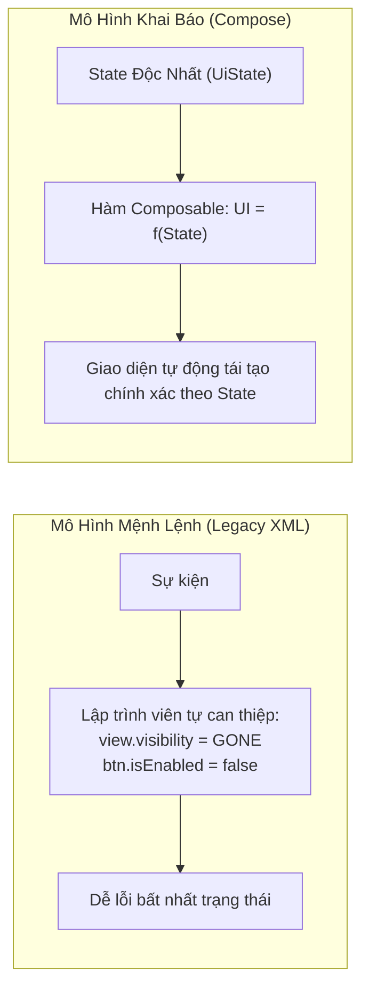
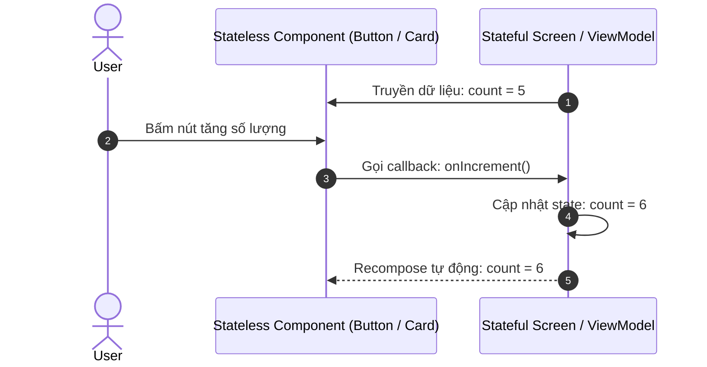
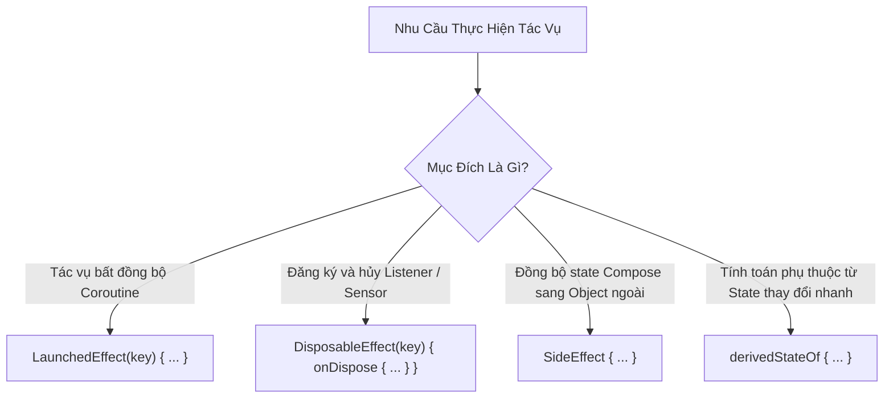

# Học Phần 03: Jetpack Compose & Nền Tảng UI Khai Báo (Declarative UI)

[](#mục-tiêu-học-tập)
[](#1-sự-chuyển-dịch-tư-duy-ui--fstate)
[](../skills/kmp-compose-multiplatform-ui/SKILL.md)

---

## 🎯 Mục Tiêu Học Tập
1. Hiểu sâu sắc sự chuyển dịch mô hình tư duy từ **Lập trình Mệnh lệnh (Imperative UI / XML)** sang **Lập trình Khai báo (Declarative UI)**: công thức bất hủ $UI = f(State)$.
2. Nắm vững 3 giai đoạn của Compose Runtime: **Initial Composition ➔ Recomposition ➔ Disposal**.
3. Phân biệt chính xác giữa `remember` và `rememberSaveable` trong việc chống mất dữ liệu khi xoay màn hình hoặc hệ điều hành hủy tiến trình (Process Death).
4. Áp dụng kỹ thuật **Nâng cao Trạng thái (State Hoisting)** để phân tách rạch ròi giữa Stateful Composable và Stateless Composable phục vụ tái sử dụng và viết Unit Test.
5. Làm chủ toàn bộ hệ thống Side-Effects: `LaunchedEffect`, `DisposableEffect`, `SideEffect`, và `derivedStateOf`.
6. Tối ưu danh sách lớn với `LazyColumn` bằng cách khai báo `key` tường minh, triệt tiêu hiện tượng lag giật.

---

## 🧠 1. Sự Chuyển Dịch Tư Duy: $UI = f(State)$

Trong mô hình XML cũ, bạn phải lưu tham chiếu tới View (`findViewById`) và tự tay thay đổi thuộc tính (`textView.setText(...)`). Điều này dễ dẫn đến trạng thái không nhất quán khi có nhiều luồng cùng can thiệp.



### Vòng Đời Của Một Composable
1. **Initial Composition**: Compose chạy các hàm `@Composable` lần đầu tiên để dựng cây giao diện (Layout Tree).
2. **Recomposition**: Khi bất kỳ `State<T>` nào mà Composable đó đang đọc bị thay đổi, Compose sẽ **vẽ lại chỉ những phần liên quan**, bỏ qua các nhánh không thay đổi (Smart Recomposition).
3. **Disposal**: Khi Composable rời khỏi cây giao diện, các tài nguyên được giải phóng tự động thông qua `DisposableEffect`.

---

## 🏛️ 2. Quản Lý Trạng Thái & Kỹ Thuật State Hoisting

Nguyên tắc vàng của Jetpack Compose: **State flows down, Events flow up (Trạng thái chảy xuống, Sự kiện bắn lên)**.



### Mã Nguồn Thực Chiến: Triển Khai State Hoisting Đúng Chuẩn
```kotlin
package com.example.curriculum.level3

import androidx.compose.foundation.layout.*
import androidx.compose.material3.*
import androidx.compose.runtime.*
import androidx.compose.runtime.saveable.rememberSaveable
import androidx.compose.ui.Alignment
import androidx.compose.ui.Modifier
import androidx.compose.ui.unit.dp

// 1. Stateful Screen: Chịu trách nhiệm giữ và duy trì trạng thái
@Composable
fun CounterScreen(modifier: Modifier = Modifier) {
    // rememberSaveable giúp giữ giá trị khi xoay màn hình (Configuration Changes)
    var count by rememberSaveable { mutableIntStateOf(0) }

    CounterContent(
        count = count,
        onIncrement = { count++ },
        onReset = { count = 0 },
        modifier = modifier
    )
}

// 2. Stateless Composable: Thuần khiết (Pure function), cực kỳ dễ viết Preview và Unit Test
@Composable
fun CounterContent(
    count: Int,
    onIncrement: () -> Unit,
    onReset: () -> Unit,
    modifier: Modifier = Modifier
) {
    Column(
        modifier = modifier.fillMaxSize().padding(16.dp),
        horizontalAlignment = Alignment.CenterHorizontally,
        verticalArrangement = Arrangement.Center
    ) {
        Text(
            text = "Số lượng hiện tại: $count",
            style = MaterialTheme.typography.headlineMedium
        )
        
        Spacer(modifier = Modifier.height(16.dp))
        
        Row(horizontalArrangement = Arrangement.spacedBy(8.dp)) {
            Button(onClick = onIncrement) {
                Text("Tăng số lượng")
            }
            OutlinedButton(onClick = onReset, enabled = count > 0) {
                Text("Đặt lại")
            }
        }
    }
}
```

---

## ⚡ 3. Quản Lý Tác Dụng Phụ (Side-Effects) An Toàn

Composable phải là hàm phi tác dụng phụ (Pure & Idempotent). Khi bạn cần thực hiện tác vụ bên ngoài (gọi mạng, đăng ký listener, điều hướng), bạn **BẮT BUỘC** phải đưa chúng vào các Side-Effect APIs.



### Mã Nguồn Thực Chiến: Sử Dụng `DisposableEffect` & `derivedStateOf`
```kotlin
package com.example.curriculum.level3

import androidx.compose.foundation.lazy.LazyColumn
import androidx.compose.foundation.lazy.items
import androidx.compose.foundation.lazy.rememberLazyListState
import androidx.compose.material3.*
import androidx.compose.runtime.*
import androidx.compose.ui.Modifier

@Composable
fun OptimizedProductList(
    items: List<String>,
    modifier: Modifier = Modifier
) {
    val listState = rememberLazyListState()

    // derivedStateOf: Chỉ kích hoạt recomposition khi giá trị Boolean (showScrollToTop) thay đổi,
    // thay vì recompose mỗi pixel người dùng cuộn danh sách!
    val showScrollToTop by remember {
        derivedStateOf { listState.firstVisibleItemIndex > 5 }
    }

    Scaffold(
        floatingActionButton = {
            if (showScrollToTop) {
                FloatingActionButton(onClick = { /* Cuộn lên đầu */ }) {
                    Text("⬆")
                }
            }
        }
    ) { innerPadding ->
        LazyColumn(
            state = listState,
            contentPadding = innerPadding,
            modifier = modifier
        ) {
            // BẮT BUỘC có key: Giúp Compose tái sử dụng item thông minh khi danh sách thay đổi thứ tự
            items(
                items = items,
                key = { item -> item }
            ) { product ->
                Text(
                    text = product,
                    style = MaterialTheme.typography.bodyLarge
                )
            }
        }
    }
}
```

---

## 🚫 4. Bảng Đối Chiếu Anti-Patterns (Bẫy Sai Trong Compose)

| Anti-Pattern (Lỗi Sơ Cấp) | Hậu Quả Thực Tế | Giải Pháp Chuẩn Doanh Nghiệp |
| :--- | :--- | :--- |
| **Gọi API trực tiếp trong thân Composable** | API bị gọi liên tục hàng trăm lần mỗi khi màn hình Recompose, làm sập máy chủ. | Luôn bọc trong `LaunchedEffect(key)` hoặc gọi thông qua ViewModel Intent. |
| **Dùng `remember` cho biến quan trọng khi xoay màn hình** | Người dùng xoay ngang điện thoại, toàn bộ dữ liệu form đang nhập bị xóa sạch. | Sử dụng `rememberSaveable` hoặc chuyển trạng thái vào `ViewModel`. |
| **Dùng `items(list)` mà không khai báo `key`** | Khi xóa hoặc thêm 1 phần tử, Compose buộc phải vẽ lại toàn bộ danh sách, gây giật lag. | Luôn cung cấp `key = { it.id }` với ID duy nhất, ổn định của mỗi phần tử. |
| **Tính toán biểu thức cuộn trực tiếp không qua `derivedStateOf`** | Composable bị Recompose 120 lần/giây theo từng pixel cuộn, gây tụt khung hình. | Bọc logic điều kiện vào `derivedStateOf { listState.firstVisibleItemIndex > 0 }`. |

---

## 📝 5. Bài Tập Thực Hành & Thử Thách Đồ Án

1. **Thử Thách 1**: Xây dựng một Composable đếm ngược thời gian (`CountDownTimer`) nhận vào `totalSeconds: Int`. Sử dụng `LaunchedEffect` để đếm ngược mỗi giây và gọi callback `onFinished()` khi về 0. Đảm bảo timer tự động dừng nếu màn hình bị đóng.
2. **Thử Thách 2**: Tích hợp một cảm biến con quay hồi chuyển hoặc bàn phím hệ thống bằng `DisposableEffect`. Đăng ký lắng nghe khi Composable xuất hiện và bắt buộc gọi hàm hủy đăng ký trong khối `onDispose { ... }`.

---

👉 **Bước Tiếp Theo**: Chuyển sang [**Học Phần 04: Clean Architecture, Hexagonal & Phân Tầng Module**](04-level-4-clean-architecture.md)!
