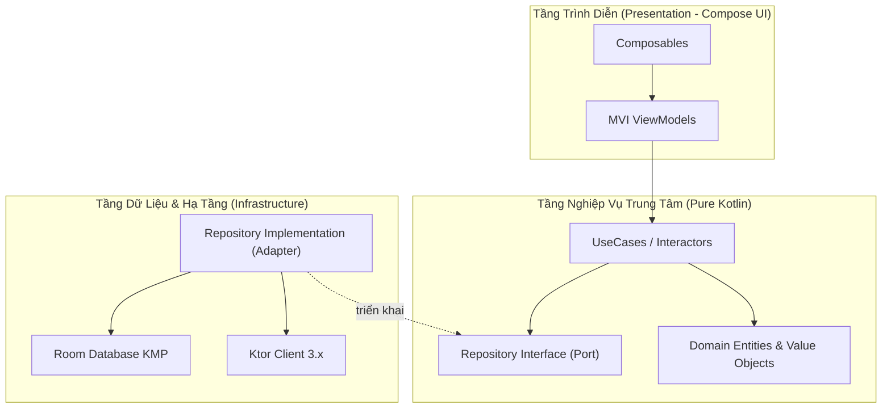
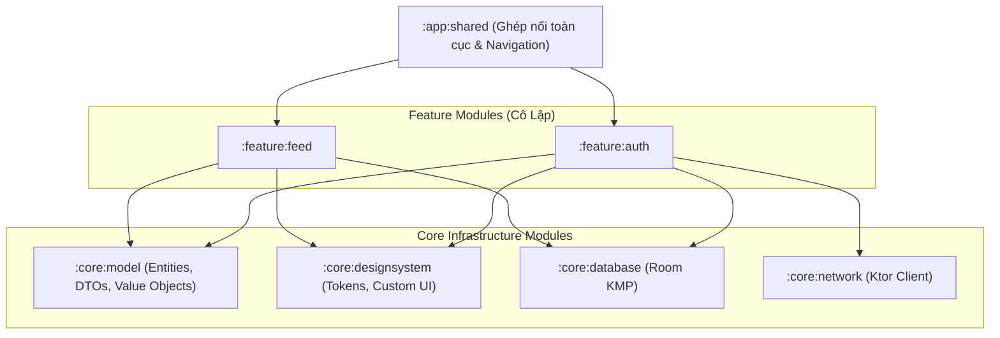

# Học Phần 04: Clean Architecture, Hexagonal & Phân Tầng Module Đa Nền Tảng

[](#mục-tiêu-học-tập)
[](#1-triết-lý-đảo-ngược-phụ-thuộc-dependency-inversion)
[](../skills/kmp-architecture-foundation/SKILL.md)
[](../skills/kmp-dependency-injection-koin/SKILL.md)

---

## 🎯 Mục Tiêu Học Tập
1. Hiểu cặn kẽ triết lý **Clean Architecture** và mô hình **Lục giác (Hexagonal / Ports & Adapters)** được chuẩn hóa cho Kotlin Multiplatform.
2. Áp dụng nguyên lý **Đảo ngược phụ thuộc (Dependency Inversion Principle - DIP)**: Tầng Domain là trung tâm tuyệt đối, không chứa bất kỳ import nào từ Android SDK, CocoaPods hay Compose UI.
3. Thiết kế chiến lược phân tách module đa dự án (**Multi-Module Topology**): `:core:*`, `:feature:*`, và `:app:*` nhằm tối ưu tốc độ biên dịch song song (Gradle Parallel Build) và bảo vệ ranh giới đóng gói.
4. Triển khai Dependency Injection đa nền tảng với **Koin 4.x** (`module`, `singleOf`, `viewModelOf`).
5. Xây dựng UseCases tuân thủ nguyên lý Đơn trách nhiệm (Single Responsibility Principle - SRP) với toán tử `operator fun invoke()`.

---

## 🧠 1. Triết Lý Đảo Ngược Phụ Thuộc (Dependency Inversion)

Tại sao một kiến trúc chuẩn doanh nghiệp không bao giờ cho phép ViewModel gọi trực tiếp Retrofit/Ktor hay Room Database?



### Các Ranh Giới Nghiêm Ngặt
1. **Domain Layer (Trái tim của hệ thống)**: Chứa các quy tắc nghiệp vụ cốt lõi (Business Logic). Tầng này hoàn toàn độc lập với công nghệ bên ngoài. Nếu ngày mai bạn đổi Room sang SQLDelight, hoặc đổi Compose sang Flutter, tầng Domain **không bị sửa dù chỉ 1 dòng code**.
2. **Ports & Adapters**: Tầng Domain định nghĩa **Cổng kết nối (Port)** dưới dạng Interface trừu tượng (ví dụ: `UserRepository`). Tầng Data đóng vai trò là **Bộ chuyển đổi (Adapter)** hiện thực hóa interface đó (`UserRepositoryImpl`).

---

## 🏛️ 2. Mô Hình Phân Tách Module Chuẩn Doanh Nghiệp (Multi-Module)

Dự án quy mô lớn không bao giờ gộp chung toàn bộ code vào một module `:app`. Việc phân tách module mang lại 3 lợi thế sống còn:
- **Biên dịch nhanh vượt trội**: Gradle chỉ biên dịch lại những module có thay đổi code.
- **Tái sử dụng tuyệt đối**: Tầng `:core:model` có thể dùng chung giữa Client Mobile và Ktor Server Backend.
- **Ngăn chặn code bẩn**: Không thể gọi nhầm class nội bộ của feature khác nếu Gradle không khai báo `implementation`.



---

## 💻 3. Triển Khai Thực Chiến: UseCase & Koin Multiplatform

### 3.1. Thiết Kế UseCase Chuẩn Doanh Nghiệp (Tầng Domain)
```kotlin
package com.example.curriculum.level4.domain

import kotlinx.coroutines.flow.Flow
import kotlinx.coroutines.flow.map

// Domain Entity
data class UserAccount(val id: String, val username: String, val isVip: Boolean)

// Repository Port (Trừu tượng, không phụ thuộc Database hay Network)
interface UserRepository {
    fun observeUser(): Flow<UserAccount?>
    suspend fun refreshUserProfile(): Result<Unit>
}

// UseCase: Đơn trách nhiệm, áp dụng toán tử invoke() để gọi như một hàm
class ObserveVipStatusUseCase(private val userRepository: UserRepository) {
    operator fun invoke(): Flow<Boolean> {
        return userRepository.observeUser().map { user ->
            user != null && user.isVip
        }
    }
}
```

### 3.2. Cấu Hình Dependency Injection Với Koin Multiplatform (Tầng DI)
```kotlin
package com.example.curriculum.level4.di

import org.koin.core.module.dsl.singleOf
import org.koin.core.module.dsl.viewModelOf
import org.koin.dsl.bind
import org.koin.dsl.module
import com.example.curriculum.level4.domain.*
import com.example.curriculum.level4.data.*

val domainModule = module {
    // Tự động khởi tạo UseCase và inject UserRepository vào constructor
    singleOf(::ObserveVipStatusUseCase)
}

val dataModule = module {
    // Bind Repository Implementation vào Repository Interface
    singleOf(::UserRepositoryImpl) bind UserRepository::class
}

// Toàn bộ module KMP hợp nhất
val appModules = listOf(domainModule, dataModule)
```

---

## 🚫 4. Bảng Đối Chiếu Anti-Patterns (Bẫy Sai Trong Kiến Trúc)

| Anti-Pattern (Lỗi Sơ Cấp) | Hậu Quả Thực Tế | Giải Pháp Chuẩn Doanh Nghiệp |
| :--- | :--- | :--- |
| **Import Android Context vào Tầng Domain** | Phá vỡ tính đa nền tảng, khiến Domain không thể chạy trên iOS, Desktop hay Web Wasm. | Tầng Domain chỉ sử dụng Pure Kotlin. Mọi tương tác OS phải qua Interface-Factory pattern. |
| **Feature module này phụ thuộc Feature module kia** | Gây ra vòng lặp phụ thuộc (Cyclic Dependency), làm hỏng khả năng phân tách module. | Các Feature giao tiếp thông qua Điều hướng trung tâm hoặc Event Bus ở `:core`. |
| **UseCase chỉ làm mỗi việc gọi lại Repository** | Sinh ra hàng loạt UseCase rác không có logic nghiệp vụ ("Pass-through UseCases"). | Chỉ tạo UseCase khi có logic biến đổi, phối hợp nhiều Repositories hoặc xác thực dữ liệu. |
| **Tạo Singleton thủ công bằng `object MyManager`** | Gây khó khăn khi viết Unit Test, khó kiểm soát vòng đời và tạo rò rỉ bộ nhớ. | Luôn quản lý vòng đời dependencies thông qua hệ thống Koin DI (`single`, `factory`). |

---

## 📝 5. Bài Tập Thực Hành & Thử Thách Đồ Án

1. **Thử Thách 1**: Thiết kế một module `:feature:cart` (Giỏ hàng) tuân thủ Clean Architecture. Hãy định nghĩa `CartItem` (Domain), `CartRepository` (Port), và `CalculateDiscountedTotalUseCase` (UseCase tính tổng tiền sau khi áp dụng mã giảm giá VIP).
2. **Thử Thách 2**: Cấu hình Koin Module cho giỏ hàng bằng `viewModelOf` và viết một kịch bản Unit Test kiểm tra tính đúng đắn của UseCase bằng cách mock `CartRepository`.

---

👉 **Bước Tiếp Theo**: Chuyển sang [**Học Phần 05: Compose Multiplatform (CMP) - Android, iOS, Desktop, Web**](05-level-5-cmp-multiplatform-ui.md)!
