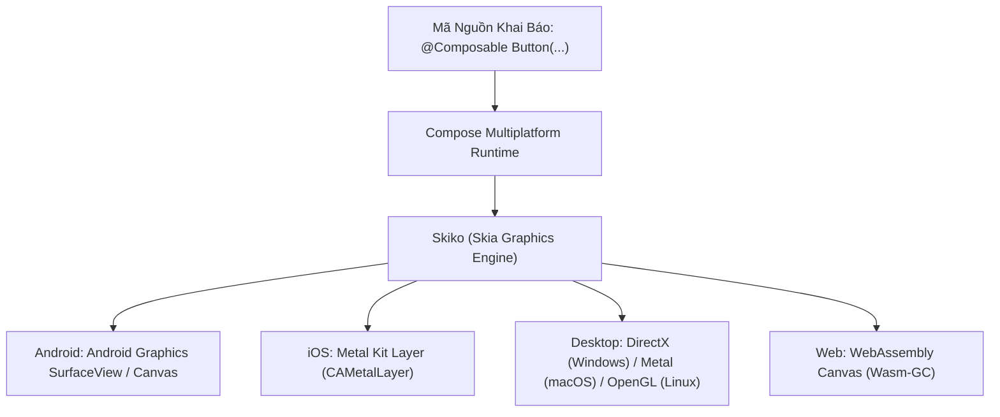
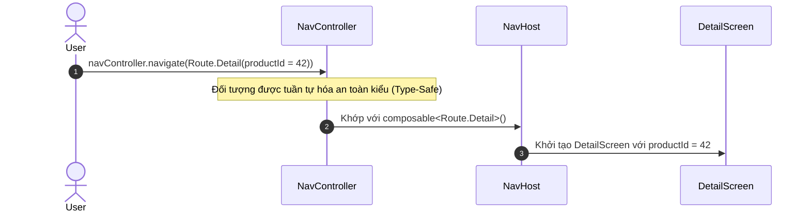

# Học Phần 05: Compose Multiplatform (CMP) — Chinh Phục Android, iOS, Desktop & Web

[](#mục-tiêu-học-tập)
[](#1-bản-chất-đồ-họa-skiko-trong-compose-multiplatform)
[](../skills/kmp-compose-multiplatform-ui/SKILL.md)
[](../skills/kmp-adaptive-responsive-layouts/SKILL.md)

---

## 🎯 Mục Tiêu Học Tập
1. Hiểu bản chất động cơ kết xuất đồ họa **Skiko (Skia for Kotlin)**: tại sao Compose Multiplatform vẽ trực tiếp pixel lên màn hình thay vì bọc các widget native (Wrapped Native Views).
2. Quản lý tài nguyên đa nền tảng (**CMP Resources**): String đa ngôn ngữ, Vector Drawables, và Phông chữ tùy biến từ `commonMain` mà không dùng `R.string` của Android.
3. Thiết kế giao diện thích ứng đa kích thước (**Adaptive Layouts**) với `WindowSizeClass`: tự động chuyển đổi giữa `BottomNavigationBar` (Mobile) sang `NavigationRail` (Tablet) và `PermanentNavigationDrawer` (Desktop).
4. Triển khai điều hướng an toàn kiểu dữ liệu (**Type-Safe Navigation Compose**) với các Route định danh bằng Kotlinx Serialization `@Serializable`.
5. Xây dựng hệ thống Design Tokens và Theme đa giao diện (Light, Dark, High-Contrast).

---

## 🧠 1. Bản Chất Đồ Họa Skiko Trong Compose Multiplatform

Không giống như React Native (dùng Javascript Bridge điều khiển Native View) hay Flutter (dùng engine C++ riêng biệt), **Compose Multiplatform** sử dụng thư viện **Skiko** (Kotlin bindings cho Google Skia Graphics Library - chính là engine render bên trong Android và Chrome).



### Lợi Thế Vượt Trội Của Skiko:
- **Độ nhất quán Pixel-Perfect 100%**: Giao diện hiển thị trên iPhone 16 Pro, Samsung Galaxy S24, Windows 11 và Trình duyệt Web hoàn toàn đồng nhất tới từng điểm ảnh.
- **Tốc độ khung hình 120Hz**: Tận dụng tối đa tăng tốc phần cứng (Hardware Acceleration) thông qua Metal trên Apple và DirectX/OpenGL trên PC.

---

## 📐 2. Giao Diện Thích Ứng Đa Kích Thước (WindowSizeClass)

Trong thế giới đa nền tảng, kích thước màn hình biến đổi từ điện thoại nhỏ (360dp), màn hình gập (Foldables 600dp), máy tính bảng (840dp) cho đến màn hình UltraWide (4K). 

```mermaid
flowchart TD
    Width["Chiều Rộng Màn Hình Hiện Tại (dp)"]
    
    Width -->|< 600dp (Compact)| Mobile["Thiết Bị Cầm Tay (Mobile)<br/>➔ Scaffold với BottomNavigationBar"]
    Width -->|600dp - 840dp (Medium)| Tablet["Màn Hình Gập / Tablet Đứng<br/>➔ Scaffold với NavigationRail"]
    Width -->|> 840dp (Expanded)| Desktop["Máy Tính Bảng Ngang / PC / Web<br/>➔ PermanentNavigationDrawer + List-Detail 2 Pane"]
```

### Mã Nguồn Thực Chiến: Khung Sườn Thích Ứng Tự Động
```kotlin
package com.example.curriculum.level5.ui

import androidx.compose.foundation.layout.*
import androidx.compose.material3.*
import androidx.compose.runtime.Composable
import androidx.compose.ui.Modifier
import androidx.compose.ui.unit.dp

enum class DeviceWindowWidth { Compact, Medium, Expanded }

@Composable
fun AdaptiveAppScaffold(
    windowWidthClass: DeviceWindowWidth,
    selectedDestination: String,
    onNavigate: (String) -> Unit,
    content: @Composable () -> Unit
) {
    when (windowWidthClass) {
        DeviceWindowWidth.Compact -> {
            // Mobile Layout: Thanh điều hướng nằm ở đáy màn hình
            Scaffold(
                bottomBar = {
                    NavigationBar {
                        NavigationBarItem(
                            selected = selectedDestination == "home",
                            onClick = { onNavigate("home") },
                            icon = { Text("🏠") },
                            label = { Text("Trang chủ") }
                        )
                        NavigationBarItem(
                            selected = selectedDestination == "settings",
                            onClick = { onNavigate("settings") },
                            icon = { Text("⚙") },
                            label = { Text("Cài đặt") }
                        )
                    }
                }
            ) { padding ->
                Box(modifier = Modifier.padding(padding)) { content() }
            }
        }

        DeviceWindowWidth.Medium, DeviceWindowWidth.Expanded -> {
            // Tablet & Desktop Layout: Thanh điều hướng dựng đứng bên trái (NavigationRail)
            Row(modifier = Modifier.fillMaxSize()) {
                NavigationRail {
                    NavigationRailItem(
                        selected = selectedDestination == "home",
                        onClick = { onNavigate("home") },
                        icon = { Text("🏠") },
                        label = { Text("Trang chủ") }
                    )
                    NavigationRailItem(
                        selected = selectedDestination == "settings",
                        onClick = { onNavigate("settings") },
                        icon = { Text("⚙") },
                        label = { Text("Cài đặt") }
                    )
                }
                Box(modifier = Modifier.weight(1f).fillMaxHeight()) { content() }
            }
        }
    }
}
```

---

## 🧭 3. Điều Hướng An Toàn Kiểu Dữ Liệu (Type-Safe Navigation)

Loại bỏ hoàn toàn các chuỗi URL String dễ lỗi chính tả (`"user_profile/{userId}"`). Từ Compose 1.7+, toàn bộ hệ thống điều hướng sử dụng các Kotlinx Serialization object/class tĩnh.



### Mã Nguồn Thực Chiến: Thiết Lập Type-Safe Navigation Stack
```kotlin
package com.example.curriculum.level5.navigation

import androidx.compose.runtime.Composable
import androidx.navigation.compose.*
import androidx.navigation.toRoute
import kotlinx.serialization.Serializable

// 1. Định nghĩa các tuyến đường bằng @Serializable
sealed interface AppRoute {
    @Serializable
    data object Home : AppRoute

    @Serializable
    data class ProductDetail(val productId: String, val referralCode: String? = null) : AppRoute
}

// 2. Thiết lập Đồ thị Điều hướng Type-Safe
@Composable
fun AppNavigationGraph() {
    val navController = rememberNavController()

    NavHost(navController = navController, startDestination = AppRoute.Home) {
        // Màn hình chính
        composable<AppRoute.Home> {
            HomeScreen(
                onProductClick = { selectedId ->
                    navController.navigate(AppRoute.ProductDetail(productId = selectedId))
                }
            )
        }

        // Màn hình chi tiết sản phẩm: Tham số được giải mã tự động!
        composable<AppRoute.ProductDetail> { backStackEntry ->
            val route = backStackEntry.toRoute<AppRoute.ProductDetail>()
            ProductDetailScreen(
                productId = route.productId,
                referral = route.referralCode,
                onBack = { navController.popBackStack() }
            )
        }
    }
}
```

---

## 🚫 4. Bảng Đối Chiếu Anti-Patterns (Bẫy Sai Trong CMP UI)

| Anti-Pattern (Lỗi Sơ Cấp) | Hậu Quả Thực Tế | Giải Pháp Chuẩn Doanh Nghiệp |
| :--- | :--- | :--- |
| **Dùng chuỗi String hardcode để điều hướng** | Gõ sai chính tả gây crash runtime khi chuyển màn hình mà Compiler không báo trước. | Luôn dùng `@Serializable` route classes với Type-Safe Navigation Compose. |
| **Cố định kích thước giao diện bằng dp tuyệt đối** | Giao diện bị méo mó, vỡ layout khi chạy trên iPad, Tablet, hoặc màn hình Desktop. | Sử dụng `WindowSizeClass` kết hợp tỷ lệ linh hoạt (`weight`, `BoxWithConstraints`). |
| **Dùng resource Android `R.string` trong CMP** | Mã nguồn không thể biên dịch trên iOS, Desktop hay Web Wasm. | Dùng bộ thư viện Compose Multiplatform Resources chính thức (`Res.string.*`). |

---

## 📝 5. Bài Tập Thực Hành & Thử Thách Đồ Án

1. **Thử Thách 1**: Xây dựng màn hình danh mục sản phẩm (List-Detail Pattern). Trên điện thoại, khi bấm vào sản phẩm sẽ điều hướng sang màn hình mới. Trên màn hình máy tính bảng hoặc Desktop, hiển thị danh sách bên trái và chi tiết sản phẩm bên phải trên cùng một màn hình (Two-Pane Layout).
2. **Thử Thách 2**: Tích hợp CMP Resources để hỗ trợ đa ngôn ngữ (Tiếng Việt và Tiếng Anh) kèm phông chữ Google Fonts ngoại tuyến (Offline Bundled Fonts) không cần kết nối mạng.

---

👉 **Bước Tiếp Theo**: Chuyển sang [**Học Phần 06: Dữ Liệu Nội Bộ Room KMP & Mạng Ktor Client 3.x**](06-level-6-data-networking.md)!
