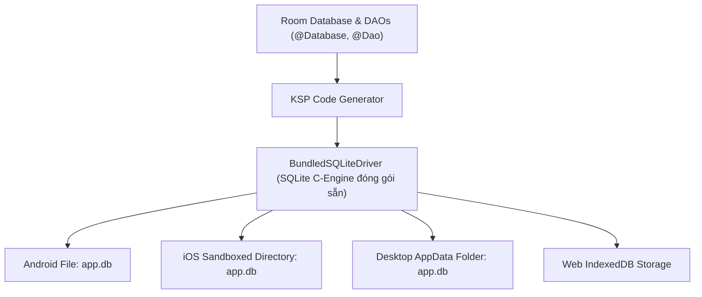
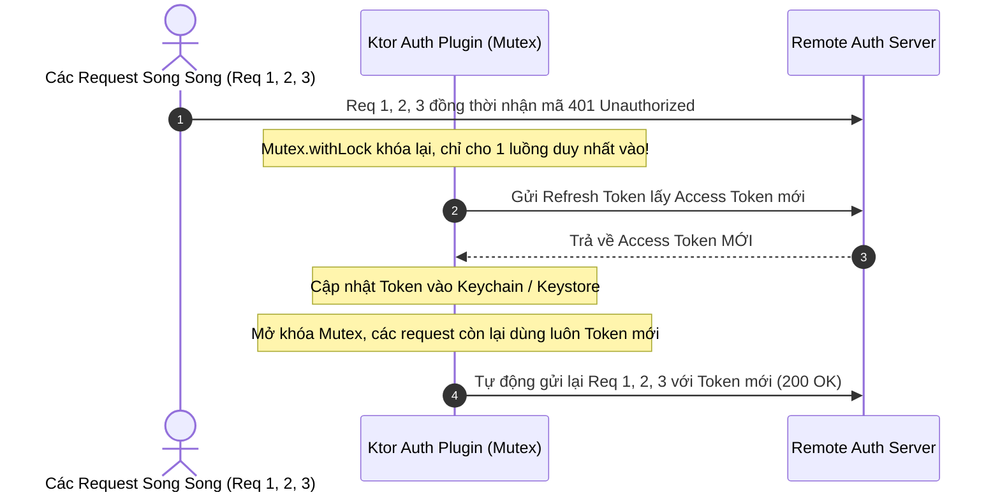

# Học Phần 06: Dữ Liệu Nội Bộ Room KMP & Mạng Ktor Client 3.x

[](#mục-tiêu-học-tập)
[](#1-cơ-sở-dữ-liệu-đa-nền-tảng-room-multiplatform-27)
[](../skills/kmp-offline-room-database/SKILL.md)
[](../skills/kmp-ktor-network-client/SKILL.md)

---

## 🎯 Mục Tiêu Học Tập
1. Làm chủ cơ sở dữ liệu quan hệ **Room Multiplatform 2.7+** chạy đồng nhất trên Android, iOS, Desktop và Web thông qua `BundledSQLiteDriver`.
2. Khai báo các DAO phản ứng nhanh với luồng dữ liệu liên tục (`Flow<List<Entity>>`) tự động bắn ra UI mỗi khi Database có thay đổi.
3. Bảo mật khóa truy cập (Access Token) và dữ liệu nhạy cảm bằng **Secure Vault** kết hợp Android Keystore và Apple Keychain Services.
4. Xây dựng tầng mạng với **Ktor Client 3.x**, cấu hình các engine tối ưu theo từng OS (`OkHttp` trên Android, `Darwin` trên iOS, `CIO` trên Desktop).
5. Triển khai cơ chế **Silent Token Refresh (Cấp lại Token ngầm)** an toàn luồng với `Mutex`, giải quyết triệt để lỗi chạy đua (Race Condition) khi có nhiều request đồng thời gặp mã lỗi 401 Unauthorized.

---

## 🗄️ 1. Cơ Sở Dữ Liệu Đa Nền Tảng Room Multiplatform 2.7+

Trong các giải pháp KMP trước đây, lập trình viên phải dựa vào SQLDelight với cú pháp SQL thủ công phức tạp. Từ phiên bản 2.7+, Google chính thức hỗ trợ **Room KMP** đa nền tảng với đầy đủ tính năng quen thuộc.



### Mã Nguồn Thực Chiến: Khởi Tạo Room Database Đa Nền Tảng
```kotlin
package com.example.curriculum.level6.data.db

import androidx.room.*
import androidx.sqlite.driver.bundled.BundledSQLiteDriver
import kotlinx.coroutines.flow.Flow
import kotlinx.coroutines.Dispatchers
import kotlinx.coroutines.IO

// 1. Entity định nghĩa bảng dữ liệu
@Entity(tableName = "articles")
data class ArticleEntity(
    @PrimaryKey val id: String,
    val title: String,
    val summary: String,
    val isBookmarked: Boolean = false,
    val updatedAtEpoch: Long
)

// 2. Reactive DAO: Trả về Flow để UI tự động cập nhật
@Dao
interface ArticleDao {
    @Query("SELECT * FROM articles ORDER BY updatedAtEpoch DESC")
    fun observeAllArticles(): Flow<List<ArticleEntity>>

    @Insert(onConflict = OnConflictStrategy.REPLACE)
    suspend fun insertArticles(articles: List<ArticleEntity>)

    @Query("UPDATE articles SET isBookmarked = :bookmarked WHERE id = :id")
    suspend fun setBookmark(id: String, bookmarked: Boolean)
}

// 3. Database Abstract Class với Constructor KSP
@Database(entities = [ArticleEntity::class], version = 1)
@ConstructedBy(AppDatabaseConstructor::class)
abstract class AppDatabase : RoomDatabase() {
    abstract fun articleDao(): ArticleDao
}

// Yêu cầu bắt buộc của Room KMP để sinh mã khởi tạo không dùng Reflection
@Suppress("NO_ACTUAL_FOR_EXPECT")
expect object AppDatabaseConstructor : RoomDatabaseConstructor<AppDatabase>

// 4. Hàm Builder chuẩn hóa với BundledSQLiteDriver
fun getRoomDatabase(builder: RoomDatabase.Builder<AppDatabase>): AppDatabase {
    return builder
        .setDriver(BundledSQLiteDriver()) // Sử dụng SQLite đóng gói kèm, tránh lỗi lệch phiên bản OS
        .setQueryCoroutineContext(Dispatchers.IO)
        .build()
}
```

---

## 🌐 2. Tầng Mạng Ktor Client 3.x & Cơ Chế Silent Token Refresh

Khi Token JWT hết hạn, nếu 5 API cùng gửi lên đồng thời và nhận mã lỗi 401, điều gì sẽ xảy ra? Nếu không có cơ chế kiểm soát, ứng dụng sẽ gửi 5 request cấp lại Token cùng lúc, gây xung đột và làm người dùng bị văng ra màn hình đăng nhập!



### Mã Nguồn Thực Chiến: Cấu Hình Ktor Client 3.x Với Auth Plugin
```kotlin
package com.example.curriculum.level6.data.network

import io.ktor.client.*
import io.ktor.client.plugins.auth.*
import io.ktor.client.plugins.auth.providers.*
import io.ktor.client.plugins.contentnegotiation.*
import io.ktor.client.plugins.logging.*
import io.ktor.serialization.kotlinx.json.*
import kotlinx.serialization.json.Json

fun createSecureKtorClient(tokenStorage: TokenStorage): HttpClient {
    return HttpClient {
        // 1. Chuyển đổi JSON tự động với Kotlinx Serialization
        install(ContentNegotiation) {
            json(Json {
                ignoreUnknownKeys = true
                prettyPrint = false
                isLenient = true
            })
        }

        // 2. Ghi log có bộ lọc bảo mật
        install(Logging) {
            level = LogLevel.HEADERS
            logger = Logger.SIMPLE
        }

        // 3. Cơ chế cấp lại Token tự động không gây xung đột (Thread-safe Token Refresh)
        install(Auth) {
            bearer {
                loadTokens {
                    BearerTokens(
                        accessToken = tokenStorage.getAccessToken().orEmpty(),
                        refreshToken = tokenStorage.getRefreshToken().orEmpty()
                    )
                }

                refreshTokens {
                    // Ktor Auth Plugin tự động bọc khối này trong Mutex an toàn luồng!
                    val oldRefresh = oldTokens?.refreshToken ?: return@refreshTokens null
                    
                    try {
                        val newTokens = tokenStorage.requestNewTokensFromBackend(oldRefresh)
                        BearerTokens(
                            accessToken = newTokens.accessToken,
                            refreshToken = newTokens.refreshToken
                        )
                    } catch (e: Exception) {
                        tokenStorage.clearAllTokens()
                        null // Trả về null sẽ kích hoạt đăng xuất ứng dụng
                    }
                }
            }
        }
    }
}

interface TokenStorage {
    suspend fun getAccessToken(): String?
    suspend fun getRefreshToken(): String?
    suspend fun requestNewTokensFromBackend(refreshToken: String): TokenPair
    suspend fun clearAllTokens()
}

data class TokenPair(val accessToken: String, val refreshToken: String)
```

---

## 🚫 3. Bảng Đối Chiếu Anti-Patterns (Bẫy Sai Trong Dữ Liệu & Mạng)

| Anti-Pattern (Lỗi Sơ Cấp) | Hậu Quả Thực Tế | Giải Pháp Chuẩn Doanh Nghiệp |
| :--- | :--- | :--- |
| **Lưu Access Token vào SharedPreferences dạng text thường** | Bị hacker trích xuất token dễ dàng trên các máy Rooted/Jailbroken. | Luôn mã hóa bằng Android Keystore + AES-GCM hoặc Apple Keychain Services. |
| **Không dùng BundledSQLiteDriver trong Room KMP** | Trên iOS/macOS, Room sẽ gọi SQLite mặc định của OS, dẫn đến lỗi cú pháp SQL hoặc crash bất thường. | Khai báo `.setDriver(BundledSQLiteDriver())` để đảm bảo SQLite đồng nhất 100%. |
| **Ghi log toàn bộ HTTP Header chứa chuỗi Bearer Token** | Token bí mật bị lộ ra hệ thống log console, vi phạm tiêu chuẩn bảo mật OWASP. | Lọc bỏ header `Authorization` khi cấu hình `Logging` plugin của Ktor. |

---

## 📝 4. Bài Tập Thực Hành & Thử Thách Đồ Án

1. **Thử Thách 1**: Tạo một bảng Room `UserSearchHistory` lưu lịch sử tìm kiếm. Viết hàm DAO trả về `Flow<List<UserSearchHistory>>` giới hạn 10 kết quả gần nhất và tự động xóa bớt các bản ghi cũ khi số lượng vượt quá 10.
2. **Thử Thách 2**: Tích hợp một API thời tiết công cộng qua Ktor Client. Bọc kết quả trong một `sealed interface NetworkResult<T>` xử lý đầy đủ các lỗi: `Success`, `HttpError(code, message)`, `NetworkTimeout`, và `UnknownError`.

---

👉 **Bước Tiếp Theo**: Chuyển sang [**Học Phần 07: Máy Trạng Thái MVI & Unidirectional Data Flow**](07-level-7-mvi-state-machines.md)!
