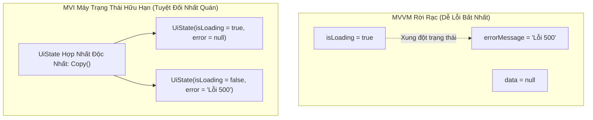
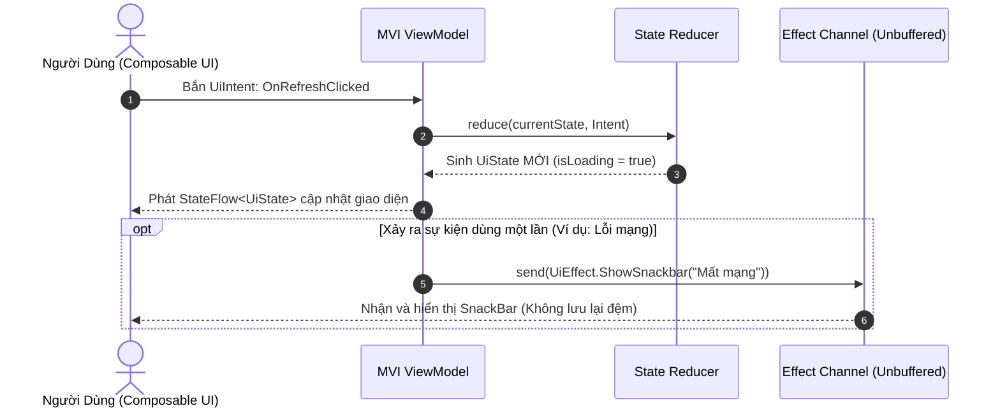

# Học Phần 07: Máy Trạng Thái MVI & Unidirectional Data Flow (MVI State Machines)

[](#mục-tiêu-học-tập)
[](#1-tại-sao-mvvm-truyền-thống-thất-bại-trong-ứng-dụng-lớn)
[](../skills/kmp-mvi-stateflow-architecture/SKILL.md)
[](../skills/kmp-testing-mocking-turbines/SKILL.md)

---

## 🎯 Mục Tiêu Học Tập
1. Nhận diện các điểm yếu chết người của mô hình MVVM truyền thống: hiện tượng **Trạng thái Bất khả thi (Impossible States)** khi duy trì nhiều biến `StateFlow` rời rạc.
2. Làm chủ kiến trúc **Model-View-Intent (MVI)** và nguyên lý **Luồng dữ liệu đơn hướng (Unidirectional Data Flow - UDF)**.
3. Thiết kế hợp đồng 3 thành phần rõ ràng: **`UiState` (Trạng thái bất biến)**, **`UiIntent` (Ý định thao tác)**, và **`UiEffect` (Sự kiện dùng 1 lần)**.
4. Triệt tiêu hoàn toàn lỗi hiển thị trùng lặp SnackBar / Dialog khi xoay màn hình bằng cách sử dụng **Unbuffered Channel** thay vì SharedFlow.
5. Viết Unit Test kiểm thử máy trạng thái MVI toàn diện với thư viện **CashApp Turbine**.

---

## 🧠 1. Tại Sao MVVM Truyền Thống Thất Bại Trong Ứng Dụng Lớn?

Trong mô hình MVVM cũ, ViewModel thường khai báo nhiều biến rời rạc:
```kotlin
// ❌ CÁCH VIẾT SAI TRONG MVVM TRUYỀN THỐNG:
val isLoading = MutableStateFlow(false)
val errorMessage = MutableStateFlow<String?>(null)
val userList = MutableStateFlow<List<User>>(emptyList())
```
Điều gì xảy ra nếu mạng chậm và xảy ra lỗi? Lập trình viên có thể quên set `isLoading.value = false`, dẫn đến hiện tượng: **Vòng xoay Loading vẫn quay trong khi thông báo lỗi đã hiện lên!** Đây gọi là **Trạng thái Bất khả thi (Impossible State)**.



---

## 🔄 2. Chu Trình MVI Khép Kín (The Closed MVI Loop)



---

## 💻 3. Triển Khai Thực Chiến: Khung Sườn Base MVI ViewModel

### 3.1. Hợp Đồng Trạng Thái (State Contracts)
```kotlin
package com.example.curriculum.level7.mvi

import androidx.compose.runtime.Immutable
import kotlinx.collections.immutable.ImmutableList
import kotlinx.collections.immutable.persistentListOf

// 1. UiState: Bắt buộc @Immutable để Compose Compiler tối ưu Recomposition
@Immutable
data class OrderListUiState(
    val isLoading: Boolean = false,
    val orders: ImmutableList<String> = persistentListOf(),
    val errorMessage: String? = null
)

// 2. UiIntent: Mọi thao tác của người dùng phải được định nghĩa bằng Sealed Interface
sealed interface OrderListUiIntent {
    data object RefreshOrders : OrderListUiIntent
    data class CancelOrder(val orderId: String) : OrderListUiIntent
}

// 3. UiEffect: Các sự kiện dùng một lần (Single-Shot Event), không được lưu vào State
sealed interface OrderListUiEffect {
    data class ShowToast(val message: String) : OrderListUiEffect
    data class NavigateToOrderDetail(val orderId: String) : OrderListUiEffect
}
```

### 3.2. MVI ViewModel Hoàn Chỉnh
```kotlin
package com.example.curriculum.level7.mvi

import kotlinx.coroutines.channels.Channel
import kotlinx.coroutines.flow.*
import kotlinx.coroutines.launch
import kotlinx.coroutines.CoroutineScope
import kotlinx.collections.immutable.toImmutableList

class OrderListViewModel(
    private val scope: CoroutineScope
) {
    // StateFlow nội bộ quản lý trạng thái
    private val _uiState = MutableStateFlow(OrderListUiState())
    val uiState: StateFlow<OrderListUiState> = _uiState.asStateFlow()

    // Channel không đệm: Sự kiện chỉ được nhận đúng 1 lần duy nhất!
    private val _uiEffect = Channel<OrderListUiEffect>(Channel.BUFFERED)
    val uiEffect: Flow<OrderListUiEffect> = _uiEffect.receiveAsFlow()

    fun handleIntent(intent: OrderListUiIntent) {
        when (intent) {
            is OrderListUiIntent.RefreshOrders -> loadOrders()
            is OrderListUiIntent.CancelOrder -> cancelOrder(intent.orderId)
        }
    }

    private fun loadOrders() {
        scope.launch {
            // Bước 1: Chuyển sang trạng thái Loading
            _uiState.update { it.copy(isLoading = true, errorMessage = null) }
            
            try {
                // Giả lập lấy dữ liệu
                val remoteOrders = listOf("Đơn #101 - Đang giao", "Đơn #102 - Hoàn thành")
                _uiState.update { 
                    it.copy(isLoading = false, orders = remoteOrders.toImmutableList()) 
                }
            } catch (e: Exception) {
                _uiState.update { it.copy(isLoading = false, errorMessage = e.message) }
                _uiEffect.send(OrderListUiEffect.ShowToast("Không thể tải danh sách đơn hàng"))
            }
        }
    }

    private fun cancelOrder(orderId: String) {
        scope.launch {
            _uiEffect.send(OrderListUiEffect.ShowToast("Đã hủy đơn hàng: $orderId"))
        }
    }
}
```

---

## 🧪 4. Kiểm Thử Luồng MVI Với CashApp Turbine

Kiểm thử Coroutine Flow thông thường rất khó vì tính chất bất đồng bộ. **Turbine** cho phép bắt và khẳng định từng giá trị được phát ra theo đúng trình tự thời gian.

```kotlin
package com.example.curriculum.level7.mvi

import app.cash.turbine.test
import kotlinx.coroutines.test.runTest
import kotlin.test.Test
import kotlin.test.assertEquals
import kotlin.test.assertFalse
import kotlin.test.assertTrue

class OrderListViewModelTest {

    @Test
    fun `refreshOrders emit Loading sau do Success`() = runTest {
        val viewModel = OrderListViewModel(scope = this)

        // Sử dụng Turbine kiểm tra uiState
        viewModel.uiState.test {
            // 1. Giá trị khởi tạo
            val initial = awaitItem()
            assertFalse(initial.isLoading)
            assertEquals(0, initial.orders.size)

            // 2. Người dùng bấm Refresh
            viewModel.handleIntent(OrderListUiIntent.RefreshOrders)

            // 3. Trạng thái Loading xuất hiện
            val loadingState = awaitItem()
            assertTrue(loadingState.isLoading)

            // 4. Trạng thái Success xuất hiện kèm dữ liệu
            val successState = awaitItem()
            assertFalse(successState.isLoading)
            assertEquals(2, successState.orders.size)

            cancelAndIgnoreRemainingEvents()
        }
    }
}
```

---

## 🚫 5. Bảng Đối Chiếu Anti-Patterns (Bẫy Sai Trong MVI)

| Anti-Pattern (Lỗi Sơ Cấp) | Hậu Quả Thực Tế | Giải Pháp Chuẩn Doanh Nghiệp |
| :--- | :--- | :--- |
| **Dùng `SharedFlow` cho SnackBar/Dialog** | Khi người dùng xoay ngang điện thoại, sự kiện bị phát lại (Replay), làm hiện lại SnackBar cũ. | Dùng `Channel<Effect>(Channel.BUFFERED)` để đảm bảo sự kiện tiêu thụ xong là biến mất. |
| **Dùng `java.util.List` trong `UiState`** | Compose Compiler coi `List` là Unstable, khiến toàn bộ màn hình bị Recompose liên tục. | Dùng `kotlinx.collections.immutable.ImmutableList` hoặc đánh dấu `@Immutable`. |
| **Tự ý sửa trực tiếp biến trong State** | Vi phạm tính bất biến, Compose không phát hiện ra thay đổi để Recompose. | Luôn dùng hàm `.update { it.copy(...) }` để tạo bản sao trạng thái mới. |

---

## 📝 6. Bài Tập Thực Hành & Thử Thách Đồ Án

1. **Thử Thách 1**: Xây dựng màn hình đăng nhập (Authentication) theo chuẩn MVI gồm các Intent: `EmailChanged`, `PasswordChanged`, `SubmitLogin`. Thiết kế `LoginUiState` tự động tính toán cờ `isSubmitEnabled` khi email và mật khẩu hợp lệ.
2. **Thử Thách 2**: Viết bộ test suite hoàn chỉnh bằng Turbine để kiểm tra khi đăng nhập thất bại thì `LoginUiState.isLoading` trở về `false` và `UiEffect.ShowToast` nhận đúng thông báo lỗi.

---

👉 **Bước Tiếp Theo**: Chuyển sang [**Học Phần 08: Động Cơ Đồng Bộ Offline-First & Mutation Outbox**](08-level-8-offline-first-sync.md)!
