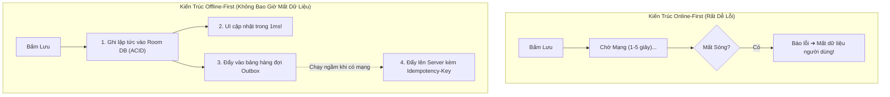
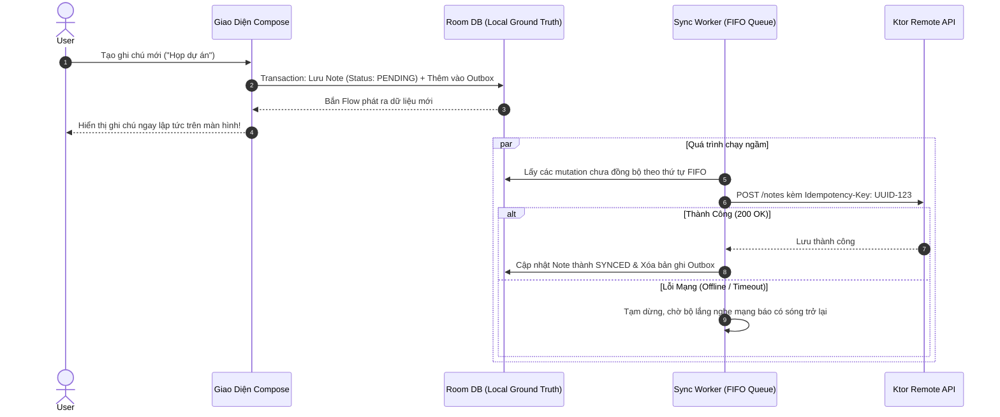

# Học Phần 08: Động Cơ Đồng Bộ Offline-First & Mutation Outbox Engine

[](#mục-tiêu-học-tập)
[](#1-bản-chất-offline-first-và-sự-thất-bại-của-online-only)
[](../skills/kmp-offline-sync-engine/SKILL.md)
[](../skills/kmp-offline-room-database/SKILL.md)

---

## 🎯 Mục Tiêu Học Tập
1. Hiểu sâu sắc sự khác biệt giữa ứng dụng chỉ có bộ nhớ đệm (Cache-aside) và kiến trúc **Ngoại tuyến thực thụ (True Offline-First)**.
2. Làm chủ mẫu thiết kế **Mutation Outbox Pattern**: tách biệt hoàn toàn giữa việc ghi dữ liệu cục bộ và việc đồng bộ lên đám mây.
3. Triển khai kỹ thuật **Cập nhật giao diện Lạc quan (Optimistic UI Updates)**: người dùng nhìn thấy dữ liệu thay đổi ngay lập tức sau 1ms mà không cần chờ phản hồi mạng.
4. Đảm bảo tính an toàn chống trùng lặp bằng UUID **Idempotency-Key** trong giao thức HTTP.
5. Giải quyết xung đột dữ liệu đa thiết bị bằng chiến lược **Last-Write-Wins (LWW)** hoặc Server-Wins.

---

## 🧠 1. Bản Chất Offline-First & Sự Thất Bại Của Ứng Dụng Online-Only

Trong kiến trúc thông thường (Online-first), mỗi khi người dùng bấm "Lưu", ứng dụng sẽ hiển thị vòng xoay Loading và chờ máy chủ trả về 200 OK. Nếu người dùng đang đi vào thang máy hoặc mất sóng: **Ứng dụng báo lỗi và toàn bộ nội dung người dùng vừa nhập bị mất trắng!**



---

## 🔄 2. Luồng Xử Lý Hàng Đợi Mutation Outbox (FIFO Replay)



---

## 💻 3. Triển Khai Thực Chiến: Mutation Outbox Engine

### 3.1. Thiết Kế Bảng Hàng Đợi Outbox (Room KMP)
```kotlin
package com.example.curriculum.level8.data.sync

import androidx.room.*
import kotlinx.serialization.Serializable
import kotlinx.serialization.json.Json

enum class SyncActionType { CREATE, UPDATE, DELETE }
enum class SyncStatus { PENDING, IN_PROGRESS, FAILED }

@Entity(tableName = "mutation_outbox")
data class MutationOutboxEntity(
    @PrimaryKey val id: String, // UUID đại diện cho Idempotency-Key
    val entityType: String,      // Ví dụ: "NOTE", "COMMENT"
    val entityId: String,        // ID của đối tượng bị thay đổi
    val action: SyncActionType,
    val payloadJson: String,     // Dữ liệu JSON tuần tự hóa
    val createdAtEpoch: Long,
    val retryCount: Int = 0,
    val status: SyncStatus = SyncStatus.PENDING
)

@Dao
interface MutationOutboxDao {
    @Query("SELECT * FROM mutation_outbox ORDER BY createdAtEpoch ASC LIMIT 20")
    suspend fun getPendingBatch(): List<MutationOutboxEntity>

    @Insert(onConflict = OnConflictStrategy.REPLACE)
    suspend fun enqueue(mutation: MutationOutboxEntity)

    @Query("DELETE FROM mutation_outbox WHERE id = :id")
    suspend fun markCompleted(id: String)

    @Query("UPDATE mutation_outbox SET retryCount = retryCount + 1, status = :status WHERE id = :id")
    suspend fun recordRetry(id: String, status: SyncStatus)
}
```

### 3.2. Động Cơ Điều Phối Đồng Bộ (Sync Engine Dispatcher)
```kotlin
package com.example.curriculum.level8.data.sync

import io.ktor.client.*
import io.ktor.client.request.*
import io.ktor.http.*
import kotlinx.coroutines.delay

class OfflineSyncEngine(
    private val outboxDao: MutationOutboxDao,
    private val httpClient: HttpClient
) {
    suspend fun processPendingMutations() {
        val pendingBatch = outboxDao.getPendingBatch()
        if (pendingBatch.isEmpty()) return

        for (mutation in pendingBatch) {
            try {
                // Đánh dấu IN_PROGRESS
                outboxDao.recordRetry(mutation.id, SyncStatus.IN_PROGRESS)

                // Gửi request lên server kèm Idempotency-Key chống trùng lặp
                val response = httpClient.post("https://api.example.com/sync/mutate") {
                    contentType(ContentType.Application.Json)
                    header("Idempotency-Key", mutation.id)
                    header("X-Client-Timestamp", mutation.createdAtEpoch.toString())
                    setBody(mutation.payloadJson)
                }

                if (response.status.isSuccess()) {
                    // Thành công: Xóa khỏi hàng đợi Outbox
                    outboxDao.markCompleted(mutation.id)
                } else if (response.status == HttpStatusCode.Conflict) {
                    // Xung đột: Áp dụng Last-Write-Wins (LWW) hoặc tải dữ liệu mới từ Server
                    resolveConflict(mutation)
                    outboxDao.markCompleted(mutation.id)
                } else {
                    outboxDao.recordRetry(mutation.id, SyncStatus.FAILED)
                }
            } catch (e: Exception) {
                // Lỗi mất kết nối mạng: dừng lại để không làm tốn pin
                println("[SyncEngine] Mất mạng, tạm dừng xử lý: ${e.message}")
                break
            }
        }
    }

    private suspend fun resolveConflict(mutation: MutationOutboxEntity) {
        println("[SyncEngine] Đang giải quyết xung đột Last-Write-Wins cho ID: ${mutation.entityId}")
    }
}
```

---

## 🚫 4. Bảng Đối Chiếu Anti-Patterns (Bẫy Sai Trong Offline Sync)

| Anti-Pattern (Lỗi Sơ Cấp) | Hậu Quả Thực Tế | Giải Pháp Chuẩn Doanh Nghiệp |
| :--- | :--- | :--- |
| **Không dùng Idempotency-Key** | Mạng chập chờn khi request đang gửi, người dùng bị tạo trùng 2 hóa đơn hoặc trừ tiền 2 lần. | Luôn sinh UUID gán vào Header `Idempotency-Key` cho mỗi mutation. |
| **Gửi song song các mutation phụ thuộc** | Lệnh "Thêm bình luận" được gửi trước lệnh "Tạo bài viết", khiến Server báo lỗi Foreign Key 404. | Bắt buộc đọc và gửi hàng đợi theo thứ tự tuần tự FIFO (`createdAtEpoch ASC`). |
| **Xóa bản ghi outbox trước khi server phản hồi 200** | Nếu hệ điều hành tắt app ngay lúc đó, dữ liệu của người dùng sẽ biến mất vĩnh viễn. | Chỉ xóa bản ghi khỏi bảng Outbox sau khi nhận mã thành công `2xx` từ API. |

---

## 📝 5. Bài Tập Thực Hành & Thử Thách Đồ Án

1. **Thử Thách 1**: Thiết kế tính năng Bookmark bài viết Offline-First: khi người dùng bấm Bookmark, Room DB cập nhật trạng thái ngay lập tức, đồng thời một mutation `TOGGLE_BOOKMARK` được lưu vào Outbox. Nếu người dùng tắt mạng rồi bật lại, mutation tự động đồng bộ lên server.
2. **Thử Thách 2**: Xây dựng thuật toán giải quyết xung đột Last-Write-Wins (LWW): nếu thời gian sửa đổi cục bộ của người dùng mới hơn thời gian cập nhật trên máy chủ, cho phép ghi đè. Ngược lại, chấp nhận dữ liệu từ máy chủ.

---

👉 **Bước Tiếp Theo**: Chuyển sang [**Học Phần 09: Cầu Nối Phần Cứng & An Toàn Bộ Nhớ Kotlin/Native ARC**](09-level-9-native-memory-arc.md)!
