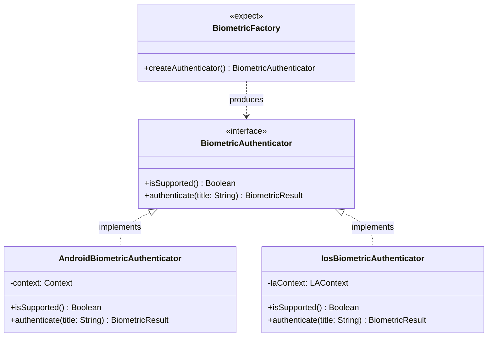

# Học Phần 09: Cầu Nối Phần Cứng Native & An Toàn Bộ Nhớ Kotlin/Native ARC

[](#mục-tiêu-học-tập)
[](#1-bản-chất-bộ-nhớ-arc-trong-kotlinnative-va-hiểm-họa-retain-cycle)
[](../skills/kmp-expect-actual-hardware-interop/SKILL.md)
[](../skills/kmp-memory-leak-profiling/SKILL.md)

---

## 🎯 Mục Tiêu Học Tập
1. Hiểu cặn kẽ sự khác biệt cơ bản giữa cơ chế gom rác **Tracing Garbage Collector (JVM)** và **Automatic Reference Counting (ARC)** trong môi trường **Kotlin/Native (iOS/macOS)**.
2. Nhận diện và triệt tiêu hoàn toàn lỗi **Vòng lặp giữ tham chiếu (Retain Cycles)** khi bắc cầu giao tiếp giữa Swift (iOS) và Kotlin/Native.
3. Thay thế triệt để mô hình cũ `expect class` bằng mẫu thiết kế chuẩn công nghiệp **Interface-Factory Pattern** để cầu nối phần cứng (Sinh trắc học, GPS, Haptic) đạt khả năng viết Unit Test 100%.
4. Nhúng mượt mà Compose Multiplatform vào SwiftUI (`ComposeUIViewController`) và ngược lại (`UIKitView`).
5. Tuân thủ tiêu chuẩn hệ thống trên Android 14/15: đăng ký tường minh **Foreground Service Types** và thiết kế **Edge-to-Edge** với `WindowInsets.safeDrawing`.

---

## 🧠 1. Bản Chất Bộ Nhớ ARC Trong Kotlin/Native & Hiểm Họa Retain Cycle

Trên Android (JVM), GC có thể phát hiện và dọn dẹp các đối tượng tham chiếu vòng tròn nếu chúng không kết nối tới GC Root. Nhưng trên iOS (Kotlin/Native), cơ chế đếm tham chiếu **ARC** sẽ khiến bộ nhớ bị rò rỉ vĩnh viễn nếu Object A giữ Object B và Object B giữ ngược lại Object A!

```mermaid
graph LR
    subgraph RetainCycleHazard ["Hiểm Họa Rò Rỉ Bộ Nhớ (Retain Cycle)"]
        SwiftView["SwiftUI View (ARC)"] -->|Strong Retain| Coordinator["ObservableObject Coordinator"]
        Coordinator -->|Strong Retain| KotlinVM["Shared Kotlin ViewModel"]
        KotlinVM -.->|Strong Callback / Listener| Coordinator
        Note over SwiftView,KotlinVM: Khi màn hình đóng, cả 2 đối tượng không bao giờ được giải phóng!
    end

    subgraph SafeDeallocation ["Giải Pháp Kiến Trúc An Toàn"]
        SView["SwiftUI View"] -->|Retain| SCoord["Coordinator"]
        SCoord -->|Calls onCleared() onDisappear| KVM["Kotlin ViewModel"]
        KVM -->|Cancels Job| Scope["SupervisorJob().cancel()"]
        SCoord -.->|Weak Callback| KVM
    end
```

### Các Quy Tắc An Toàn Bộ Nhớ Tuyệt Đối:
1. **Không giữ Strong Callback từ Swift**: Mọi callback hoặc listener đăng ký từ Swift sang Kotlin phải được bọc trong các tham chiếu yếu hoặc hủy đăng ký khi view biến mất.
2. **Luôn cung cấp hàm `onCleared()`**: Mọi Shared ViewModel phải cung cấp hàm hủy vòng đời để hủy toàn bộ Coroutine con khi người dùng rời khỏi màn hình.

---

## 🔌 2. Cầu Nối Phần Cứng: Interface-Factory Pattern

Tại sao `expect class` bị coi là anti-pattern trong các dự án KMP lớn? Vì `expect class` buộc các nền tảng phải triển khai class cụ thể, gây khó khăn cho việc viết Unit Test với Mock/Fake class trong `commonTest`.



### Mã Nguồn Thực Chiến: Triển Khai Cầu Nối Sinh Trắc Học Đa Nền Tảng

#### 1. Định nghĩa Interface trong `commonMain`
```kotlin
package com.example.curriculum.level9.hardware

sealed interface BiometricResult {
    data object Success : BiometricResult
    data class Failure(val reason: String) : BiometricResult
    data object NotAvailable : BiometricResult
}

// Interface thuần khiết, cực kỳ dễ viết Mock trong commonTest!
interface BiometricAuthenticator {
    fun isSupported(): Boolean
    suspend fun authenticate(promptTitle: String): BiometricResult
}

// Factory expect để khởi tạo theo từng OS
expect class BiometricFactory {
    fun create(): BiometricAuthenticator
}
```

#### 2. Triển khai Actual trên iOS (`iosMain`)
```kotlin
package com.example.curriculum.level9.hardware

import platform.LocalAuthentication.*
import platform.Foundation.*
import kotlin.coroutines.resume
import kotlinx.coroutines.suspendCancellableCoroutine

class IosBiometricAuthenticator : BiometricAuthenticator {
    override fun isSupported(): Boolean {
        val context = LAContext()
        return context.canEvaluatePolicy(LAPolicyDeviceOwnerAuthenticationWithBiometrics, null)
    }

    override suspend fun authenticate(promptTitle: String): BiometricResult = 
        suspendCancellableCoroutine { continuation ->
            val context = LAContext()
            context.evaluatePolicy(
                LAPolicyDeviceOwnerAuthenticationWithBiometrics,
                localizedReason = promptTitle
            ) { success, error ->
                if (success) {
                    continuation.resume(BiometricResult.Success)
                } else {
                    val message = error?.localizedDescription ?: "Xác thực thất bại"
                    continuation.resume(BiometricResult.Failure(message))
                }
            }
        }
}

actual class BiometricFactory {
    actual fun create(): BiometricAuthenticator = IosBiometricAuthenticator()
}
```

---

## 🤖 3. Chuẩn Hóa Hệ Thống Trên Android 14/15

Từ Android 14 và Android 15, Google thắt chặt kiểm soát bảo mật và giao diện tràn viền:
1. **Foreground Service Types**: Mọi Service chạy ngầm đều bắt buộc phải khai báo thuộc tính `android:foregroundServiceType` trong `AndroidManifest.xml` (ví dụ: `dataSync`, `location`, `mediaPlayback`).
2. **Edge-to-Edge Toàn Diện**: Android 15 mặc định bật tràn viền, ứng dụng buộc phải xử lý khoảng trống an toàn bằng `WindowInsets.safeDrawing`.

```kotlin
package com.example.curriculum.level9.ui

import androidx.compose.foundation.layout.*
import androidx.compose.material3.*
import androidx.compose.runtime.Composable
import androidx.compose.ui.Modifier

@Composable
fun Android15SafeScreenContent(content: @Composable () -> Unit) {
    // Tự động tránh Status Bar, Navigation Bar và Dynamic Island/Camera Cutout
    Box(
        modifier = Modifier
            .fillMaxSize()
            .windowInsetsPadding(WindowInsets.safeDrawing)
    ) {
        content()
    }
}
```

---

## 🚫 4. Bảng Đối Chiếu Anti-Patterns (Bẫy Sai Trong Native & Memory)

| Anti-Pattern (Lỗi Sơ Cấp) | Hậu Quả Thực Tế | Giải Pháp Chuẩn Doanh Nghiệp |
| :--- | :--- | :--- |
| **Dùng `expect class` cho mọi API native** | Mã nguồn bị phụ thuộc chặt, không thể viết Test Fakes trong `commonTest`. | Luôn dùng Interface trừu tượng + Factory khởi tạo. |
| **Quên gọi `viewModel.onCleared()` trên iOS** | Các Coroutines chạy ngầm trong ViewModel không bao giờ dừng, gây hao pin và rò rỉ RAM. | Gọi `onCleared()` bên trong sự kiện `.onDisappear()` của SwiftUI. |
| **Chạy Foreground Service không khai báo Type trên Android 14+** | Ứng dụng bị hệ điều hành tắt ngay lập tức kèm lỗi `SecurityException`. | Khai báo chính xác loại service trong AndroidManifest và mã nguồn Kotlin. |

---

## 📝 5. Bài Tập Thực Hành & Thử Thách Đồ Án

1. **Thử Thách 1**: Triển khai cầu nối rung phản hồi xúc giác (`HapticFeedbackEngine`) theo mô hình Interface-Factory: hỗ trợ `impact()`, `notificationSuccess()`, và `notificationError()` trên cả Android (Vibrator API) và iOS (`UIImpactFeedbackGenerator`).
2. **Thử Thách 2**: Tích hợp một màn hình Compose Multiplatform hoàn chỉnh nhúng vào trong ứng dụng iOS hiện có thông qua `ComposeUIViewController`. Viết kịch bản kiểm tra xem khi thoát màn hình thì bộ nhớ RAM có được giải phóng hoàn toàn hay không.

---

👉 **Bước Tiếp Theo**: Chuyển sang [**Học Phần 10: Tối Ưu Hóa Hiệu Năng 120Hz, Compiler Stability, Testing & CI/CD**](10-level-10-performance-devops.md)!
