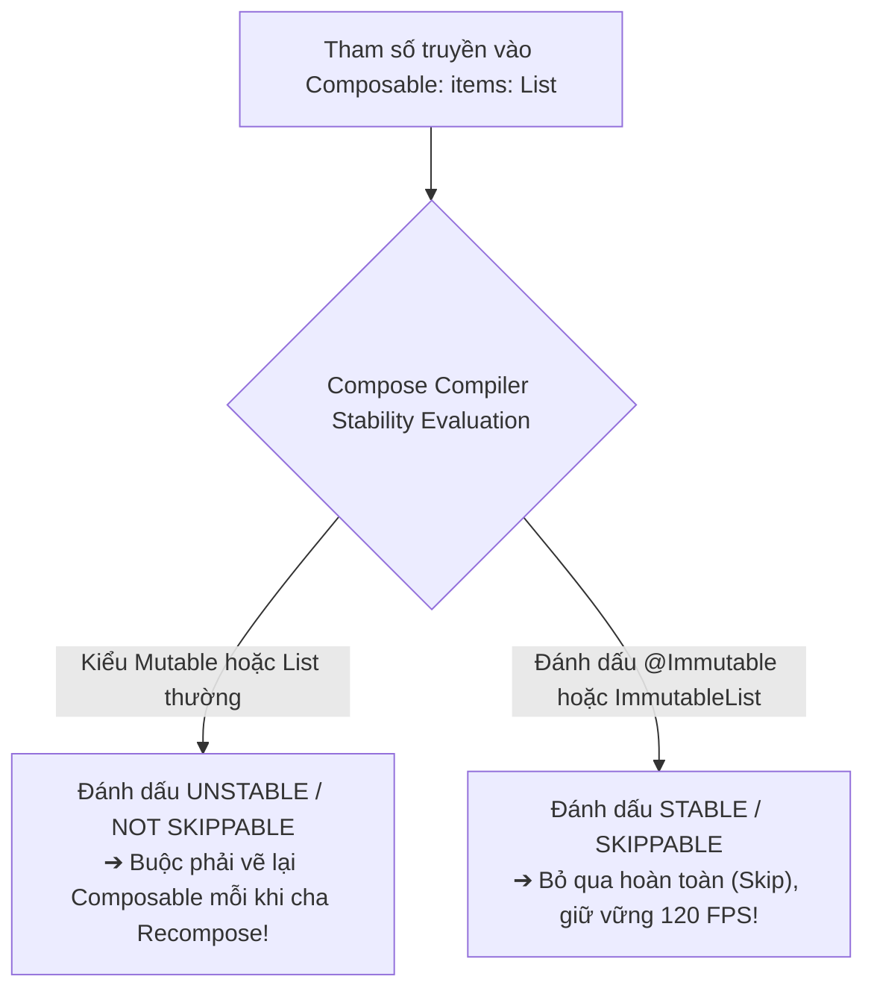
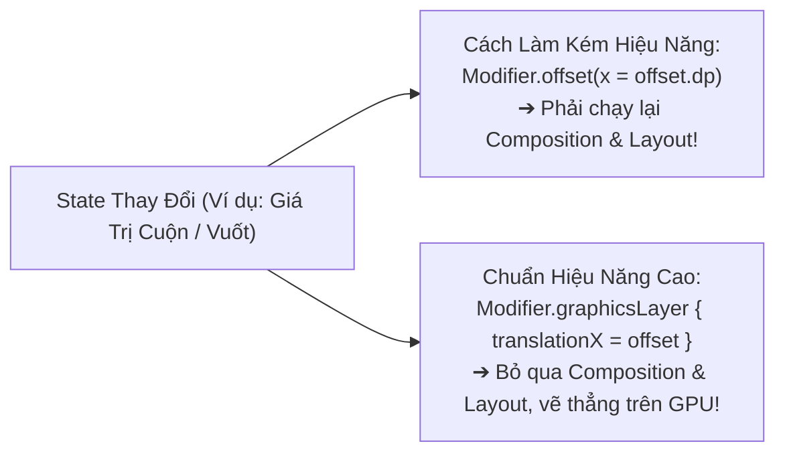
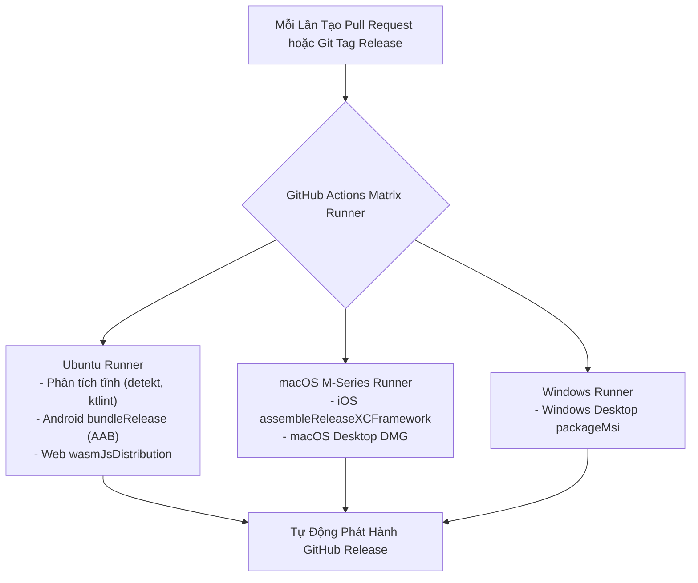

# Học Phần 10: Tối Ưu Hóa Hiệu Năng 120Hz, Compiler Stability, Testing & CI/CD

[](#mục-tiêu-học-tập)
[](#1-kiểm-toán-tính-ổn-định-compose-compiler-stability)
[](../skills/kmp-compose-compiler-recomposition-optimization/SKILL.md)
[](../skills/kmp-ci-cd-matrix-automation/SKILL.md)

---

## 🎯 Mục Tiêu Học Tập
1. Hiểu sâu cơ chế **Compose Compiler Stability (Stable vs Unstable types)** và phương pháp sinh báo cáo **Compose Compiler Metrics** để kiểm toán khả năng bỏ qua vẽ lại (Skippability).
2. Tối ưu hóa hoạt ảnh mượt mà đạt chuẩn **120Hz (8.33ms / khung hình)** bằng cách chuyển các biến đổi tọa độ sang tầng kết xuất `Modifier.graphicsLayer { ... }`.
3. Tăng tốc khởi động ứng dụng Android lên tới 40% (Cold start < 400ms) bằng **Android Baseline Profiles** và tối ưu hóa ProGuard/R8 Full Mode.
4. Triển khai kiểm thử hồi quy giao diện không cần giả lập thiết bị bằng **Roborazzi Headless Screenshot Testing**.
5. Xây dựng đường ống tự động hóa **CI/CD Matrix Pipeline** trên GitHub Actions xuất đồng thời bản cài đặt cho Android (AAB), iOS (XCFramework/IPA), Desktop (MSI/DMG) và Web (Wasm).

---

## ⚡ 1. Kiểm Toán Tính Ổn Định Compose Compiler Stability

Tại sao một Composable nhận tham số kiểu `List<User>` lại luôn bị Recompose lại ngay cả khi danh sách đó không hề thay đổi?
- **Nguyên nhân**: Interface `List` trong Kotlin tiêu chuẩn có thể bị ép kiểu ngầm sang `java.util.ArrayList` (vốn là kiểu Mutable). Do đó, Compose Compiler coi `List` là **Unstable** và không dám bỏ qua (Unskippable).



### Lệnh Xuất Báo Cáo Compose Compiler Metrics
Chạy lệnh sau trong Terminal để xuất toàn bộ chỉ số kiểm toán:
```bash
./gradlew assembleRelease -Pplugin:androidx.compose.compiler.plugins.kotlin:reportsDestination=build/compose_metrics
```

### Mã Nguồn Thực Chiến: Chuẩn Hóa Model Cho Compose Compiler
```kotlin
package com.example.curriculum.level10.performance

import androidx.compose.runtime.Composable
import androidx.compose.runtime.Immutable
import kotlinx.collections.immutable.ImmutableList
import kotlinx.collections.immutable.persistentListOf

// 1. Luôn khai báo @Immutable cho UI State Model
@Immutable
data class ProductCardModel(
    val id: String,
    val title: String,
    val priceFormatted: String,
    // Dùng ImmutableList để trình biên dịch biết chắc 100% không bị thay đổi
    val tags: ImmutableList<String> = persistentListOf()
)

// 2. Composable này được Compiler đánh dấu là SKIPPABLE!
@Composable
fun ProductCardItem(
    model: ProductCardModel,
    onClick: (String) -> Unit
) {
    // Nếu model không đổi, hàm này KHÔNG BAO GIỜ bị vẽ lại thừa!
}
```

---

## 🏎️ 2. Ngân Sách Khung Hình 120Hz & Đồ Họa GraphicsLayer

Trong màn hình 120Hz, hệ thống chỉ có **8.33 milliseconds** để hoàn thành một khung hình. Nếu logic của bạn làm tốn hơn 8.33ms, hiện tượng giật khung hình (Jank/Drop Frame) sẽ xảy ra.



### Mã Nguồn Thực Chiến: Hoạt Ảnh Chạy Thẳng Trên GPU Render Thread
```kotlin
package com.example.curriculum.level10.performance

import androidx.compose.animation.core.*
import androidx.compose.foundation.layout.Box
import androidx.compose.runtime.Composable
import androidx.compose.runtime.getValue
import androidx.compose.ui.Modifier
import androidx.compose.ui.graphics.graphicsLayer

@Composable
fun ZeroJankFloatingBadge(modifier: Modifier = Modifier) {
    val infiniteTransition = rememberInfiniteTransition(label = "pulse")
    val scale by infiniteTransition.animateFloat(
        initialValue = 0.95f,
        targetValue = 1.05f,
        animationSpec = infiniteRepeatable(
            animation = tween(800, easing = FastOutSlowInEasing),
            repeatMode = RepeatMode.Reverse
        ),
        label = "scale"
    )

    // SỬ DỤNG graphicsLayer: Bỏ qua giai đoạn Layout & Draw, chỉ tốn 0.1ms trên GPU!
    Box(
        modifier = modifier.graphicsLayer {
            scaleX = scale
            scaleY = scale
        }
    )
}
```

---

## 🚀 3. Tăng Tốc Khởi Động Với Android Baseline Profiles

**Baseline Profiles** chứa các quy tắc biên dịch trước (AOT Compilation Rules) được cài đặt kèm file APK/AAB. Nhờ đó, máy ảo Android Runtime (ART) không cần thông dịch (JIT) mã nguồn khi người dùng mở ứng dụng lần đầu.


### Quy Tắc Thu Thập Macrobenchmark:
```kotlin
package com.example.benchmark

import androidx.benchmark.macro.junit4.BaselineProfileRule
import androidx.test.ext.junit.runners.AndroidJUnit4
import org.junit.Rule
import org.junit.Test
import org.junit.runner.RunWith

@RunWith(AndroidJUnit4::class)
class StartupBaselineProfileGenerator {
    @get:Rule
    val baselineRule = BaselineProfileRule()

    @Test
    fun generateBaselineProfile() = baselineRule.collect(
        packageName = "com.example.app",
        includeInStartupProfile = true
    ) {
        // Tái hiện hành động mở ứng dụng và cuộn màn hình trang chủ
        pressHome()
        startActivityAndWait()
    }
}
```

---

## 🌐 4. Tự Động Hóa Ma Trận CI/CD Toàn Cầu (GitHub Actions Matrix)

Đóng gói và kiểm thử tự động trên nhiều hệ điều hành cùng một lúc:



---

## 🚫 5. Bảng Đối Chiếu Anti-Patterns (Bẫy Sai Trong Hiệu Năng & DevOps)

| Anti-Pattern (Lỗi Sơ Cấp) | Hậu Quả Thực Tế | Giải Pháp Chuẩn Doanh Nghiệp |
| :--- | :--- | :--- |
| **Dùng `Modifier.offset(x.dp)` cho animation cuộn** | Kích hoạt lại Recomposition và Layout phase 120 lần/giây, gây đơ lag màn hình. | Luôn chuyển sang `Modifier.graphicsLayer { translationX = x }`. |
| **Bỏ qua kiểm toán Compose Compiler Metrics** | Hàng loạt Composable bị Unstable ngầm mà lập trình viên không hề hay biết. | Bật cờ kiểm tra metrics trong build script và chặn build nếu có màn hình Unskippable. |
| **Không dùng Baseline Profiles trên Android** | Ứng dụng bị chậm, đơ lag trong vài giây đầu sau khi người dùng tải từ Google Play. | Tạo kịch bản Macrobenchmark tự động thu thập Baseline Profiles trước mỗi bản Release. |
| **Build release thủ công trên máy tính cá nhân** | Nguy cơ sai lệch môi trường, lộ key ký bảo mật và thiếu tính minh bạch. | Tự động hóa 100% quy trình ký và đóng gói bằng GitHub Actions Matrix. |

---

## 🎓 6. Đồ Án Tốt Nghiệp: Xây Dựng Ứng Dụng Đa Nền Tảng Chuẩn Doanh Nghiệp

Chúc mừng bạn đã hoàn thành trọn vẹn 10 học phần của **Giáo Trình Android Native & Kotlin Multiplatform**! Để được công nhận trình độ **Master Multiplatform Architect**, hãy thực hiện đồ án tốt nghiệp tổng hợp sau:

### Yêu Cầu Đồ Án Tổng Hợp:
1. **Kiến Trúc**: Xây dựng ứng dụng tin tức tài chính đa nền tảng (Android, iOS, Desktop, Web) tuân thủ Clean Architecture đa module.
2. **Quản Lý Trạng Thái**: Triển khai máy trạng thái MVI hoàn chỉnh với CashApp Turbine test coverage > 85%.
3. **Dữ Liệu & Mạng**: Tích hợp Room KMP 2.7+ và Ktor Client 3.x với cơ chế đồng bộ **Mutation Outbox (Offline-First)**.
4. **Hiệu Năng**: Đạt 100% Skippable trên các Composable chính (kiểm toán qua Compose Metrics) và không giật khung hình ở tần số quét 120Hz.
5. **Tự Động Hóa**: Cấu hình pipeline GitHub Actions tự động kiểm tra code style và đóng gói bản cài đặt.

---

Tham khảo trực tiếp **27 Siêu Kỹ Năng Thực Chiến** tại thư mục [`skills/`](../skills) để giải quyết bất kỳ thách thức kỹ thuật nào trong quá trình phát triển dự án!
