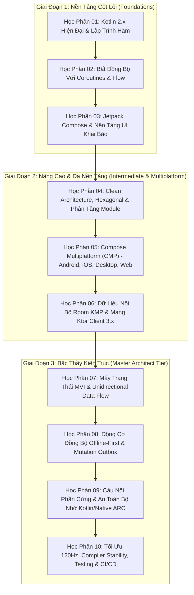

# 🎓 Giáo Trình Đào Tạo Kỹ Sư Android & Kotlin Multiplatform (Zero to Master Architect)

Chào mừng bạn đến với **Hệ thống Giáo trình Chuyên sâu về Android Native & Kotlin Multiplatform (KMP/CMP)**. Bộ giáo trình này được thiết kế và biên soạn theo tiêu chuẩn kép: **Kiến Trúc Sư Hệ Thống / Di Động Trưởng (Principal Mobile Architect)** và **Giảng Viên Kỹ Thuật Cao Cấp**, đưa người học từ những bước chân lập trình đầu tiên cho đến khi làm chủ toàn diện các kiến trúc đa nền tảng phức tạp nhất.

---

## 🗺️ Lộ Trình Đào Tạo 10 Cấp Độ (Curriculum Syllabus)

Hệ thống bài học được tổ chức thành 10 học phần (tương ứng với 10 file tài liệu chuyên sâu), dẫn dắt qua 3 giai đoạn chuyển hóa:

---

## 📚 Mục Lục Chi Tiết Các Học Phần

| Học Phần | File Tài Liệu | Trọng Tâm Kiến Thức | Cấp Độ |
| :---: | :--- | :--- | :---: |
| **01** | [**`01-level-1-kotlin-core.md`**](01-level-1-kotlin-core.md) | Hệ thống kiểu dữ liệu Kotlin 2.x, Immutability, `data object`, `value class`, `sealed interface`, Higher-order functions, Inline reified generics. | **Cơ bản** |
| **02** | [**`02-level-2-coroutines-flow.md`**](02-level-2-coroutines-flow.md) | Xử lý đa luồng bất đồng bộ, CoroutineScope, SupervisorJob, Structured Concurrency, Cold Flow vs Hot StateFlow/SharedFlow, toán tử chuyển đổi luồng. | **Cơ bản** |
| **03** | [**`03-level-3-compose-basics.md`**](03-level-3-compose-basics.md) | Tư duy giao diện khai báo (Declarative UI), Vòng đời Recomposition, State Hoisting, Quản lý Side-Effects (`LaunchedEffect`, `DisposableEffect`), Layout nguyên tử. | **Cơ sở UI** |
| **04** | [**`04-level-4-clean-architecture.md`**](04-level-4-clean-architecture.md) | Kiến trúc Clean Architecture, Nguyên lý Inversion of Control, Ports & Adapters, Phân tách module độc lập (`:core:*`, `:feature:*`, `:app:*`), Koin DI Multiplatform. | **Nâng cao** |
| **05** | [**`05-level-5-cmp-multiplatform-ui.md`**](05-level-5-cmp-multiplatform-ui.md) | Compose Multiplatform (CMP) 1.7+, Đồ họa Skiko, Điều hướng Type-Safe Navigation Compose, Giao diện tương thích đa kích thước WindowSizeClass, Hệ thống Theme Tokens. | **Nâng cao** |
| **06** | [**`06-level-6-data-networking.md`**](06-level-6-data-networking.md) | Cơ sở dữ liệu SQLite đa nền tảng Room KMP 2.7+ (`BundledSQLiteDriver`), DataStore Preferences & Mã hóa Keystore/Keychain, Ktor Client 3.x với Silent Token Refresh. | **Nâng cao** |
| **07** | [**`07-level-7-mvi-state-machines.md`**](07-level-7-mvi-state-machines.md) | Mô hình Model-View-Intent (MVI), Máy trạng thái hữu hạn, Khử trùng lặp sự kiện giao diện bằng Channel Effect, Kiểm thử luồng ViewModel với CashApp Turbine. | **Chuyên sâu** |
| **08** | [**`08-level-8-offline-first-sync.md`**](08-level-8-offline-first-sync.md) | Trải nghiệm ngoại tuyến tuyệt đối (Offline-First), Mẫu thiết kế Mutation Outbox, Giao dịch nguyên tử ACID, Khóa Idempotency-Key, Chiến lược giải quyết xung đột LWW. | **Chuyên sâu** |
| **09** | [**`09-level-9-native-memory-arc.md`**](09-level-9-native-memory-arc.md) | Mô hình Interface-Factory thay thế `expect class`, Quản lý vòng lặp bộ nhớ Kotlin/Native ARC (Retain Cycles), Nhúng Compose vào SwiftUI, Tích hợp Android 14/15 Services. | **Master** |
| **10** | [**`10-level-10-performance-devops.md`**](10-level-10-performance-devops.md) | Khử giật khung hình 120Hz (`Modifier.graphicsLayer`), Kiểm toán Compose Compiler Stability, Baseline Profiles & R8 Shrinking, Roborazzi Screenshot Testing, CI/CD đa nền tảng. | **Master** |

---

## 🎯 Phương Pháp Tiếp Cận Độc Đáo: Lý Thuyết ➔ Code Doanh Nghiệp ➔ Siêu Skills

Mỗi học phần trong giáo trình đều tuân thủ cấu trúc 5 bước đào tạo chuẩn hóa:
1. **Bản Đồ Tư Duy & Lý Thuyết Cốt Lõi**: Giải thích bản chất cơ chế hoạt động, tại sao giải pháp này ra đời và giải quyết vấn đề gì.
2. **Sơ Đồ Luồng Dữ Liệu Trực Quan (Mermaid)**: Trực quan hóa tương tác giữa các thành phần.
3. **Mã Nguồn Thực Chiến Chuẩn Kotlin 2.x (Zero-Stub)**: 100% mã nguồn có kiểu dữ liệu đầy đủ, chạy được ngay, không dùng code giả lập (`// TODO`).
4. **Bảng Đối Chiếu Anti-Patterns (Bẫy Sai Phổ Biến)**: Nhận diện lỗi thường gặp của lập trình viên sơ cấp và cách sửa chữa theo chuẩn doanh nghiệp.
5. **Đồ Án Thực Hành & Liên Kết Siêu Skills**: Giao bài tập đồ án thực chiến và liên kết trực tiếp tới các file trong kho lưu trữ [`skills/`](../skills) để áp dụng vào công việc hàng ngày.

---

Bắt đầu ngay với [**Học Phần 01: Kotlin 2.x Hiện Đại & Lập Trình Hàm**](01-level-1-kotlin-core.md)!
