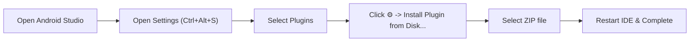

# 📖 KMPSkills Assistant — Android Studio Plugin User Guide

This guide provides step-by-step instructions on how to install, configure, use, and troubleshoot the **KMPSkills Assistant** native plugin for **Android Studio** and **IntelliJ IDEA**.

---

## 📌 1. Pre-built Distribution Information

The plugin has been built and packaged into a production-ready ZIP distribution:

| Parameter | Value |
| :--- | :--- |
| **Plugin Name** | `KMPSkills Assistant` |
| **Version** | `1.0.0` |
| **File Size** | `~1.63 MB` |
| **ZIP File Path** | `c:\VPS\KMPSkills\plugins\android-studio\build\distributions\kmpskills-android-studio-plugin-1.0.0.zip` |
| **IDE Compatibility** | Android Studio Hedgehog (2023.1), Iguana (2023.2), Jellyfish (2023.3), Koala (2024.1), Ladybug (2024.2), Meerkat (2024.3+) & IntelliJ IDEA 2023.3 – 2024.3+ |

---

## 🚀 2. Step-by-Step Installation Guide (Install Plugin from Disk)



### Step 1: Open Android Studio
Launch Android Studio and open any Android Native or Kotlin Multiplatform (KMP) project.

### Step 2: Open Settings / Preferences
- **Windows / Linux**: Press `Ctrl + Alt + S` (or navigate to `File > Settings`).
- **macOS**: Press `Cmd + ,` (or navigate to `Android Studio > Settings / Preferences`).

### Step 3: Navigate to the Plugins Section
In the left sidebar of the Settings window, click **Plugins**.

### Step 4: Choose "Install Plugin from Disk..."
1. At the top of the Plugins panel, click the **Gear icon (⚙️)** next to the *Installed* tab.
2. From the dropdown menu, select **"Install Plugin from Disk..."**.

### Step 5: Select the Plugin ZIP Distribution
In the file chooser dialog, navigate to the project directory and select the distribution ZIP:
```text
c:\VPS\KMPSkills\plugins\android-studio\build\distributions\kmpskills-android-studio-plugin-1.0.0.zip
```
Click **OK**.

### Step 6: Apply & Restart IDE
1. Click **Apply** or **OK** at the bottom of the Settings window.
2. When prompted, click **Restart IDE** to activate the plugin.

---

## 🌟 3. Feature Walkthrough & Usage Guide

Once Android Studio restarts, three primary feature sets become active:

---

### Feature 1: KMPSkills Sidebar Tool Window

On the right-hand tool stripe of Android Studio, click the **KMPSkills** tab to open the control center:

```
┌────────────────────────────────────────────────────────┐
│  💎 KMPSkills Assistant (v1.0.0)                      │
├────────────────────────────────────────────────────────┤
│  [ ⚡ Inject AI Rules ]    [ 🔍 Run Architecture Doctor ] │
├────────────────────────────────────────────────────────┤
│  [Tab: 27 Skills Catalog]   [Tab: 10-Level Curriculum] │
│                                                        │
│  🔍 Search skills: [ mvi...                 ]          │
│                                                        │
│  • kmp-mvi-stateflow-architecture                      │
│    Immutable state, ViewModel Flow & Channel effects   │
│    [ 📋 Copy Directive for AI Chat ]                   │
│                                                        │
│  • kmp-offline-room-database                           │
│    Room KMP 2.7+ BundledSQLiteDriver, Flow DAO...     │
│    [ 📋 Copy Directive for AI Chat ]                   │
└────────────────────────────────────────────────────────┘
```

1. **`⚡ Inject AI Rules` Button**:
   - Automatically writes `.github/copilot-instructions.md` and `.cursor/rules/` into the current project in 1 second.
   - Ensures **GitHub Copilot** and **Gemini Code Assist** in Android Studio enforce all 27 architectural standards.

2. **`🔍 Run Architecture Doctor` Button**:
   - Audits `gradle/libs.versions.toml` to verify Kotlin, AGP, Ktor, Room, and Koin version alignments.

3. **`27 Skills Catalog` Tab**:
   - Instant real-time filtering across all 27 architectural skills.
   - Click **"📋 Copy Directive for AI Chat"** to copy the architecture instructions directly to the clipboard for pasting into the AI chat window.

4. **`10-Level Curriculum` Tab**:
   - Browse the 10-level masterclass syllabus directly inside Android Studio without leaving your IDE.

---

### Feature 2: Right-Click Context Menu Code Generators (Scaffolding)

Right-click any package folder inside `src/commonMain/kotlin/...` (or `src/main/java/...`):

#### 1. Generate Full MVI Feature Screen
1. Right-click package > **KMPSkills > New MVI Feature Screen...**
2. Enter the feature name (e.g. `Cart` or `ProductDetail`).
3. Click **OK**. The plugin generates 5 warning-free Kotlin files:
   - `<Name>UiState.kt`: `@Immutable` model with `ImmutableList`.
   - `<Name>UiIntent.kt`: User actions contract with `sealed interface`.
   - `<Name>UiEffect.kt`: One-shot side-effects (Snackbar, Navigation) via `Channel`.
   - `<Name>ViewModel.kt`: Unidirectional Coroutines Flow ViewModel.
   - `<Name>Screen.kt`: Jetpack Compose UI with strict state hoisting.

#### 2. Generate Room KMP Entity & Reactive Flow DAO
1. Right-click database package > **KMPSkills > New Room KMP Entity & DAO...**
2. Enter the entity name (e.g. `Article` or `Order`).
3. Click **OK**. The plugin generates 2 files:
   - `<Name>Entity.kt`: Room Entity with primary keys and timestamps.
   - `<Name>Dao.kt`: Reactive DAO with `Flow<List<Entity>>`, `insertOrUpdate`, and `deleteById`.

---

### Feature 3: Top Menu Bar Diagnostics

From Android Studio's top menu:
- Navigate to **Tools > KMPSkills > Run Architecture Doctor**.
- Displays an IDE notification popup summarizing your project health and recommended dependency versions.

---

## 🔧 4. Troubleshooting & FAQs

### Q1: I cannot see the "KMPSkills" sidebar tab on the right side.
**Solution**:
1. Check the top menu: `View > Tool Windows > KMPSkills`.
2. Verify the plugin is enabled under `Settings > Plugins > Installed`.

### Q2: Error "Plugin is not compatible with this version of the IDE"?
**Cause**: The IDE build number falls outside the configured `since-build` and `until-build` range.
**Solution**:
Open `plugins/android-studio/src/main/resources/META-INF/plugin.xml` and verify `<idea-version>`:
```xml
<idea-version since-build="233.0" until-build="251.*" />
```
Update `until-build` if you are on an upcoming preview build, and rebuild the distribution:
```powershell
cd c:\VPS\KMPSkills\plugins\android-studio
.\gradlew.bat buildPlugin
```
The newly compiled ZIP is placed in `plugins/android-studio/build/distributions/`.

### Q3: How to uninstall or update the plugin?
**Solution**:
1. Go to `Settings > Plugins > Installed`.
2. Locate `KMPSkills Assistant`.
3. Click the gear icon next to the plugin name and select **Uninstall** (or install the newer ZIP over it via *Install Plugin from Disk...*).
4. Restart Android Studio.

---

## 🎯 5. Combining with AI Chat (GitHub Copilot / Gemini Code Assist)

1. Open your AI Chat window in Android Studio (`Ctrl + Shift + I` or click the Copilot/Gemini tab).
2. Click **⚡ Inject AI Rules** in the KMPSkills sidebar.
3. Prompt your AI normally:
   > *"Implement a product repository with offline caching in Room and mutation outbox synchronization."*
4. The AI will automatically read the injected rules and generate code obeying:
   - Reactive Flow returns.
   - Mutation Outbox pattern for network dropouts.
   - Zero-leak Kotlin/Native ARC memory safety.
   - Compose compiler stability contracts.
