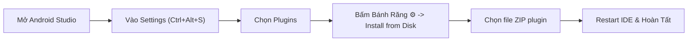

# 📖 Hướng Dẫn Sử Dụng & Cài Đặt Plugin KMPSkills Cho Android Studio

Tài liệu này hướng dẫn chi tiết từng bước cách cài đặt, kích hoạt, sử dụng và khắc phục sự cố cho plugin **KMPSkills Assistant** trên **Android Studio** và **IntelliJ IDEA**.

---

## 📌 1. Thông Tin Bản Cài Đặt Sẵn (Pre-built Distribution)

Plugin đã được biên dịch hoàn tất và sẵn sàng để cài đặt trực tiếp từ ổ đĩa:

| Thông số | Giá trị |
| :--- | :--- |
| **Tên Plugin** | `KMPSkills Assistant` |
| **Phiên bản** | `1.0.0` |
| **Dung lượng** | `~1.63 MB` |
| **Đường dẫn file ZIP** | `c:\VPS\KMPSkills\plugins\android-studio\build\distributions\kmpskills-android-studio-plugin-1.0.0.zip` |
| **Tương thích IDE** | Android Studio Hedgehog (2023.1), Iguana (2023.2), Jellyfish (2023.3), Koala (2024.1), Ladybug (2024.2), Meerkat (2024.3+) & IntelliJ IDEA 2023.3 – 2024.3+ |

---

## 🚀 2. Hướng Dẫn Cài Đặt Từng Bước (Install Plugin from Disk)



### Bước 1: Mở Android Studio
Khởi động Android Studio và mở bất kỳ dự án Android Native hoặc Kotlin Multiplatform nào.

### Bước 2: Mở Hộp Thoại Cài Đặt (Settings)
- Trên **Windows / Linux**: Nhấn phím tắt `Ctrl + Alt + S` (hoặc vào menu `File > Settings`).
- Trên **macOS**: Nhấn phím tắt `Cmd + ,` (hoặc vào menu `Android Studio > Settings / Preferences`).

### Bước 3: Vào Mục Plugins
Tại danh mục bên trái của cửa sổ Settings, nhấp chọn mục **Plugins**.

### Bước 4: Chọn Cài Đặt Từ Đĩa (Install Plugin from Disk)
1. Ở hàng trên cùng bên phải cửa sổ Plugins, nhấn vào biểu tượng **Bánh Răng (⚙️)** nằm cạnh tab *Installed*.
2. Trong menu xổ xuống, chọn dòng **"Install Plugin from Disk..."**.

### Bước 5: Chọn File ZIP Của Plugin
Trong cửa sổ duyệt file vừa xuất hiện, điều hướng đến thư mục dự án và chọn file zip:
```text
c:\VPS\KMPSkills\plugins\android-studio\build\distributions\kmpskills-android-studio-plugin-1.0.0.zip
```
Nhấn **OK**.

### Bước 6: Áp Dụng & Khởi Động Lại IDE (Restart IDE)
1. Nhấn nút **Apply** hoặc **OK** ở góc dưới màn hình Settings.
2. Android Studio sẽ hiển thị thông báo yêu cầu khởi động lại: Nhấn chọn **Restart IDE**.

---

## 🌟 3. Hướng Dẫn Sử Dụng Các Tính Năng Sau Khi Cài Đặt

Sau khi Android Studio khởi động lại, bạn sẽ có ngay 3 tính năng trợ lực lập trình chuyên sâu:

---

### Tính Năng 1: Thanh Cửa Sổ Công Cụ Sidebar (Tool Window)

Ở thanh viền cạnh bên phải (Right Stripe) của Android Studio, bạn sẽ thấy một tab mang tên **KMPSkills**. Nhấp vào để mở giao diện điều khiển:

```
┌────────────────────────────────────────────────────────┐
│  💎 KMPSkills Assistant (v1.0.0)                      │
├────────────────────────────────────────────────────────┤
│  [ ⚡ Inject AI Rules ]    [ 🔍 Run Architecture Doctor ] │
├────────────────────────────────────────────────────────┤
│  [Tab: 27 Skills Catalog]   [Tab: 10-Level Curriculum] │
│                                                        │
│  🔍 Tìm kiếm kỹ năng: [ mvi...              ]          │
│                                                        │
│  • kmp-mvi-stateflow-architecture                      │
│    Trạng thái bất biến, ViewModel Flow & Channel...   │
│    [ 📋 Copy Directive for AI Chat ]                   │
│                                                        │
│  • kmp-offline-room-database                           │
│    Room KMP 2.7+ BundledSQLiteDriver, Flow DAO...     │
│    [ 📋 Copy Directive for AI Chat ]                   │
└────────────────────────────────────────────────────────┘
```

1. **Nút `⚡ Inject AI Rules`**:
   - Chỉ với 1 cú click, plugin sẽ quét dự án và tự động sinh file cấu hình `.github/copilot-instructions.md` và `.cursor/rules/`.
   - Giúp các trợ lý AI như **GitHub Copilot** và **Gemini Code Assist** trong Android Studio lập tức tuân thủ toàn bộ 27 quy chuẩn kiến trúc KMP.

2. **Nút `🔍 Run Architecture Doctor`**:
   - Quét kiểm tra nhanh file `gradle/libs.versions.toml` để xem các thư viện Kotlin, AGP, Ktor, Room, Koin đã đạt chuẩn kiến trúc khuyến nghị hay chưa.

3. **Tab `27 Skills Catalog`**:
   - Ô tìm kiếm thời gian thực giúp lọc nhanh kỹ năng cần dùng.
   - Nhấn nút **"📋 Copy Directive for AI Chat"**: Sao chép tức thì chỉ dẫn prompt vào bộ nhớ đệm (Clipboard) để dán trực tiếp vào khung chat của Copilot / Gemini.

4. **Tab `10-Level Curriculum`**:
   - Tra cứu mục tiêu và nội dung của toàn bộ 10 học phần thực chiến từ cơ bản đến nâng cao ngay trong IDE mà không cần mở trình duyệt web.

---

### Tính Năng 2: Menu Chuột Phải Sinh Mã Nguồn Tự Động (Code Scaffolder)

Bạn có thể sinh nhanh các bộ khung mã nguồn chuẩn mực, 100% không cảnh báo lỗi:

#### 1. Sinh trọn bộ MVI Feature Screen
1. Nhấp chuột phải vào bất kỳ package nào trong cây thư mục `src/commonMain/kotlin/...` (hoặc `src/main/java/...`).
2. Chọn menu: **KMPSkills > New MVI Feature Screen...**
3. Nhập tên tính năng (Ví dụ: `Cart` hoặc `ProductDetail`).
4. Nhấn **OK**. Plugin sẽ sinh ngay 5 file:
   - `<Name>UiState.kt`: Mô hình trạng thái bất biến với `@Immutable` và `ImmutableList`.
   - `<Name>UiIntent.kt`: Định nghĩa các ý định người dùng với `sealed interface`.
   - `<Name>UiEffect.kt`: Sự kiện thông báo 1 lần (Snackbar, Điều hướng) qua `Channel`.
   - `<Name>ViewModel.kt`: ViewModel hoàn chỉnh quản lý luồng dữ liệu đơn luồng.
   - `<Name>Screen.kt`: Giao diện Jetpack Compose với State Hoisting chuẩn mực.

#### 2. Sinh Room KMP Entity & Reactive Flow DAO
1. Nhấp chuột phải vào package lưu trữ dữ liệu cục bộ (`database` hoặc `dao`).
2. Chọn menu: **KMPSkills > New Room KMP Entity & DAO...**
3. Nhập tên thực thể (Ví dụ: `Article` hoặc `Order`).
4. Plugin sẽ sinh ngay 2 file:
   - `<Name>Entity.kt`: Khai báo bảng Room với khóa chính và mốc thời gian.
   - `<Name>Dao.kt`: Giao diện DAO hoàn chỉnh hỗ trợ `Flow<List<Entity>>`, `insertOrUpdate`, và `deleteById`.

---

### Tính Năng 3: Menu Hệ Thống (Top Menu Bar)

Trên thanh menu trên cùng của Android Studio:
- Vào menu **Tools > KMPSkills > Run Architecture Doctor**:
- Một hộp thoại thông báo nổi sẽ hiển thị kết quả kiểm toán sức khỏe của dự án kèm các khuyến nghị tối ưu phiên bản.

---

## 🔧 4. Xử Lý Sự Cố Thường Gặp (Troubleshooting)

### Câu hỏi 1: Tôi không thấy thanh Sidebar "KMPSkills" ở cạnh phải màn hình?
**Khắc phục**:
1. Vào menu trên cùng: `View > Tool Windows > KMPSkills`.
2. Nếu vẫn không thấy, kiểm tra xem plugin đã được kích hoạt trong `Settings > Plugins > Installed` chưa.

### Câu hỏi 2: Gặp thông báo "Plugin is not compatible with this version of the IDE"?
**Nguyên nhân**: Bạn đang dùng bản Android Studio quá cũ (trước 2023.1) hoặc bản Preview quá mới vượt ngưỡng `until-build`.
**Khắc phục**:
Mở file `plugins/android-studio/src/main/resources/META-INF/plugin.xml`, kiểm tra thẻ `<idea-version>`:
```xml
<idea-version since-build="233.0" until-build="251.*" />
```
Nếu bạn dùng bản IDE mới hơn, bạn chỉ cần sửa `until-build="260.*"`, sau đó chạy lại lệnh đóng gói:
```powershell
cd c:\VPS\KMPSkills\plugins\android-studio
.\gradlew.bat buildPlugin
```
File zip mới sẽ được tạo ra tại `plugins/android-studio/build/distributions/`.

### Câu hỏi 3: Làm sao để gỡ cài đặt (Uninstall) hoặc nâng cấp plugin?
**Khắc phục**:
1. Vào `Settings > Plugins > Installed`.
2. Tìm dòng `KMPSkills Assistant`.
3. Bấm vào biểu tượng bánh răng bên cạnh tên plugin và chọn **Uninstall** (hoặc chọn cài đè file zip mới thông qua *Install Plugin from Disk...*).
4. Restart lại Android Studio.

---

## 🎯 5. Cách Phối Hợp Plugin Cùng AI Chat (GitHub Copilot / Gemini Code Assist)

1. Mở cửa sổ chat của **GitHub Copilot** (`Ctrl + Shift + I` hoặc mở tab Copilot) hoặc **Gemini**.
2. Nhấn nút **⚡ Inject AI Rules** trên thanh Sidebar KMPSkills.
3. Trong ô chat AI, bạn chỉ cần yêu cầu bình thường, ví dụ:
   > *"Hãy viết UseCase và Repository triển khai lấy dữ liệu sản phẩm, có lưu cache Room và cơ chế offline sync."*
4. AI sẽ tự động đọc các file hướng dẫn kiến trúc vừa được nạp và sinh mã nguồn tuân thủ 100% các tiêu chuẩn:
   - Trả về Flow phản ứng.
   - Quản lý xung đột qua Mutation Outbox.
   - Đảm bảo giải phóng bộ nhớ an toàn trên Kotlin/Native (không rò rỉ ARC).
   - Tối ưu Compose Recomposition Stability.
